## AUDIT 3.1.4: a ghost plan with an extended end_ts siphons past the agreement — PASS

> the merchant recreates the plan with a 60-day end_ts and keeps pulling past the original end (Cantina HIGH 3.1.4)

**InitSubscriptionAuthority: structured CPI tree**

```text

Transaction  signers=[alice]
└── subscriptions::InitSubscriptionAuthority [1] ✓ 12240cu  signer=alice
    ├── System [2] ✓ (no cu)
    └── Token [2] ✓ 126cu
Compute Units (this run): 12240
Fee: 5000 lamports
Legend (2):
  alice         = FXddRd8CdAC8SWKT3Ataasn69R7rbTfQZcKg8ejyrUbF
  subscriptions = De1egAFMkMWZSN5rYXRj9CAdheBamobVNubTsi9avR44
```

**InitSubscriptionAuthority: sequence diagram**

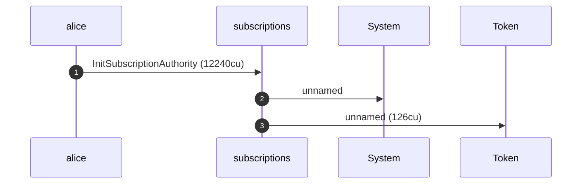

**InitSubscriptionAuthority: sequence diagram, with lifelines**

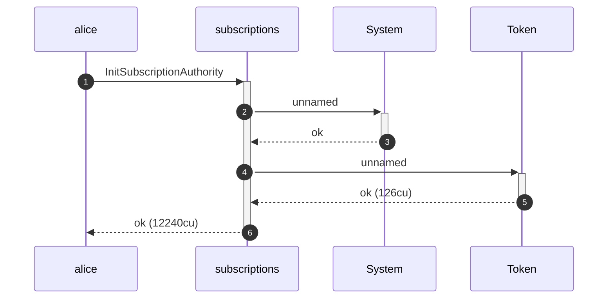

**InitSubscriptionAuthority: authority graph**

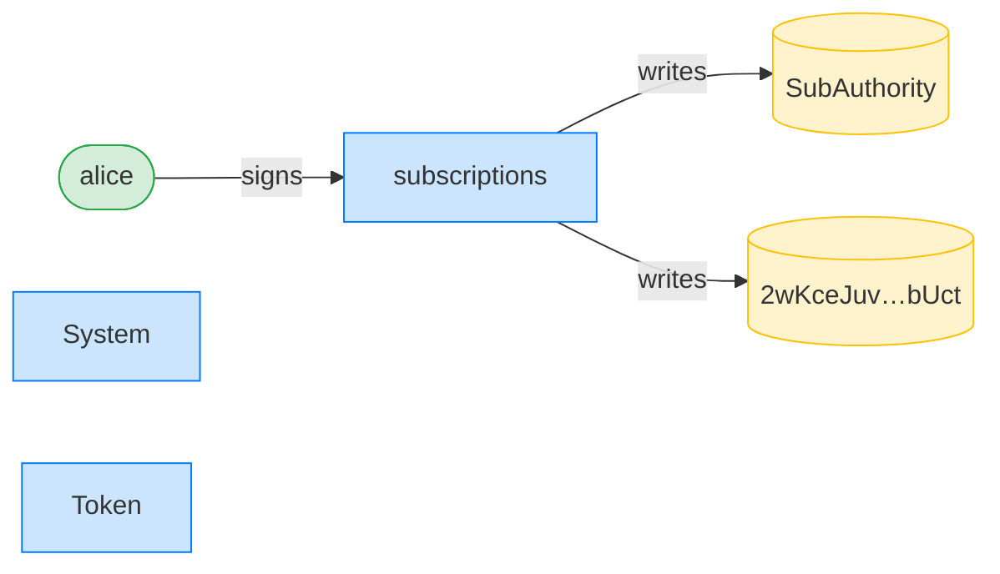

**InitSubscriptionAuthority: ownership graph**

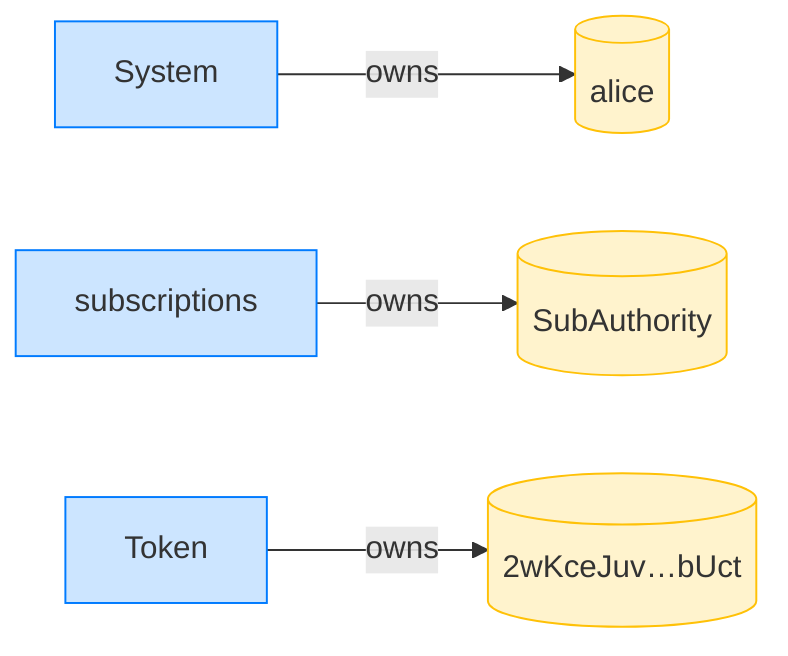

### The merchant offers a plan; Alice subscribes, consenting to its terms

**CreatePlan: structured CPI tree**

```text

Transaction  signers=[merchant]
└── subscriptions::CreatePlan [1] ✓ 3467cu  signer=merchant
    └── System [2] ✓ (no cu)
Compute Units (this run): 3467
Fee: 5000 lamports
Legend (2):
  merchant      = J4fPsxKiTTKiXSiN9bgZ5JBrVgTM9c6N8tjhLN8gfdTq
  subscriptions = De1egAFMkMWZSN5rYXRj9CAdheBamobVNubTsi9avR44
```

**CreatePlan: sequence diagram**

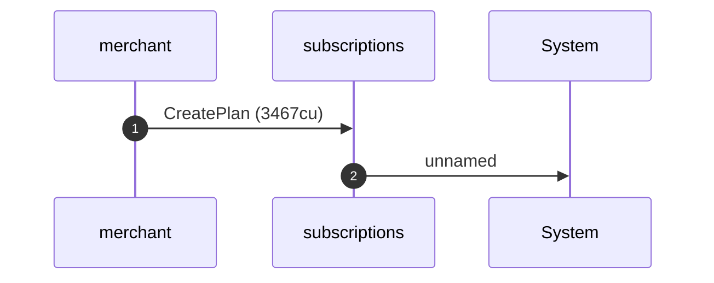

**CreatePlan: sequence diagram, with lifelines**

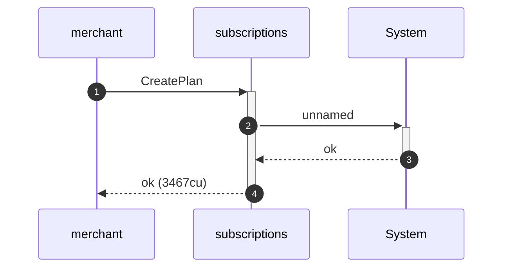

**CreatePlan: authority graph**

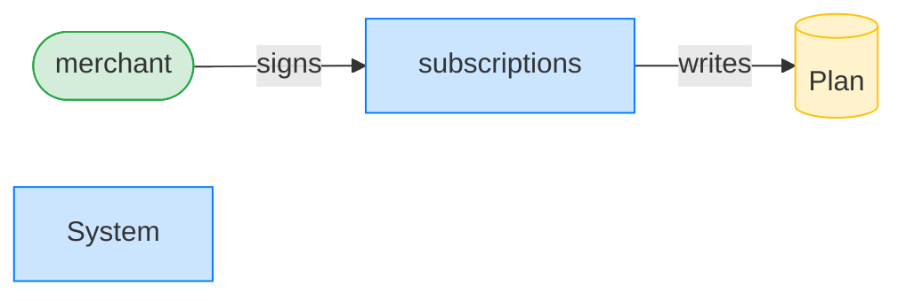

**CreatePlan: ownership graph**

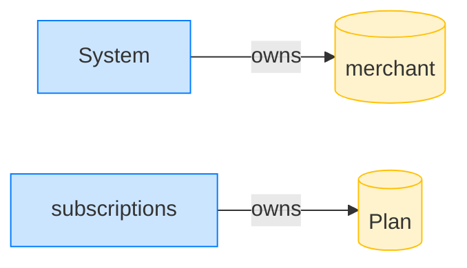

**Subscribe: structured CPI tree**

```text

Transaction  signers=[alice]
└── subscriptions::Subscribe [1] ✓ 6515cu  signer=alice
    ├── System [2] ✓ (no cu)
    └── subscriptions [2] ✓ 137cu
          🔔 SubscriptionCreated
               plan:       Plan,
               subscriber: alice,
               mint:       USDC mint,
               created_ts: 1700000000
Compute Units (this run): 6515
Fee: 5000 lamports
Legend (2):
  alice         = FXddRd8CdAC8SWKT3Ataasn69R7rbTfQZcKg8ejyrUbF
  subscriptions = De1egAFMkMWZSN5rYXRj9CAdheBamobVNubTsi9avR44
```

**Subscribe: sequence diagram**

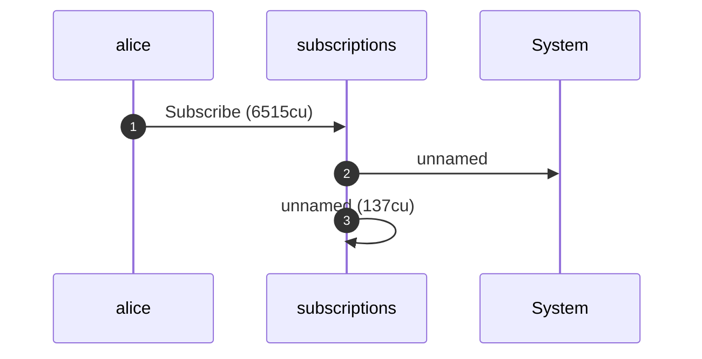

**Subscribe: sequence diagram, with lifelines**

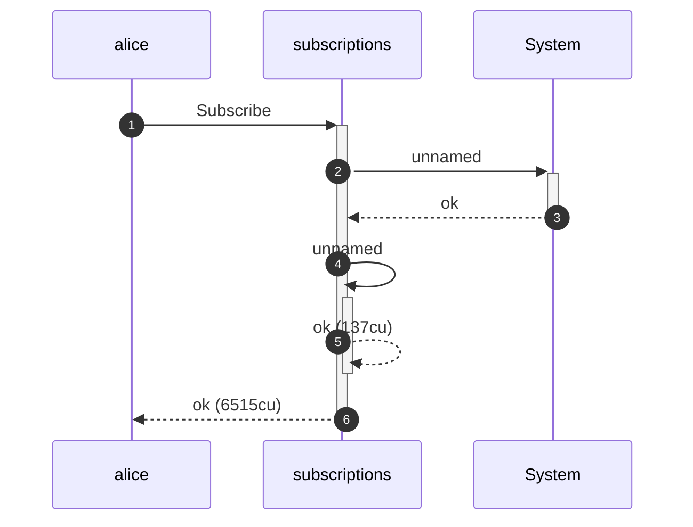

**Subscribe: authority graph**

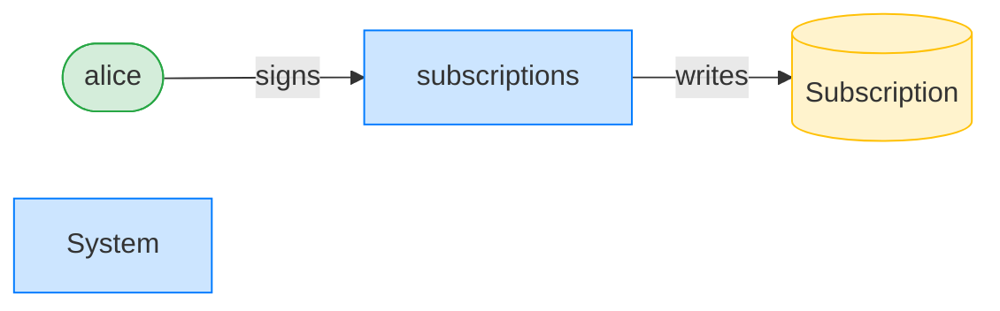

**Subscribe: ownership graph**

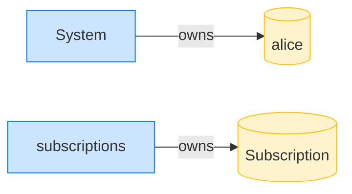

### The merchant sunsets, expires, and deletes the plan

**UpdatePlan (sunset): structured CPI tree**

```text

Transaction  signers=[merchant]
└── subscriptions::UpdatePlan [1] ✓ 500cu  signer=merchant
Compute Units (this run): 500
Fee: 5000 lamports
Legend (2):
  merchant      = J4fPsxKiTTKiXSiN9bgZ5JBrVgTM9c6N8tjhLN8gfdTq
  subscriptions = De1egAFMkMWZSN5rYXRj9CAdheBamobVNubTsi9avR44
```

**UpdatePlan (sunset): sequence diagram**

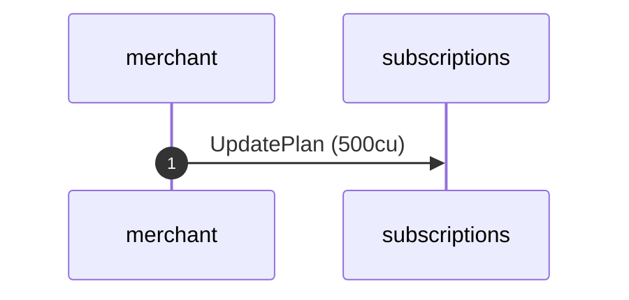

**UpdatePlan (sunset): sequence diagram, with lifelines**

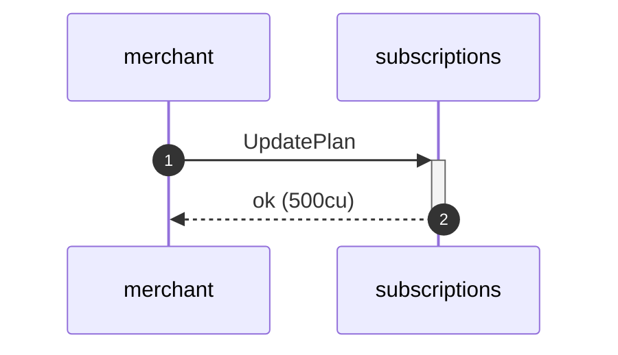

**UpdatePlan (sunset): authority graph**


**UpdatePlan (sunset): ownership graph**


**DeletePlan: structured CPI tree**

```text

Transaction  signers=[merchant]
└── subscriptions::DeletePlan [1] ✓ 366cu  signer=merchant
Compute Units (this run): 366
Fee: 5000 lamports
Legend (2):
  merchant      = J4fPsxKiTTKiXSiN9bgZ5JBrVgTM9c6N8tjhLN8gfdTq
  subscriptions = De1egAFMkMWZSN5rYXRj9CAdheBamobVNubTsi9avR44
```

**DeletePlan: sequence diagram**


**DeletePlan: sequence diagram, with lifelines**

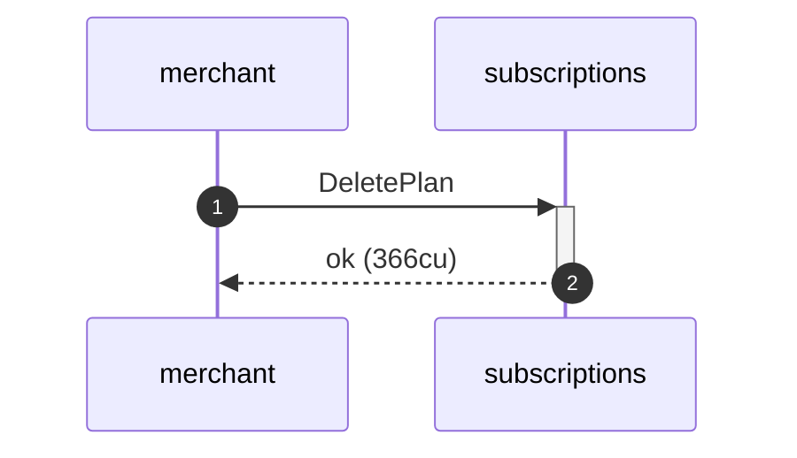

**DeletePlan: authority graph**

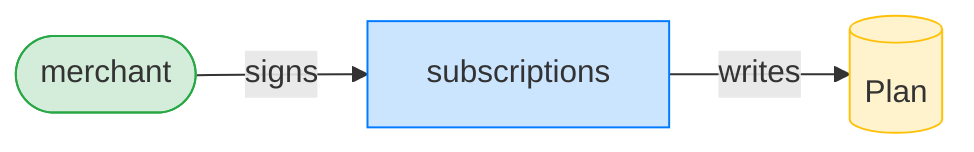

**DeletePlan: ownership graph**

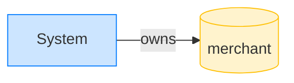

### The merchant recreates the plan at the same id with ghost terms

**CreatePlan (ghost): structured CPI tree**

```text

Transaction  signers=[merchant]
└── subscriptions::CreatePlan [1] ✓ 3467cu  signer=merchant
    └── System [2] ✓ (no cu)
Compute Units (this run): 3467
Fee: 5000 lamports
Legend (2):
  merchant      = J4fPsxKiTTKiXSiN9bgZ5JBrVgTM9c6N8tjhLN8gfdTq
  subscriptions = De1egAFMkMWZSN5rYXRj9CAdheBamobVNubTsi9avR44
```

**CreatePlan (ghost): sequence diagram**

```mermaid
sequenceDiagram
    autonumber
    participant merchant
    participant subscriptions
    participant System
    merchant ->> subscriptions: CreatePlan (3467cu)
    subscriptions ->> System: unnamed
```

**CreatePlan (ghost): sequence diagram, with lifelines**

```mermaid
sequenceDiagram
    autonumber
    participant merchant
    participant subscriptions
    participant System
    merchant ->>+ subscriptions: CreatePlan
    subscriptions ->>+ System: unnamed
    System -->>- subscriptions: ok
    subscriptions -->>- merchant: ok (3467cu)
```

**CreatePlan (ghost): authority graph**

```mermaid
flowchart LR
    classDef signer fill:#d4edda,stroke:#28a745;
    classDef program fill:#cce5ff,stroke:#007bff;
    classDef writable fill:#fff3cd,stroke:#ffc107;
    subscriptions[subscriptions]:::program
    merchant([merchant]):::signer
    Plan[(Plan)]:::writable
    System[System]:::program
    merchant -->|signs| subscriptions
    subscriptions -->|writes| Plan
```

**CreatePlan (ghost): ownership graph**

```mermaid
flowchart LR
    classDef owner fill:#cce5ff,stroke:#007bff;
    classDef account fill:#fff3cd,stroke:#ffc107;
    System[System]:::owner
    merchant[(merchant)]:::account
    subscriptions[subscriptions]:::owner
    Plan[(Plan)]:::account
    System -->|owns| merchant
    subscriptions -->|owns| Plan
```

### Past the original end_ts, the merchant still pulls against the extended ghost plan

**TransferSubscription (past original end): structured CPI tree**

```text

Transaction  signers=[merchant]
└── subscriptions::TransferSubscription [1] ✓ 7521cu  signer=merchant
    ├── Token [2] ✓ 113cu
    └── subscriptions [2] ✓ 137cu
Compute Units (this run): 7521
Fee: 5000 lamports
Legend (2):
  merchant      = J4fPsxKiTTKiXSiN9bgZ5JBrVgTM9c6N8tjhLN8gfdTq
  subscriptions = De1egAFMkMWZSN5rYXRj9CAdheBamobVNubTsi9avR44
```

**TransferSubscription (past original end): sequence diagram**

```mermaid
sequenceDiagram
    autonumber
    participant merchant
    participant subscriptions
    participant Token
    merchant ->> subscriptions: TransferSubscription (7521cu)
    subscriptions ->> Token: unnamed (113cu)
    subscriptions ->> subscriptions: unnamed (137cu)
```

**TransferSubscription (past original end): sequence diagram, with lifelines**

```mermaid
sequenceDiagram
    autonumber
    participant merchant
    participant subscriptions
    participant Token
    merchant ->>+ subscriptions: TransferSubscription
    subscriptions ->>+ Token: unnamed
    Token -->>- subscriptions: ok (113cu)
    subscriptions ->>+ subscriptions: unnamed
    subscriptions -->>- subscriptions: ok (137cu)
    subscriptions -->>- merchant: ok (7521cu)
```

**TransferSubscription (past original end): authority graph**

```mermaid
flowchart LR
    classDef signer fill:#d4edda,stroke:#28a745;
    classDef program fill:#cce5ff,stroke:#007bff;
    classDef writable fill:#fff3cd,stroke:#ffc107;
    subscriptions[subscriptions]:::program
    Subscription[(Subscription)]:::writable
    2wKceJuv_bUct[("2wKceJuv…bUct")]:::writable
    7Qnij9GH_AJ5b[("7Qnij9GH…AJ5b")]:::writable
    merchant([merchant]):::signer
    Token[Token]:::program
    merchant -->|signs| subscriptions
    subscriptions -->|writes| Subscription
    subscriptions -->|writes| 2wKceJuv_bUct
    subscriptions -->|writes| 7Qnij9GH_AJ5b
```

**TransferSubscription (past original end): ownership graph**

```mermaid
flowchart LR
    classDef owner fill:#cce5ff,stroke:#007bff;
    classDef account fill:#fff3cd,stroke:#ffc107;
    subscriptions[subscriptions]:::owner
    Subscription[(Subscription)]:::account
    Token[Token]:::owner
    2wKceJuv_bUct[("2wKceJuv…bUct")]:::account
    7Qnij9GH_AJ5b[("7Qnij9GH…AJ5b")]:::account
    System[System]:::owner
    merchant[(merchant)]:::account
    subscriptions -->|owns| Subscription
    Token -->|owns| 2wKceJuv_bUct
    Token -->|owns| 7Qnij9GH_AJ5b
    System -->|owns| merchant
```

Finding 3.1.4: the original plan ended an hour ago, but the merchant recreated it with a 60-day end_ts. With check_plan_terms reverted, transfer_subscription reads the live (extended) end_ts and the pull lands — the merchant siphons indefinitely past the agreement. On the fixed code the recreated terms mismatch the snapshot and the pull is refused; the checks below then fail.

- [x] the post-original-end pull SUCCEEDS (the vulnerability): `true`
- [x] the merchant siphoned 10M past the original end: `10000000`
