# Finding 3.1.1 — missing start-time validation: before and after

> Cantina HIGH 3.1.1, reproduced and remediated, rendered end to end in the anchor-litesvm DSL.

A delegatee is granted a recurring allowance that only starts tomorrow, yet pulls the full per-period budget now. `saturating_sub` floors the pre-start timestamp to 0, so the period guard never fires.

Below is the *same* exploit run twice: against the vulnerable program (the fix reverted) where it lands, and against the fixed program where it is refused (`DelegationNotStarted`). Every transaction renders its structured CPI tree and its authority/ownership graphs, so the attack — and its absence — are legible.

---

## ⚠️ Before — the exploit lands (vulnerable program)

#### AUDIT 3.1.1: a recurring pull lands before the delegation starts — PASS

> a delegatee pulls the per-period budget a day before start_ts (Cantina HIGH 3.1.1)

**InitSubscriptionAuthority: structured CPI tree**

```text

Transaction  signers=[alice]
└── subscriptions::InitSubscriptionAuthority [1] ✓ 7740cu  signer=alice
    ├── System [2] ✓ (no cu)
    └── Token [2] ✓ 126cu
Compute Units (this run): 7740
Fee: 5000 lamports
Legend (2):
  alice         = FXddRd8CdAC8SWKT3Ataasn69R7rbTfQZcKg8ejyrUbF
  subscriptions = De1egAFMkMWZSN5rYXRj9CAdheBamobVNubTsi9avR44
```

**InitSubscriptionAuthority: sequence diagram**

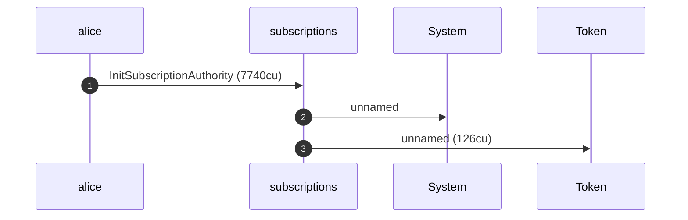

**InitSubscriptionAuthority: sequence diagram, with lifelines**

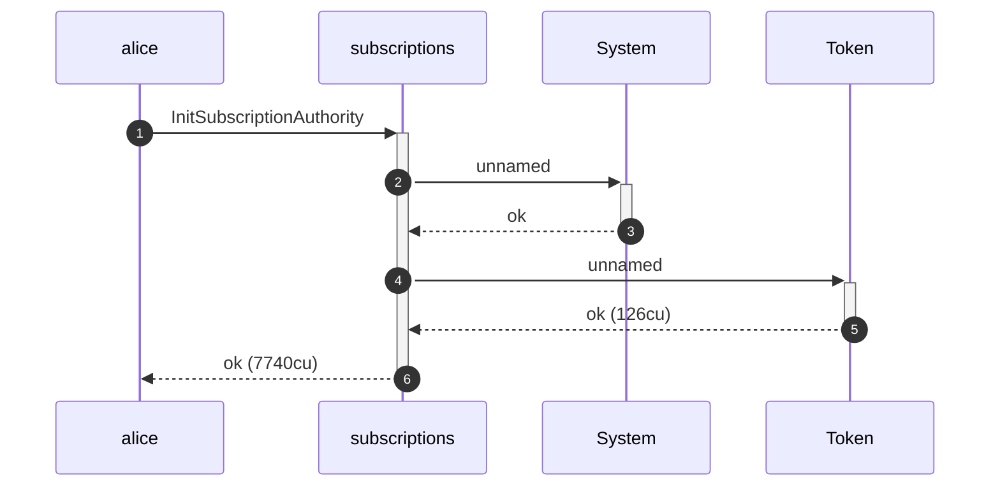

**InitSubscriptionAuthority: authority graph**


**InitSubscriptionAuthority: ownership graph**

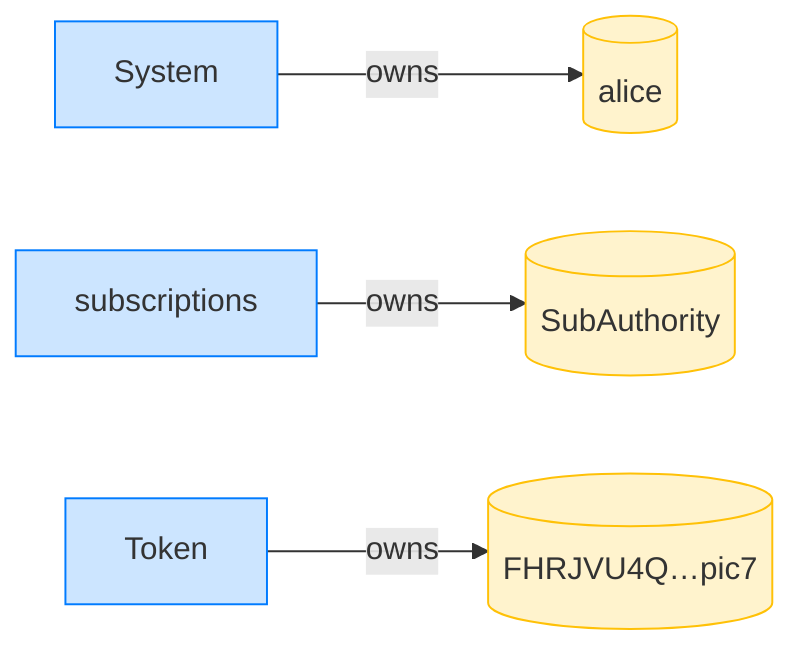

##### Alice grants Bob a recurring allowance that only starts tomorrow

**CreateRecurringDelegation: structured CPI tree**

```text

Transaction  signers=[alice]
└── subscriptions::CreateRecurringDelegation [1] ✓ 5072cu  signer=alice
    └── System [2] ✓ (no cu)
Compute Units (this run): 5072
Fee: 5000 lamports
Legend (2):
  alice         = FXddRd8CdAC8SWKT3Ataasn69R7rbTfQZcKg8ejyrUbF
  subscriptions = De1egAFMkMWZSN5rYXRj9CAdheBamobVNubTsi9avR44
```

**CreateRecurringDelegation: sequence diagram**


**CreateRecurringDelegation: sequence diagram, with lifelines**


**CreateRecurringDelegation: authority graph**

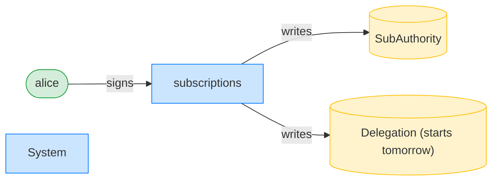

**CreateRecurringDelegation: ownership graph**

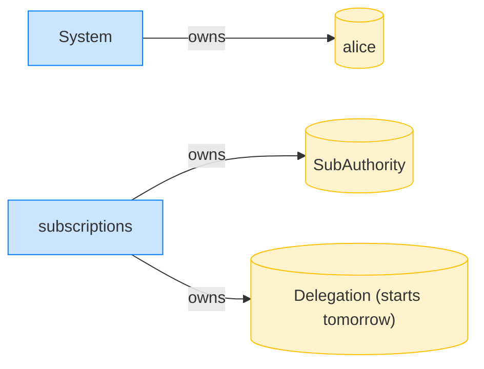

##### Bob pulls 10 tokens NOW — a day before the delegation begins

**TransferRecurring (before start_ts): structured CPI tree**

```text

Transaction  signers=[bob]
└── subscriptions::TransferRecurring [1] ✓ 5659cu  signer=bob
    ├── Token [2] ✓ 113cu
    └── subscriptions [2] ✓ 137cu
          🔔 RecurringTransfer
               delegatee:        bob,
               amount:           10000000,
               pulled_in_period: 10000000,
               receiver:         bob
Compute Units (this run): 5659
Fee: 5000 lamports
Legend (2):
  bob           = 9S8NPMnzAba71o3tr8dHDzUrfT5NesYFzP56QFpYieMR
  subscriptions = De1egAFMkMWZSN5rYXRj9CAdheBamobVNubTsi9avR44
```

**TransferRecurring (before start_ts): sequence diagram**

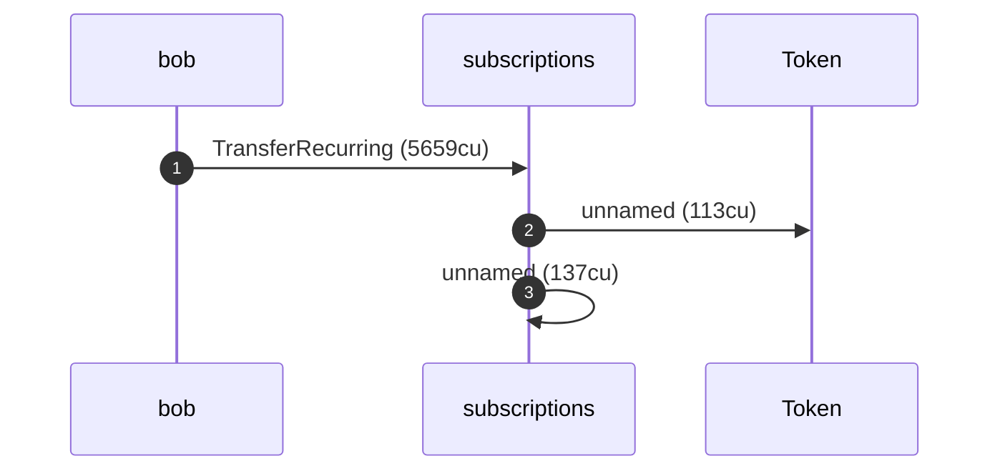

**TransferRecurring (before start_ts): sequence diagram, with lifelines**

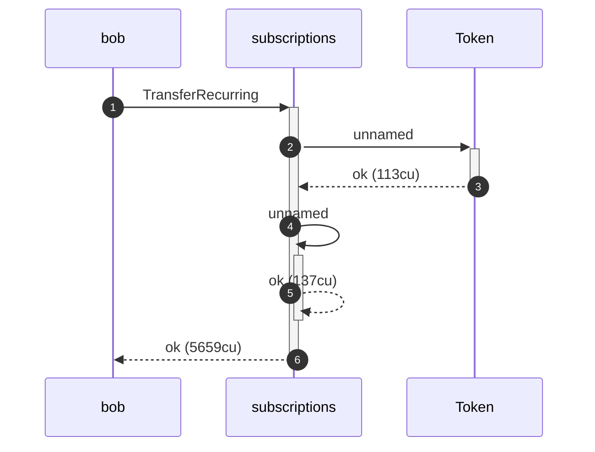

**TransferRecurring (before start_ts): authority graph**

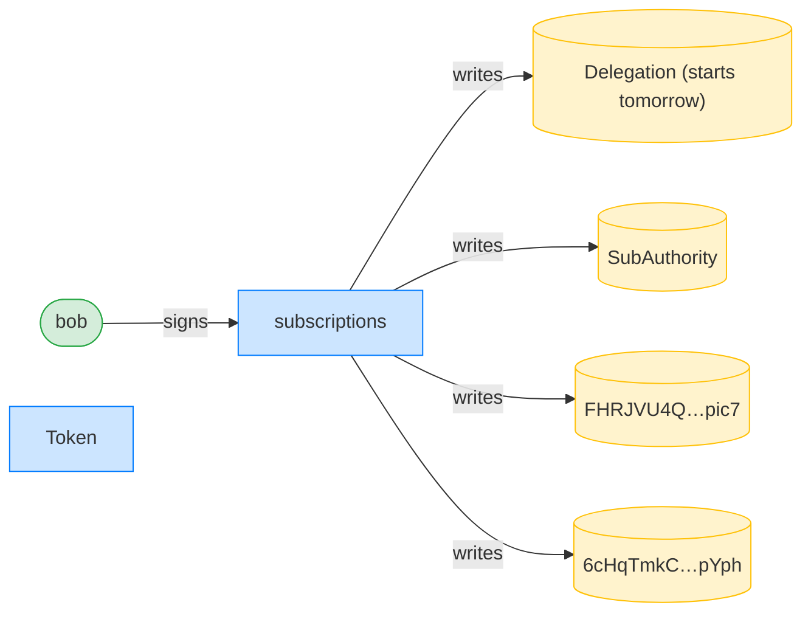

**TransferRecurring (before start_ts): ownership graph**

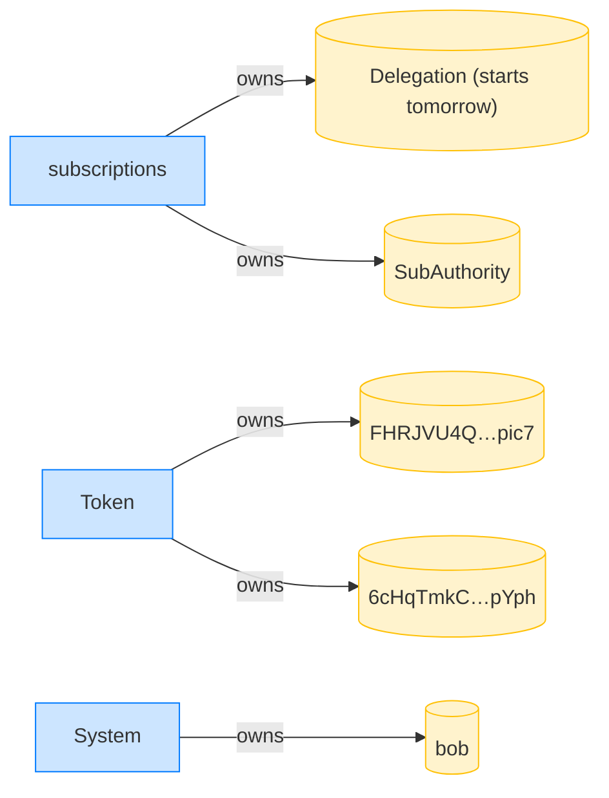

Finding 3.1.1: the delegation's start_ts is a day in the future, yet the pull above lands now. With the PR6 guard reverted on this branch, validate_recurring_transfer floors the pre-start timestamp via saturating_sub to 0, leaving the full per-period budget available immediately. On the fixed code this pull is refused with DelegationNotStarted, and the assertions below fail — that failure is the regression proof that the fix holds.

- [x] the pre-start pull SUCCEEDS (the vulnerability): `true`
- [x] Bob received tokens before the delegation started: `10000000`

---

## ✅ After — the fix refuses (fixed program, `turbin3`)

#### AUDIT 3.1.1 (regression): the fix refuses a pre-start recurring pull — PASS

> the PR6 guard refuses a recurring pull before start_ts (Cantina HIGH 3.1.1)

**InitSubscriptionAuthority: structured CPI tree**

```text

Transaction  signers=[alice]
└── subscriptions::InitSubscriptionAuthority [1] ✓ 7742cu  signer=alice
    ├── System [2] ✓ (no cu)
    └── Token [2] ✓ 126cu
Compute Units (this run): 7742
Fee: 5000 lamports
Legend (2):
  alice         = FXddRd8CdAC8SWKT3Ataasn69R7rbTfQZcKg8ejyrUbF
  subscriptions = De1egAFMkMWZSN5rYXRj9CAdheBamobVNubTsi9avR44
```

**InitSubscriptionAuthority: sequence diagram**


**InitSubscriptionAuthority: sequence diagram, with lifelines**


**InitSubscriptionAuthority: authority graph**

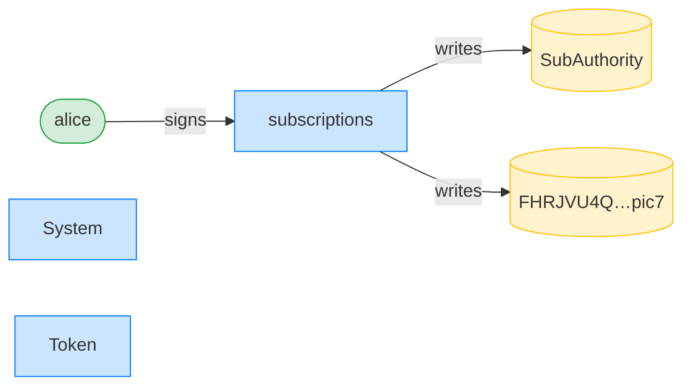

**InitSubscriptionAuthority: ownership graph**


##### Alice grants Bob a recurring allowance that only starts tomorrow

**CreateRecurringDelegation: structured CPI tree**

```text

Transaction  signers=[alice]
└── subscriptions::CreateRecurringDelegation [1] ✓ 5073cu  signer=alice
    └── System [2] ✓ (no cu)
Compute Units (this run): 5073
Fee: 5000 lamports
Legend (2):
  alice         = FXddRd8CdAC8SWKT3Ataasn69R7rbTfQZcKg8ejyrUbF
  subscriptions = De1egAFMkMWZSN5rYXRj9CAdheBamobVNubTsi9avR44
```

**CreateRecurringDelegation: sequence diagram**

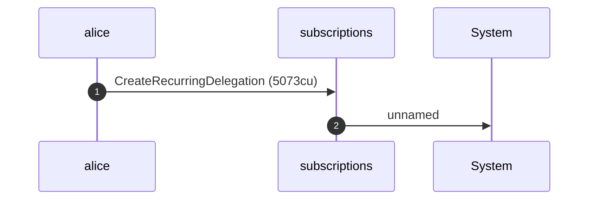

**CreateRecurringDelegation: sequence diagram, with lifelines**

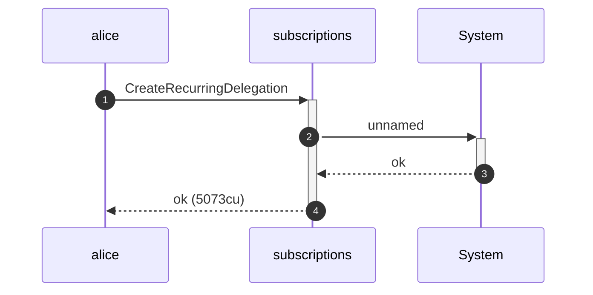

**CreateRecurringDelegation: authority graph**


**CreateRecurringDelegation: ownership graph**


##### Bob pulls 10 tokens NOW — a day before the delegation begins

**TransferRecurring (before start_ts): structured CPI tree**

```text

Transaction  signers=[bob]
└── subscriptions::TransferRecurring [1] ✗ 915cu  signer=bob
    └── Error: DelegationNotStarted
Error: InstructionError(0, Custom(407))
Compute Units (this run): 915
Fee: 5000 lamports
Legend (2):
  bob           = 9S8NPMnzAba71o3tr8dHDzUrfT5NesYFzP56QFpYieMR
  subscriptions = De1egAFMkMWZSN5rYXRj9CAdheBamobVNubTsi9avR44
```

Finding 3.1.1: the delegation's start_ts is a day in the future, yet the pull above lands now. With the PR6 guard reverted on this branch, validate_recurring_transfer floors the pre-start timestamp via saturating_sub to 0, leaving the full per-period budget available immediately. On the fixed code this pull is refused with DelegationNotStarted, and the assertions below confirm the refusal — this regression guards the fix against any future regression.

- [x] the fix refuses the pre-start pull (DelegationNotStarted): `false`
- [x] Bob received nothing — the pull was refused: `0`
