# Finding 3.1.2 — ghost-plan inflated-amount drain: before and after

> Cantina HIGH 3.1.2, reproduced and remediated, rendered end to end in the anchor-litesvm DSL.

Alice subscribes consenting to 1,000/period. The merchant deletes the expired plan and recreates it at the SAME PDA with 100,000,000/period, then pulls 50,000,000 — 50,000x the agreement. The transfer reads the live plan amount, not the consented snapshot.

Below is the *same* exploit run twice: against the vulnerable program (the fix reverted) where it lands, and against the fixed program where it is refused (`PlanTermsMismatch`). Every transaction renders its structured CPI tree and its authority/ownership graphs, so the attack — and its absence — are legible.

---

## ⚠️ Before — the exploit lands (vulnerable program)

#### AUDIT 3.1.2: a ghost plan with an inflated amount drains the subscriber — PASS

> the merchant recreates the plan at 100M/hour and pulls far more than Alice consented to (Cantina HIGH 3.1.2)

**InitSubscriptionAuthority: structured CPI tree**

```text

Transaction  signers=[alice]
└── subscriptions::InitSubscriptionAuthority [1] ✓ 6240cu  signer=alice
    ├── System [2] ✓ (no cu)
    └── Token [2] ✓ 126cu
Compute Units (this run): 6240
Fee: 5000 lamports
Legend (2):
  alice         = FXddRd8CdAC8SWKT3Ataasn69R7rbTfQZcKg8ejyrUbF
  subscriptions = De1egAFMkMWZSN5rYXRj9CAdheBamobVNubTsi9avR44
```

**InitSubscriptionAuthority: sequence diagram**

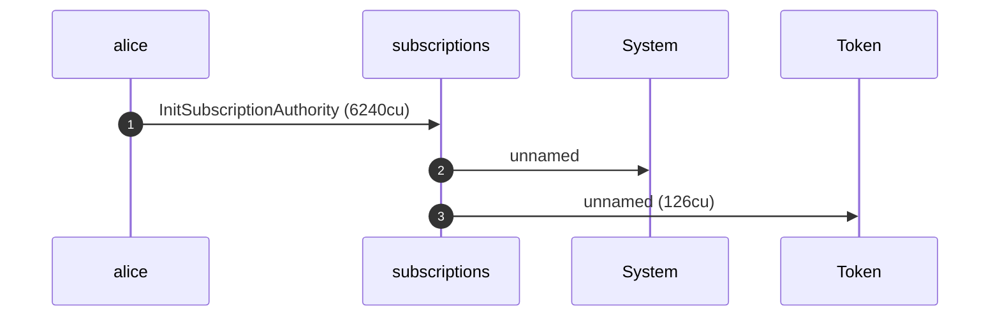

**InitSubscriptionAuthority: sequence diagram, with lifelines**

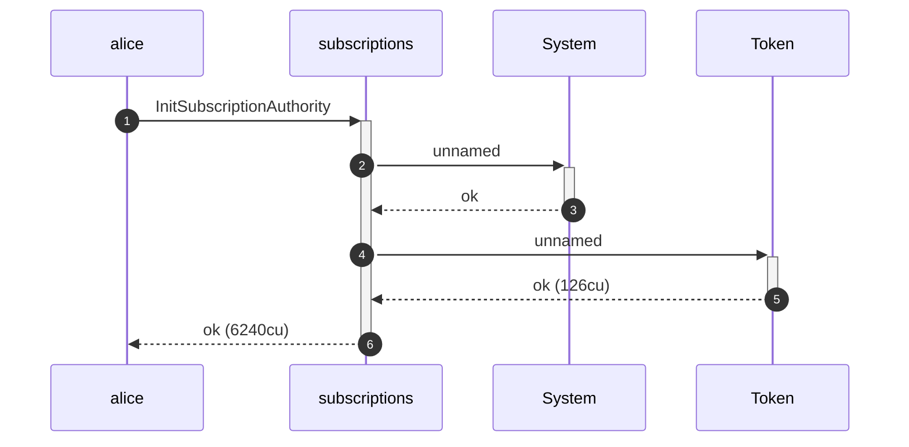

**InitSubscriptionAuthority: authority graph**

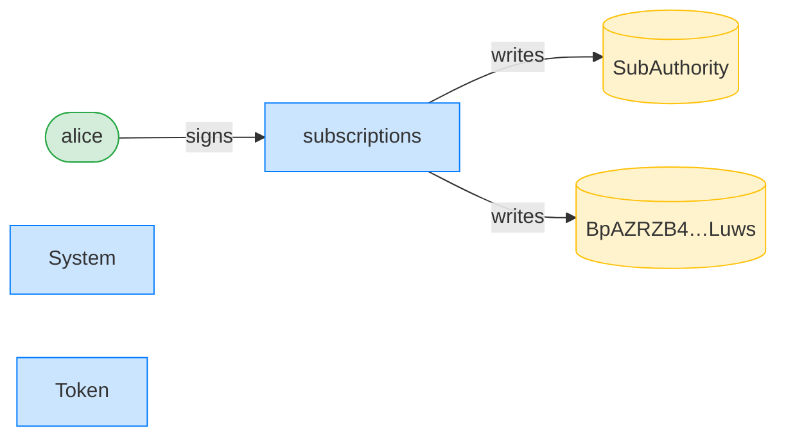

**InitSubscriptionAuthority: ownership graph**

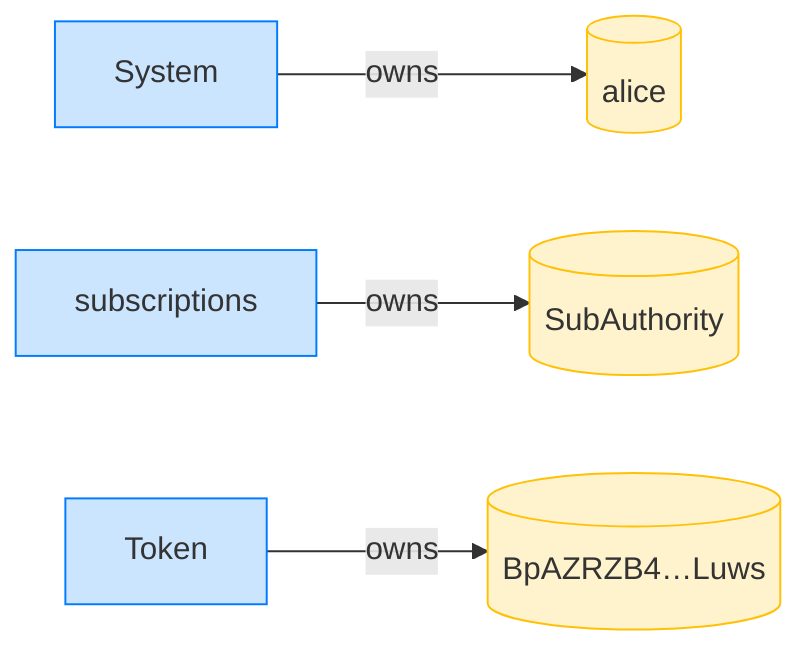

##### The merchant offers a plan; Alice subscribes, consenting to its terms

**CreatePlan: structured CPI tree**

```text

Transaction  signers=[merchant]
└── subscriptions::CreatePlan [1] ✓ 3467cu  signer=merchant
    └── System [2] ✓ (no cu)
Compute Units (this run): 3467
Fee: 5000 lamports
Legend (2):
  merchant      = J4fPsxKiTTKiXSiN9bgZ5JBrVgTM9c6N8tjhLN8gfdTq
  subscriptions = De1egAFMkMWZSN5rYXRj9CAdheBamobVNubTsi9avR44
```

**CreatePlan: sequence diagram**

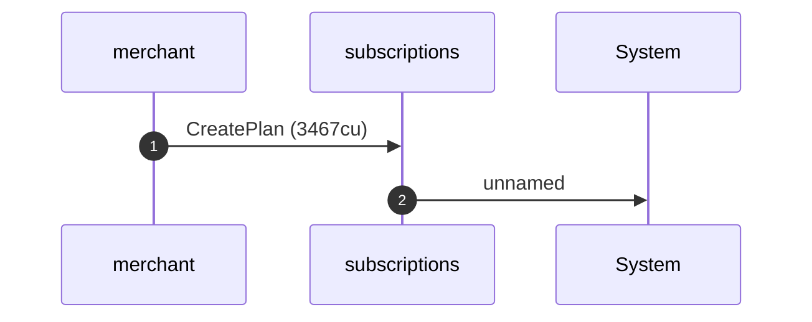

**CreatePlan: sequence diagram, with lifelines**

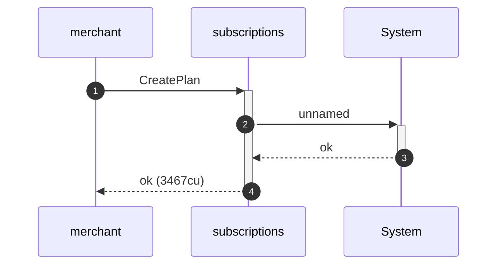

**CreatePlan: authority graph**

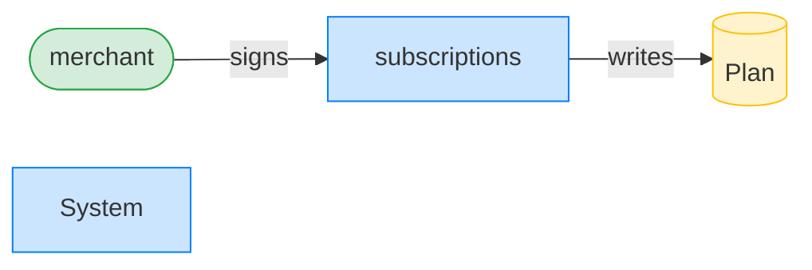

**CreatePlan: ownership graph**

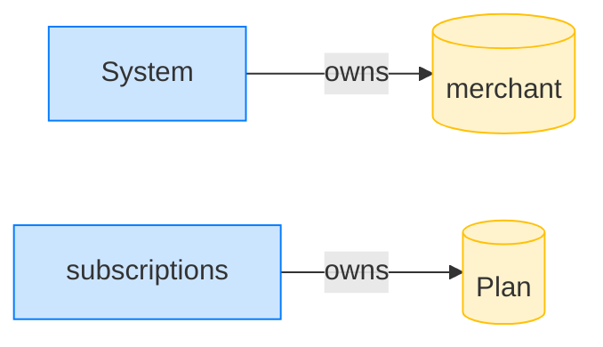

**Subscribe: structured CPI tree**

```text

Transaction  signers=[alice]
└── subscriptions::Subscribe [1] ✓ 6515cu  signer=alice
    ├── System [2] ✓ (no cu)
    └── subscriptions [2] ✓ 137cu
          🔔 SubscriptionCreated
               plan:       Plan,
               subscriber: alice,
               mint:       USDC mint,
               created_ts: 1700000000
Compute Units (this run): 6515
Fee: 5000 lamports
Legend (2):
  alice         = FXddRd8CdAC8SWKT3Ataasn69R7rbTfQZcKg8ejyrUbF
  subscriptions = De1egAFMkMWZSN5rYXRj9CAdheBamobVNubTsi9avR44
```

**Subscribe: sequence diagram**

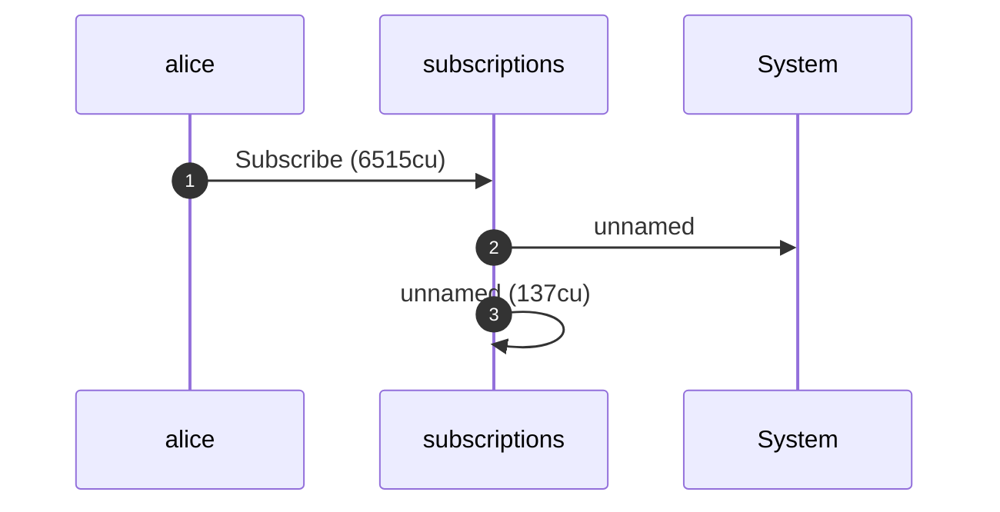

**Subscribe: sequence diagram, with lifelines**

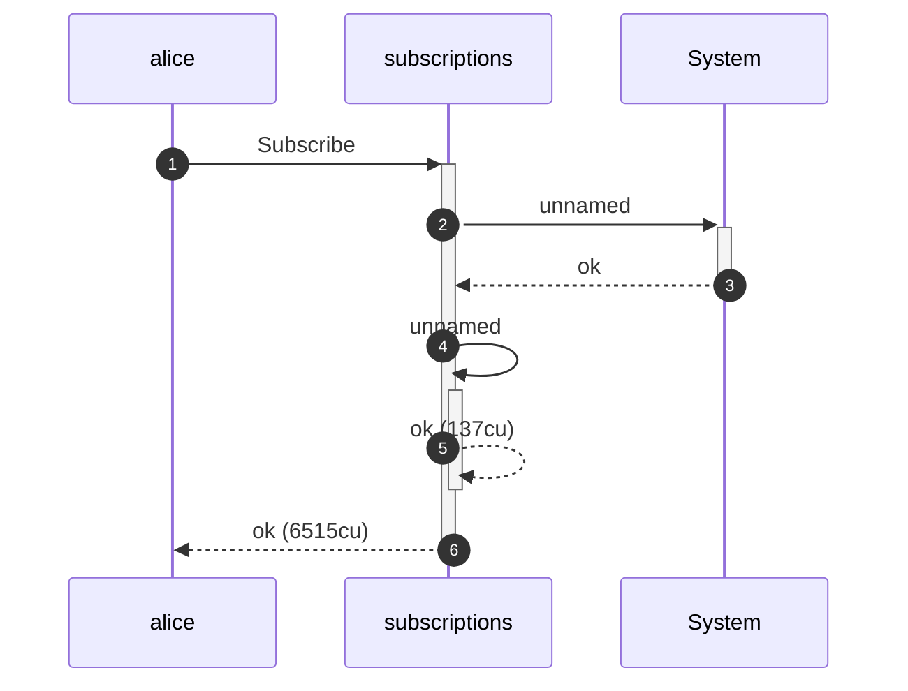

**Subscribe: authority graph**

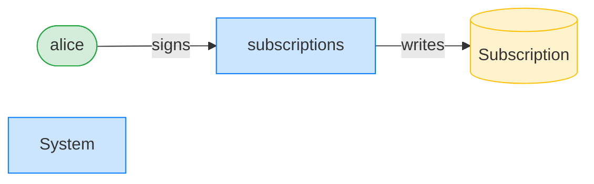

**Subscribe: ownership graph**

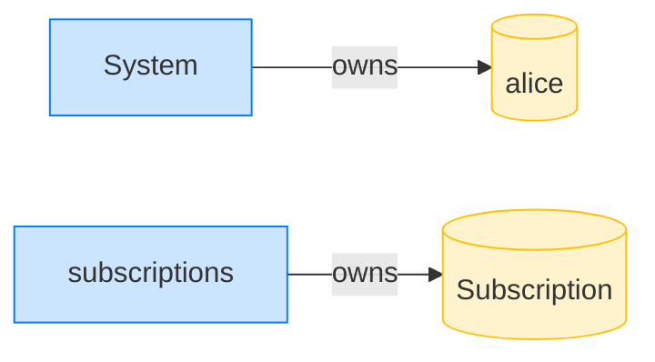

##### The merchant sunsets, expires, and deletes the plan

**UpdatePlan (sunset): structured CPI tree**

```text

Transaction  signers=[merchant]
└── subscriptions::UpdatePlan [1] ✓ 500cu  signer=merchant
Compute Units (this run): 500
Fee: 5000 lamports
Legend (2):
  merchant      = J4fPsxKiTTKiXSiN9bgZ5JBrVgTM9c6N8tjhLN8gfdTq
  subscriptions = De1egAFMkMWZSN5rYXRj9CAdheBamobVNubTsi9avR44
```

**UpdatePlan (sunset): sequence diagram**

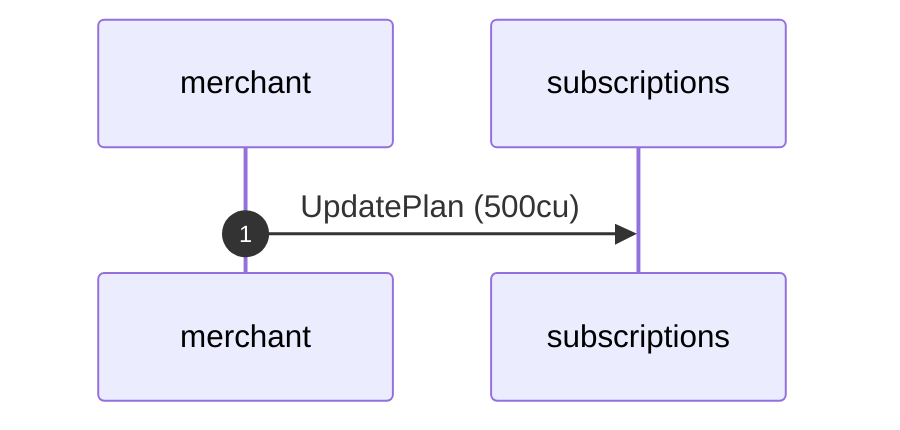

**UpdatePlan (sunset): sequence diagram, with lifelines**

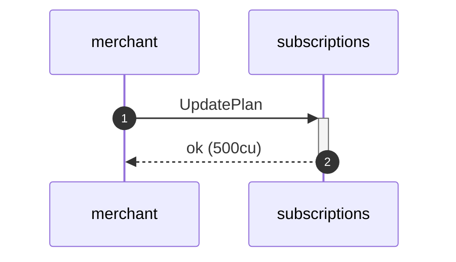

**UpdatePlan (sunset): authority graph**

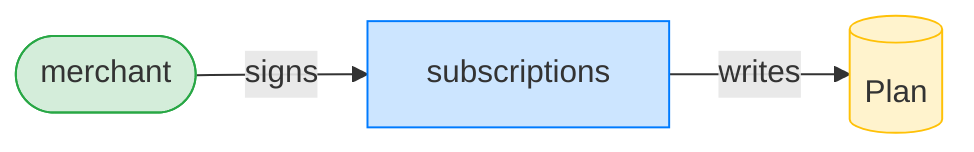

**UpdatePlan (sunset): ownership graph**


**DeletePlan: structured CPI tree**

```text

Transaction  signers=[merchant]
└── subscriptions::DeletePlan [1] ✓ 366cu  signer=merchant
Compute Units (this run): 366
Fee: 5000 lamports
Legend (2):
  merchant      = J4fPsxKiTTKiXSiN9bgZ5JBrVgTM9c6N8tjhLN8gfdTq
  subscriptions = De1egAFMkMWZSN5rYXRj9CAdheBamobVNubTsi9avR44
```

**DeletePlan: sequence diagram**


**DeletePlan: sequence diagram, with lifelines**

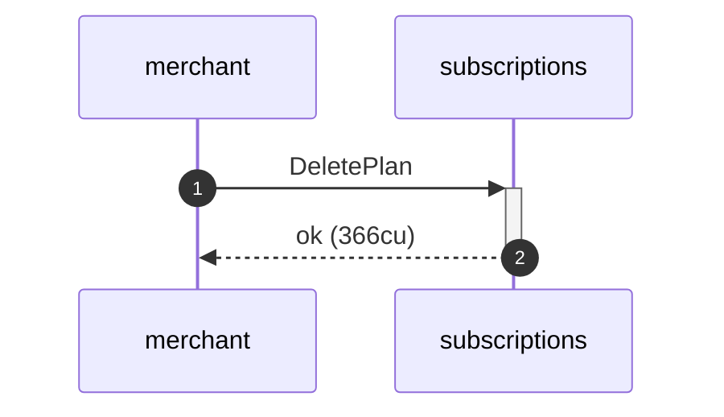

**DeletePlan: authority graph**


**DeletePlan: ownership graph**

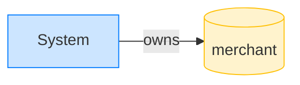

##### The merchant recreates the plan at the same id with ghost terms

**CreatePlan (ghost): structured CPI tree**

```text

Transaction  signers=[merchant]
└── subscriptions::CreatePlan [1] ✓ 3467cu  signer=merchant
    └── System [2] ✓ (no cu)
Compute Units (this run): 3467
Fee: 5000 lamports
Legend (2):
  merchant      = J4fPsxKiTTKiXSiN9bgZ5JBrVgTM9c6N8tjhLN8gfdTq
  subscriptions = De1egAFMkMWZSN5rYXRj9CAdheBamobVNubTsi9avR44
```

**CreatePlan (ghost): sequence diagram**

```mermaid
sequenceDiagram
    autonumber
    participant merchant
    participant subscriptions
    participant System
    merchant ->> subscriptions: CreatePlan (3467cu)
    subscriptions ->> System: unnamed
```

**CreatePlan (ghost): sequence diagram, with lifelines**

```mermaid
sequenceDiagram
    autonumber
    participant merchant
    participant subscriptions
    participant System
    merchant ->>+ subscriptions: CreatePlan
    subscriptions ->>+ System: unnamed
    System -->>- subscriptions: ok
    subscriptions -->>- merchant: ok (3467cu)
```

**CreatePlan (ghost): authority graph**

```mermaid
flowchart LR
    classDef signer fill:#d4edda,stroke:#28a745;
    classDef program fill:#cce5ff,stroke:#007bff;
    classDef writable fill:#fff3cd,stroke:#ffc107;
    subscriptions[subscriptions]:::program
    merchant([merchant]):::signer
    Plan[(Plan)]:::writable
    System[System]:::program
    merchant -->|signs| subscriptions
    subscriptions -->|writes| Plan
```

**CreatePlan (ghost): ownership graph**

```mermaid
flowchart LR
    classDef owner fill:#cce5ff,stroke:#007bff;
    classDef account fill:#fff3cd,stroke:#ffc107;
    System[System]:::owner
    merchant[(merchant)]:::account
    subscriptions[subscriptions]:::owner
    Plan[(Plan)]:::account
    System -->|owns| merchant
    subscriptions -->|owns| Plan
```

##### The merchant pulls 50M — 50,000x what Alice agreed to

**TransferSubscription (ghost-plan drain): structured CPI tree**

```text

Transaction  signers=[merchant]
└── subscriptions::TransferSubscription [1] ✓ 6021cu  signer=merchant
    ├── Token [2] ✓ 113cu
    └── subscriptions [2] ✓ 137cu
Compute Units (this run): 6021
Fee: 5000 lamports
Legend (2):
  merchant      = J4fPsxKiTTKiXSiN9bgZ5JBrVgTM9c6N8tjhLN8gfdTq
  subscriptions = De1egAFMkMWZSN5rYXRj9CAdheBamobVNubTsi9avR44
```

**TransferSubscription (ghost-plan drain): sequence diagram**

```mermaid
sequenceDiagram
    autonumber
    participant merchant
    participant subscriptions
    participant Token
    merchant ->> subscriptions: TransferSubscription (6021cu)
    subscriptions ->> Token: unnamed (113cu)
    subscriptions ->> subscriptions: unnamed (137cu)
```

**TransferSubscription (ghost-plan drain): sequence diagram, with lifelines**

```mermaid
sequenceDiagram
    autonumber
    participant merchant
    participant subscriptions
    participant Token
    merchant ->>+ subscriptions: TransferSubscription
    subscriptions ->>+ Token: unnamed
    Token -->>- subscriptions: ok (113cu)
    subscriptions ->>+ subscriptions: unnamed
    subscriptions -->>- subscriptions: ok (137cu)
    subscriptions -->>- merchant: ok (6021cu)
```

**TransferSubscription (ghost-plan drain): authority graph**

```mermaid
flowchart LR
    classDef signer fill:#d4edda,stroke:#28a745;
    classDef program fill:#cce5ff,stroke:#007bff;
    classDef writable fill:#fff3cd,stroke:#ffc107;
    subscriptions[subscriptions]:::program
    Subscription[(Subscription)]:::writable
    BpAZRZB4_Luws[("BpAZRZB4…Luws")]:::writable
    Dxn7A5SW_7ksT[("Dxn7A5SW…7ksT")]:::writable
    merchant([merchant]):::signer
    Token[Token]:::program
    merchant -->|signs| subscriptions
    subscriptions -->|writes| Subscription
    subscriptions -->|writes| BpAZRZB4_Luws
    subscriptions -->|writes| Dxn7A5SW_7ksT
```

**TransferSubscription (ghost-plan drain): ownership graph**

```mermaid
flowchart LR
    classDef owner fill:#cce5ff,stroke:#007bff;
    classDef account fill:#fff3cd,stroke:#ffc107;
    subscriptions[subscriptions]:::owner
    Subscription[(Subscription)]:::account
    Token[Token]:::owner
    BpAZRZB4_Luws[("BpAZRZB4…Luws")]:::account
    Dxn7A5SW_7ksT[("Dxn7A5SW…7ksT")]:::account
    System[System]:::owner
    merchant[(merchant)]:::account
    subscriptions -->|owns| Subscription
    Token -->|owns| BpAZRZB4_Luws
    Token -->|owns| Dxn7A5SW_7ksT
    System -->|owns| merchant
```

Finding 3.1.2: Alice consented to 1000/hour, but the merchant deleted and recreated the plan at 100M/hour and pulled 50M. With check_plan_terms reverted, transfer_subscription reads the live ghost amount instead of the consented snapshot. On the fixed code the recreated terms mismatch the snapshot and the pull is refused; the checks below then fail — the regression proof.

- [x] the inflated ghost-plan pull SUCCEEDS (the vulnerability): `true`
- [x] the merchant received 50M: `50000000`
- [x] Alice was drained by 50M: `50000000`

---

## ✅ After — the fix refuses (fixed program, `turbin3`)

#### AUDIT 3.1.2 (regression): the fix refuses the inflated ghost plan — PASS

> the merchant recreates the plan at 100M/hour and pulls far more than Alice consented to (Cantina HIGH 3.1.2)

**InitSubscriptionAuthority: structured CPI tree**

```text

Transaction  signers=[alice]
└── subscriptions::InitSubscriptionAuthority [1] ✓ 6242cu  signer=alice
    ├── System [2] ✓ (no cu)
    └── Token [2] ✓ 126cu
Compute Units (this run): 6242
Fee: 5000 lamports
Legend (2):
  alice         = FXddRd8CdAC8SWKT3Ataasn69R7rbTfQZcKg8ejyrUbF
  subscriptions = De1egAFMkMWZSN5rYXRj9CAdheBamobVNubTsi9avR44
```

**InitSubscriptionAuthority: sequence diagram**

```mermaid
sequenceDiagram
    autonumber
    participant alice
    participant subscriptions
    participant System
    participant Token
    alice ->> subscriptions: InitSubscriptionAuthority (6242cu)
    subscriptions ->> System: unnamed
    subscriptions ->> Token: unnamed (126cu)
```

**InitSubscriptionAuthority: sequence diagram, with lifelines**

```mermaid
sequenceDiagram
    autonumber
    participant alice
    participant subscriptions
    participant System
    participant Token
    alice ->>+ subscriptions: InitSubscriptionAuthority
    subscriptions ->>+ System: unnamed
    System -->>- subscriptions: ok
    subscriptions ->>+ Token: unnamed
    Token -->>- subscriptions: ok (126cu)
    subscriptions -->>- alice: ok (6242cu)
```

**InitSubscriptionAuthority: authority graph**

```mermaid
flowchart LR
    classDef signer fill:#d4edda,stroke:#28a745;
    classDef program fill:#cce5ff,stroke:#007bff;
    classDef writable fill:#fff3cd,stroke:#ffc107;
    subscriptions[subscriptions]:::program
    alice([alice]):::signer
    SubAuthority[(SubAuthority)]:::writable
    BpAZRZB4_Luws[("BpAZRZB4…Luws")]:::writable
    System[System]:::program
    Token[Token]:::program
    alice -->|signs| subscriptions
    subscriptions -->|writes| SubAuthority
    subscriptions -->|writes| BpAZRZB4_Luws
```

**InitSubscriptionAuthority: ownership graph**

```mermaid
flowchart LR
    classDef owner fill:#cce5ff,stroke:#007bff;
    classDef account fill:#fff3cd,stroke:#ffc107;
    System[System]:::owner
    alice[(alice)]:::account
    subscriptions[subscriptions]:::owner
    SubAuthority[(SubAuthority)]:::account
    Token[Token]:::owner
    BpAZRZB4_Luws[("BpAZRZB4…Luws")]:::account
    System -->|owns| alice
    subscriptions -->|owns| SubAuthority
    Token -->|owns| BpAZRZB4_Luws
```

##### The merchant offers a plan; Alice subscribes, consenting to its terms

**CreatePlan: structured CPI tree**

```text

Transaction  signers=[merchant]
└── subscriptions::CreatePlan [1] ✓ 3468cu  signer=merchant
    └── System [2] ✓ (no cu)
Compute Units (this run): 3468
Fee: 5000 lamports
Legend (2):
  merchant      = J4fPsxKiTTKiXSiN9bgZ5JBrVgTM9c6N8tjhLN8gfdTq
  subscriptions = De1egAFMkMWZSN5rYXRj9CAdheBamobVNubTsi9avR44
```

**CreatePlan: sequence diagram**

```mermaid
sequenceDiagram
    autonumber
    participant merchant
    participant subscriptions
    participant System
    merchant ->> subscriptions: CreatePlan (3468cu)
    subscriptions ->> System: unnamed
```

**CreatePlan: sequence diagram, with lifelines**

```mermaid
sequenceDiagram
    autonumber
    participant merchant
    participant subscriptions
    participant System
    merchant ->>+ subscriptions: CreatePlan
    subscriptions ->>+ System: unnamed
    System -->>- subscriptions: ok
    subscriptions -->>- merchant: ok (3468cu)
```

**CreatePlan: authority graph**

```mermaid
flowchart LR
    classDef signer fill:#d4edda,stroke:#28a745;
    classDef program fill:#cce5ff,stroke:#007bff;
    classDef writable fill:#fff3cd,stroke:#ffc107;
    subscriptions[subscriptions]:::program
    merchant([merchant]):::signer
    Plan[(Plan)]:::writable
    System[System]:::program
    merchant -->|signs| subscriptions
    subscriptions -->|writes| Plan
```

**CreatePlan: ownership graph**

```mermaid
flowchart LR
    classDef owner fill:#cce5ff,stroke:#007bff;
    classDef account fill:#fff3cd,stroke:#ffc107;
    System[System]:::owner
    merchant[(merchant)]:::account
    subscriptions[subscriptions]:::owner
    Plan[(Plan)]:::account
    System -->|owns| merchant
    subscriptions -->|owns| Plan
```

**Subscribe: structured CPI tree**

```text

Transaction  signers=[alice]
└── subscriptions::Subscribe [1] ✓ 6516cu  signer=alice
    ├── System [2] ✓ (no cu)
    └── subscriptions [2] ✓ 137cu
          🔔 SubscriptionCreated
               plan:       Plan,
               subscriber: alice,
               mint:       USDC mint,
               created_ts: 1700000000
Compute Units (this run): 6516
Fee: 5000 lamports
Legend (2):
  alice         = FXddRd8CdAC8SWKT3Ataasn69R7rbTfQZcKg8ejyrUbF
  subscriptions = De1egAFMkMWZSN5rYXRj9CAdheBamobVNubTsi9avR44
```

**Subscribe: sequence diagram**

```mermaid
sequenceDiagram
    autonumber
    participant alice
    participant subscriptions
    participant System
    alice ->> subscriptions: Subscribe (6516cu)
    subscriptions ->> System: unnamed
    subscriptions ->> subscriptions: unnamed (137cu)
```

**Subscribe: sequence diagram, with lifelines**

```mermaid
sequenceDiagram
    autonumber
    participant alice
    participant subscriptions
    participant System
    alice ->>+ subscriptions: Subscribe
    subscriptions ->>+ System: unnamed
    System -->>- subscriptions: ok
    subscriptions ->>+ subscriptions: unnamed
    subscriptions -->>- subscriptions: ok (137cu)
    subscriptions -->>- alice: ok (6516cu)
```

**Subscribe: authority graph**

```mermaid
flowchart LR
    classDef signer fill:#d4edda,stroke:#28a745;
    classDef program fill:#cce5ff,stroke:#007bff;
    classDef writable fill:#fff3cd,stroke:#ffc107;
    subscriptions[subscriptions]:::program
    alice([alice]):::signer
    Subscription[(Subscription)]:::writable
    System[System]:::program
    alice -->|signs| subscriptions
    subscriptions -->|writes| Subscription
```

**Subscribe: ownership graph**

```mermaid
flowchart LR
    classDef owner fill:#cce5ff,stroke:#007bff;
    classDef account fill:#fff3cd,stroke:#ffc107;
    System[System]:::owner
    alice[(alice)]:::account
    subscriptions[subscriptions]:::owner
    Subscription[(Subscription)]:::account
    System -->|owns| alice
    subscriptions -->|owns| Subscription
```

##### The merchant sunsets, expires, and deletes the plan

**UpdatePlan (sunset): structured CPI tree**

```text

Transaction  signers=[merchant]
└── subscriptions::UpdatePlan [1] ✓ 500cu  signer=merchant
Compute Units (this run): 500
Fee: 5000 lamports
Legend (2):
  merchant      = J4fPsxKiTTKiXSiN9bgZ5JBrVgTM9c6N8tjhLN8gfdTq
  subscriptions = De1egAFMkMWZSN5rYXRj9CAdheBamobVNubTsi9avR44
```

**UpdatePlan (sunset): sequence diagram**

```mermaid
sequenceDiagram
    autonumber
    participant merchant
    participant subscriptions
    merchant ->> subscriptions: UpdatePlan (500cu)
```

**UpdatePlan (sunset): sequence diagram, with lifelines**

```mermaid
sequenceDiagram
    autonumber
    participant merchant
    participant subscriptions
    merchant ->>+ subscriptions: UpdatePlan
    subscriptions -->>- merchant: ok (500cu)
```

**UpdatePlan (sunset): authority graph**

```mermaid
flowchart LR
    classDef signer fill:#d4edda,stroke:#28a745;
    classDef program fill:#cce5ff,stroke:#007bff;
    classDef writable fill:#fff3cd,stroke:#ffc107;
    subscriptions[subscriptions]:::program
    merchant([merchant]):::signer
    Plan[(Plan)]:::writable
    merchant -->|signs| subscriptions
    subscriptions -->|writes| Plan
```

**UpdatePlan (sunset): ownership graph**

```mermaid
flowchart LR
    classDef owner fill:#cce5ff,stroke:#007bff;
    classDef account fill:#fff3cd,stroke:#ffc107;
    System[System]:::owner
    merchant[(merchant)]:::account
    subscriptions[subscriptions]:::owner
    Plan[(Plan)]:::account
    System -->|owns| merchant
    subscriptions -->|owns| Plan
```

**DeletePlan: structured CPI tree**

```text

Transaction  signers=[merchant]
└── subscriptions::DeletePlan [1] ✓ 366cu  signer=merchant
Compute Units (this run): 366
Fee: 5000 lamports
Legend (2):
  merchant      = J4fPsxKiTTKiXSiN9bgZ5JBrVgTM9c6N8tjhLN8gfdTq
  subscriptions = De1egAFMkMWZSN5rYXRj9CAdheBamobVNubTsi9avR44
```

**DeletePlan: sequence diagram**

```mermaid
sequenceDiagram
    autonumber
    participant merchant
    participant subscriptions
    merchant ->> subscriptions: DeletePlan (366cu)
```

**DeletePlan: sequence diagram, with lifelines**

```mermaid
sequenceDiagram
    autonumber
    participant merchant
    participant subscriptions
    merchant ->>+ subscriptions: DeletePlan
    subscriptions -->>- merchant: ok (366cu)
```

**DeletePlan: authority graph**

```mermaid
flowchart LR
    classDef signer fill:#d4edda,stroke:#28a745;
    classDef program fill:#cce5ff,stroke:#007bff;
    classDef writable fill:#fff3cd,stroke:#ffc107;
    subscriptions[subscriptions]:::program
    merchant([merchant]):::signer
    Plan[(Plan)]:::writable
    merchant -->|signs| subscriptions
    subscriptions -->|writes| Plan
```

**DeletePlan: ownership graph**

```mermaid
flowchart LR
    classDef owner fill:#cce5ff,stroke:#007bff;
    classDef account fill:#fff3cd,stroke:#ffc107;
    System[System]:::owner
    merchant[(merchant)]:::account
    System -->|owns| merchant
```

##### The merchant recreates the plan at the same id with ghost terms

**CreatePlan (ghost): structured CPI tree**

```text

Transaction  signers=[merchant]
└── subscriptions::CreatePlan [1] ✓ 3468cu  signer=merchant
    └── System [2] ✓ (no cu)
Compute Units (this run): 3468
Fee: 5000 lamports
Legend (2):
  merchant      = J4fPsxKiTTKiXSiN9bgZ5JBrVgTM9c6N8tjhLN8gfdTq
  subscriptions = De1egAFMkMWZSN5rYXRj9CAdheBamobVNubTsi9avR44
```

**CreatePlan (ghost): sequence diagram**

```mermaid
sequenceDiagram
    autonumber
    participant merchant
    participant subscriptions
    participant System
    merchant ->> subscriptions: CreatePlan (3468cu)
    subscriptions ->> System: unnamed
```

**CreatePlan (ghost): sequence diagram, with lifelines**

```mermaid
sequenceDiagram
    autonumber
    participant merchant
    participant subscriptions
    participant System
    merchant ->>+ subscriptions: CreatePlan
    subscriptions ->>+ System: unnamed
    System -->>- subscriptions: ok
    subscriptions -->>- merchant: ok (3468cu)
```

**CreatePlan (ghost): authority graph**

```mermaid
flowchart LR
    classDef signer fill:#d4edda,stroke:#28a745;
    classDef program fill:#cce5ff,stroke:#007bff;
    classDef writable fill:#fff3cd,stroke:#ffc107;
    subscriptions[subscriptions]:::program
    merchant([merchant]):::signer
    Plan[(Plan)]:::writable
    System[System]:::program
    merchant -->|signs| subscriptions
    subscriptions -->|writes| Plan
```

**CreatePlan (ghost): ownership graph**

```mermaid
flowchart LR
    classDef owner fill:#cce5ff,stroke:#007bff;
    classDef account fill:#fff3cd,stroke:#ffc107;
    System[System]:::owner
    merchant[(merchant)]:::account
    subscriptions[subscriptions]:::owner
    Plan[(Plan)]:::account
    System -->|owns| merchant
    subscriptions -->|owns| Plan
```

##### The merchant pulls 50M — 50,000x what Alice agreed to

**TransferSubscription (ghost-plan drain): structured CPI tree**

```text

Transaction  signers=[merchant]
└── subscriptions::TransferSubscription [1] ✗ 1069cu  signer=merchant
    └── Error: PlanTermsMismatch
Error: InstructionError(0, Custom(519))
Compute Units (this run): 1069
Fee: 5000 lamports
Legend (2):
  merchant      = J4fPsxKiTTKiXSiN9bgZ5JBrVgTM9c6N8tjhLN8gfdTq
  subscriptions = De1egAFMkMWZSN5rYXRj9CAdheBamobVNubTsi9avR44
```

Finding 3.1.2: Alice consented to 1000/hour, but the merchant deleted and recreated the plan at 100M/hour and pulled 50M. With check_plan_terms reverted, transfer_subscription reads the live ghost amount instead of the consented snapshot. On the fixed code the recreated terms mismatch the snapshot and the pull is refused; the checks below confirm the refusal, guarding the fix.

- [x] the fix refuses the inflated ghost-plan pull (PlanTermsMismatch): `false`
- [x] the merchant received nothing — the pull was refused: `0`
- [x] Alice was not drained: `100000000`
