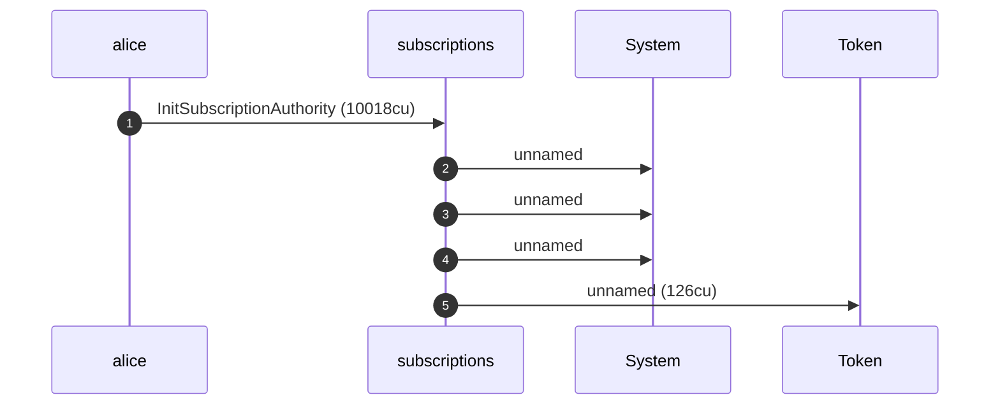
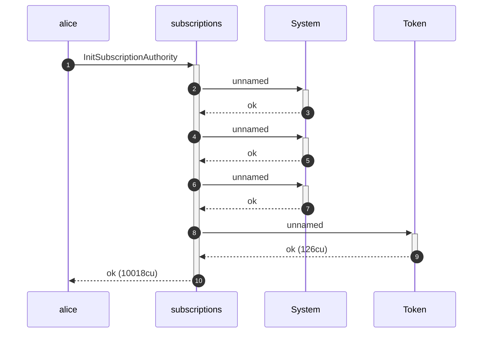
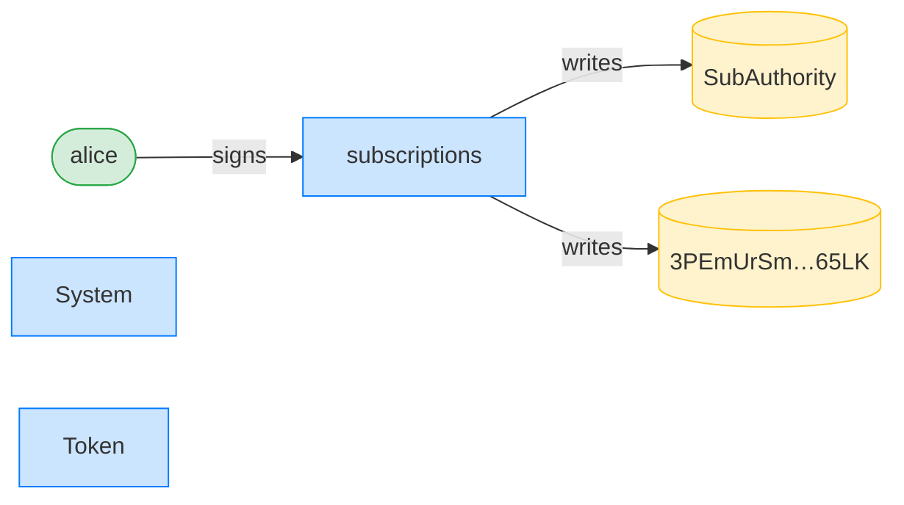
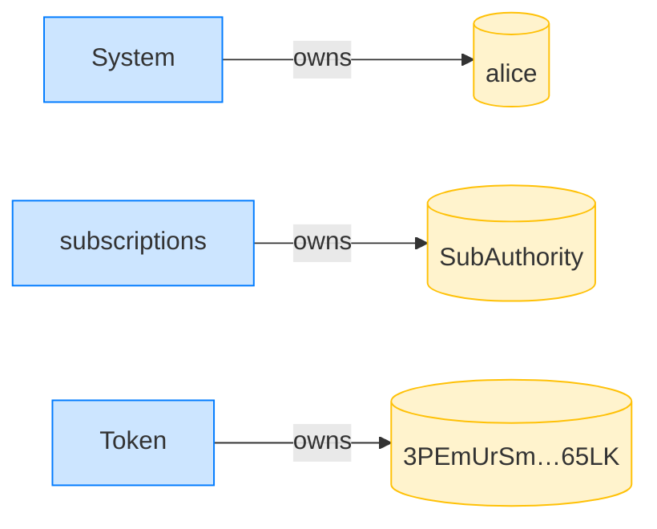

# Finding 3.1.3 — a pre-funded PDA blocks creation: before and after

> Cantina HIGH 3.1.3, reproduced and remediated, rendered end to end in the anchor-litesvm DSL.

An attacker front-runs the deterministic authority PDA with lamports. The unconditional `CreateAccount` is rejected by the System program, so the legitimate user can never initialize their authority — a permanent denial of service.

Below is the *same* exploit run twice: against the vulnerable program (the fix reverted) where it lands, and against the fixed program where it is refused (creation now succeeds (the rent is topped up in place)). Every transaction renders its structured CPI tree and its authority/ownership graphs, so the attack — and its absence — are legible.

---

## ⚠️ Before — the exploit lands (vulnerable program)

#### AUDIT 3.1.3: a pre-funded PDA blocks authority creation — PASS

> an attacker pre-funds the authority PDA so Alice can never initialize it (Cantina HIGH 3.1.3)

##### Mallory pre-funds Alice's authority PDA address

##### Alice tries to initialize her authority

**InitSubscriptionAuthority: structured CPI tree**

```text

Transaction  signers=[alice]
└── subscriptions::InitSubscriptionAuthority [1] ✗ 4721cu  signer=alice
    ├── System [2] ✗ (no cu)
    │   └── Error: custom program error: 0x0
    └── Error: custom program error: 0x0
Error: InstructionError(0, Custom(0))
Compute Units (this run): 4721
Fee: 5000 lamports
Legend (2):
  alice         = FXddRd8CdAC8SWKT3Ataasn69R7rbTfQZcKg8ejyrUbF
  subscriptions = De1egAFMkMWZSN5rYXRj9CAdheBamobVNubTsi9avR44
```

Finding 3.1.3: the PDA address was pre-funded, so the unconditional CreateAccount on this branch is rejected by the System program and Alice's authority cannot be created — a permanent denial of service against any user whose (deterministic) PDA an attacker front-runs. On the fixed code (PR5) the program tops up the rent and Allocate/Assign-s in place, creation succeeds, and the check below fails: that failure is the regression proof the fix holds.

- [x] the pre-funded PDA BLOCKS creation (the vulnerability): `true`

---

## ✅ After — the fix refuses (fixed program, `turbin3`)

#### AUDIT 3.1.3 (regression): the fix survives a pre-funded PDA — PASS

> the PR5 fix tops up a pre-funded PDA so Alice can still initialize (Cantina HIGH 3.1.3)

##### Mallory pre-funds Alice's authority PDA address

##### Alice tries to initialize her authority

**InitSubscriptionAuthority: structured CPI tree**

```text

Transaction  signers=[alice]
└── subscriptions::InitSubscriptionAuthority [1] ✓ 10018cu  signer=alice
    ├── System [2] ✓ (no cu)
    ├── System [2] ✓ (no cu)
    ├── System [2] ✓ (no cu)
    └── Token [2] ✓ 126cu
Compute Units (this run): 10018
Fee: 5000 lamports
Legend (2):
  alice         = FXddRd8CdAC8SWKT3Ataasn69R7rbTfQZcKg8ejyrUbF
  subscriptions = De1egAFMkMWZSN5rYXRj9CAdheBamobVNubTsi9avR44
```

**InitSubscriptionAuthority: sequence diagram**



**InitSubscriptionAuthority: sequence diagram, with lifelines**



**InitSubscriptionAuthority: authority graph**



**InitSubscriptionAuthority: ownership graph**



Finding 3.1.3: the PDA address was pre-funded, so the unconditional CreateAccount on this branch is rejected by the System program and Alice's authority cannot be created — a permanent denial of service against any user whose (deterministic) PDA an attacker front-runs. On the fixed code (PR5) the program tops up the rent and Allocate/Assign-s in place, creation succeeds, and the check below confirms it — this regression guards the fix.

- [x] the fix survives the pre-funded PDA (creation succeeds): `false`
