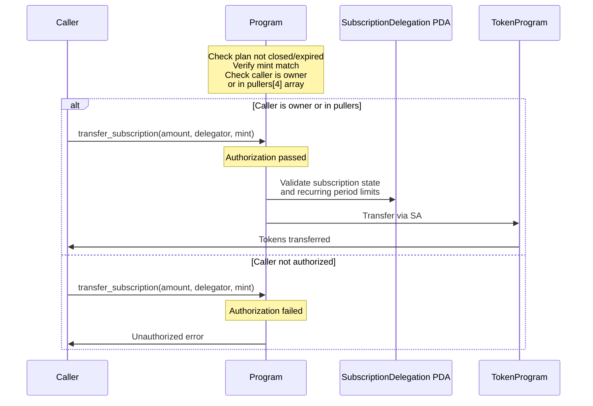
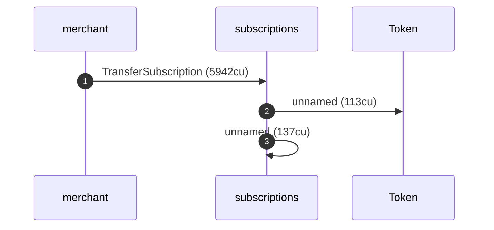

# DSL behavior mirrors

The architecture decision records under [`../docs/`](../docs/) explain the
program with hand-drawn Mermaid: `sequenceDiagram` blocks for the instruction
flows, `flowchart` blocks for the account relationships. Someone sat down and
drew those by reading the code and deciding what mattered.

These reports are the same diagrams, generated. Each one runs the real
instruction through the anchor-litesvm `World`/observability surface and renders
the execution as a sequence diagram and an authority/ownership graph. The
question they answer: does the picture a human drew to *explain* an instruction
fall out of the executor on its own, frame by frame, when we actually run it?

The point is not coverage (the `dsl_tests/` suite covers behavior exhaustively);
it is fidelity. A generated diagram that matches the hand-drawn one is a diagram
that cannot drift from the code, because it *is* the code, observed.

## The reports

| behavior | mirrors | report |
|---|---|---|
| `transfer_subscription` authorization `alt` | ADR-002 "Transfer Subscription (Pull)" | [the authorization alt](./transfer-subscription--pull---the-authorization-alt.md) |

## Worked example: the `transfer_subscription` authorization alt

ADR-002 draws the pull as a sequence diagram with an `alt` block that splits on
the authorization check:



The [report](./transfer-subscription--pull---the-authorization-alt.md) runs both
branches against the program, in one `World`, off one staged subscription. The
generated counterpart to the `alt` branch (the merchant, who owns the plan,
pulls and the transfer lands):



That is the hand-drawn `alt` branch, observed: the caller invokes the program,
the program CPIs into the token program (the `P->>T: Transfer via SA` arrow),
and a self-CPI emits the event. The diagram even carries the compute cost the
hand-drawn one could not know. The authority graph shows that same pull
structurally, naming exactly the accounts the transfer writes:


And the `else` branch (Mallory, who is neither the plan owner nor a whitelisted
puller) is the refused tree, which names the guard the hand-drawn `Unauthorized
error` arrow only gestures at:

```text
Transaction  signers=[mallory]
└── subscriptions::TransferSubscription [1] ✗ 946cu  signer=mallory
    └── Error: Unauthorized
Error: InstructionError(0, Custom(130))
```

The authorization check is step 4 of the instruction's validation (per ADR-002),
so Mallory's frame fails at 946 compute units, before any token moves: there is
no CPI into the token program at all, which is exactly what the hand-drawn
`else` branch shows (the `P->>T` arrow is absent).

## On the `unnamed` inner frames

You will have noticed the generated sequence diagram says `unnamed` where the
hand-drawn one says `Transfer via SA`:

```text
    subscriptions ->> Token: unnamed (113cu)
    subscriptions ->> subscriptions: unnamed (137cu)
```

The top-level frame names itself (`TransferSubscription`); the inner CPI frames
do not. This is worth being precise about, because it is not a property of this
program and it is not quite a bug either: it is a seam left by an unfinished
migration in the framework's multi-engine model, and the two unnamed frames sit
on different sides of it.

The root cause is the cross-engine abstraction. Inner-frame name resolution was
originally wired to litesvm's `inner_instructions` list. But the engine-neutral
record the renderers consume deliberately does not carry `inner_instructions`
(that list is a litesvm-specific artifact an RPC or mollusk backend would not
produce the same way); it carries inner *structure* as the `cpi_tree` frames and
inner *data* as the per-frame trace. So when the model went engine-neutral, the
naming logic stayed behind on an input that is now empty on every backend's path.
The resolver still exists; it just no longer has anything to read.

The two unnamed frames are not equally unsettled, though:

- **The `Token` frame (a native-program CPI).** Where its name belongs is
  already clear: in the trace pass, because the trace is now the cross-engine
  carrier of inner data, and the built-in decoders are pure functions of
  `(program_id, data)`. This half is an incomplete migration with an obvious
  destination, not an open question. The name `Transfer` would fall out for free
  the moment resolution moves onto the trace, with no per-program registration.

- **The `subscriptions ->> subscriptions` frame (a self-CPI event emit).** This
  one is a genuine open design question. The program emits events as a self-CPI
  whose data is an 8-byte event tag rather than an instruction discriminator, and
  the framework already has *two* renderers that disagree about it: the tree
  consults the event registry and prints `🔔 SubscriptionCreated`, while the
  sequence renderer consults only the instruction-name table and prints
  `unnamed`. Underneath that is a real judgment call we have not settled: should
  a self-CPI emit even be a participant arrow in the sequence view, or should it
  fold into the caller the way the tree's annotation does?

In sum: the `unnamed` frames are a symptom of the
`inner_instructions`-to-`trace` migration (done for multi-engine support) being
half-finished. One half has a clear home it has not moved to yet; the other half
is a real question about whether events are instructions in a sequence diagram at
all. Neither touches what this mirror is *for*: the `alt` is a story about
authorization, carried by the named top-level frame, the authority graph, and
the refused `Unauthorized`. The unnamed frames are the token transfer and the
event emit, identical on both branches, so the report is a faithful mirror of
ADR-002 today and a tidier one once the native-program half lands.

## Regenerating

These reports are byte-reproducible (deterministic actors, pinned clock). They
are generated in their own scope so they neither depend on nor disturb the
`dsl_tests/` snapshot:

```bash
cargo build-sbf --manifest-path program/Cargo.toml
MD_REPORTS_DIR=$(pwd)/dsl_behaviors \
  cargo test -p tests-subscriptions transfer_subscription_the_authorization_alt
```
