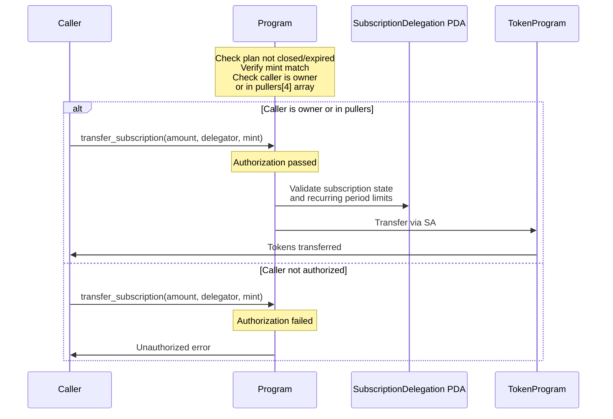
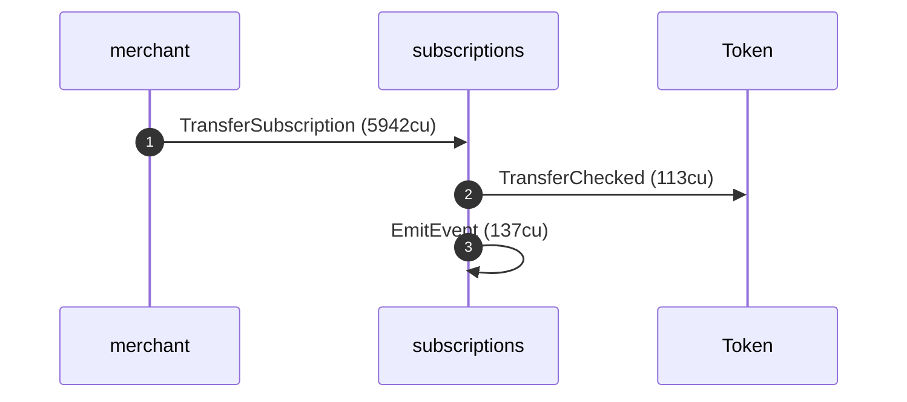
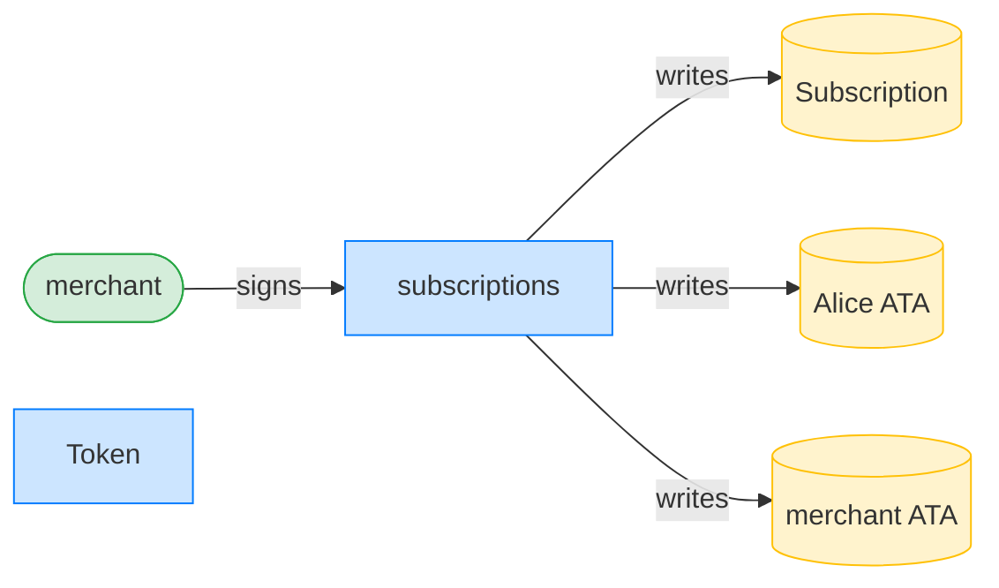

# DSL behavior mirrors

The architecture decision records under [`../docs/`](../docs/) explain the
program with hand-drawn Mermaid: `sequenceDiagram` blocks for the instruction
flows, `flowchart` blocks for the account relationships. Someone sat down and
drew those by reading the code and deciding what mattered.

These reports are the same diagrams, generated. Each one runs the real
instruction through the anchor-litesvm `World`/observability surface and renders
the execution as a sequence diagram and an authority/ownership graph. The
question they answer: does the picture a human drew to *explain* an instruction
fall out of the executor on its own, frame by frame, when we actually run it?

The point is not coverage (the `dsl_tests/` suite covers behavior exhaustively);
it is fidelity. A generated diagram that matches the hand-drawn one is a diagram
that cannot drift from the code, because it *is* the code, observed.

## The reports

| behavior | mirrors | report |
|---|---|---|
| `transfer_subscription` authorization `alt` | ADR-002 "Transfer Subscription (Pull)" | [the authorization alt](./transfer-subscription--pull---the-authorization-alt.md) |

## Worked example: the `transfer_subscription` authorization alt

ADR-002 draws the pull as a sequence diagram with an `alt` block that splits on
the authorization check:



The [report](./transfer-subscription--pull---the-authorization-alt.md) runs both
branches against the program, in one `World`, off one staged subscription. The
generated counterpart to the `alt` branch (the merchant, who owns the plan,
pulls and the transfer lands):



That is the hand-drawn `alt` branch, observed: the caller invokes the program,
the program CPIs into the token program (the `P->>T: Transfer via SA` arrow, here
the named `Token: TransferChecked`), and a self-CPI emits the event. The diagram even carries the compute cost the
hand-drawn one could not know. The authority graph shows that same pull
structurally, naming exactly the accounts the transfer writes:



And the `else` branch (Mallory, who is neither the plan owner nor a whitelisted
puller) is the refused tree, which names the guard the hand-drawn `Unauthorized
error` arrow only gestures at:

```text
Transaction  signers=[mallory]
└── subscriptions::TransferSubscription [1] ✗ 946cu  signer=mallory
    └── Error: Unauthorized
Error: InstructionError(0, Custom(130))
```

The authorization check is step 4 of the instruction's validation (per ADR-002),
so Mallory's frame fails at 946 compute units, before any token moves: there is
no CPI into the token program at all, which is exactly what the hand-drawn
`else` branch shows (the `P->>T` arrow is absent).

## On the inner frame names

The inner CPI frames now name themselves: `System: CreateAccount`,
`Token: TransferChecked`, `subscriptions: EmitEvent`. That was not always so, and
the history is worth a note because it is the dogfood loop paying off.

These frames used to render `unnamed`. The cause was a seam in the framework's
multi-engine model: inner-frame name resolution was wired to litesvm's
`inner_instructions` list, but the engine-neutral record the renderers consume
deliberately does not carry that list (it is a litesvm-specific artifact an RPC
or mollusk backend would not produce the same way); it carries inner *structure*
as the `cpi_tree` frames and inner *data* as the per-frame trace. So when the
model went engine-neutral, the naming logic stayed behind on an input that was
empty on every backend's path. The resolver existed; it just had nothing to read.

The fix (cds-rs/anchor-litesvm#10, landed in `turbin3` at `c45d76b`) resolves the
name from the trace instead, with the same built-in decoders. Those decoders are
pure functions of `(program_id, data)`, so a native-program CPI names itself with
no per-program registration: `System: CreateAccount`, `Token: TransferChecked`,
`Token: Approve` all fall out for free. This report regenerated against that fix
is what you see above.

One nicety remains open (#10's second half). The `subscriptions ->> subscriptions`
frame is the program emitting an event as a self-CPI; it now reads `EmitEvent`,
its registered instruction name, rather than `unnamed`. But the CPI tree decodes
that same frame further, to `🔔 SubscriptionCreated` with its fields, because it
consults the event registry. Whether the *sequence* view should likewise name it
by the event (`emit SubscriptionCreated`) or fold it into the caller the way the
tree's annotation does is an unsettled rendering question, not a missing fact: the
event is already decoded where it matters. Either way it does not touch what this
mirror is *for* (the authorization `alt`, carried by the top-level frame, the
authority graph, and the refused `Unauthorized`).

## Regenerating

These reports are byte-reproducible (deterministic actors, pinned clock). They
are generated in their own scope so they neither depend on nor disturb the
`dsl_tests/` snapshot:

```bash
cargo build-sbf --manifest-path program/Cargo.toml
MD_REPORTS_DIR=$(pwd)/dsl_behaviors \
  cargo test -p tests-subscriptions transfer_subscription_the_authorization_alt
```
