## Transfer subscription (pull): the authorization alt — PASS

> the same pull, run by an authorized caller (it lands) and an unauthorized one (Unauthorized), mirroring the alt block in the ADR-002 sequence diagram

### Stage: Alice's authority, the merchant's plan, Alice subscribed

**InitSubscriptionAuthority: structured CPI tree**

```text

Transaction  signers=[alice]
└── subscriptions::InitSubscriptionAuthority [1] ✓ 7742cu  signer=alice
    ├── System::CreateAccount [2] ✓ (no cu)
    └── Token::Approve [2] ✓ 126cu
Compute Units (this run): 7742
Fee: 5000 lamports
Legend (2):
  alice         = FXddRd8CdAC8SWKT3Ataasn69R7rbTfQZcKg8ejyrUbF
  subscriptions = De1egAFMkMWZSN5rYXRj9CAdheBamobVNubTsi9avR44
```

**InitSubscriptionAuthority: sequence diagram**

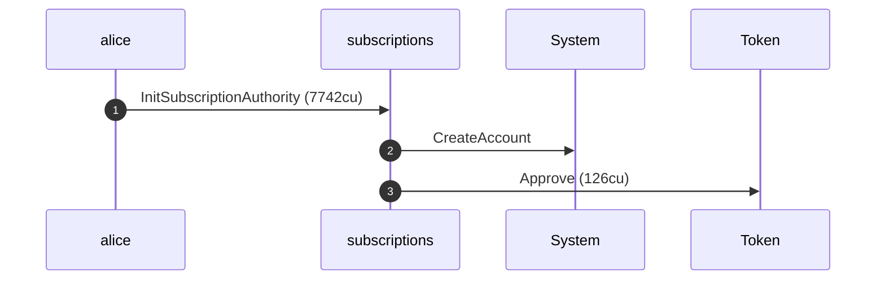

**InitSubscriptionAuthority: sequence diagram, with lifelines**

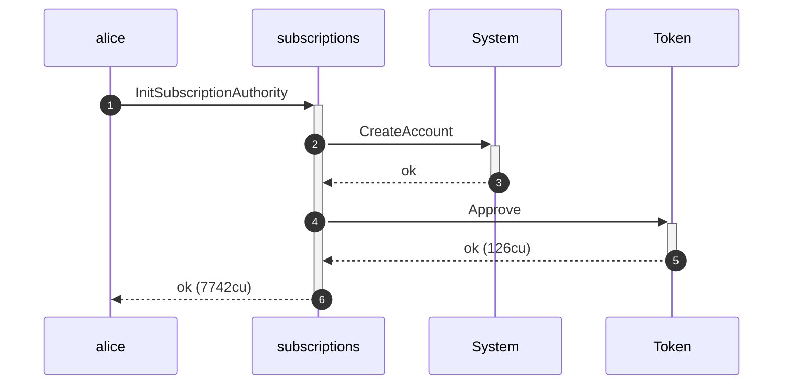

**InitSubscriptionAuthority: authority graph**

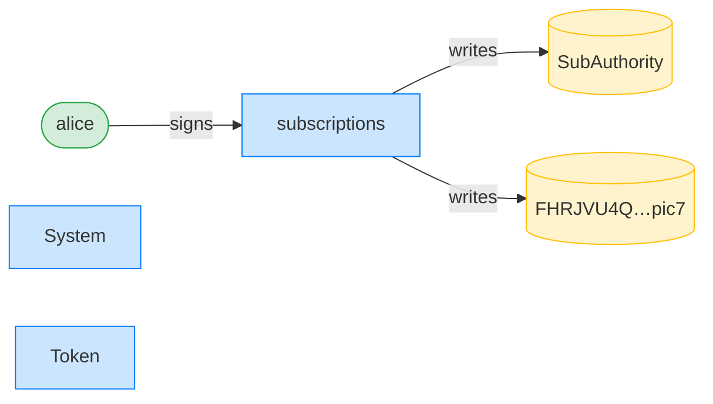

**InitSubscriptionAuthority: ownership graph**

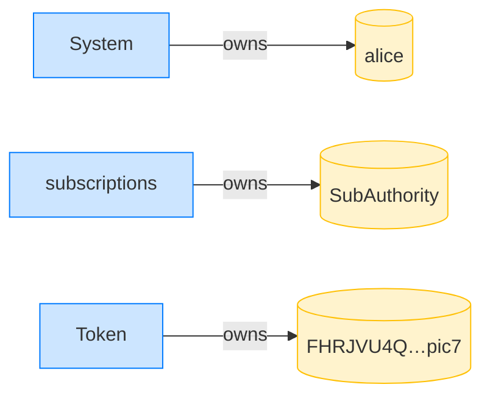

**CreatePlan: structured CPI tree**

```text

Transaction  signers=[merchant]
└── subscriptions::CreatePlan [1] ✓ 3468cu  signer=merchant
    └── System::CreateAccount [2] ✓ (no cu)
Compute Units (this run): 3468
Fee: 5000 lamports
Legend (2):
  merchant      = J4fPsxKiTTKiXSiN9bgZ5JBrVgTM9c6N8tjhLN8gfdTq
  subscriptions = De1egAFMkMWZSN5rYXRj9CAdheBamobVNubTsi9avR44
```

**CreatePlan: sequence diagram**

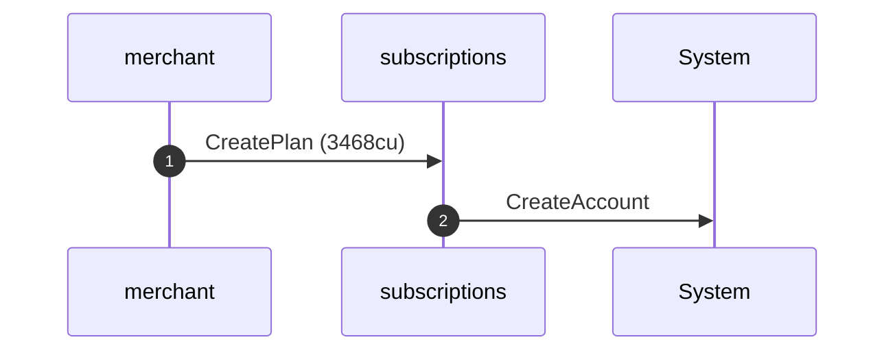

**CreatePlan: sequence diagram, with lifelines**

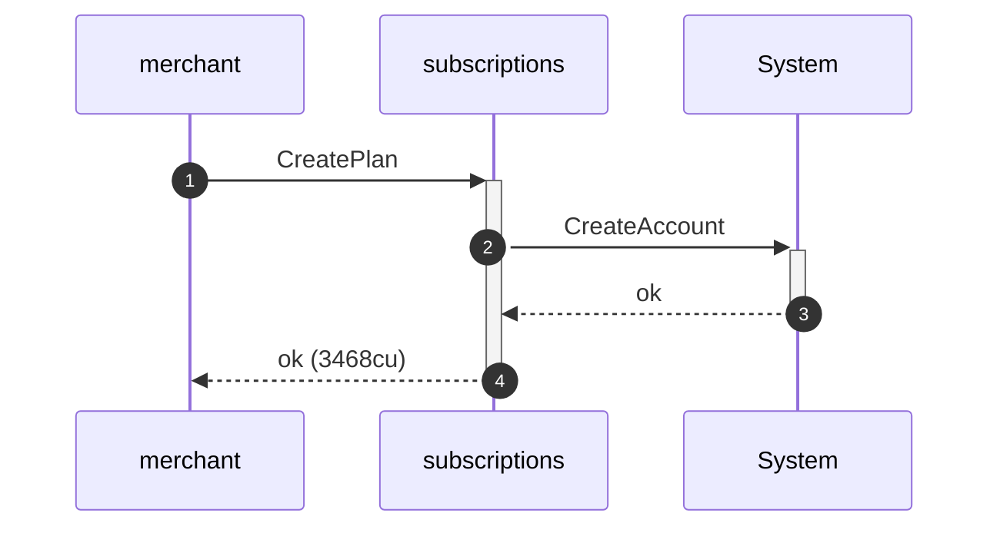

**CreatePlan: authority graph**

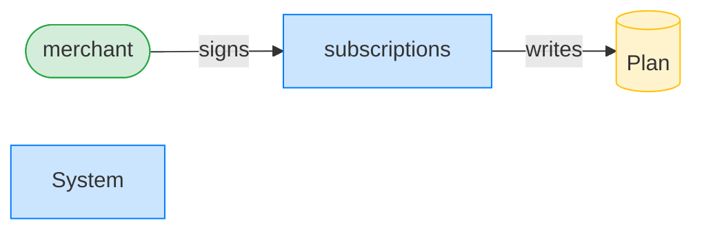

**CreatePlan: ownership graph**

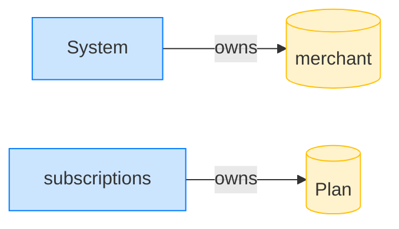

**Subscribe: structured CPI tree**

```text

Transaction  signers=[alice]
└── subscriptions::Subscribe [1] ✓ 6516cu  signer=alice
    ├── System::CreateAccount [2] ✓ (no cu)
    └── subscriptions::EmitEvent [2] ✓ 137cu
          🔔 SubscriptionCreated
               plan:       Plan,
               subscriber: alice,
               mint:       USDC mint,
               created_ts: 1700000000
Compute Units (this run): 6516
Fee: 5000 lamports
Legend (2):
  alice         = FXddRd8CdAC8SWKT3Ataasn69R7rbTfQZcKg8ejyrUbF
  subscriptions = De1egAFMkMWZSN5rYXRj9CAdheBamobVNubTsi9avR44
```

**Subscribe: sequence diagram**

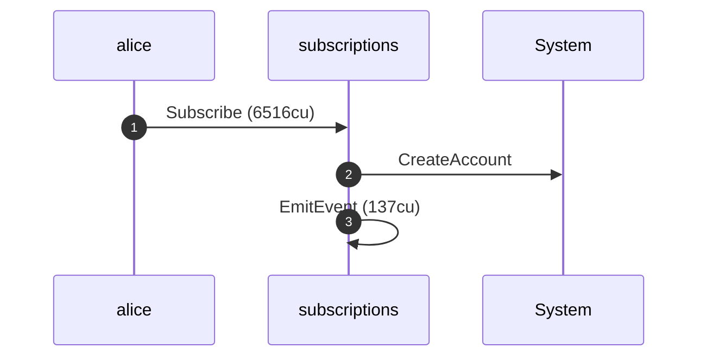

**Subscribe: sequence diagram, with lifelines**

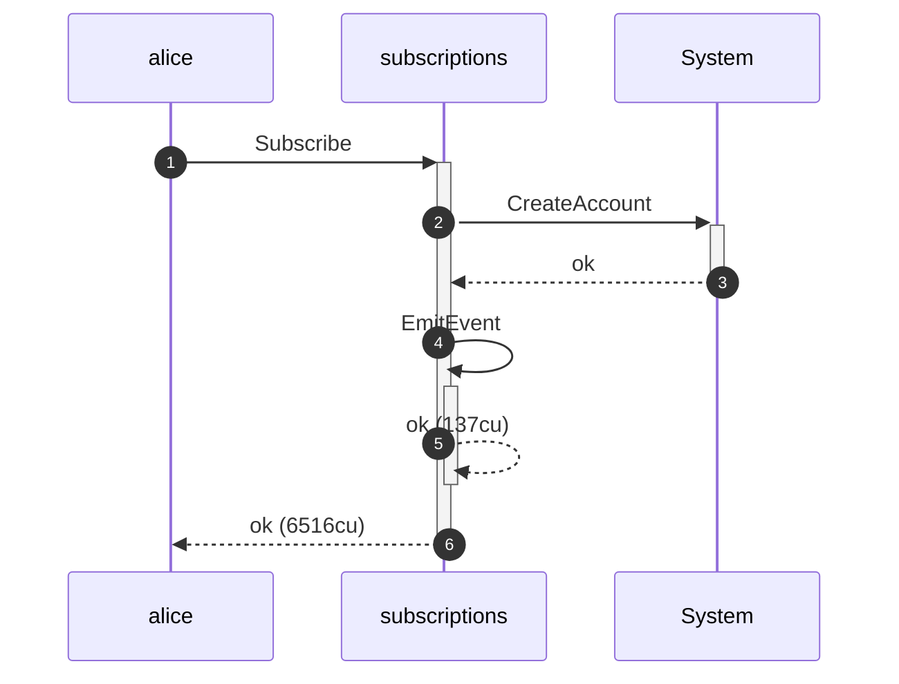

**Subscribe: authority graph**

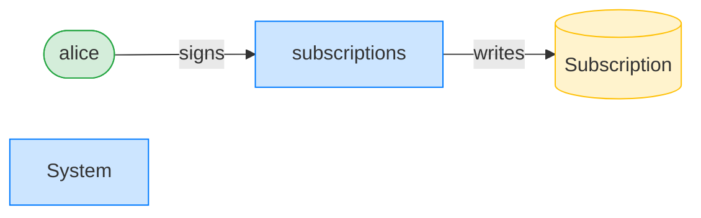

**Subscribe: ownership graph**

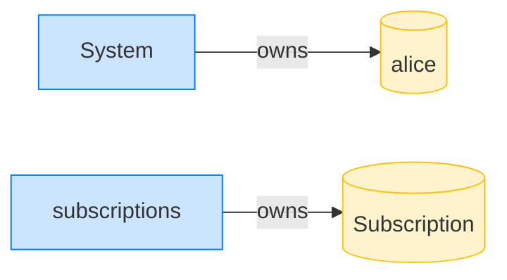

ADR-002 draws `transfer_subscription` as a sequence diagram whose `alt` splits on the authorization check: **`alt` Caller is owner or in pullers** versus **`else` Caller not authorized**. The two sections below run exactly those two branches against the program; the rendered sequence diagrams and authority graphs are the generated mirror of that hand-drawn alt.

### alt — the caller is the plan owner (authorized): the pull lands

The merchant owns the plan, so authorization passes. The pull moves 10 tokens through the subscription authority's signed token transfer and emits the recurring-transfer event. The authority graph shows the merchant signing and the program writing the subscription and the token accounts.

**alt: authorized pull (merchant): structured CPI tree**

```text

Transaction  signers=[merchant]
└── subscriptions::TransferSubscription [1] ✓ 5942cu  signer=merchant
    ├── Token::TransferChecked [2] ✓ 113cu
    └── subscriptions::EmitEvent [2] ✓ 137cu
Compute Units (this run): 5942
Fee: 5000 lamports
Legend (2):
  merchant      = J4fPsxKiTTKiXSiN9bgZ5JBrVgTM9c6N8tjhLN8gfdTq
  subscriptions = De1egAFMkMWZSN5rYXRj9CAdheBamobVNubTsi9avR44
```

**alt: authorized pull (merchant): sequence diagram**

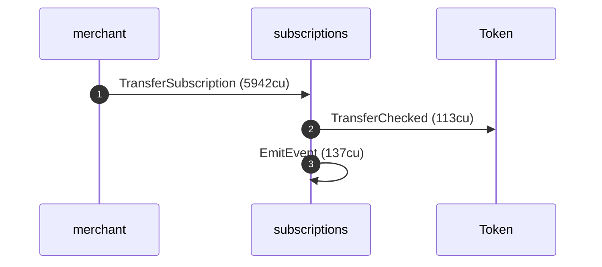

**alt: authorized pull (merchant): sequence diagram, with lifelines**

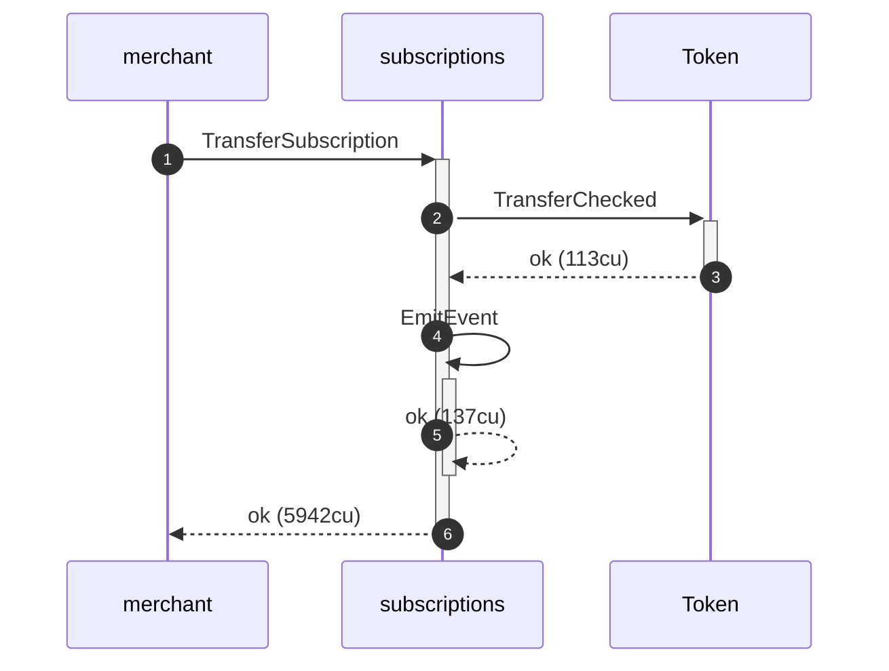

**alt: authorized pull (merchant): authority graph**

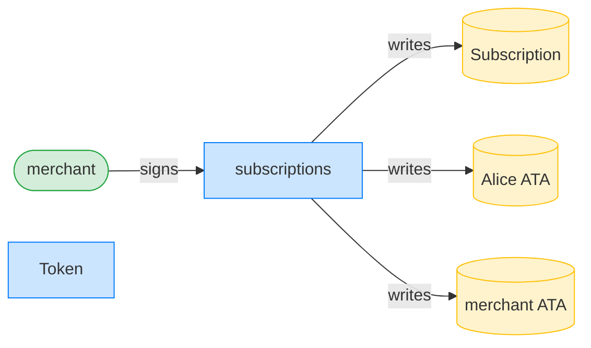

**alt: authorized pull (merchant): ownership graph**

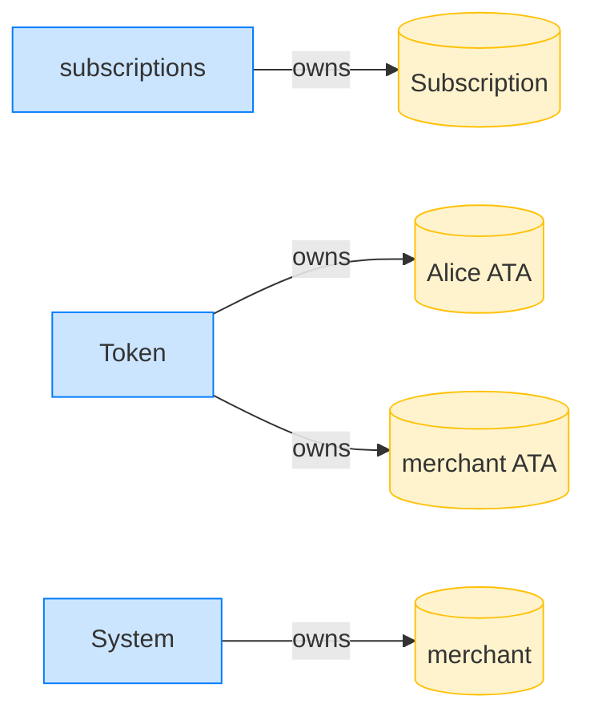

- [x] the authorized pull credited the merchant 10 tokens: `10000000`

### else — the caller is neither owner nor puller (unauthorized): the pull is refused

Mallory is neither the plan owner nor a whitelisted puller, so the authorization check at step 4 fails before any token moves. The refused tree names the guard: `Unauthorized`. The transaction-level surface stops at the program frame; nothing is signed into the token program.

**else: unauthorized pull (mallory): structured CPI tree**

```text

Transaction  signers=[mallory]
└── subscriptions::TransferSubscription [1] ✗ 946cu  signer=mallory
    └── Error: Unauthorized
Error: InstructionError(0, Custom(130))
Compute Units (this run): 946
Fee: 5000 lamports
Legend (2):
  mallory       = DBSEUVB8mVMJYsFGED5gtoBUxDPN2FmQKs9KPiMxXoE8
  subscriptions = De1egAFMkMWZSN5rYXRj9CAdheBamobVNubTsi9avR44
```

- [x] the refused pull moved nothing more — the merchant still holds only the authorized 10: `10000000`
