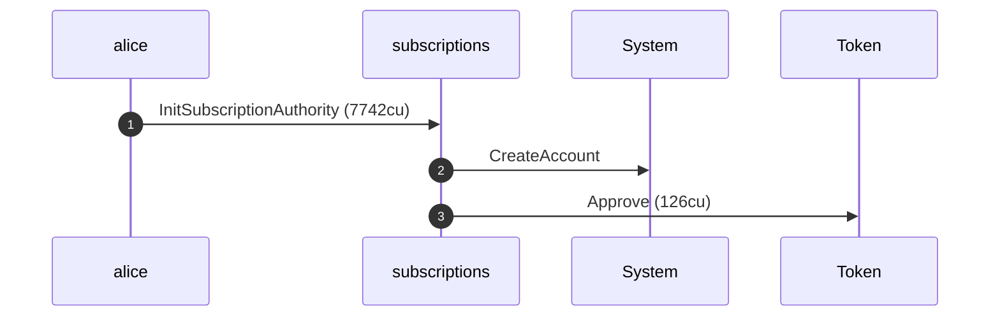
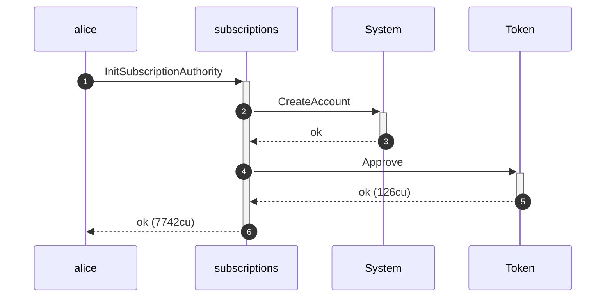
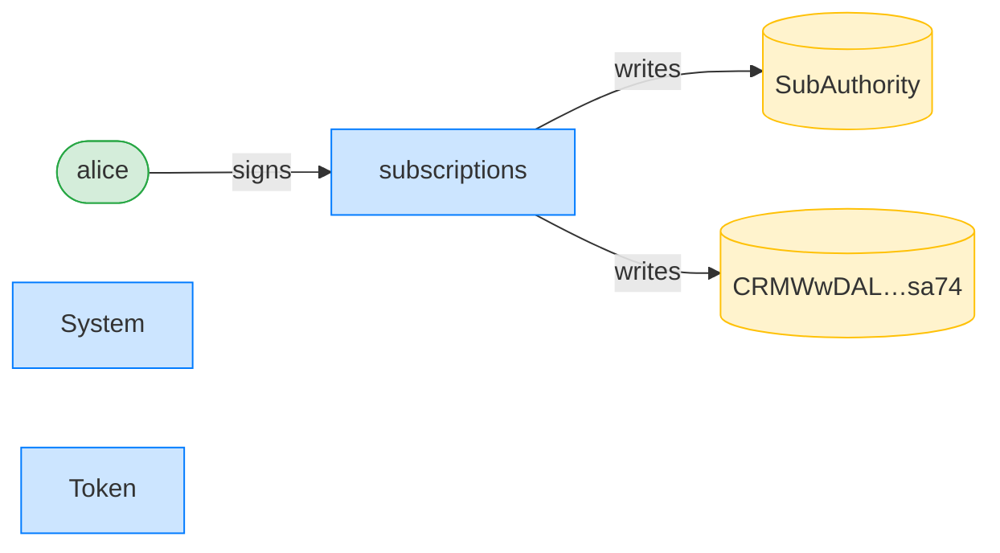
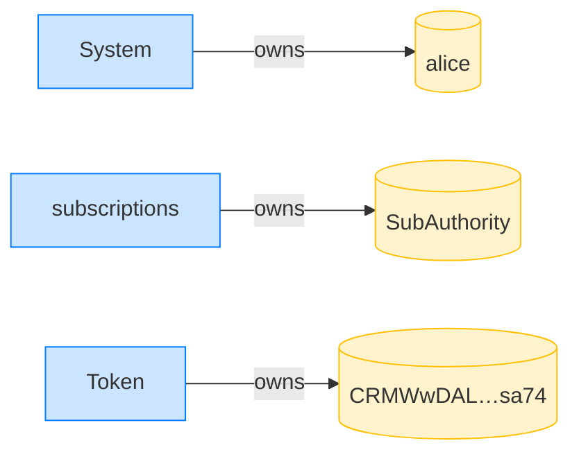
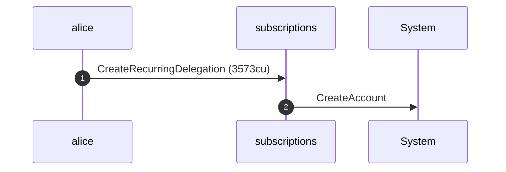
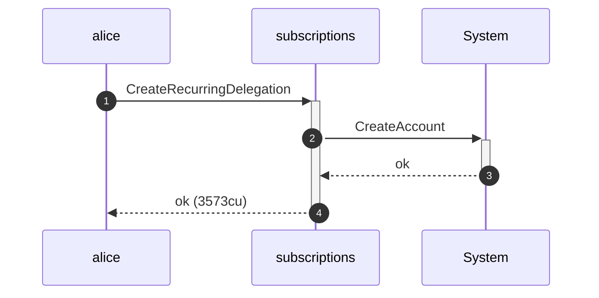
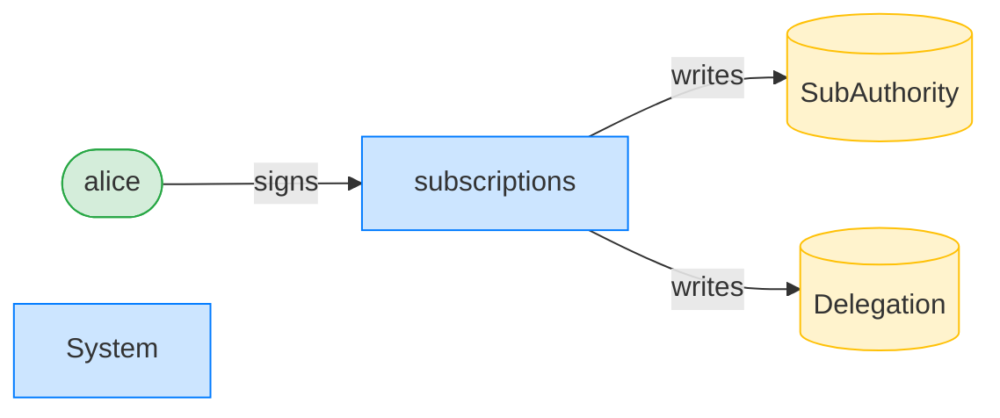
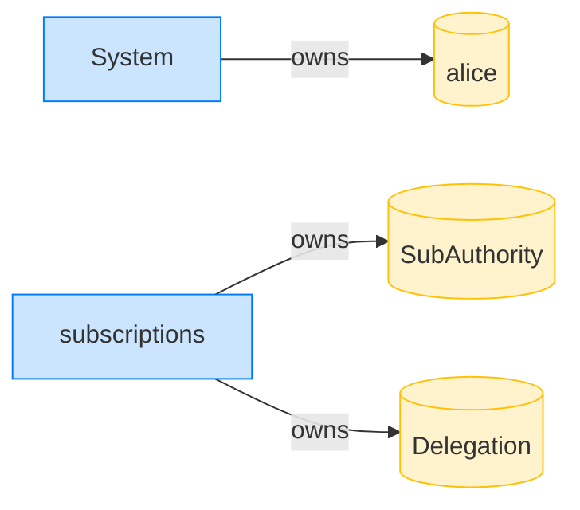

## A non-delegator cannot revoke — PASS

> Mallory, who is neither delegator nor payer, cannot revoke a live delegation

**InitSubscriptionAuthority: structured CPI tree**

```text

Transaction  signers=[alice]
└── subscriptions::InitSubscriptionAuthority [1] ✓ 7742cu  signer=alice
    ├── System::CreateAccount [2] ✓ (no cu)
    └── Token::Approve [2] ✓ 126cu
Compute Units (this run): 7742
Fee: 5000 lamports
Legend (2):
  alice         = FXddRd8CdAC8SWKT3Ataasn69R7rbTfQZcKg8ejyrUbF
  subscriptions = De1egAFMkMWZSN5rYXRj9CAdheBamobVNubTsi9avR44
```

**InitSubscriptionAuthority: sequence diagram**



**InitSubscriptionAuthority: sequence diagram, with lifelines**



**InitSubscriptionAuthority: authority graph**



**InitSubscriptionAuthority: ownership graph**



### Alice creates a recurring delegation

**CreateRecurringDelegation: structured CPI tree**

```text

Transaction  signers=[alice]
└── subscriptions::CreateRecurringDelegation [1] ✓ 3573cu  signer=alice
    └── System::CreateAccount [2] ✓ (no cu)
Compute Units (this run): 3573
Fee: 5000 lamports
Legend (2):
  alice         = FXddRd8CdAC8SWKT3Ataasn69R7rbTfQZcKg8ejyrUbF
  subscriptions = De1egAFMkMWZSN5rYXRj9CAdheBamobVNubTsi9avR44
```

**CreateRecurringDelegation: sequence diagram**



**CreateRecurringDelegation: sequence diagram, with lifelines**



**CreateRecurringDelegation: authority graph**



**CreateRecurringDelegation: ownership graph**



### Mallory tries to revoke Alice's delegation

**RevokeDelegation (by Mallory): structured CPI tree**

```text

Transaction  signers=[mallory]
└── subscriptions::RevokeDelegation [1] ✗ 229cu  signer=mallory
    └── Error: Unauthorized
Error: InstructionError(0, Custom(130))
Compute Units (this run): 229
Fee: 5000 lamports
Legend (2):
  mallory       = DBSEUVB8mVMJYsFGED5gtoBUxDPN2FmQKs9KPiMxXoE8
  subscriptions = De1egAFMkMWZSN5rYXRj9CAdheBamobVNubTsi9avR44
```
