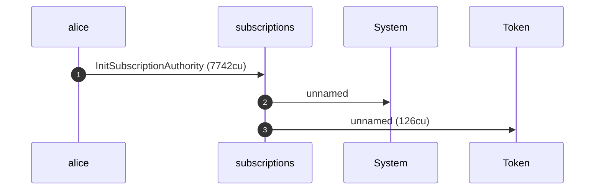
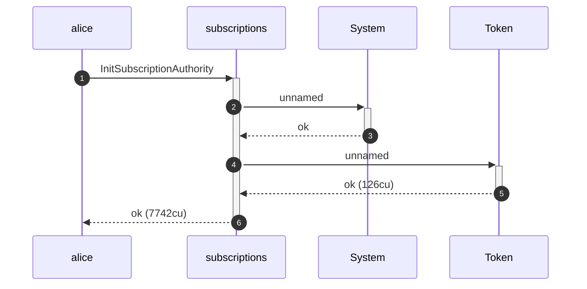
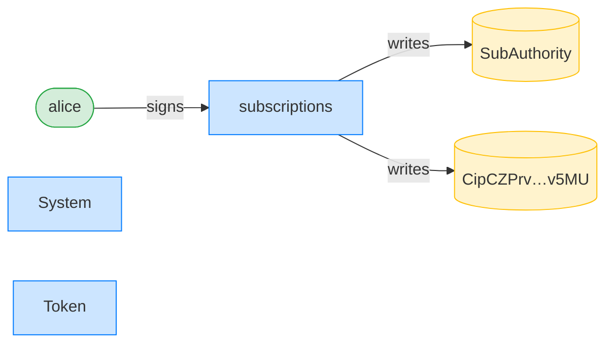
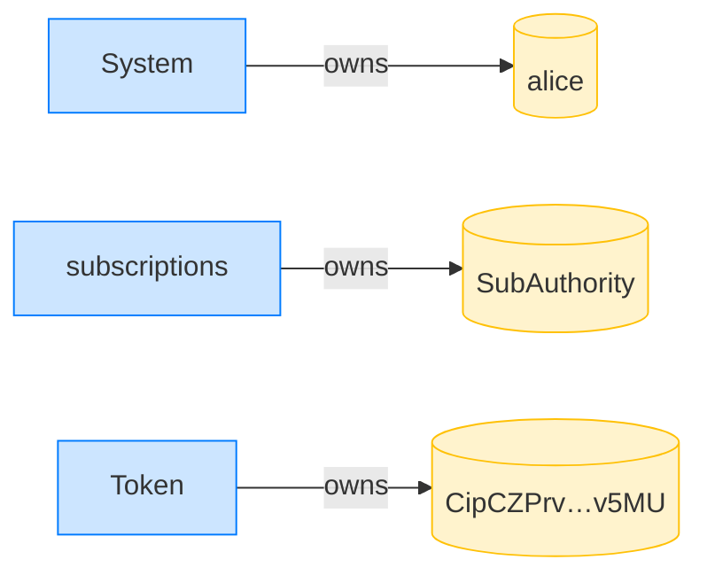

## A non-owner cannot close the authority — PASS

> Mallory cannot close Alice's SubscriptionAuthority

**InitSubscriptionAuthority: structured CPI tree**

```text

Transaction  signers=[alice]
└── subscriptions::InitSubscriptionAuthority [1] ✓ 7742cu  signer=alice
    ├── System [2] ✓ (no cu)
    └── Token [2] ✓ 126cu
Compute Units (this run): 7742
Fee: 5000 lamports
Legend (2):
  alice         = FXddRd8CdAC8SWKT3Ataasn69R7rbTfQZcKg8ejyrUbF
  subscriptions = De1egAFMkMWZSN5rYXRj9CAdheBamobVNubTsi9avR44
```

**InitSubscriptionAuthority: sequence diagram**



**InitSubscriptionAuthority: sequence diagram, with lifelines**



**InitSubscriptionAuthority: authority graph**



**InitSubscriptionAuthority: ownership graph**



### Mallory attempts to close Alice's authority

**CloseSubscriptionAuthority (non-owner): structured CPI tree**

```text

Transaction  signers=[mallory]
└── subscriptions::CloseSubscriptionAuthority [1] ✗ 222cu  signer=mallory
    └── Error: Unauthorized
Error: InstructionError(0, Custom(130))
Compute Units (this run): 222
Fee: 5000 lamports
Legend (2):
  mallory       = DBSEUVB8mVMJYsFGED5gtoBUxDPN2FmQKs9KPiMxXoE8
  subscriptions = De1egAFMkMWZSN5rYXRj9CAdheBamobVNubTsi9avR44
```

- [x] the authority is still funded: `true`
