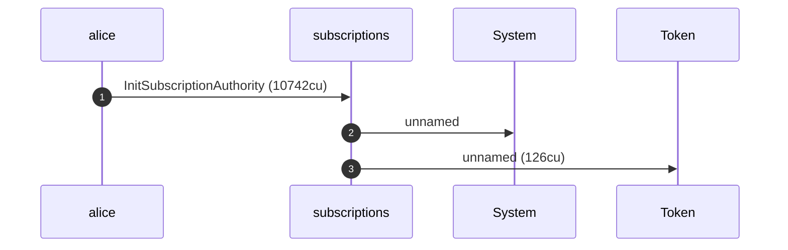
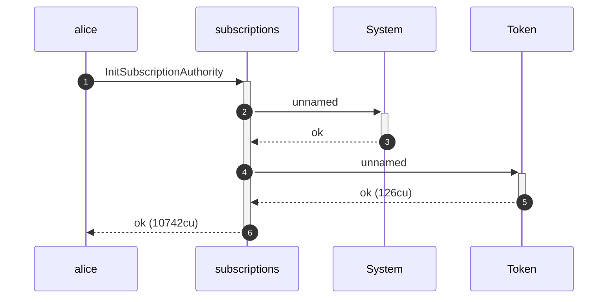
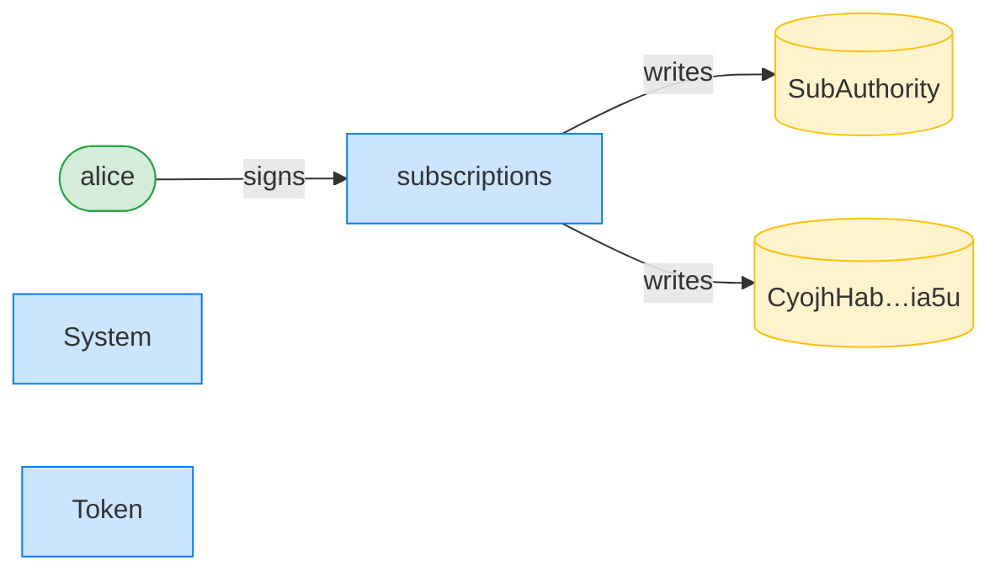
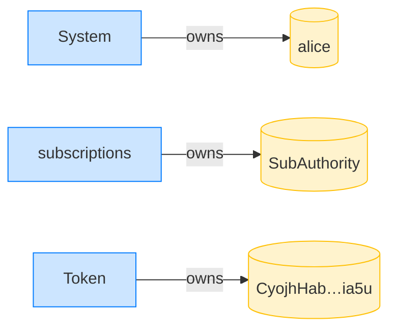
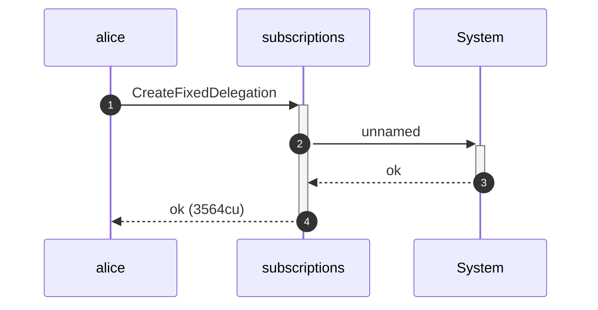
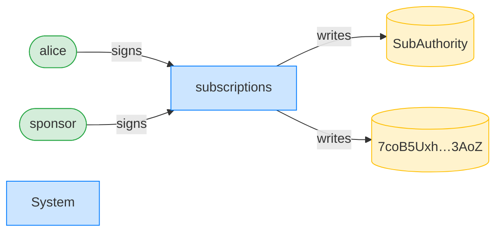
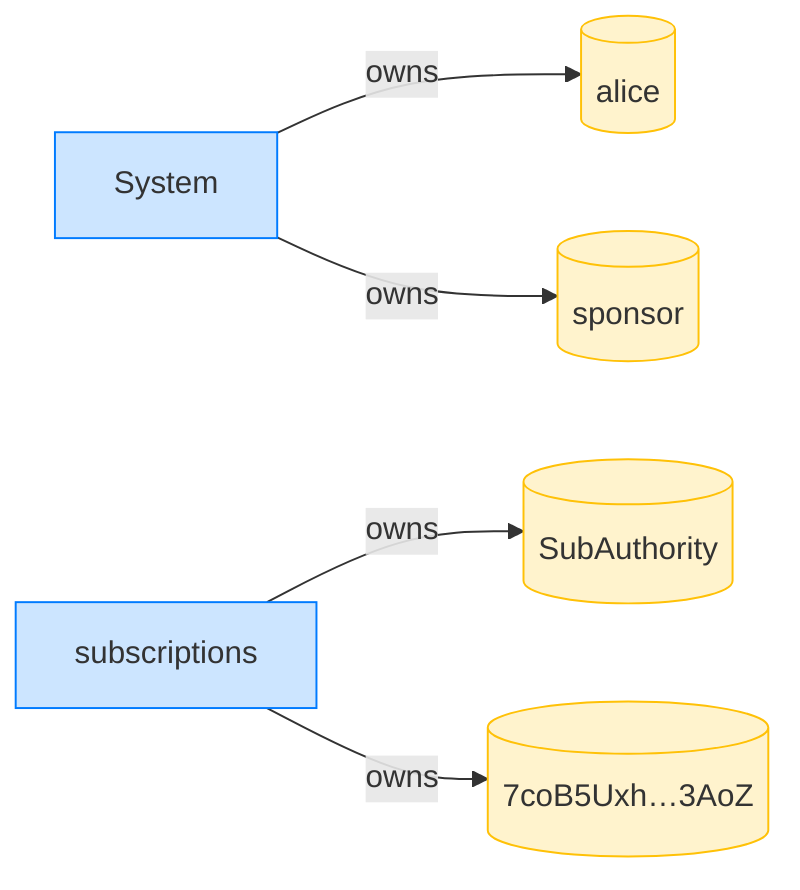

## A sponsor cannot revoke a no-expiry delegation — PASS

> a delegation with no expiry never becomes sponsor-revocable, even far in the future

**InitSubscriptionAuthority: structured CPI tree**

```text

Transaction  signers=[alice]
└── subscriptions::InitSubscriptionAuthority [1] ✓ 10742cu  signer=alice
    ├── System [2] ✓ (no cu)
    └── Token [2] ✓ 126cu
Compute Units (this run): 10742
Fee: 5000 lamports
Legend (2):
  alice         = FXddRd8CdAC8SWKT3Ataasn69R7rbTfQZcKg8ejyrUbF
  subscriptions = De1egAFMkMWZSN5rYXRj9CAdheBamobVNubTsi9avR44
```

**InitSubscriptionAuthority: sequence diagram**



**InitSubscriptionAuthority: sequence diagram, with lifelines**



**InitSubscriptionAuthority: authority graph**



**InitSubscriptionAuthority: ownership graph**



### Alice creates a sponsor-funded delegation with no expiry

**CreateFixedDelegation (sponsored, no expiry): structured CPI tree**

```text

Transaction  signers=[sponsor, alice]
└── subscriptions::CreateFixedDelegation [1] ✓ 3564cu  signer=[alice, sponsor]
    └── System [2] ✓ (no cu)
Compute Units (this run): 3564
Fee: 10000 lamports
Legend (3):
  sponsor       = 47cncVPgU4mK37H7VvxLCCsoDEKYaVhNLHHp4MbnEwvx
  alice         = FXddRd8CdAC8SWKT3Ataasn69R7rbTfQZcKg8ejyrUbF
  subscriptions = De1egAFMkMWZSN5rYXRj9CAdheBamobVNubTsi9avR44
```

**CreateFixedDelegation (sponsored, no expiry): sequence diagram**


**CreateFixedDelegation (sponsored, no expiry): sequence diagram, with lifelines**



**CreateFixedDelegation (sponsored, no expiry): authority graph**



**CreateFixedDelegation (sponsored, no expiry): ownership graph**



### The sponsor tries to revoke a no-expiry delegation a year later

**RevokeDelegation (by sponsor, no expiry): structured CPI tree**

```text

Transaction  signers=[sponsor]
└── subscriptions::RevokeDelegation [1] ✗ 371cu  signer=sponsor
    └── Error: Unauthorized
Error: InstructionError(0, Custom(130))
Compute Units (this run): 371
Fee: 5000 lamports
Legend (2):
  sponsor       = 47cncVPgU4mK37H7VvxLCCsoDEKYaVhNLHHp4MbnEwvx
  subscriptions = De1egAFMkMWZSN5rYXRj9CAdheBamobVNubTsi9avR44
```
