## A sponsor cannot revoke with the wrong plan PDA — PASS

> pointing revoke at an unrelated plan is rejected as a subscription/plan mismatch

### Stage: Alice's authority, the merchant's plan, Alice subscribed (sponsored)

**InitSubscriptionAuthority: structured CPI tree**

```text

Transaction  signers=[alice]
└── subscriptions::InitSubscriptionAuthority [1] ✓ 6242cu  signer=alice
    ├── System [2] ✓ (no cu)
    └── Token [2] ✓ 126cu
Compute Units (this run): 6242
Fee: 5000 lamports
Legend (2):
  alice         = FXddRd8CdAC8SWKT3Ataasn69R7rbTfQZcKg8ejyrUbF
  subscriptions = De1egAFMkMWZSN5rYXRj9CAdheBamobVNubTsi9avR44
```

**InitSubscriptionAuthority: sequence diagram**

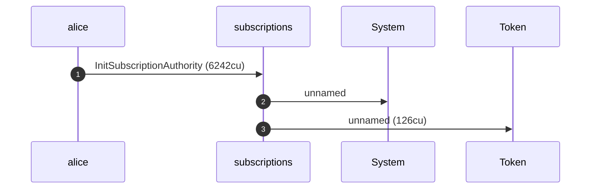

**InitSubscriptionAuthority: sequence diagram, with lifelines**

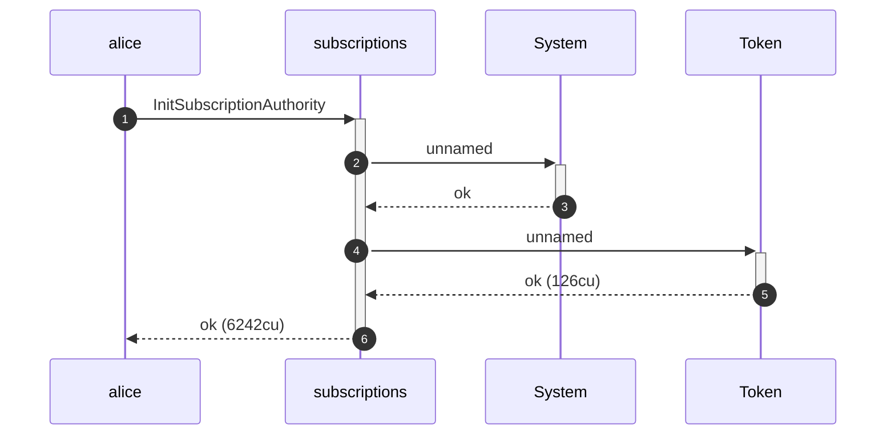

**InitSubscriptionAuthority: authority graph**

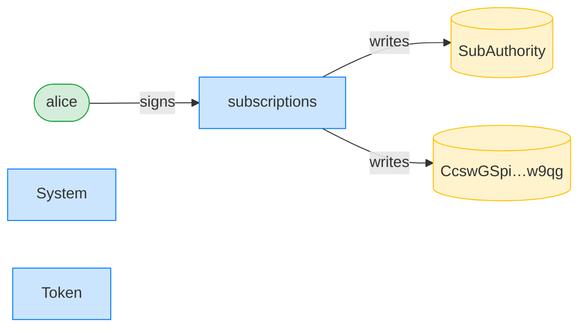

**InitSubscriptionAuthority: ownership graph**

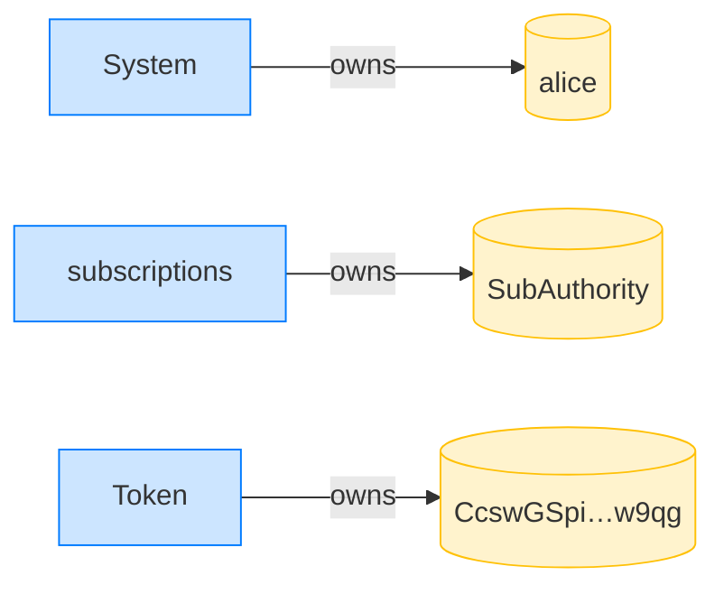

**CreatePlan: structured CPI tree**

```text

Transaction  signers=[merchant]
└── subscriptions::CreatePlan [1] ✓ 3468cu  signer=merchant
    └── System [2] ✓ (no cu)
Compute Units (this run): 3468
Fee: 5000 lamports
Legend (2):
  merchant      = J4fPsxKiTTKiXSiN9bgZ5JBrVgTM9c6N8tjhLN8gfdTq
  subscriptions = De1egAFMkMWZSN5rYXRj9CAdheBamobVNubTsi9avR44
```

**CreatePlan: sequence diagram**


**CreatePlan: sequence diagram, with lifelines**


**CreatePlan: authority graph**

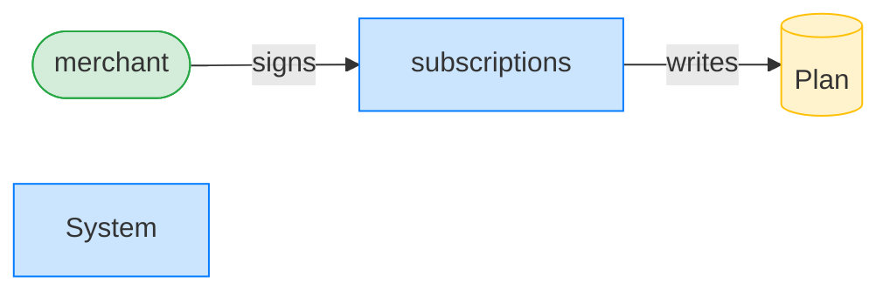

**CreatePlan: ownership graph**

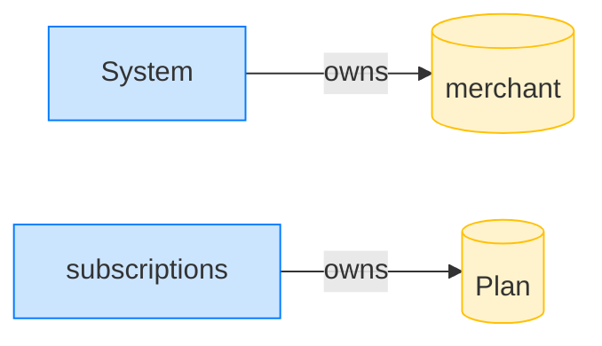

**Subscribe (sponsored): structured CPI tree**

```text

Transaction  signers=[sponsor, alice]
└── subscriptions::Subscribe [1] ✓ 6540cu  signer=[alice, sponsor]
    ├── System [2] ✓ (no cu)
    └── subscriptions [2] ✓ 137cu
          🔔 SubscriptionCreated
               plan:       Plan,
               subscriber: alice,
               mint:       USDC mint,
               created_ts: 1700000000
Compute Units (this run): 6540
Fee: 10000 lamports
Legend (3):
  sponsor       = 47cncVPgU4mK37H7VvxLCCsoDEKYaVhNLHHp4MbnEwvx
  alice         = FXddRd8CdAC8SWKT3Ataasn69R7rbTfQZcKg8ejyrUbF
  subscriptions = De1egAFMkMWZSN5rYXRj9CAdheBamobVNubTsi9avR44
```

**Subscribe (sponsored): sequence diagram**

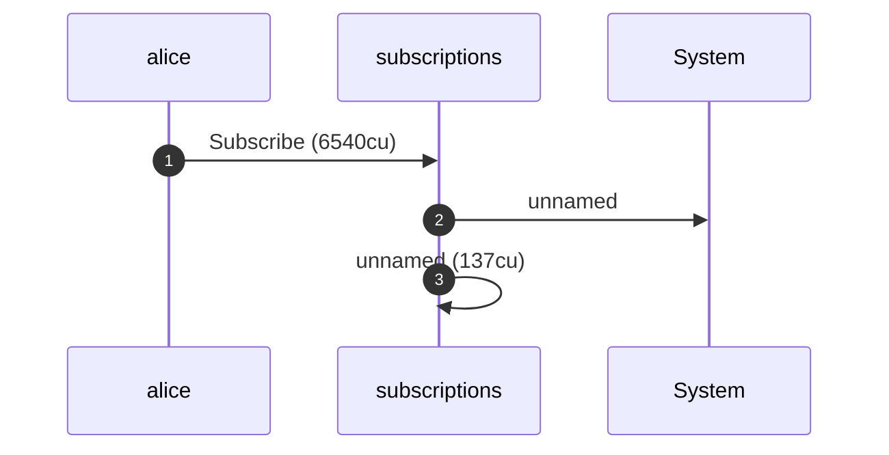

**Subscribe (sponsored): sequence diagram, with lifelines**

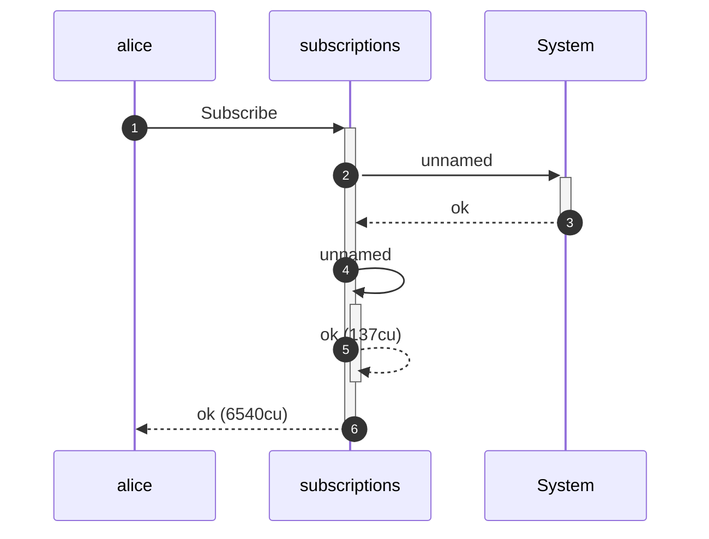

**Subscribe (sponsored): authority graph**

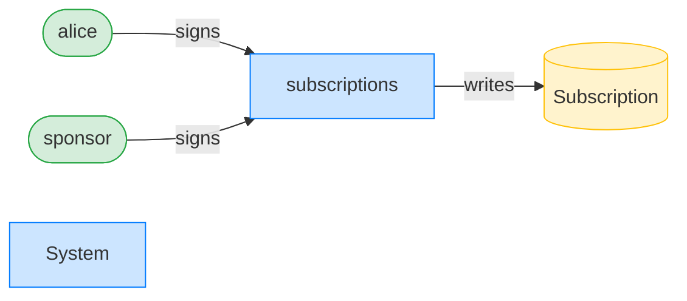

**Subscribe (sponsored): ownership graph**

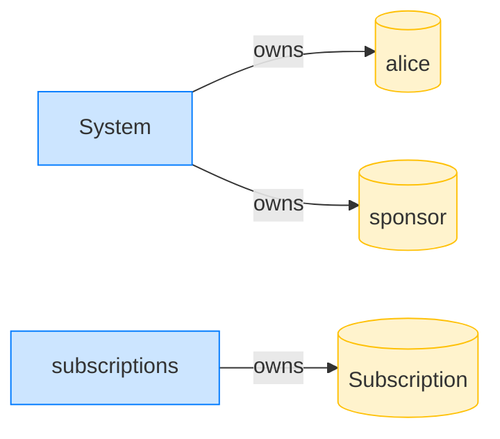

### The merchant creates a second, unrelated plan

**CreatePlan (unrelated): structured CPI tree**

```text

Transaction  signers=[merchant]
└── subscriptions::CreatePlan [1] ✓ 6468cu  signer=merchant
    └── System [2] ✓ (no cu)
Compute Units (this run): 6468
Fee: 5000 lamports
Legend (2):
  merchant      = J4fPsxKiTTKiXSiN9bgZ5JBrVgTM9c6N8tjhLN8gfdTq
  subscriptions = De1egAFMkMWZSN5rYXRj9CAdheBamobVNubTsi9avR44
```

**CreatePlan (unrelated): sequence diagram**

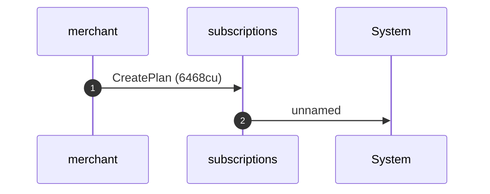

**CreatePlan (unrelated): sequence diagram, with lifelines**

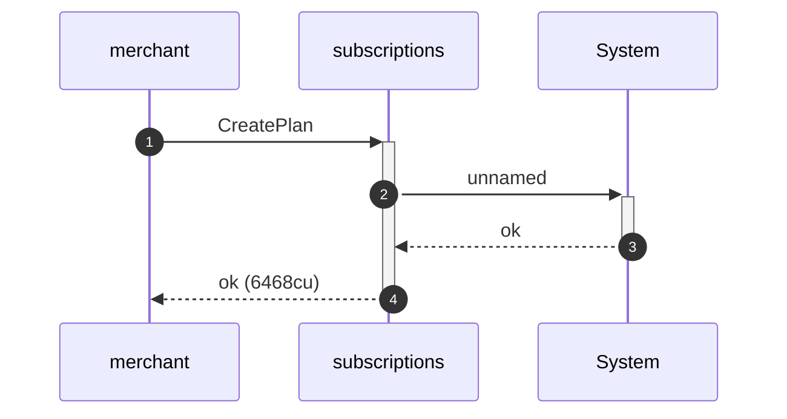

**CreatePlan (unrelated): authority graph**

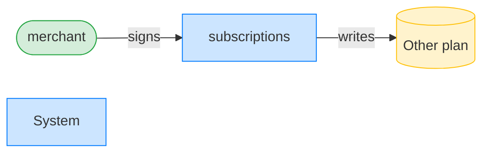

**CreatePlan (unrelated): ownership graph**

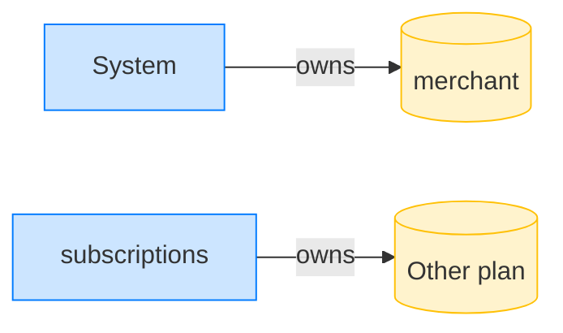

### The sponsor revokes against the wrong plan PDA

**RevokeSubscription (wrong plan): structured CPI tree**

```text

Transaction  signers=[sponsor]
└── subscriptions::RevokeDelegation [1] ✗ 357cu  signer=sponsor
    └── Error: SubscriptionPlanMismatch
Error: InstructionError(0, Custom(505))
Compute Units (this run): 357
Fee: 5000 lamports
Legend (2):
  sponsor       = 47cncVPgU4mK37H7VvxLCCsoDEKYaVhNLHHp4MbnEwvx
  subscriptions = De1egAFMkMWZSN5rYXRj9CAdheBamobVNubTsi9avR44
```
