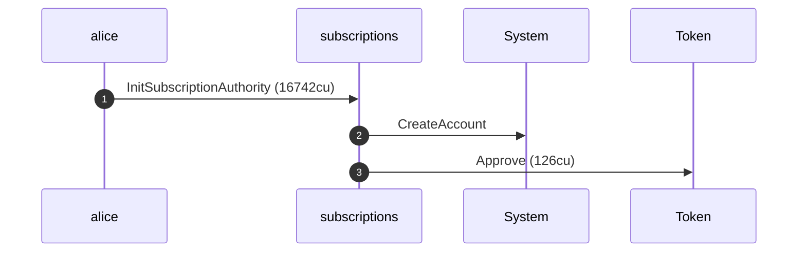
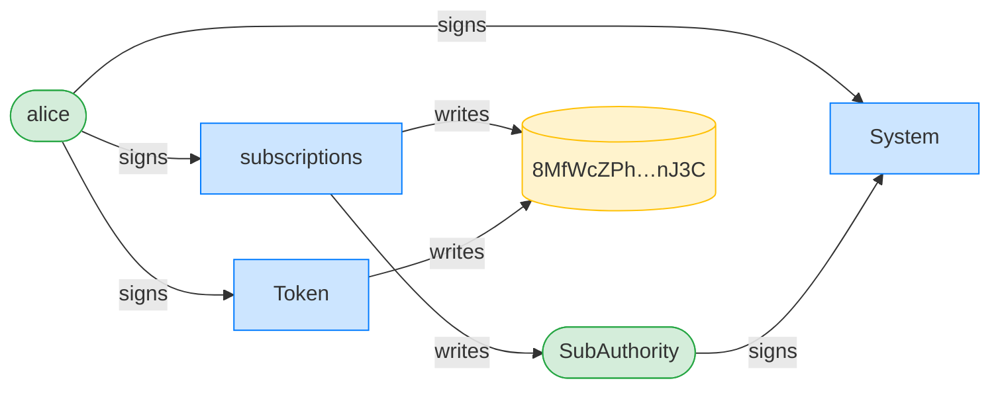
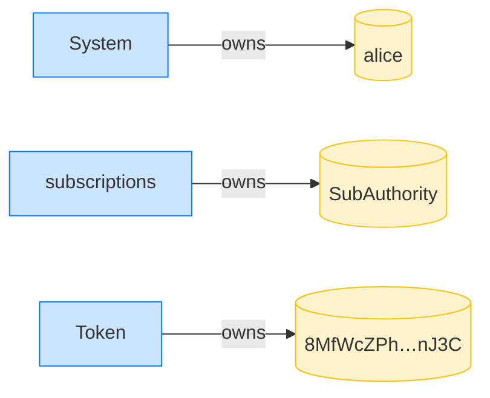
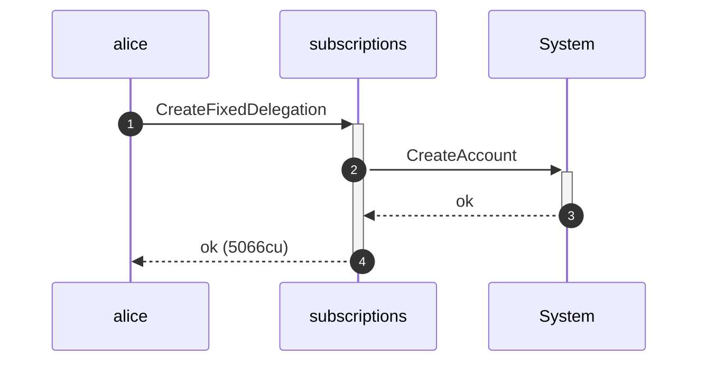
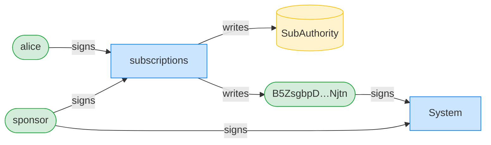
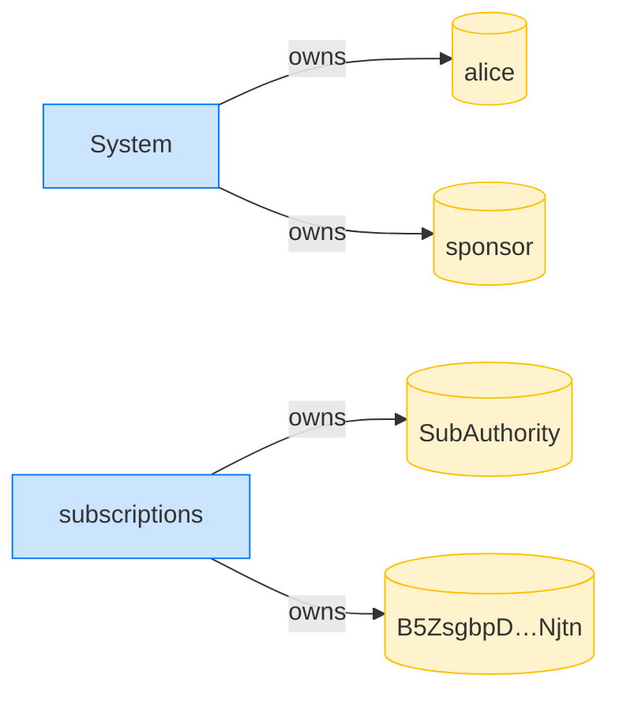
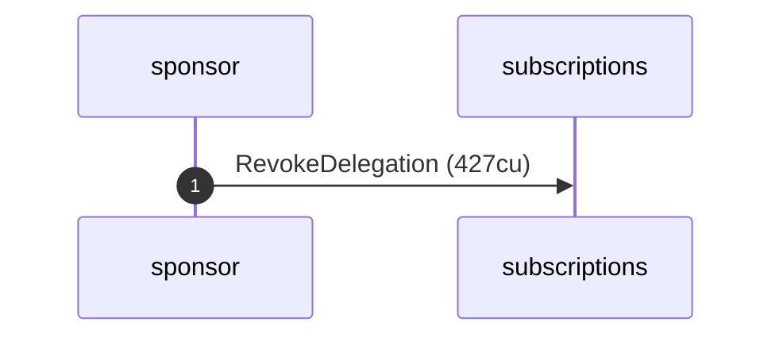
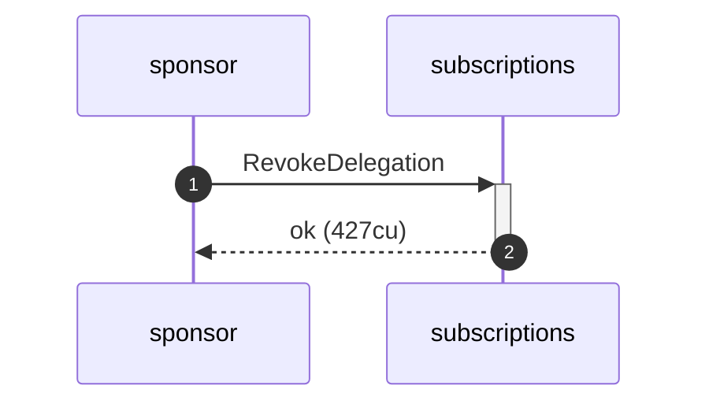
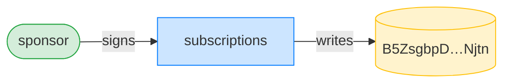
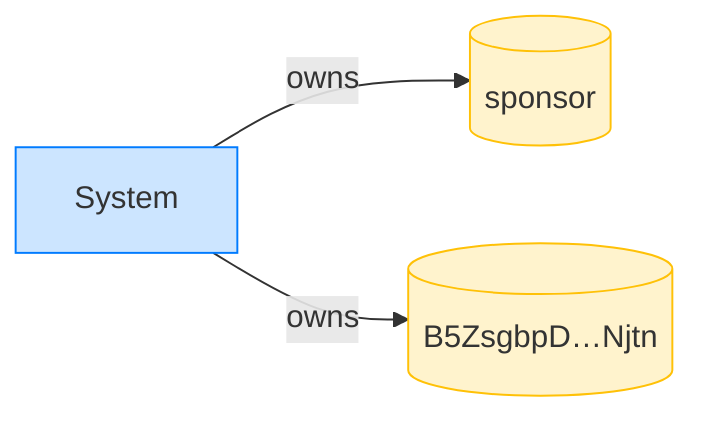

## A sponsor cannot revoke within the drift window — PASS

> the sponsor is held off until 120s past expiry, then allowed

**InitSubscriptionAuthority: structured CPI tree**

```text

── subscriptions::InitSubscriptionAuthority ────────────────
Transaction  signers=[alice]
└── subscriptions::InitSubscriptionAuthority [1] ✓ 16742cu  signer=alice
    ├── System::CreateAccount [2] ✓ (no cu)
    └── Token::Approve [2] ✓ 126cu
Compute Units (this run): 16742
Fee: 5000 lamports
Legend (2):
  subscriptions = De1egAFMkMWZSN5rYXRj9CAdheBamobVNubTsi9avR44
  alice         = FXddRd8CdAC8SWKT3Ataasn69R7rbTfQZcKg8ejyrUbF
```

**InitSubscriptionAuthority: sequence diagram**



**InitSubscriptionAuthority: sequence diagram, with lifelines**


**InitSubscriptionAuthority: authority graph**



**InitSubscriptionAuthority: ownership graph**



### Alice creates a sponsor-funded fixed delegation expiring in 100s

**CreateFixedDelegation (sponsored): structured CPI tree**

```text

── subscriptions::CreateFixedDelegation ────────────────────
Transaction  signers=[sponsor, alice]
└── subscriptions::CreateFixedDelegation [1] ✓ 5066cu  signer=[alice, sponsor]
    └── System::CreateAccount [2] ✓ (no cu)
Compute Units (this run): 5066
Fee: 10000 lamports
Legend (3):
  subscriptions = De1egAFMkMWZSN5rYXRj9CAdheBamobVNubTsi9avR44
  sponsor       = 47cncVPgU4mK37H7VvxLCCsoDEKYaVhNLHHp4MbnEwvx
  alice         = FXddRd8CdAC8SWKT3Ataasn69R7rbTfQZcKg8ejyrUbF
```

**CreateFixedDelegation (sponsored): sequence diagram**


**CreateFixedDelegation (sponsored): sequence diagram, with lifelines**



**CreateFixedDelegation (sponsored): authority graph**



**CreateFixedDelegation (sponsored): ownership graph**



### Within the drift window, the sponsor is refused

**RevokeDelegation (within drift window): structured CPI tree**

```text

── subscriptions::RevokeDelegation ─────────────────────────
Transaction  signers=[sponsor]
└── subscriptions::RevokeDelegation [1] ✗ 381cu  signer=sponsor
    └── Error: Unauthorized (0x82)
Error: InstructionError(0, Custom(130))
Compute Units (this run): 381
Fee: 5000 lamports
Legend (2):
  subscriptions = De1egAFMkMWZSN5rYXRj9CAdheBamobVNubTsi9avR44
  sponsor       = 47cncVPgU4mK37H7VvxLCCsoDEKYaVhNLHHp4MbnEwvx
```

### Past the drift window, the sponsor can revoke

**RevokeDelegation (past drift window): structured CPI tree**

```text

── subscriptions::RevokeDelegation ─────────────────────────
Transaction  signers=[sponsor]
└── subscriptions::RevokeDelegation [1] ✓ 427cu  signer=sponsor
Compute Units (this run): 427
Fee: 5000 lamports
Legend (2):
  subscriptions = De1egAFMkMWZSN5rYXRj9CAdheBamobVNubTsi9avR44
  sponsor       = 47cncVPgU4mK37H7VvxLCCsoDEKYaVhNLHHp4MbnEwvx
```

**RevokeDelegation (past drift window): sequence diagram**



**RevokeDelegation (past drift window): sequence diagram, with lifelines**



**RevokeDelegation (past drift window): authority graph**



**RevokeDelegation (past drift window): ownership graph**


