## A sponsor cannot revoke within the drift window — PASS

> the sponsor is held off until 120s past expiry, then allowed

**InitSubscriptionAuthority: structured CPI tree**

```text

Transaction  signers=[alice]
└── subscriptions::InitSubscriptionAuthority [1] ✓ 12242cu  signer=alice
    ├── System [2] ✓ (no cu)
    └── Token [2] ✓ 126cu
Compute Units (this run): 12242
Fee: 5000 lamports
Legend (2):
  alice         = FXddRd8CdAC8SWKT3Ataasn69R7rbTfQZcKg8ejyrUbF
  subscriptions = De1egAFMkMWZSN5rYXRj9CAdheBamobVNubTsi9avR44
```

**InitSubscriptionAuthority: sequence diagram**


**InitSubscriptionAuthority: sequence diagram, with lifelines**

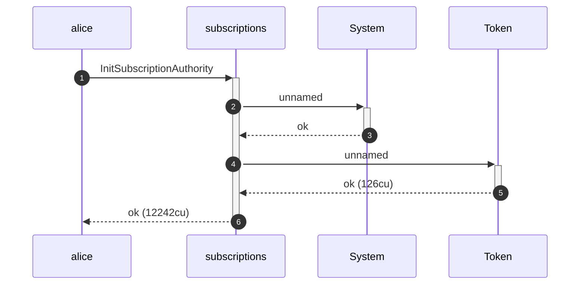

**InitSubscriptionAuthority: authority graph**

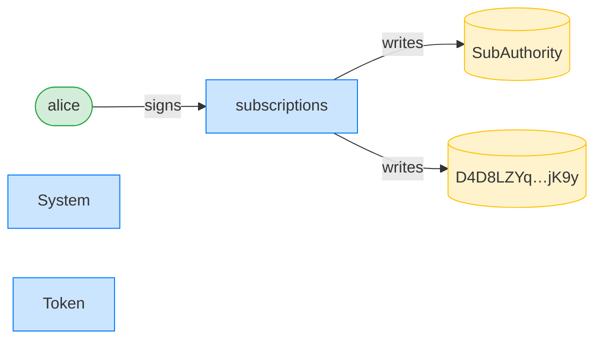

**InitSubscriptionAuthority: ownership graph**

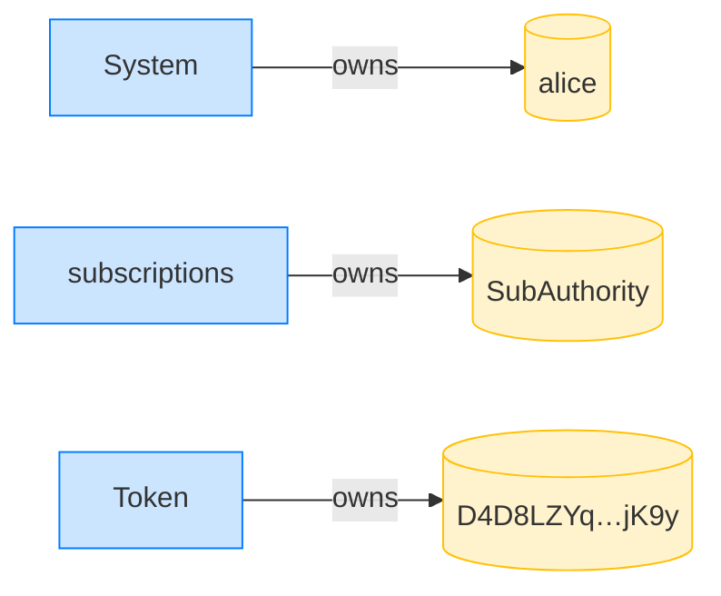

### Alice creates a sponsor-funded fixed delegation expiring in 100s

**CreateFixedDelegation (sponsored): structured CPI tree**

```text

Transaction  signers=[sponsor, alice]
└── subscriptions::CreateFixedDelegation [1] ✓ 3566cu  signer=[alice, sponsor]
    └── System [2] ✓ (no cu)
Compute Units (this run): 3566
Fee: 10000 lamports
Legend (3):
  sponsor       = 47cncVPgU4mK37H7VvxLCCsoDEKYaVhNLHHp4MbnEwvx
  alice         = FXddRd8CdAC8SWKT3Ataasn69R7rbTfQZcKg8ejyrUbF
  subscriptions = De1egAFMkMWZSN5rYXRj9CAdheBamobVNubTsi9avR44
```

**CreateFixedDelegation (sponsored): sequence diagram**

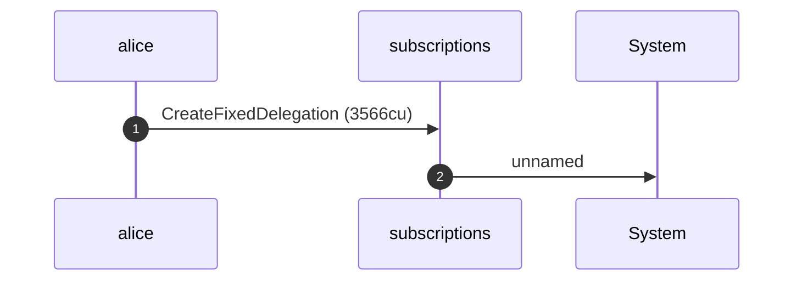

**CreateFixedDelegation (sponsored): sequence diagram, with lifelines**

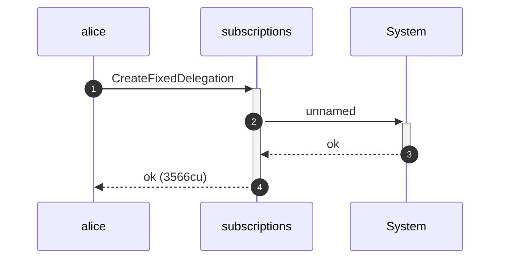

**CreateFixedDelegation (sponsored): authority graph**

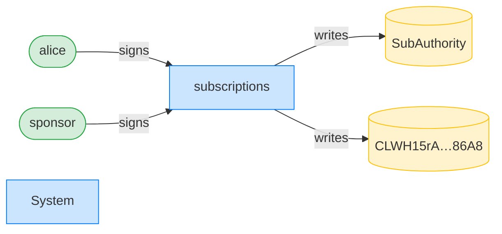

**CreateFixedDelegation (sponsored): ownership graph**

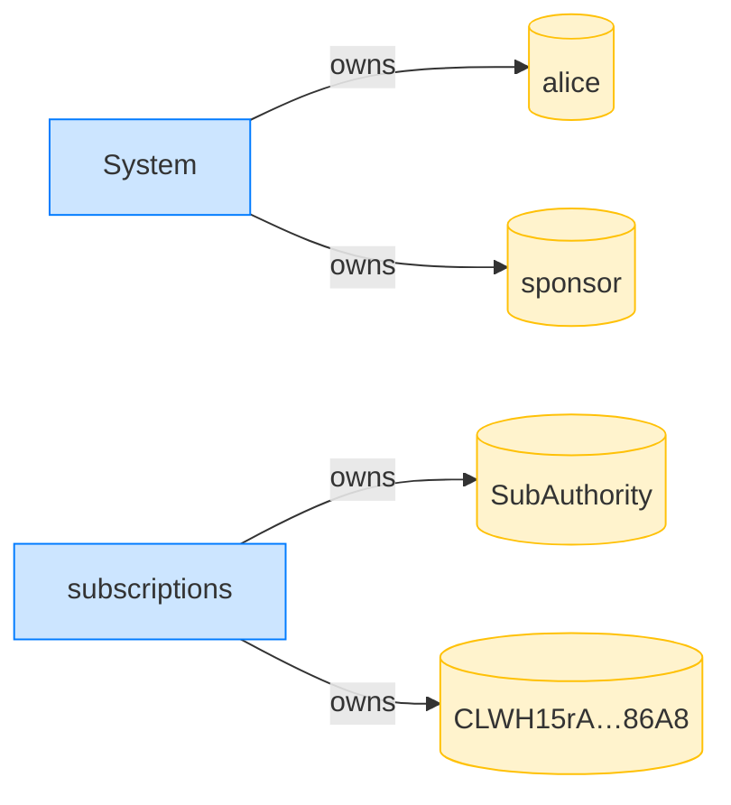

### Within the drift window, the sponsor is refused

**RevokeDelegation (within drift window): structured CPI tree**

```text

Transaction  signers=[sponsor]
└── subscriptions::RevokeDelegation [1] ✗ 375cu  signer=sponsor
    └── Error: Unauthorized
Error: InstructionError(0, Custom(130))
Compute Units (this run): 375
Fee: 5000 lamports
Legend (2):
  sponsor       = 47cncVPgU4mK37H7VvxLCCsoDEKYaVhNLHHp4MbnEwvx
  subscriptions = De1egAFMkMWZSN5rYXRj9CAdheBamobVNubTsi9avR44
```

### Past the drift window, the sponsor can revoke

**RevokeDelegation (past drift window): structured CPI tree**

```text

Transaction  signers=[sponsor]
└── subscriptions::RevokeDelegation [1] ✓ 427cu  signer=sponsor
Compute Units (this run): 427
Fee: 5000 lamports
Legend (2):
  sponsor       = 47cncVPgU4mK37H7VvxLCCsoDEKYaVhNLHHp4MbnEwvx
  subscriptions = De1egAFMkMWZSN5rYXRj9CAdheBamobVNubTsi9avR44
```

**RevokeDelegation (past drift window): sequence diagram**

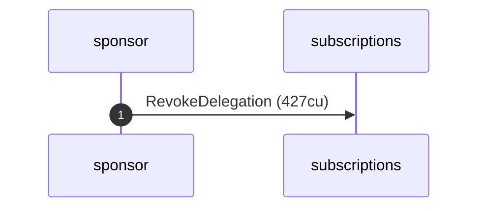

**RevokeDelegation (past drift window): sequence diagram, with lifelines**

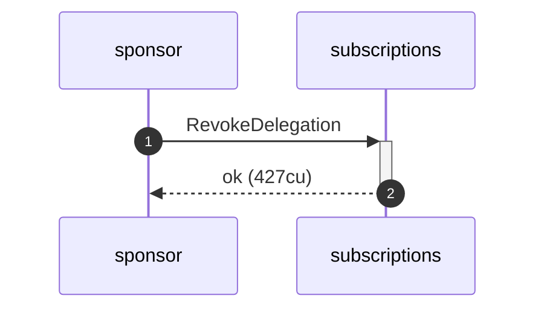

**RevokeDelegation (past drift window): authority graph**

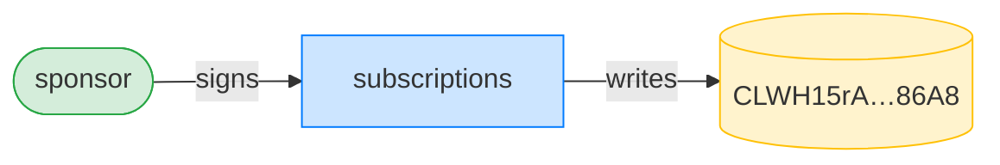

**RevokeDelegation (past drift window): ownership graph**

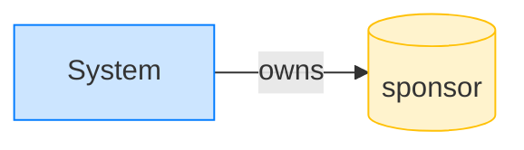
