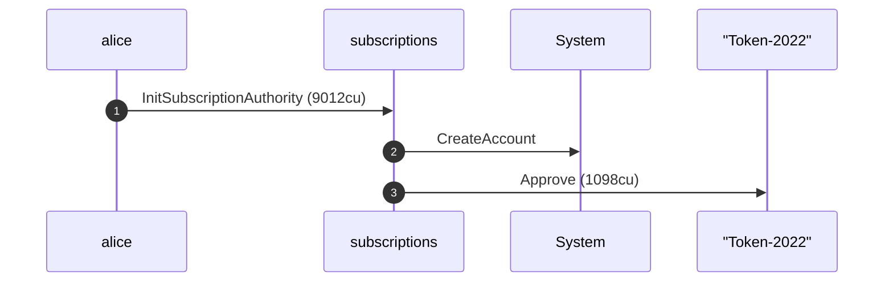
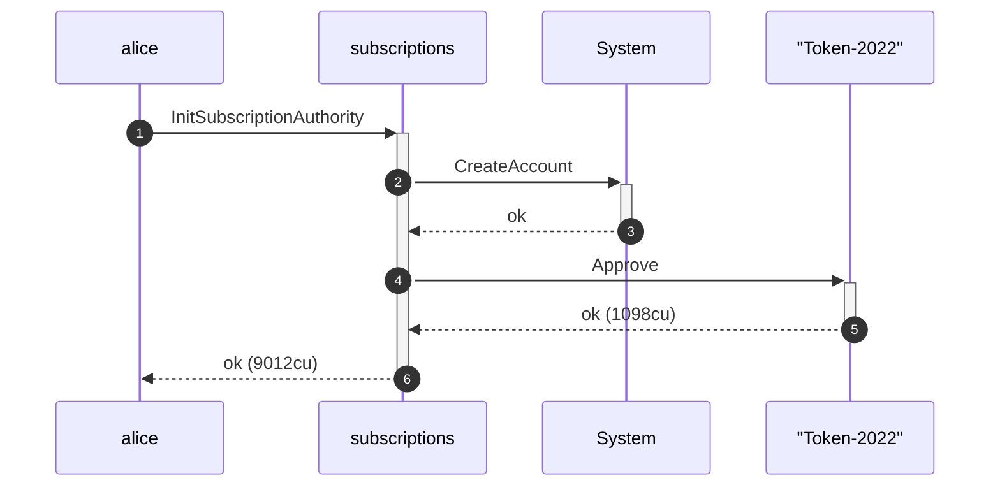
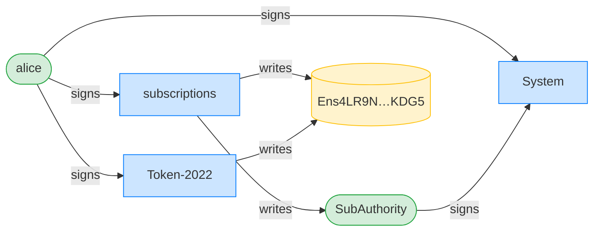
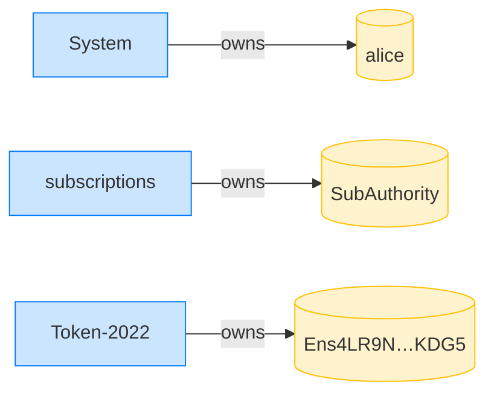

## Allow an active transfer hook — PASS

> a mint carrying a configured transfer hook is accepted

### Alice initializes over a mint with an active transfer hook

**InitSubscriptionAuthority: structured CPI tree**

```text

── subscriptions::Approve ──────────────────────────────────
Transaction  signers=[alice]
└── subscriptions::InitSubscriptionAuthority [1] ✓ 9012cu  signer=alice
    ├── System::CreateAccount [2] ✓ (no cu)
    └── Token-2022::Approve [2] ✓ 1098cu
Compute Units (this run): 9012
Fee: 5000 lamports
Legend (2):
  subscriptions = De1egAFMkMWZSN5rYXRj9CAdheBamobVNubTsi9avR44
  alice         = FXddRd8CdAC8SWKT3Ataasn69R7rbTfQZcKg8ejyrUbF
```

**InitSubscriptionAuthority: sequence diagram**



**InitSubscriptionAuthority: sequence diagram, with lifelines**



**InitSubscriptionAuthority: authority graph**



**InitSubscriptionAuthority: ownership graph**


