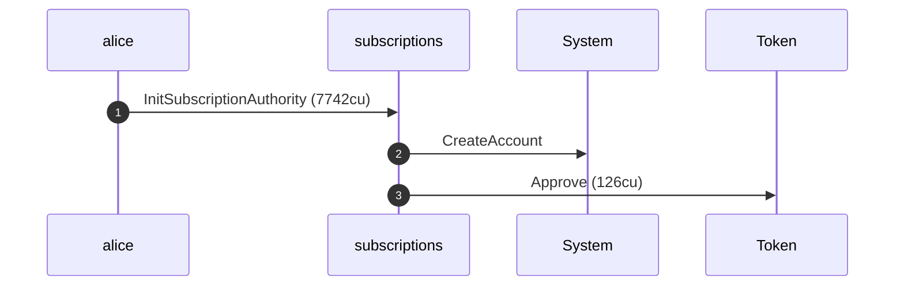
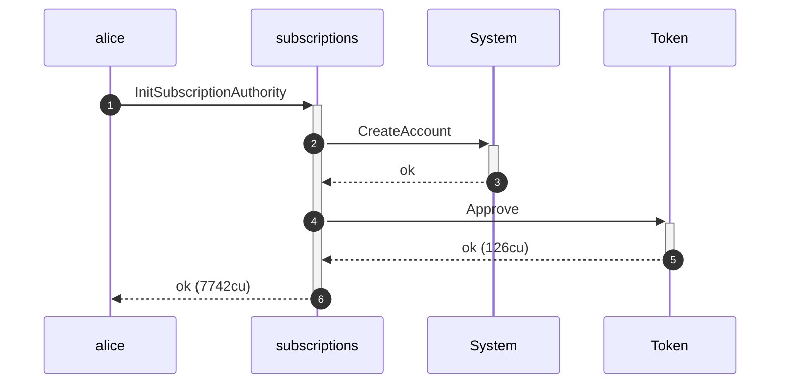
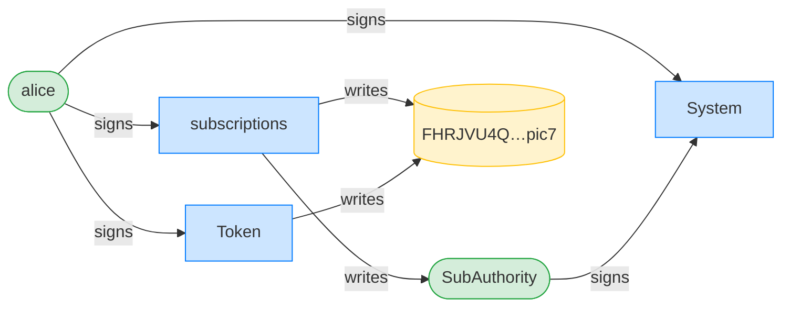
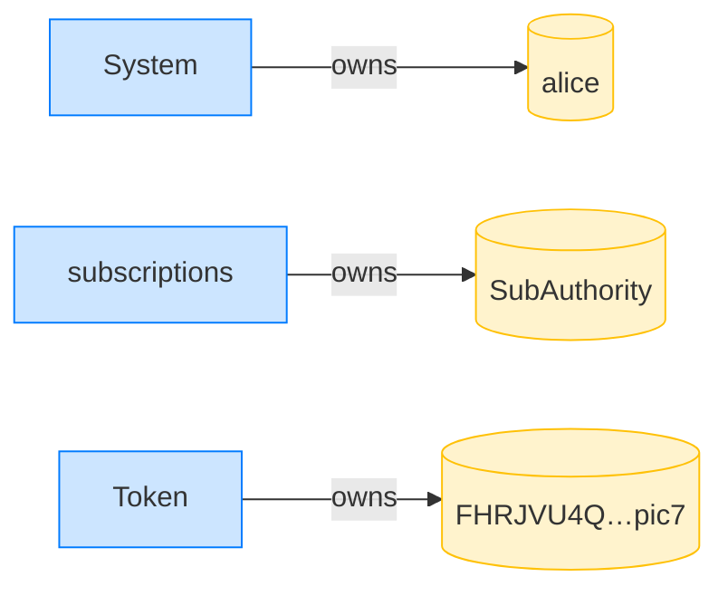
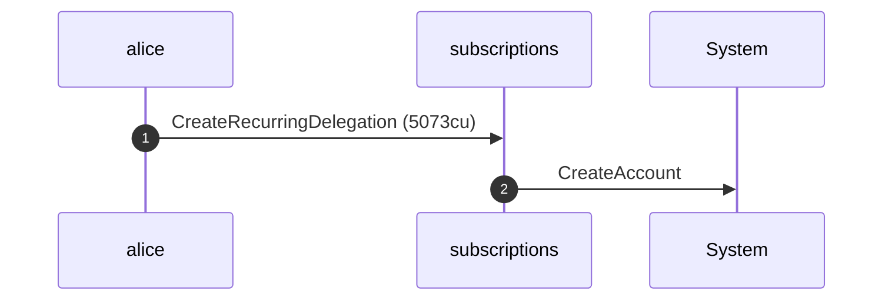
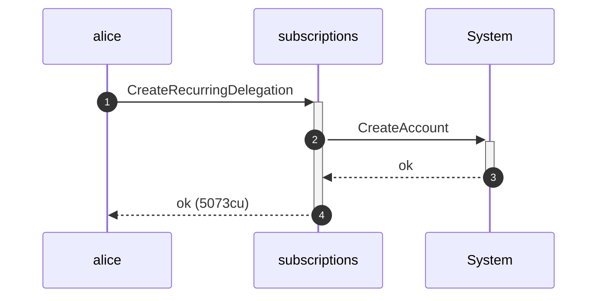
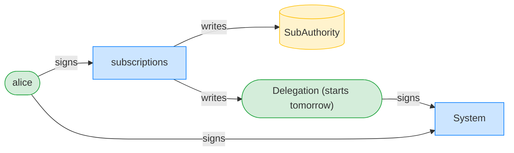
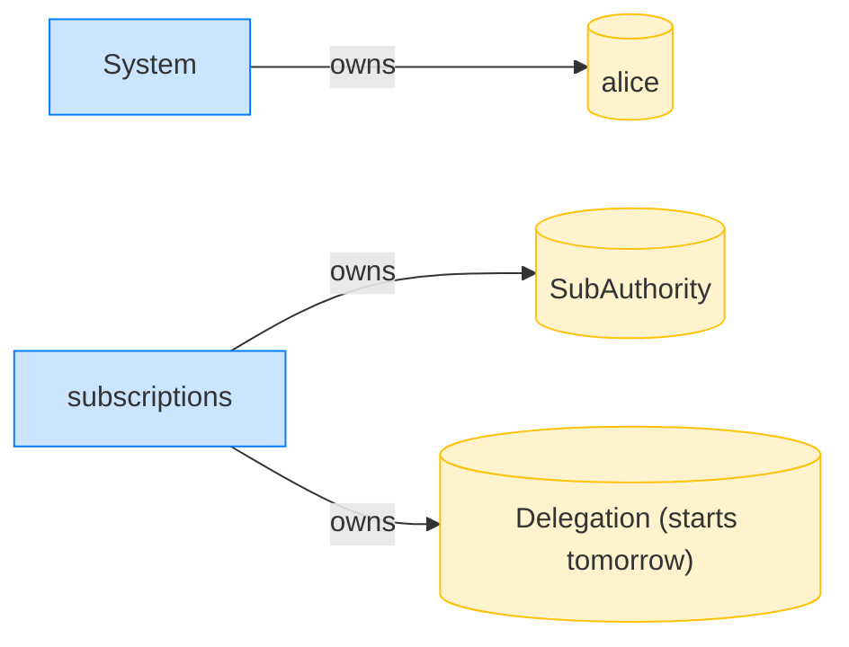

## AUDIT 3.1.1 (regression): the fix refuses a pre-start recurring pull — PASS

> the PR6 guard refuses a recurring pull before start_ts (Cantina HIGH 3.1.1)

**InitSubscriptionAuthority: structured CPI tree**

```text

── subscriptions::InitSubscriptionAuthority ────────────────
Transaction  signers=[alice]
└── subscriptions::InitSubscriptionAuthority [1] ✓ 7742cu  signer=alice
    ├── System::CreateAccount [2] ✓ (no cu)
    └── Token::Approve [2] ✓ 126cu
Compute Units (this run): 7742
Fee: 5000 lamports
Legend (2):
  subscriptions = De1egAFMkMWZSN5rYXRj9CAdheBamobVNubTsi9avR44
  alice         = FXddRd8CdAC8SWKT3Ataasn69R7rbTfQZcKg8ejyrUbF
```

**InitSubscriptionAuthority: sequence diagram**



**InitSubscriptionAuthority: sequence diagram, with lifelines**



**InitSubscriptionAuthority: authority graph**



**InitSubscriptionAuthority: ownership graph**



### Alice grants Bob a recurring allowance that only starts tomorrow

**CreateRecurringDelegation: structured CPI tree**

```text

── subscriptions::CreateRecurringDelegation ────────────────
Transaction  signers=[alice]
└── subscriptions::CreateRecurringDelegation [1] ✓ 5073cu  signer=alice
    └── System::CreateAccount [2] ✓ (no cu)
Compute Units (this run): 5073
Fee: 5000 lamports
Legend (2):
  subscriptions = De1egAFMkMWZSN5rYXRj9CAdheBamobVNubTsi9avR44
  alice         = FXddRd8CdAC8SWKT3Ataasn69R7rbTfQZcKg8ejyrUbF
```

**CreateRecurringDelegation: sequence diagram**



**CreateRecurringDelegation: sequence diagram, with lifelines**



**CreateRecurringDelegation: authority graph**



**CreateRecurringDelegation: ownership graph**



### Bob pulls 10 tokens NOW — a day before the delegation begins

**TransferRecurring (before start_ts): structured CPI tree**

```text

── subscriptions::TransferRecurring ────────────────────────
Transaction  signers=[bob]
└── subscriptions::TransferRecurring [1] ✗ 915cu  signer=bob
    └── Error: DelegationNotStarted (0x197)
Error: InstructionError(0, Custom(407))
Compute Units (this run): 915
Fee: 5000 lamports
Legend (2):
  subscriptions = De1egAFMkMWZSN5rYXRj9CAdheBamobVNubTsi9avR44
  bob           = 9S8NPMnzAba71o3tr8dHDzUrfT5NesYFzP56QFpYieMR
```

Finding 3.1.1: the delegation's start_ts is a day in the future, yet the pull above lands now. With the PR6 guard reverted on this branch, validate_recurring_transfer floors the pre-start timestamp via saturating_sub to 0, leaving the full per-period budget available immediately. On the fixed code this pull is refused with DelegationNotStarted, and the assertions below confirm the refusal — this regression guards the fix against any future regression.

- [x] the fix refuses the pre-start pull (DelegationNotStarted): `false`
- [x] Bob received nothing — the pull was refused: `0`
