## Cancel at exact plan end keeps the final period billable — PASS

> cancelling exactly at end_ts still allows the merchant to pull the final period

### Stage: Alice's authority and the merchant's 2-hour plan

**InitSubscriptionAuthority: structured CPI tree**

```text

── subscriptions::InitSubscriptionAuthority ────────────────
Transaction  signers=[alice]
└── subscriptions::InitSubscriptionAuthority [1] ✓ 9242cu  signer=alice
    ├── System::CreateAccount [2] ✓ (no cu)
    └── Token::Approve [2] ✓ 126cu
Compute Units (this run): 9242
Fee: 5000 lamports
Legend (2):
  subscriptions = De1egAFMkMWZSN5rYXRj9CAdheBamobVNubTsi9avR44
  alice         = FXddRd8CdAC8SWKT3Ataasn69R7rbTfQZcKg8ejyrUbF
```

**InitSubscriptionAuthority: sequence diagram**

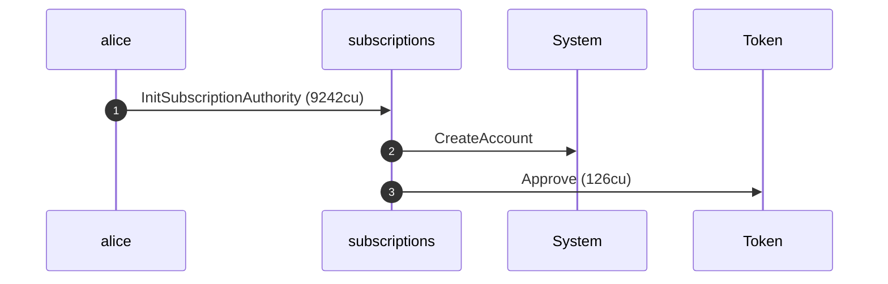

**InitSubscriptionAuthority: sequence diagram, with lifelines**

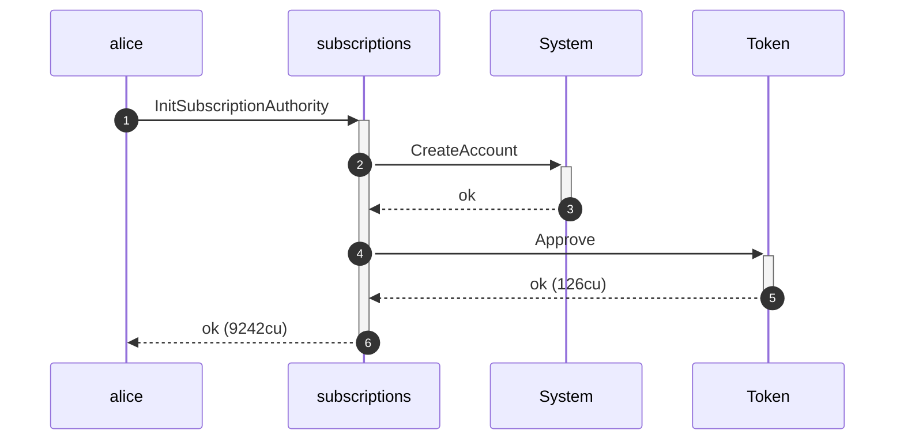

**InitSubscriptionAuthority: authority graph**

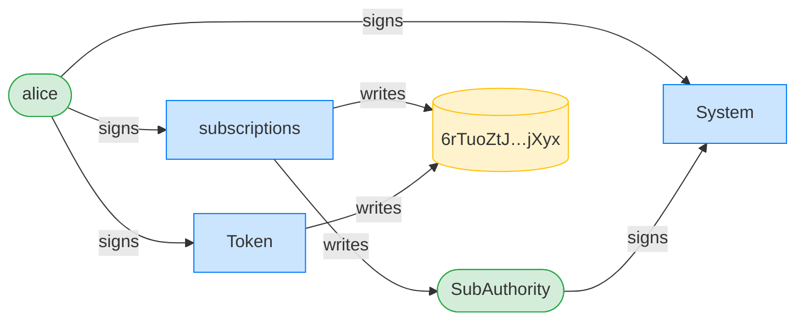

**InitSubscriptionAuthority: ownership graph**

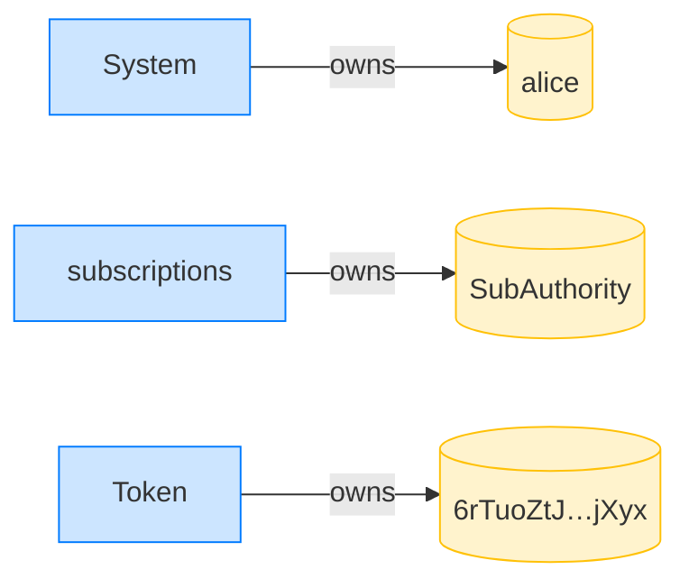

**CreatePlan: structured CPI tree**

```text

── subscriptions::CreatePlan ───────────────────────────────
Transaction  signers=[merchant]
└── subscriptions::CreatePlan [1] ✓ 3468cu  signer=merchant
    └── System::CreateAccount [2] ✓ (no cu)
Compute Units (this run): 3468
Fee: 5000 lamports
Legend (2):
  subscriptions = De1egAFMkMWZSN5rYXRj9CAdheBamobVNubTsi9avR44
  merchant      = J4fPsxKiTTKiXSiN9bgZ5JBrVgTM9c6N8tjhLN8gfdTq
```

**CreatePlan: sequence diagram**

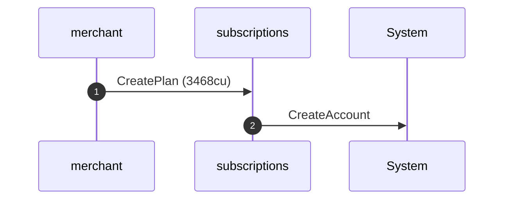

**CreatePlan: sequence diagram, with lifelines**

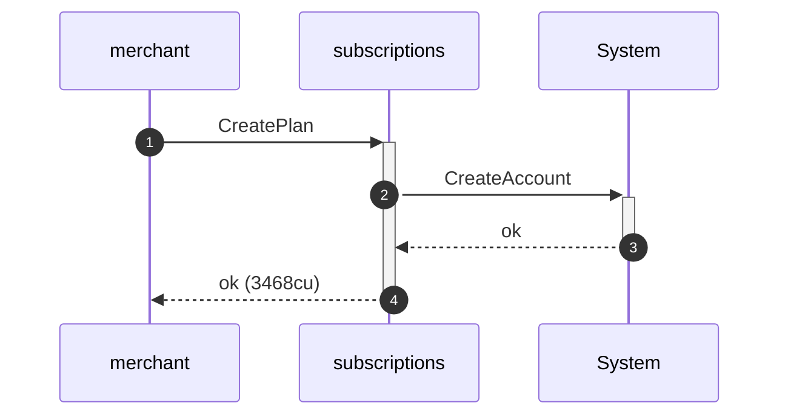

**CreatePlan: authority graph**

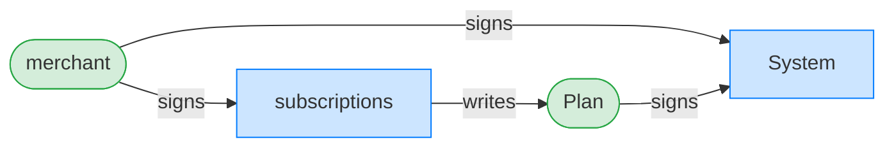

**CreatePlan: ownership graph**

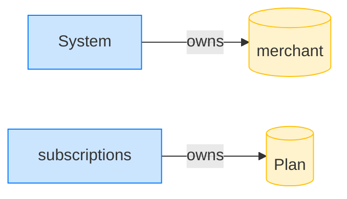

- [x] clock is exactly at plan end_ts: `1700007200`

### Alice cancels exactly at end_ts

**CancelSubscription: structured CPI tree**

```text

── subscriptions::CancelSubscription ───────────────────────
Transaction  signers=[alice]
└── subscriptions::CancelSubscription [1] ✓ 2027cu  signer=alice
    └── subscriptions::EmitEvent [2] ✓ 137cu
Compute Units (this run): 2027
Fee: 5000 lamports
Legend (2):
  subscriptions = De1egAFMkMWZSN5rYXRj9CAdheBamobVNubTsi9avR44
  alice         = FXddRd8CdAC8SWKT3Ataasn69R7rbTfQZcKg8ejyrUbF
```

**CancelSubscription: sequence diagram**

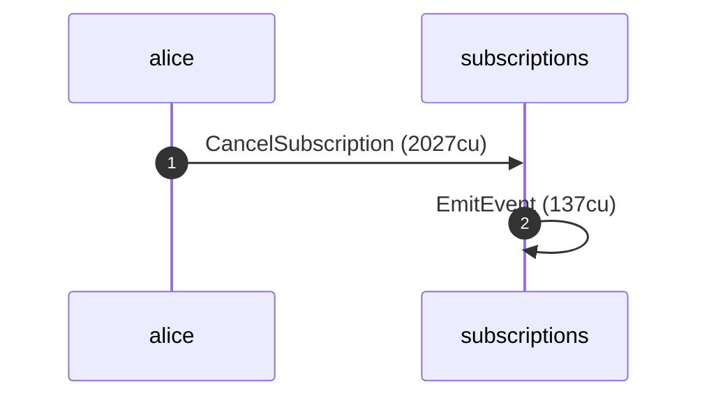

**CancelSubscription: sequence diagram, with lifelines**

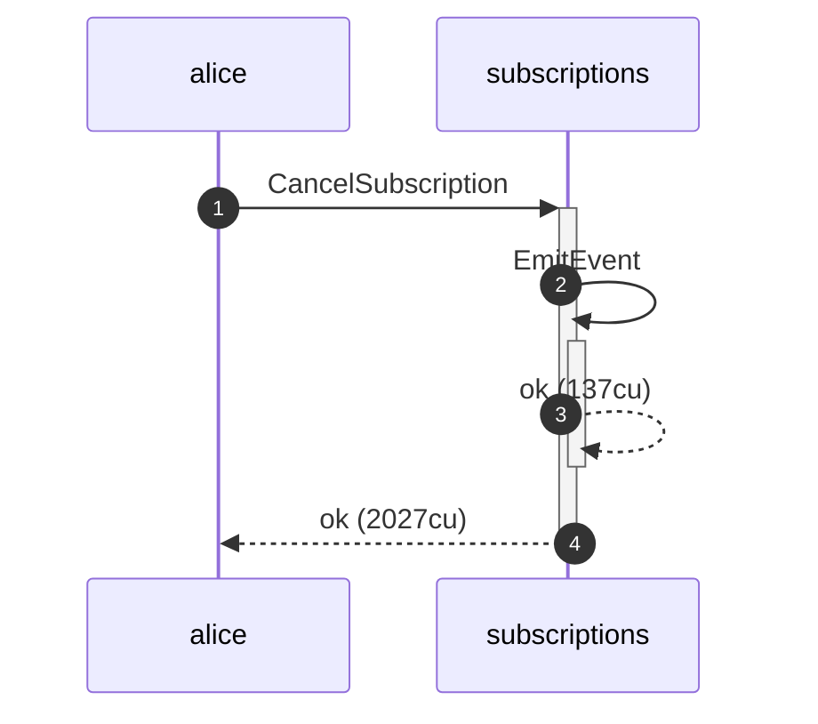

**CancelSubscription: authority graph**

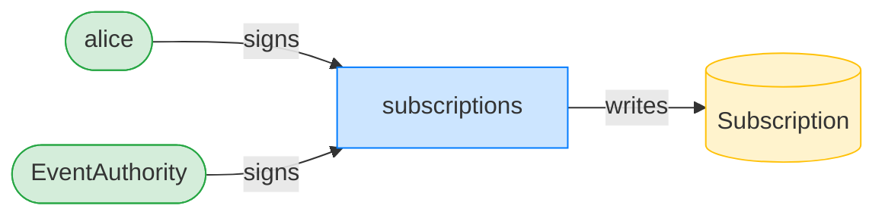

**CancelSubscription: ownership graph**

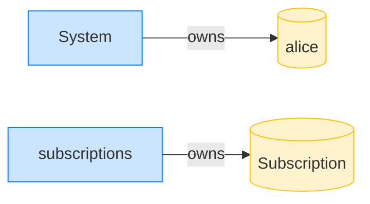

- [x] expires_at_ts is just past the inclusive end_ts: `1700007201`

### Revoke is refused: the subscription is still within its valid period

**RevokeSubscription (still billable): structured CPI tree**

```text

── subscriptions::RevokeDelegation ─────────────────────────
Transaction  signers=[alice]
└── subscriptions::RevokeDelegation [1] ✗ 412cu  signer=alice
    └── Error: SubscriptionNotCancelled (0x1fe)
Error: InstructionError(0, Custom(510))
Compute Units (this run): 412
Fee: 5000 lamports
Legend (2):
  subscriptions = De1egAFMkMWZSN5rYXRj9CAdheBamobVNubTsi9avR44
  alice         = FXddRd8CdAC8SWKT3Ataasn69R7rbTfQZcKg8ejyrUbF
```

### The merchant pulls the final billable period

**TransferSubscription: structured CPI tree**

```text

── subscriptions::TransferSubscription ─────────────────────
Transaction  signers=[merchant]
└── subscriptions::TransferSubscription [1] ✓ 6032cu  signer=merchant
    ├── Token::TransferChecked [2] ✓ 113cu
    └── subscriptions::EmitEvent [2] ✓ 137cu
Compute Units (this run): 6032
Fee: 5000 lamports
Legend (2):
  subscriptions = De1egAFMkMWZSN5rYXRj9CAdheBamobVNubTsi9avR44
  merchant      = J4fPsxKiTTKiXSiN9bgZ5JBrVgTM9c6N8tjhLN8gfdTq
```

**TransferSubscription: sequence diagram**

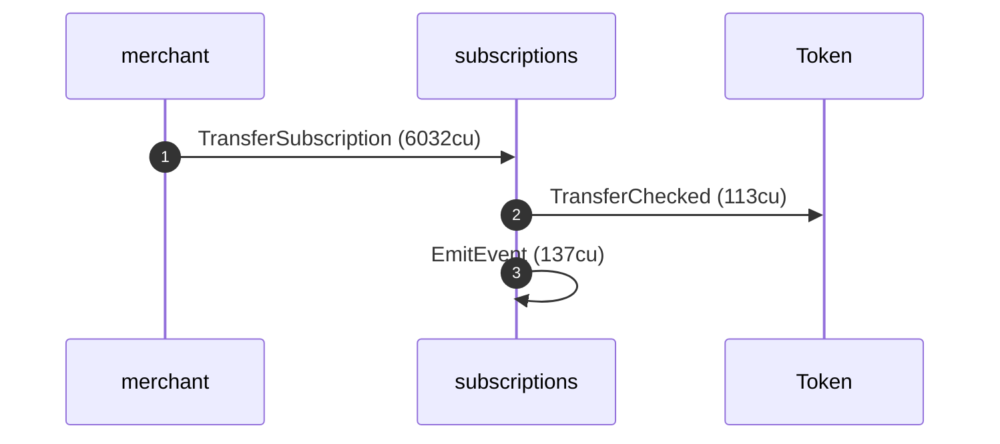

**TransferSubscription: sequence diagram, with lifelines**

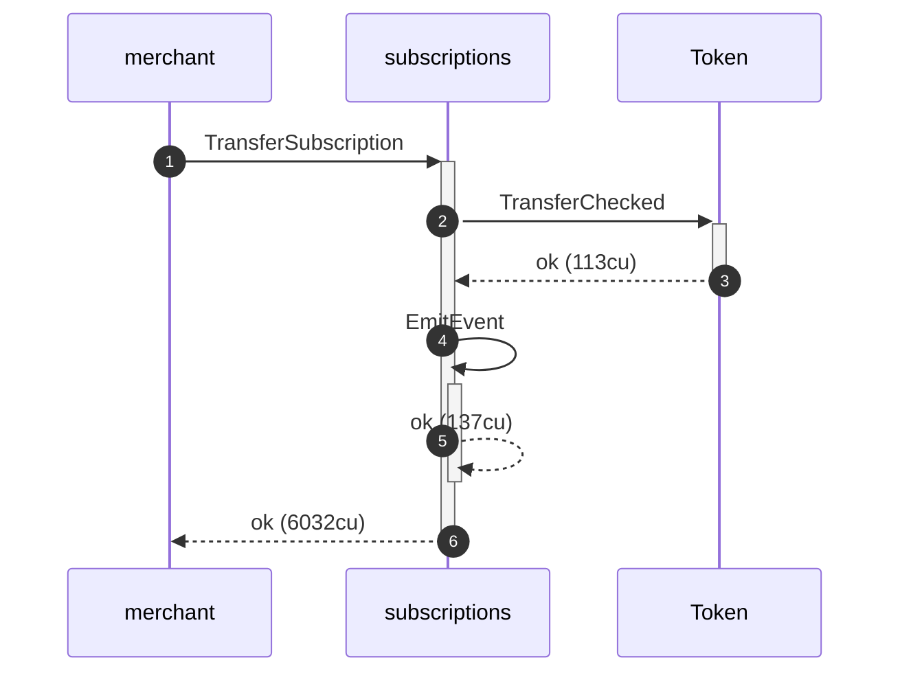

**TransferSubscription: authority graph**

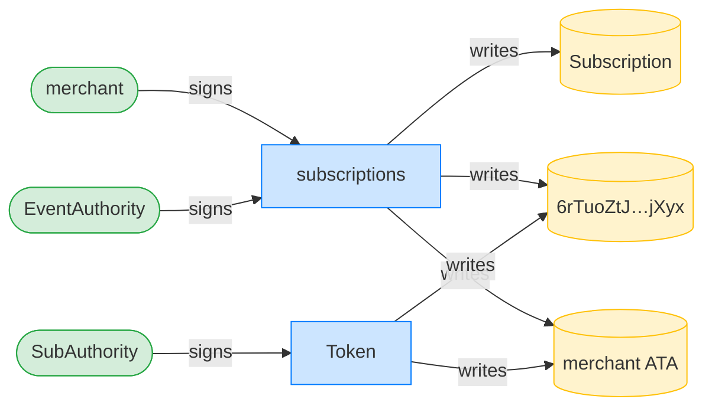

**TransferSubscription: ownership graph**

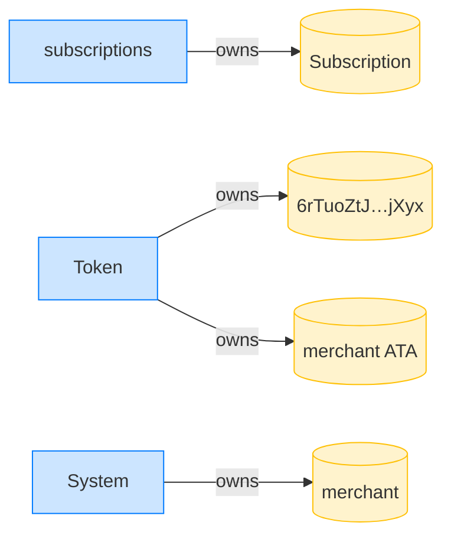

- [x] the merchant received the final period's tokens: `20000000`
