## Cancel caps expiry at the plan end_ts — PASS

> expiry is capped just past the inclusive plan end_ts, not the period end

### Stage: Alice's authority and a plan ending in 90 minutes

**InitSubscriptionAuthority: structured CPI tree**

```text

── subscriptions::InitSubscriptionAuthority ────────────────
Transaction  signers=[alice]
└── subscriptions::InitSubscriptionAuthority [1] ✓ 6242cu  signer=alice
    ├── System::CreateAccount [2] ✓ (no cu)
    └── Token::Approve [2] ✓ 126cu
Compute Units (this run): 6242
Fee: 5000 lamports
Legend (2):
  subscriptions = De1egAFMkMWZSN5rYXRj9CAdheBamobVNubTsi9avR44
  alice         = FXddRd8CdAC8SWKT3Ataasn69R7rbTfQZcKg8ejyrUbF
```

**InitSubscriptionAuthority: sequence diagram**

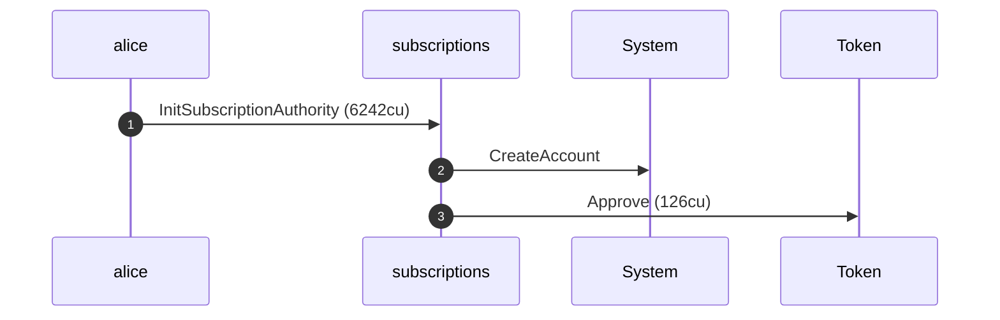

**InitSubscriptionAuthority: sequence diagram, with lifelines**

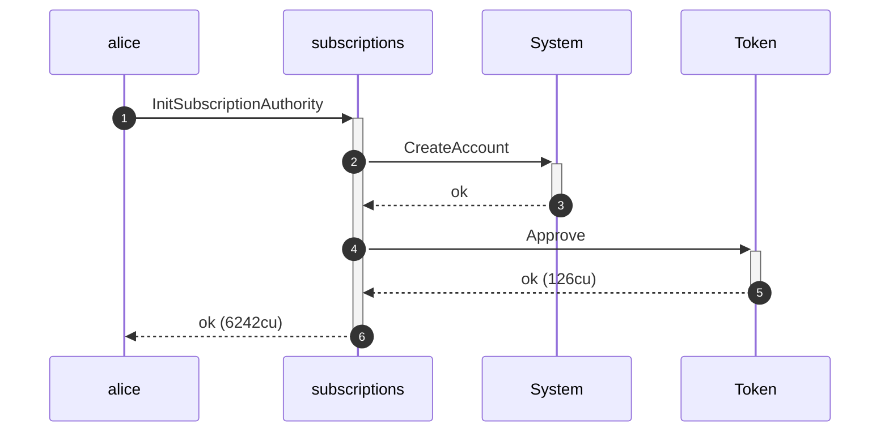

**InitSubscriptionAuthority: authority graph**

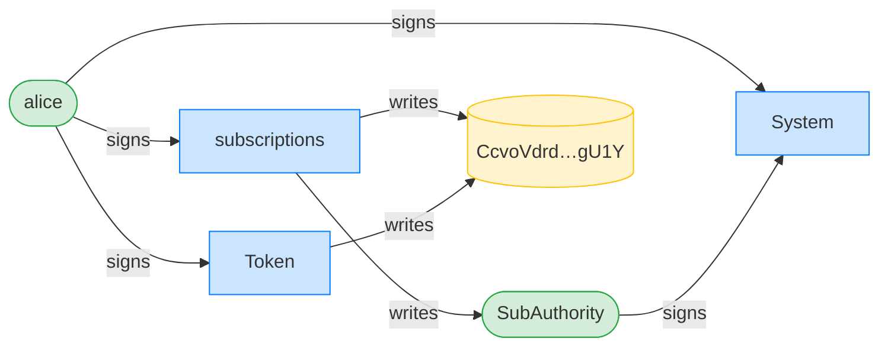

**InitSubscriptionAuthority: ownership graph**

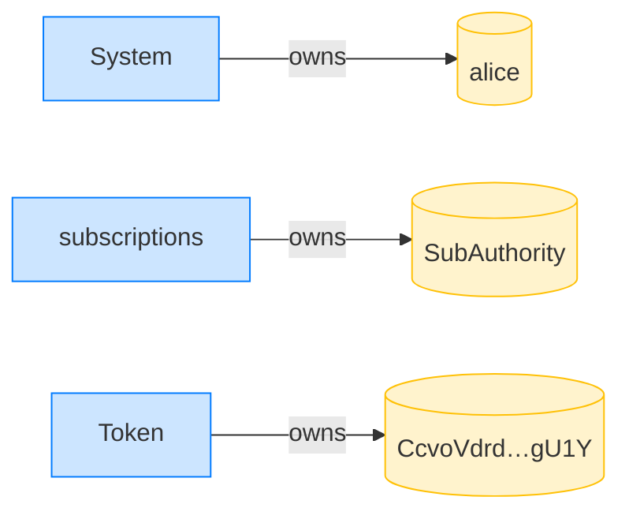

**CreatePlan: structured CPI tree**

```text

── subscriptions::CreatePlan ───────────────────────────────
Transaction  signers=[merchant]
└── subscriptions::CreatePlan [1] ✓ 3468cu  signer=merchant
    └── System::CreateAccount [2] ✓ (no cu)
Compute Units (this run): 3468
Fee: 5000 lamports
Legend (2):
  subscriptions = De1egAFMkMWZSN5rYXRj9CAdheBamobVNubTsi9avR44
  merchant      = J4fPsxKiTTKiXSiN9bgZ5JBrVgTM9c6N8tjhLN8gfdTq
```

**CreatePlan: sequence diagram**

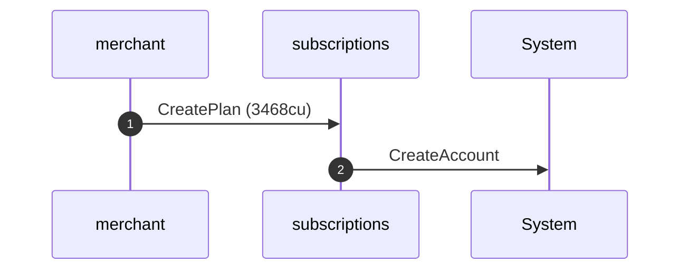

**CreatePlan: sequence diagram, with lifelines**

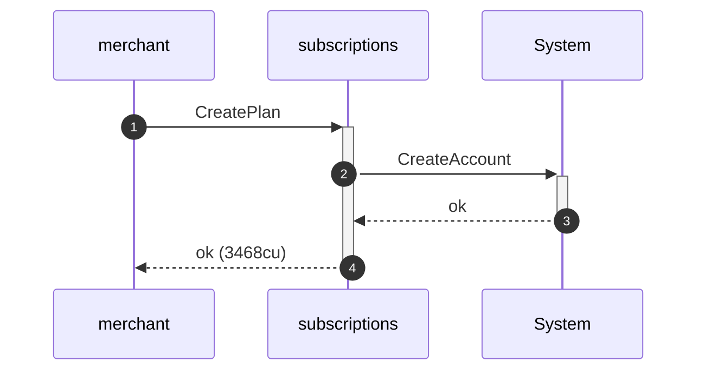

**CreatePlan: authority graph**

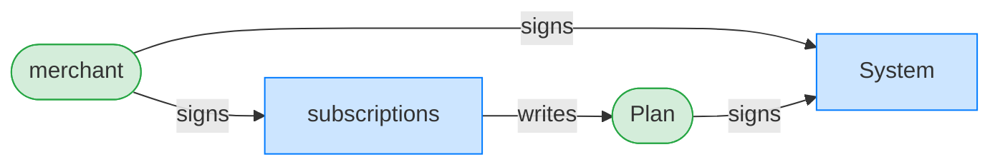

**CreatePlan: ownership graph**

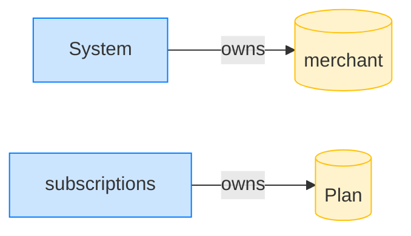

### Alice cancels after the plan end has passed within the period

**CancelSubscription: structured CPI tree**

```text

── subscriptions::CancelSubscription ───────────────────────
Transaction  signers=[alice]
└── subscriptions::CancelSubscription [1] ✓ 2027cu  signer=alice
    └── subscriptions::EmitEvent [2] ✓ 137cu
Compute Units (this run): 2027
Fee: 5000 lamports
Legend (2):
  subscriptions = De1egAFMkMWZSN5rYXRj9CAdheBamobVNubTsi9avR44
  alice         = FXddRd8CdAC8SWKT3Ataasn69R7rbTfQZcKg8ejyrUbF
```

**CancelSubscription: sequence diagram**

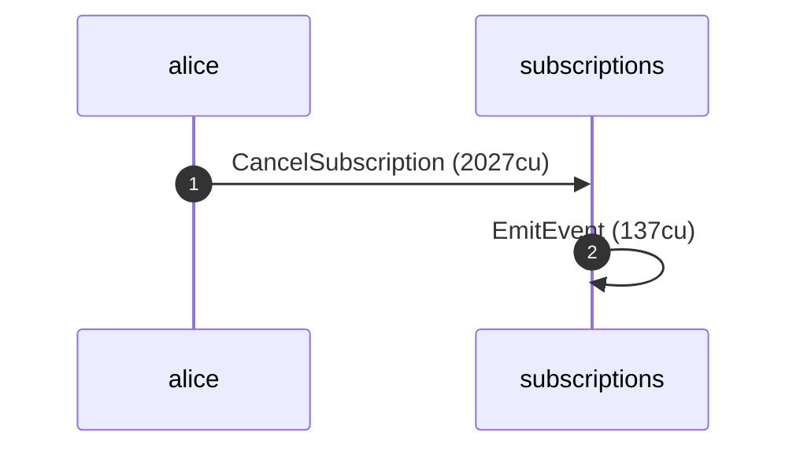

**CancelSubscription: sequence diagram, with lifelines**

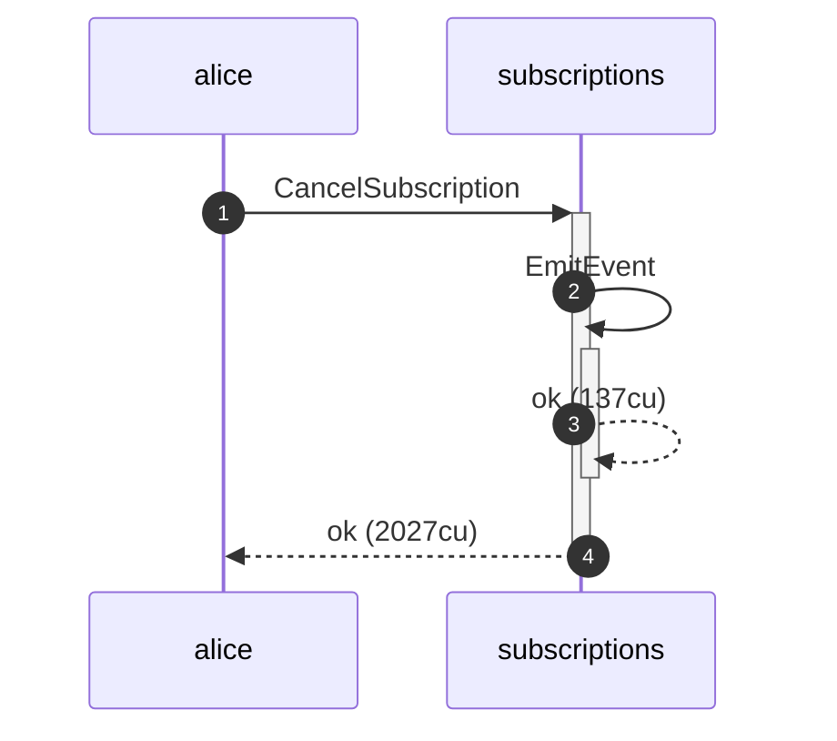

**CancelSubscription: authority graph**

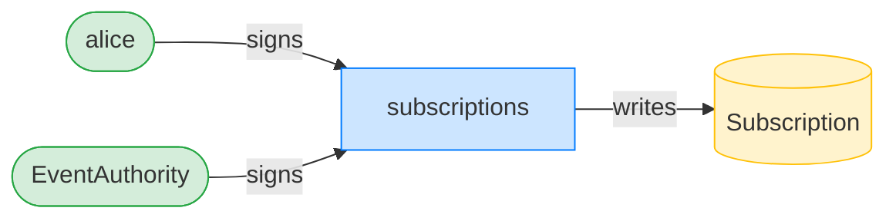

**CancelSubscription: ownership graph**

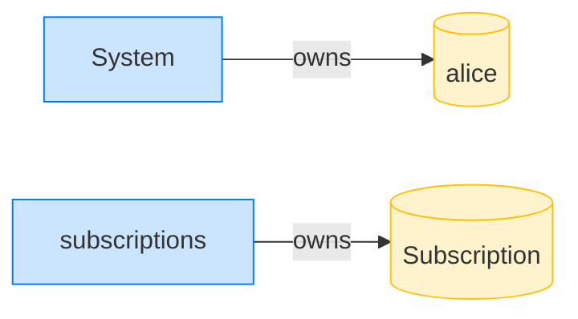

- [x] expires_at_ts is capped just past the inclusive plan end_ts, not period end: `1700005401`
