## Cancel rejects an already-cancelled subscription — PASS

> cancelling twice is rejected

### Stage: Alice's authority, the merchant's plan, Alice subscribed

**InitSubscriptionAuthority: structured CPI tree**

```text

Transaction  signers=[alice]
└── subscriptions::InitSubscriptionAuthority [1] ✓ 6242cu  signer=alice
    ├── System [2] ✓ (no cu)
    └── Token [2] ✓ 126cu
Compute Units (this run): 6242
Fee: 5000 lamports
Legend (2):
  alice         = FXddRd8CdAC8SWKT3Ataasn69R7rbTfQZcKg8ejyrUbF
  subscriptions = De1egAFMkMWZSN5rYXRj9CAdheBamobVNubTsi9avR44
```

**InitSubscriptionAuthority: sequence diagram**

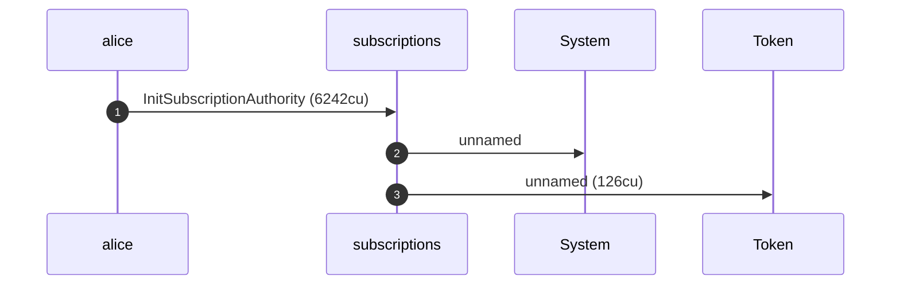

**InitSubscriptionAuthority: sequence diagram, with lifelines**

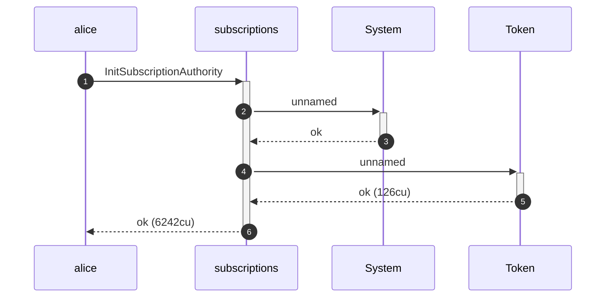

**InitSubscriptionAuthority: authority graph**

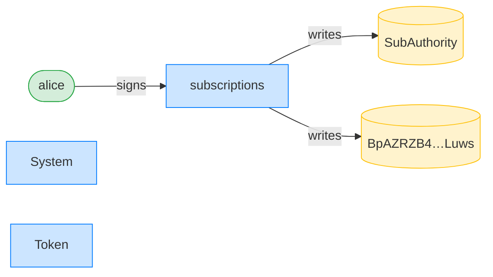

**InitSubscriptionAuthority: ownership graph**

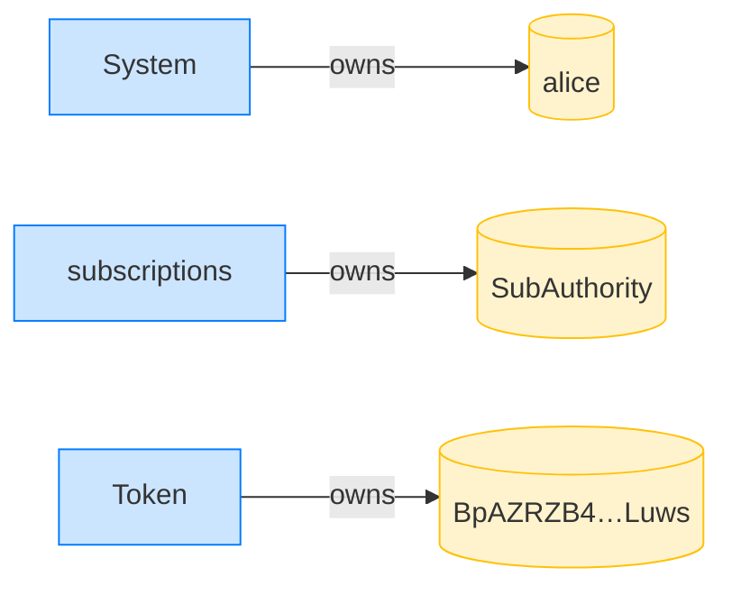

**CreatePlan: structured CPI tree**

```text

Transaction  signers=[merchant]
└── subscriptions::CreatePlan [1] ✓ 3468cu  signer=merchant
    └── System [2] ✓ (no cu)
Compute Units (this run): 3468
Fee: 5000 lamports
Legend (2):
  merchant      = J4fPsxKiTTKiXSiN9bgZ5JBrVgTM9c6N8tjhLN8gfdTq
  subscriptions = De1egAFMkMWZSN5rYXRj9CAdheBamobVNubTsi9avR44
```

**CreatePlan: sequence diagram**

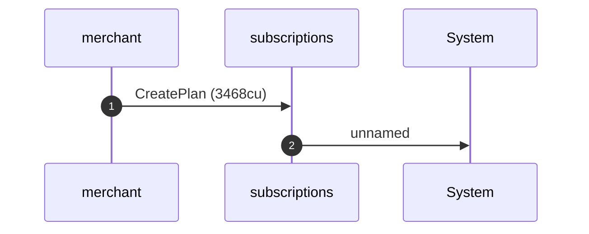

**CreatePlan: sequence diagram, with lifelines**

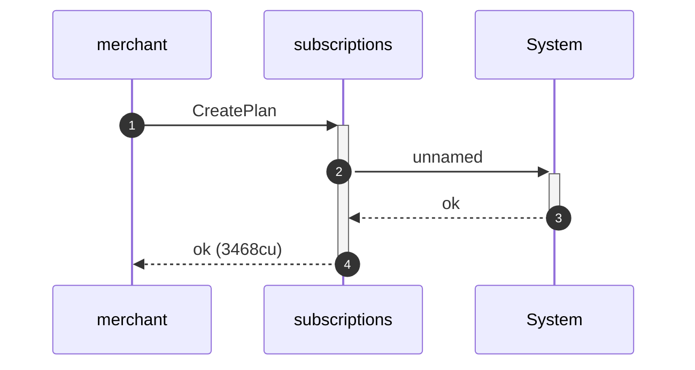

**CreatePlan: authority graph**

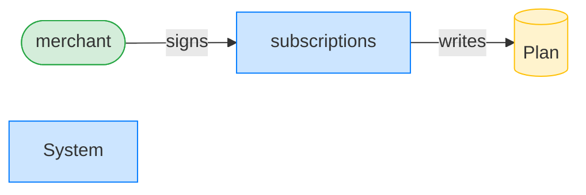

**CreatePlan: ownership graph**

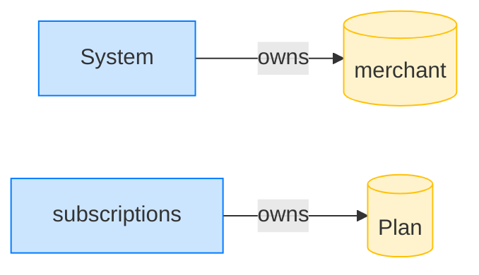

**Subscribe: structured CPI tree**

```text

Transaction  signers=[alice]
└── subscriptions::Subscribe [1] ✓ 6516cu  signer=alice
    ├── System [2] ✓ (no cu)
    └── subscriptions [2] ✓ 137cu
          🔔 SubscriptionCreated
               plan:       Plan,
               subscriber: alice,
               mint:       USDC mint,
               created_ts: 1700000000
Compute Units (this run): 6516
Fee: 5000 lamports
Legend (2):
  alice         = FXddRd8CdAC8SWKT3Ataasn69R7rbTfQZcKg8ejyrUbF
  subscriptions = De1egAFMkMWZSN5rYXRj9CAdheBamobVNubTsi9avR44
```

**Subscribe: sequence diagram**

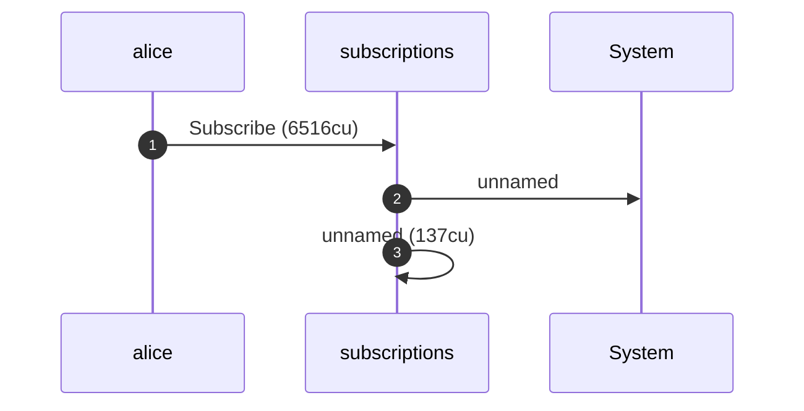

**Subscribe: sequence diagram, with lifelines**

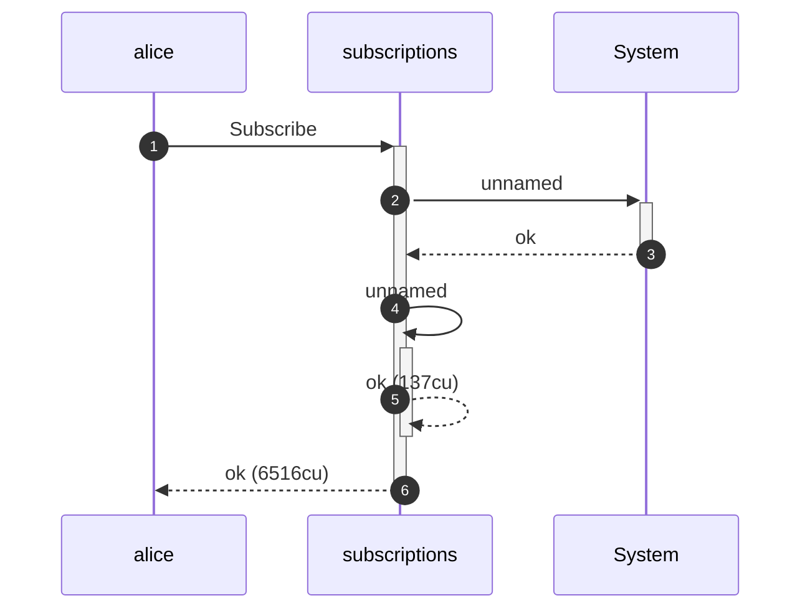

**Subscribe: authority graph**

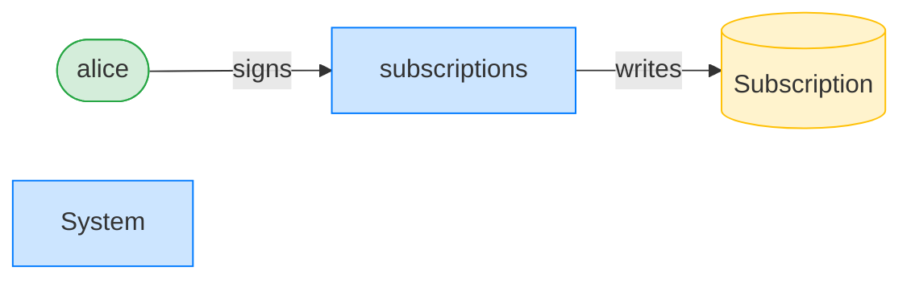

**Subscribe: ownership graph**

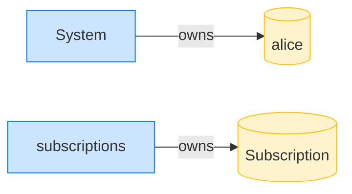

### Alice cancels her subscription

**CancelSubscription: structured CPI tree**

```text

Transaction  signers=[alice]
└── subscriptions::CancelSubscription [1] ✓ 1931cu  signer=alice
    └── subscriptions [2] ✓ 137cu
Compute Units (this run): 1931
Fee: 5000 lamports
Legend (2):
  alice         = FXddRd8CdAC8SWKT3Ataasn69R7rbTfQZcKg8ejyrUbF
  subscriptions = De1egAFMkMWZSN5rYXRj9CAdheBamobVNubTsi9avR44
```

**CancelSubscription: sequence diagram**

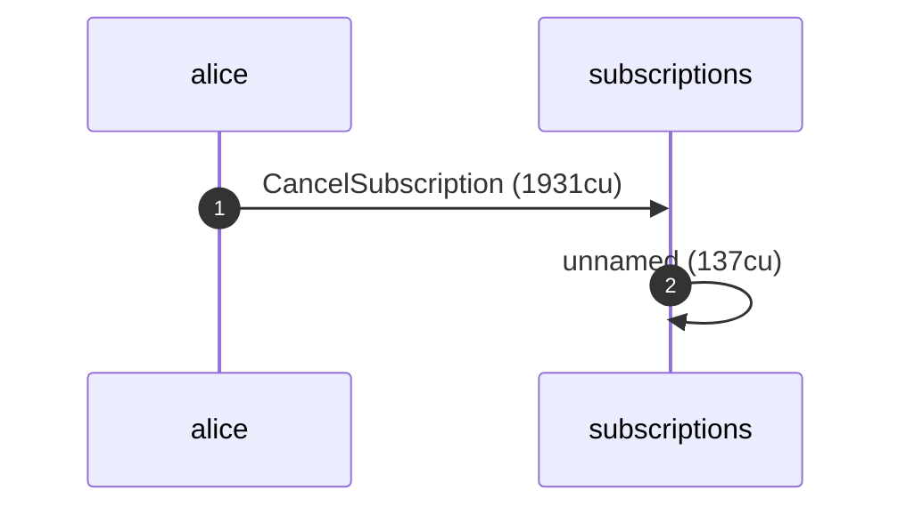

**CancelSubscription: sequence diagram, with lifelines**

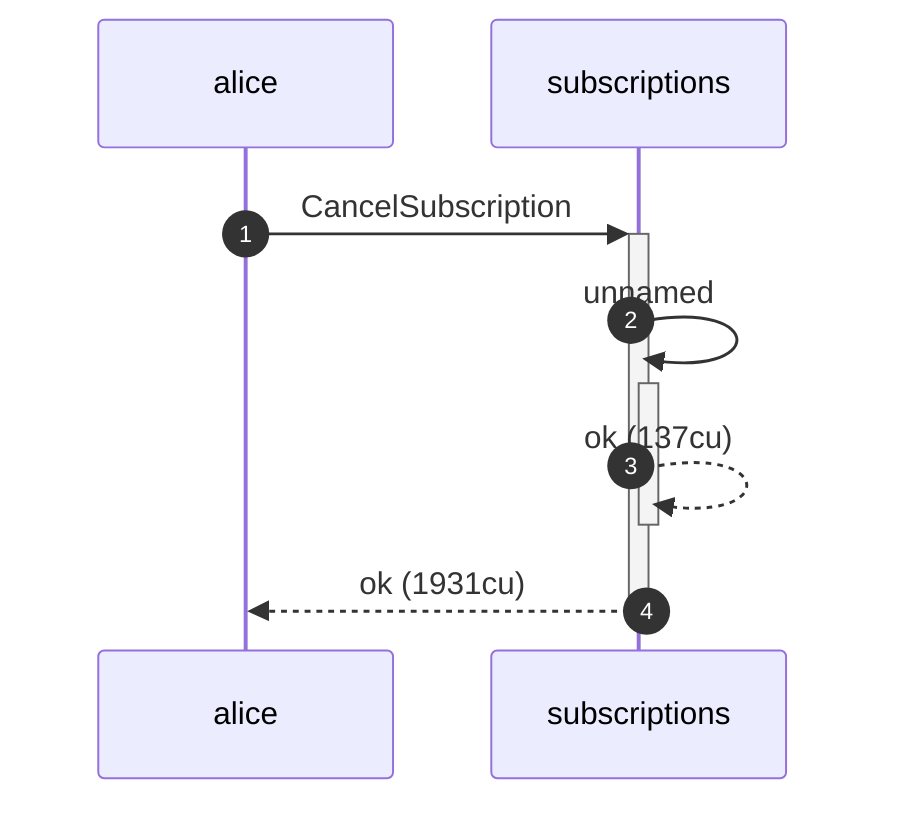

**CancelSubscription: authority graph**

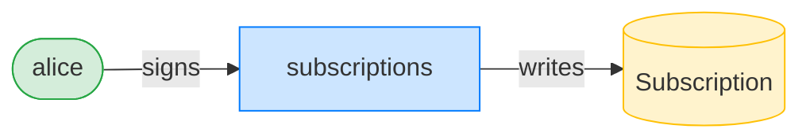

**CancelSubscription: ownership graph**


### Alice cancels again; it is rejected

**CancelSubscription (already cancelled): structured CPI tree**

```text

Transaction  signers=[alice]
└── subscriptions::CancelSubscription [1] ✗ 372cu  signer=alice
    └── Error: SubscriptionAlreadyCancelled
Error: InstructionError(0, Custom(509))
Compute Units (this run): 372
Fee: 5000 lamports
Legend (2):
  alice         = FXddRd8CdAC8SWKT3Ataasn69R7rbTfQZcKg8ejyrUbF
  subscriptions = De1egAFMkMWZSN5rYXRj9CAdheBamobVNubTsi9avR44
```
