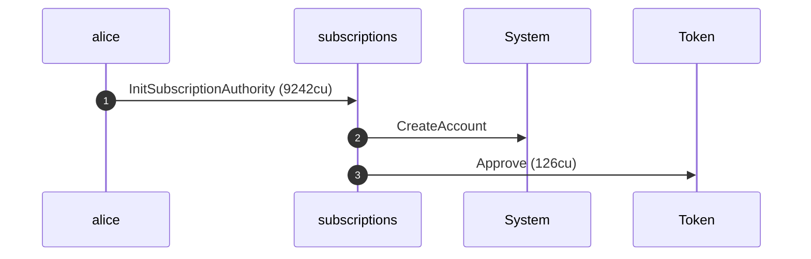
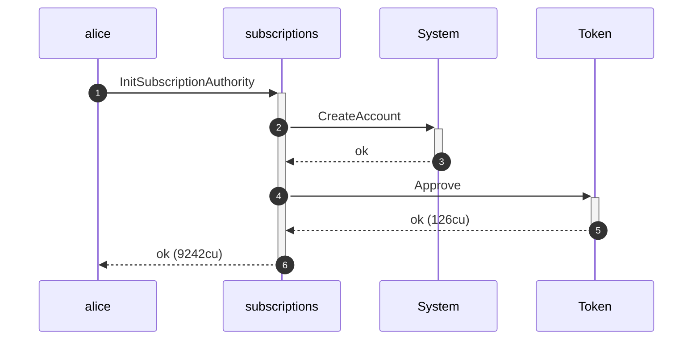
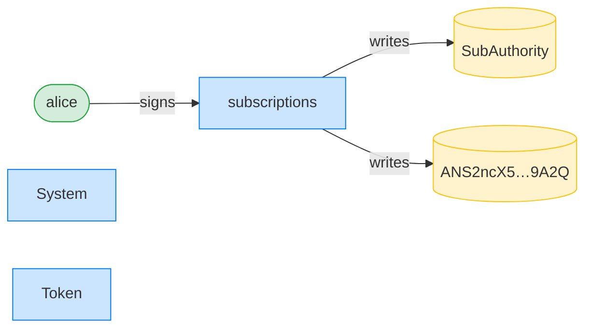
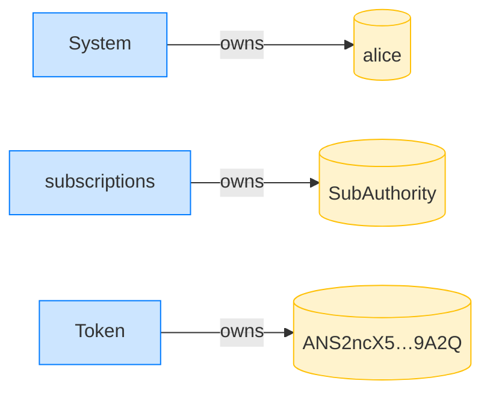

## Close: writable accounts must be writable — PASS

> flipping any account the close writes to read-only is rejected

**InitSubscriptionAuthority: structured CPI tree**

```text

Transaction  signers=[alice]
└── subscriptions::InitSubscriptionAuthority [1] ✓ 9242cu  signer=alice
    ├── System::CreateAccount [2] ✓ (no cu)
    └── Token::Approve [2] ✓ 126cu
Compute Units (this run): 9242
Fee: 5000 lamports
Legend (2):
  alice         = FXddRd8CdAC8SWKT3Ataasn69R7rbTfQZcKg8ejyrUbF
  subscriptions = De1egAFMkMWZSN5rYXRj9CAdheBamobVNubTsi9avR44
```

**InitSubscriptionAuthority: sequence diagram**



**InitSubscriptionAuthority: sequence diagram, with lifelines**



**InitSubscriptionAuthority: authority graph**



**InitSubscriptionAuthority: ownership graph**



**CloseSubscriptionAuthority (user forced read-only): structured CPI tree**

```text

Transaction  signers=[sponsor, alice]
└── subscriptions::CloseSubscriptionAuthority [1] ✗ 160cu  signer=alice
    └── Error: AccountNotWritable
Error: InstructionError(0, Custom(131))
Compute Units (this run): 160
Fee: 10000 lamports
Legend (3):
  sponsor       = 47cncVPgU4mK37H7VvxLCCsoDEKYaVhNLHHp4MbnEwvx
  alice         = FXddRd8CdAC8SWKT3Ataasn69R7rbTfQZcKg8ejyrUbF
  subscriptions = De1egAFMkMWZSN5rYXRj9CAdheBamobVNubTsi9avR44
```

**CloseSubscriptionAuthority (subscriptionAuthority forced read-only): structured CPI tree**

```text

Transaction  signers=[sponsor, alice]
└── subscriptions::CloseSubscriptionAuthority [1] ✗ 165cu  signer=alice
    └── Error: AccountNotWritable
Error: InstructionError(0, Custom(131))
Compute Units (this run): 165
Fee: 10000 lamports
Legend (3):
  sponsor       = 47cncVPgU4mK37H7VvxLCCsoDEKYaVhNLHHp4MbnEwvx
  alice         = FXddRd8CdAC8SWKT3Ataasn69R7rbTfQZcKg8ejyrUbF
  subscriptions = De1egAFMkMWZSN5rYXRj9CAdheBamobVNubTsi9avR44
```
