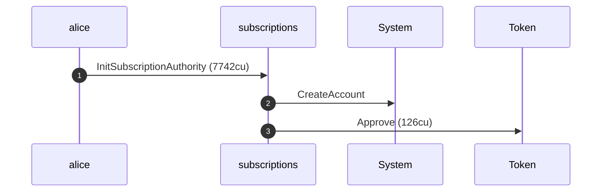
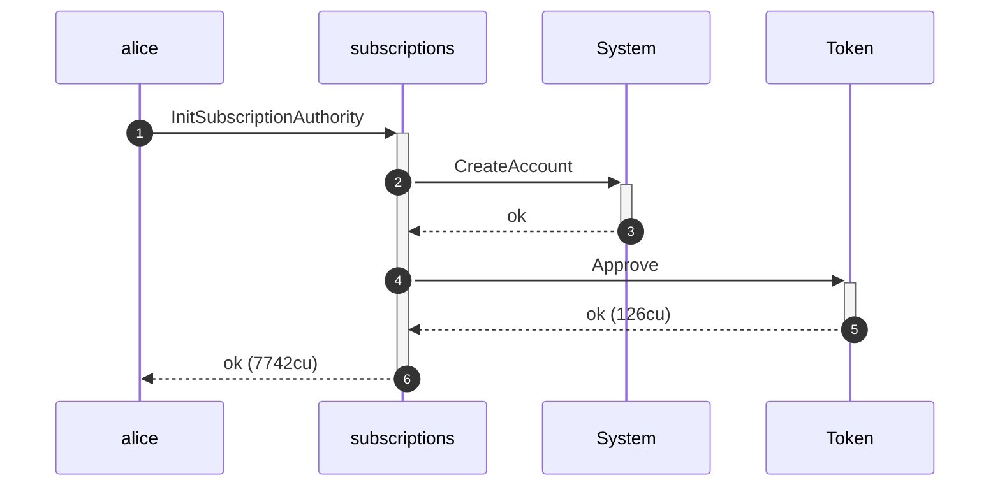
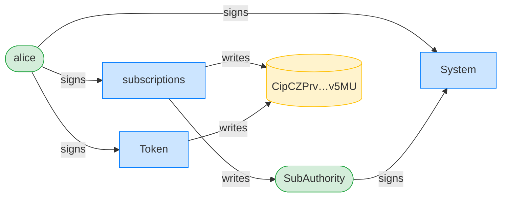
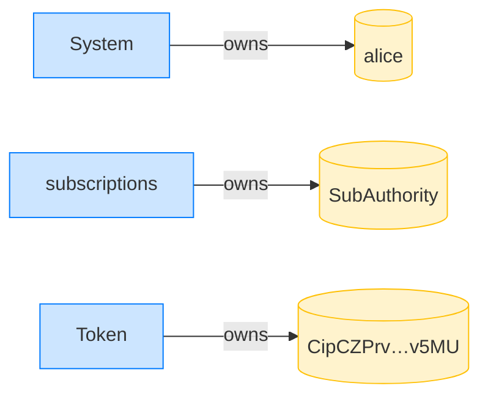
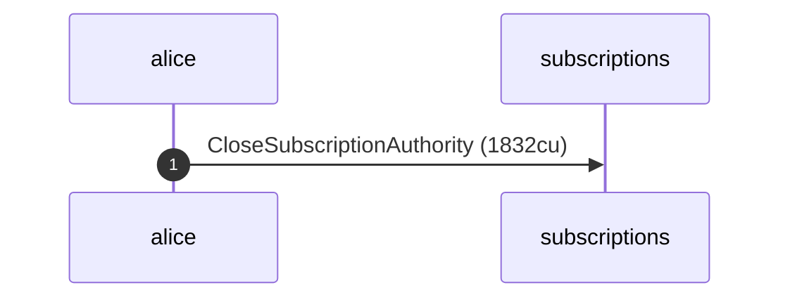
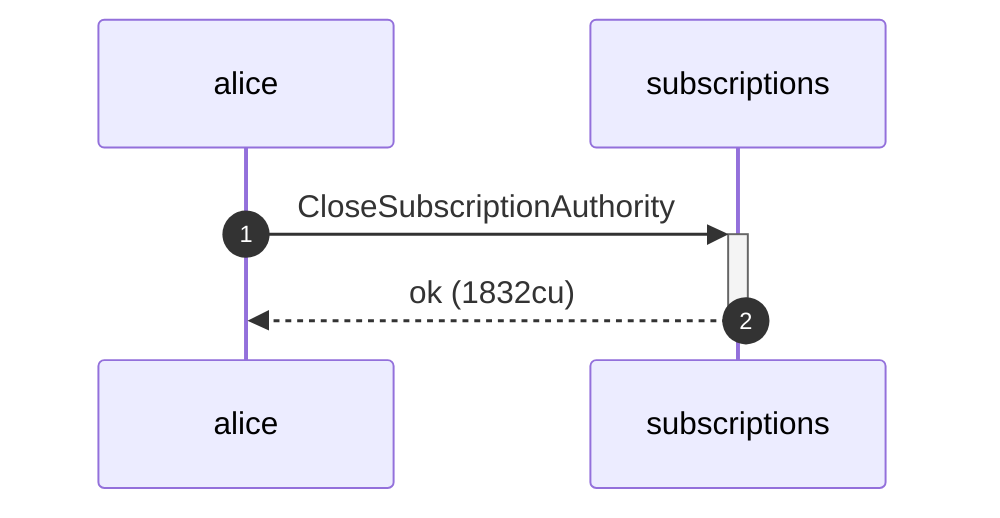
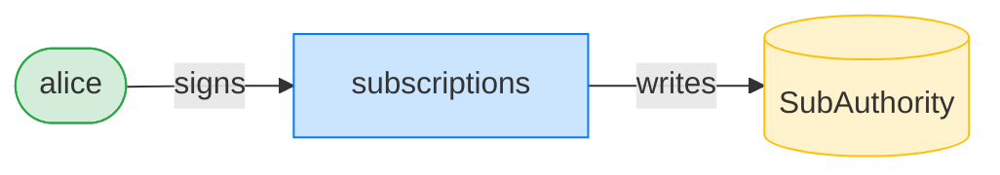
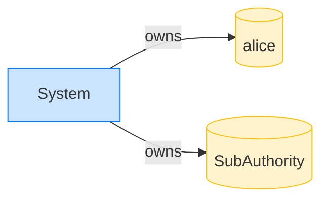

## Close a subscription authority — PASS

> Alice closes her SubscriptionAuthority and the rent returns to her

**InitSubscriptionAuthority: structured CPI tree**

```text

── subscriptions::InitSubscriptionAuthority ────────────────
Transaction  signers=[alice]
└── subscriptions::InitSubscriptionAuthority [1] ✓ 7742cu  signer=alice
    ├── System::CreateAccount [2] ✓ (no cu)
    └── Token::Approve [2] ✓ 126cu
Compute Units (this run): 7742
Fee: 5000 lamports
Legend (2):
  subscriptions = De1egAFMkMWZSN5rYXRj9CAdheBamobVNubTsi9avR44
  alice         = FXddRd8CdAC8SWKT3Ataasn69R7rbTfQZcKg8ejyrUbF
```

**InitSubscriptionAuthority: sequence diagram**



**InitSubscriptionAuthority: sequence diagram, with lifelines**



**InitSubscriptionAuthority: authority graph**



**InitSubscriptionAuthority: ownership graph**



### Alice closes her subscription authority

**CloseSubscriptionAuthority: structured CPI tree**

```text

── subscriptions::CloseSubscriptionAuthority ───────────────
Transaction  signers=[alice]
└── subscriptions::CloseSubscriptionAuthority [1] ✓ 1832cu  signer=alice
Compute Units (this run): 1832
Fee: 5000 lamports
Legend (2):
  subscriptions = De1egAFMkMWZSN5rYXRj9CAdheBamobVNubTsi9avR44
  alice         = FXddRd8CdAC8SWKT3Ataasn69R7rbTfQZcKg8ejyrUbF
```

**CloseSubscriptionAuthority: sequence diagram**



**CloseSubscriptionAuthority: sequence diagram, with lifelines**



**CloseSubscriptionAuthority: authority graph**



**CloseSubscriptionAuthority: ownership graph**



- [x] the authority account is gone or emptied: `true`
- [x] Alice's balance grew: `true`
