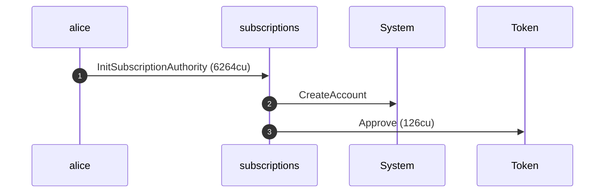
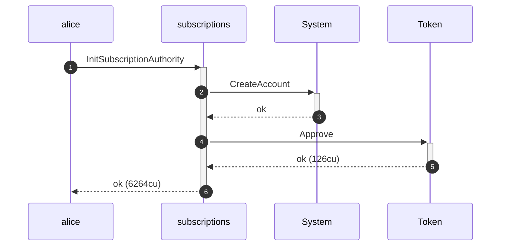
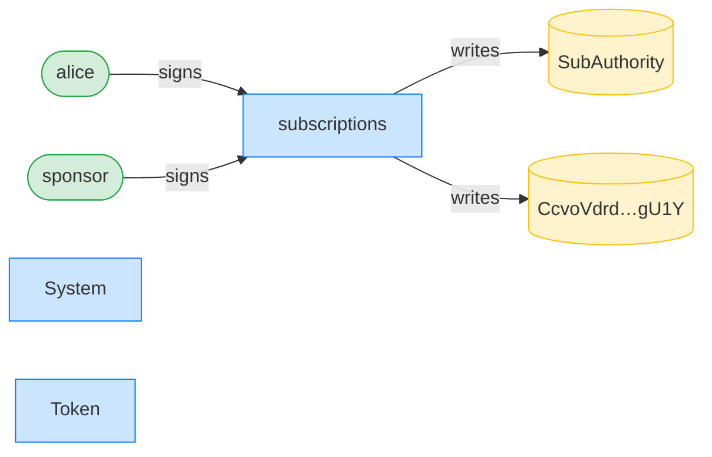
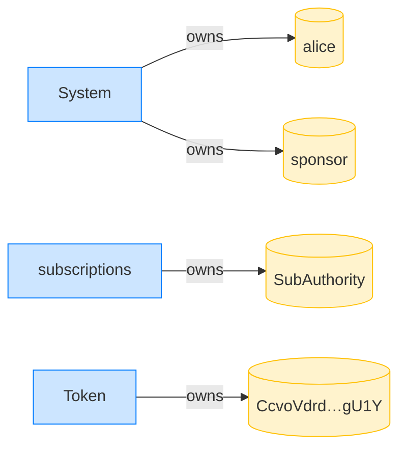
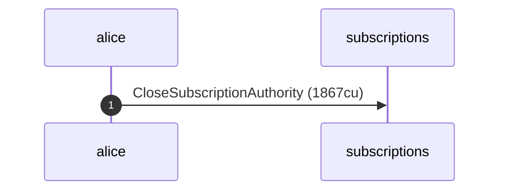
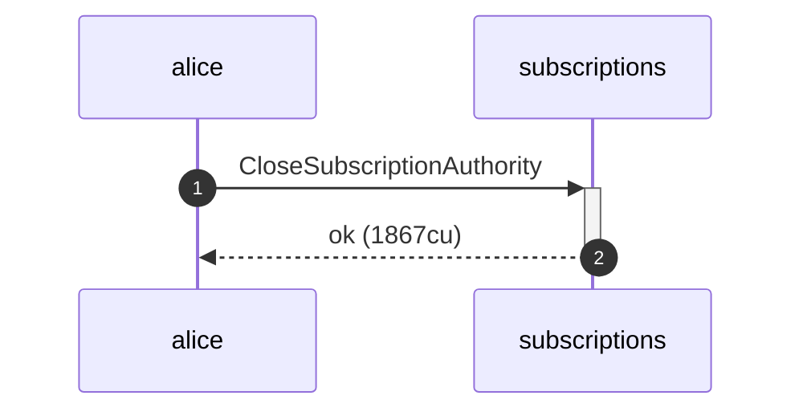
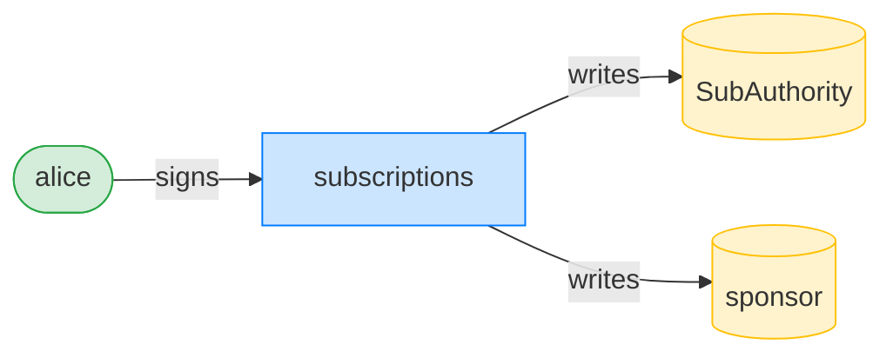
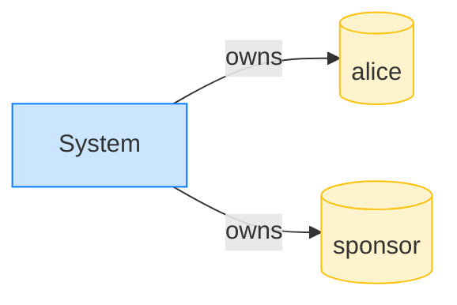

## Close returns rent to the sponsor — PASS

> when a sponsor funded the authority, the close returns rent to them

**InitSubscriptionAuthority: structured CPI tree**

```text

Transaction  signers=[sponsor, alice]
└── subscriptions::InitSubscriptionAuthority [1] ✓ 6264cu  signer=[alice, sponsor]
    ├── System::CreateAccount [2] ✓ (no cu)
    └── Token::Approve [2] ✓ 126cu
Compute Units (this run): 6264
Fee: 10000 lamports
Legend (3):
  sponsor       = 47cncVPgU4mK37H7VvxLCCsoDEKYaVhNLHHp4MbnEwvx
  alice         = FXddRd8CdAC8SWKT3Ataasn69R7rbTfQZcKg8ejyrUbF
  subscriptions = De1egAFMkMWZSN5rYXRj9CAdheBamobVNubTsi9avR44
```

**InitSubscriptionAuthority: sequence diagram**



**InitSubscriptionAuthority: sequence diagram, with lifelines**



**InitSubscriptionAuthority: authority graph**



**InitSubscriptionAuthority: ownership graph**



- [x] the stored payer is the sponsor: `47cncVPgU4mK37H7VvxLCCsoDEKYaVhNLHHp4MbnEwvx`

### Alice closes, directing rent back to the sponsor

**CloseSubscriptionAuthority (rent to sponsor): structured CPI tree**

```text

Transaction  signers=[alice]
└── subscriptions::CloseSubscriptionAuthority [1] ✓ 1867cu  signer=alice
Compute Units (this run): 1867
Fee: 5000 lamports
Legend (2):
  alice         = FXddRd8CdAC8SWKT3Ataasn69R7rbTfQZcKg8ejyrUbF
  subscriptions = De1egAFMkMWZSN5rYXRj9CAdheBamobVNubTsi9avR44
```

**CloseSubscriptionAuthority (rent to sponsor): sequence diagram**



**CloseSubscriptionAuthority (rent to sponsor): sequence diagram, with lifelines**



**CloseSubscriptionAuthority (rent to sponsor): authority graph**



**CloseSubscriptionAuthority (rent to sponsor): ownership graph**


