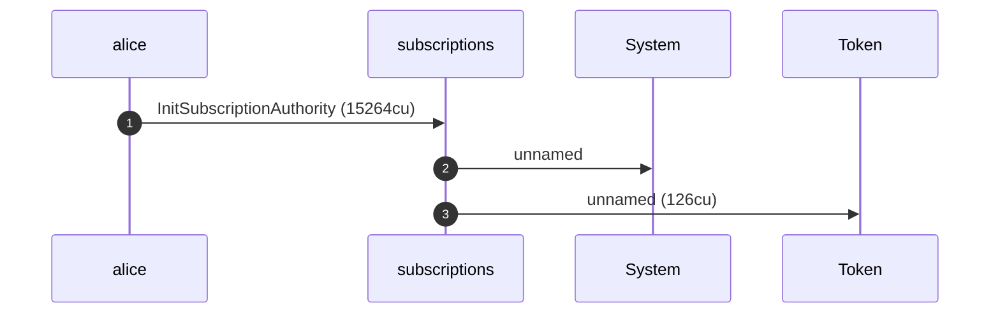
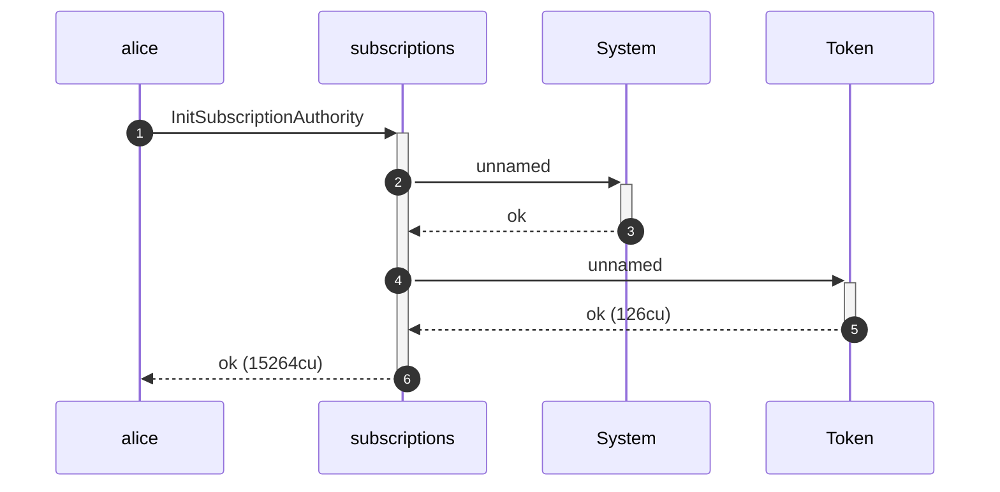
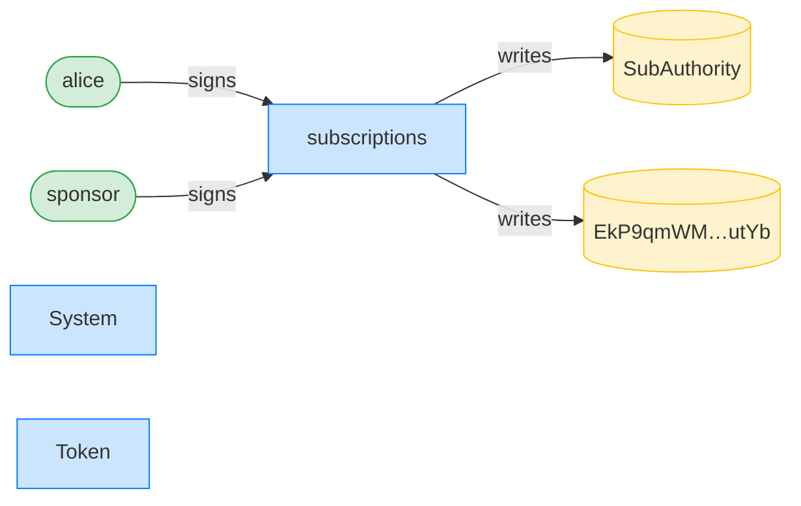
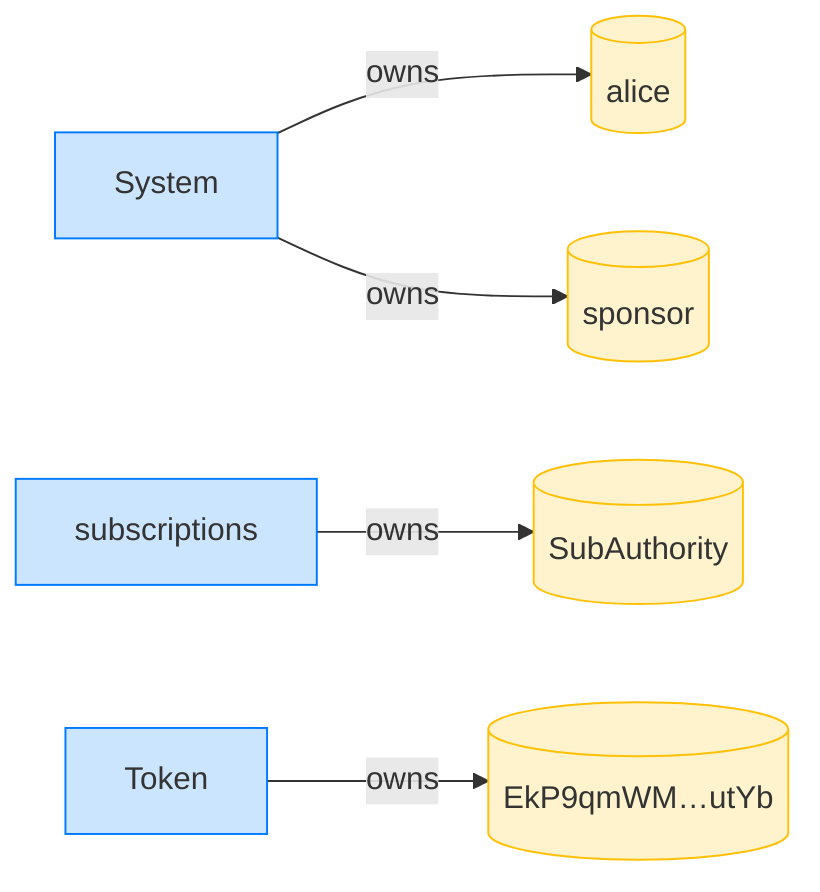

## Close with the wrong receiver is unauthorized — PASS

> the rent receiver must be the stored payer, not an arbitrary account

**InitSubscriptionAuthority: structured CPI tree**

```text

Transaction  signers=[sponsor, alice]
└── subscriptions::InitSubscriptionAuthority [1] ✓ 15264cu  signer=[alice, sponsor]
    ├── System [2] ✓ (no cu)
    └── Token [2] ✓ 126cu
Compute Units (this run): 15264
Fee: 10000 lamports
Legend (3):
  sponsor       = 47cncVPgU4mK37H7VvxLCCsoDEKYaVhNLHHp4MbnEwvx
  alice         = FXddRd8CdAC8SWKT3Ataasn69R7rbTfQZcKg8ejyrUbF
  subscriptions = De1egAFMkMWZSN5rYXRj9CAdheBamobVNubTsi9avR44
```

**InitSubscriptionAuthority: sequence diagram**



**InitSubscriptionAuthority: sequence diagram, with lifelines**



**InitSubscriptionAuthority: authority graph**



**InitSubscriptionAuthority: ownership graph**



### Alice closes, but points the rent at Mallory

**CloseSubscriptionAuthority (wrong receiver): structured CPI tree**

```text

Transaction  signers=[alice]
└── subscriptions::CloseSubscriptionAuthority [1] ✗ 1841cu  signer=alice
    └── Error: Unauthorized
Error: InstructionError(0, Custom(130))
Compute Units (this run): 1841
Fee: 5000 lamports
Legend (2):
  alice         = FXddRd8CdAC8SWKT3Ataasn69R7rbTfQZcKg8ejyrUbF
  subscriptions = De1egAFMkMWZSN5rYXRj9CAdheBamobVNubTsi9avR44
```
