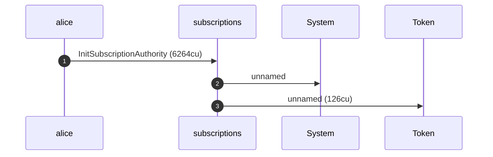
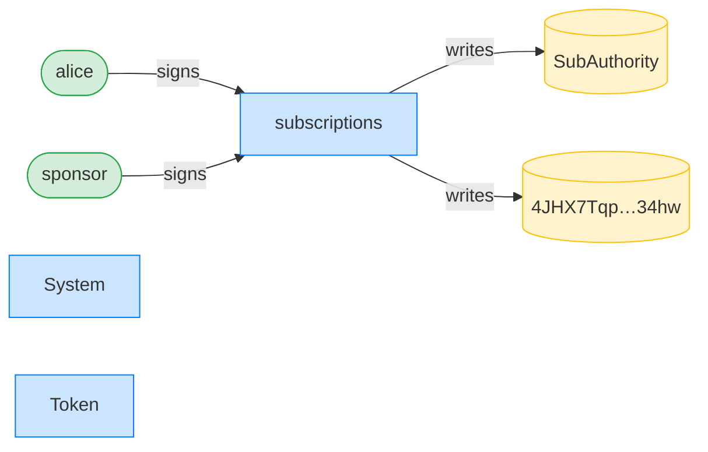
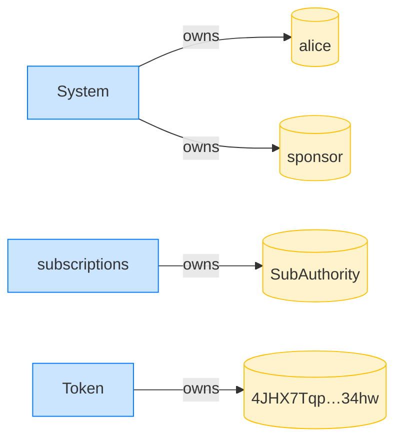

## Close without a receiver fails when a sponsor funded — PASS

> a sponsor-funded authority cannot be closed without naming the rent receiver

**InitSubscriptionAuthority: structured CPI tree**

```text

Transaction  signers=[sponsor, alice]
└── subscriptions::InitSubscriptionAuthority [1] ✓ 6264cu  signer=[alice, sponsor]
    ├── System [2] ✓ (no cu)
    └── Token [2] ✓ 126cu
Compute Units (this run): 6264
Fee: 10000 lamports
Legend (3):
  sponsor       = 47cncVPgU4mK37H7VvxLCCsoDEKYaVhNLHHp4MbnEwvx
  alice         = FXddRd8CdAC8SWKT3Ataasn69R7rbTfQZcKg8ejyrUbF
  subscriptions = De1egAFMkMWZSN5rYXRj9CAdheBamobVNubTsi9avR44
```

**InitSubscriptionAuthority: sequence diagram**



**InitSubscriptionAuthority: sequence diagram, with lifelines**


**InitSubscriptionAuthority: authority graph**



**InitSubscriptionAuthority: ownership graph**



### Alice closes without naming the sponsor receiver

**CloseSubscriptionAuthority (no receiver): structured CPI tree**

```text

Transaction  signers=[alice]
└── subscriptions::CloseSubscriptionAuthority [1] ✗ 1810cu  signer=alice
    └── Error: NotEnoughAccountKeys
Error: InstructionError(0, Custom(113))
Compute Units (this run): 1810
Fee: 5000 lamports
Legend (2):
  alice         = FXddRd8CdAC8SWKT3Ataasn69R7rbTfQZcKg8ejyrUbF
  subscriptions = De1egAFMkMWZSN5rYXRj9CAdheBamobVNubTsi9avR44
```
