## Closing the authority blocks all delegations — PASS

> after the authority is closed, every outstanding delegation's pull is refused

### Stage: Alice's authority and delegations to Bob and Charlie

**InitSubscriptionAuthority: structured CPI tree**

```text

── subscriptions::InitSubscriptionAuthority ────────────────
Transaction  signers=[alice]
└── subscriptions::InitSubscriptionAuthority [1] ✓ 6242cu  signer=alice
    ├── System::CreateAccount [2] ✓ (no cu)
    └── Token::Approve [2] ✓ 126cu
Compute Units (this run): 6242
Fee: 5000 lamports
Legend (2):
  subscriptions = De1egAFMkMWZSN5rYXRj9CAdheBamobVNubTsi9avR44
  alice         = FXddRd8CdAC8SWKT3Ataasn69R7rbTfQZcKg8ejyrUbF
```

**InitSubscriptionAuthority: sequence diagram**

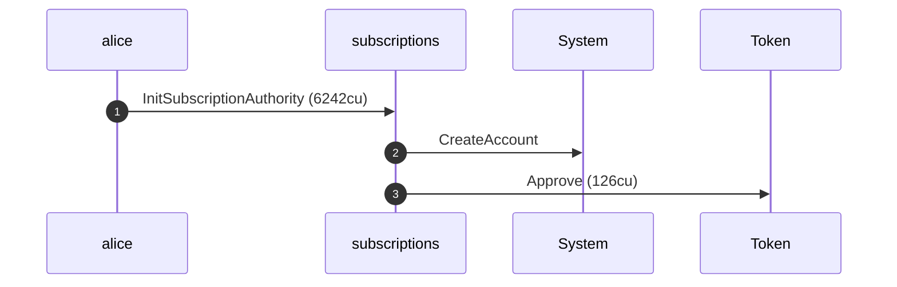

**InitSubscriptionAuthority: sequence diagram, with lifelines**

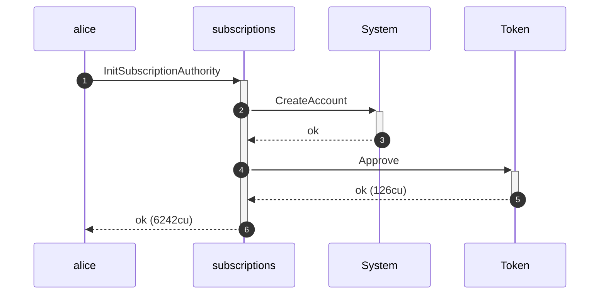

**InitSubscriptionAuthority: authority graph**

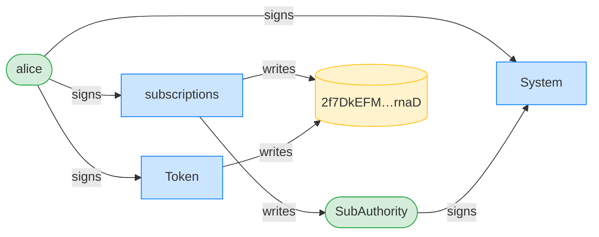

**InitSubscriptionAuthority: ownership graph**

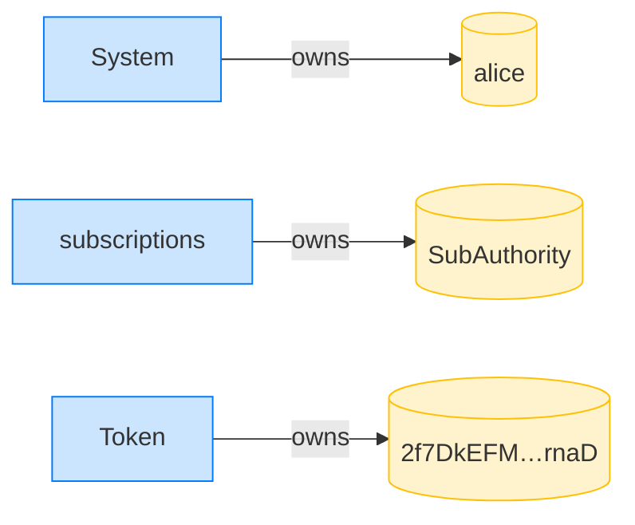

**CreateFixedDelegation (Bob): structured CPI tree**

```text

── subscriptions::CreateFixedDelegation ────────────────────
Transaction  signers=[alice]
└── subscriptions::CreateFixedDelegation [1] ✓ 6538cu  signer=alice
    └── System::CreateAccount [2] ✓ (no cu)
Compute Units (this run): 6538
Fee: 5000 lamports
Legend (2):
  subscriptions = De1egAFMkMWZSN5rYXRj9CAdheBamobVNubTsi9avR44
  alice         = FXddRd8CdAC8SWKT3Ataasn69R7rbTfQZcKg8ejyrUbF
```

**CreateFixedDelegation (Bob): sequence diagram**

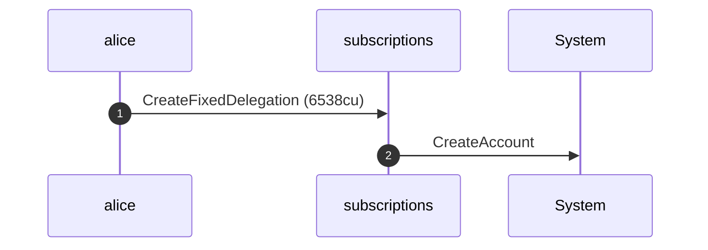

**CreateFixedDelegation (Bob): sequence diagram, with lifelines**

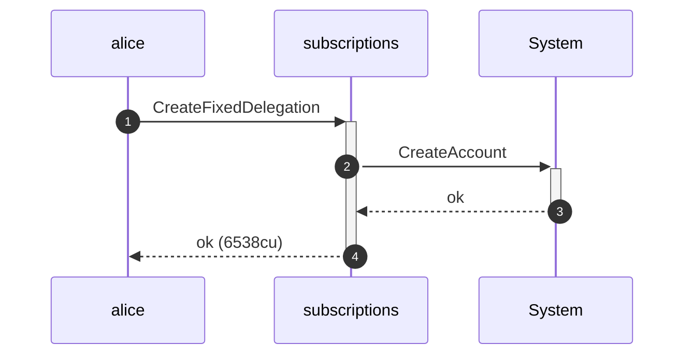

**CreateFixedDelegation (Bob): authority graph**

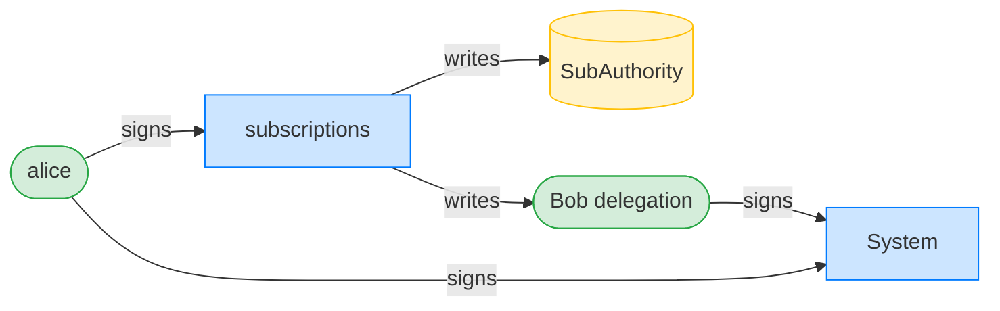

**CreateFixedDelegation (Bob): ownership graph**

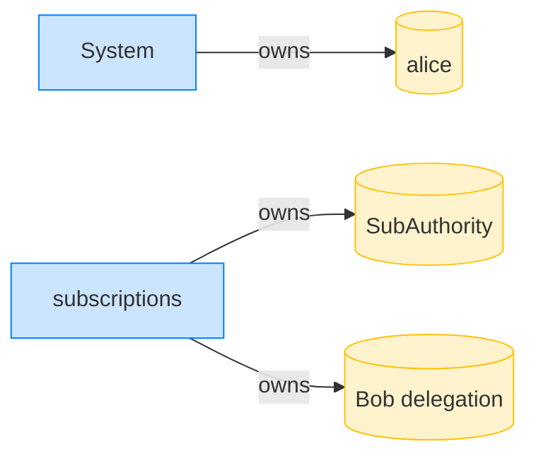

**CreateFixedDelegation (Charlie): structured CPI tree**

```text

── subscriptions::CreateFixedDelegation ────────────────────
Transaction  signers=[alice]
└── subscriptions::CreateFixedDelegation [1] ✓ 5038cu  signer=alice
    └── System::CreateAccount [2] ✓ (no cu)
Compute Units (this run): 5038
Fee: 5000 lamports
Legend (2):
  subscriptions = De1egAFMkMWZSN5rYXRj9CAdheBamobVNubTsi9avR44
  alice         = FXddRd8CdAC8SWKT3Ataasn69R7rbTfQZcKg8ejyrUbF
```

**CreateFixedDelegation (Charlie): sequence diagram**


**CreateFixedDelegation (Charlie): sequence diagram, with lifelines**


**CreateFixedDelegation (Charlie): authority graph**

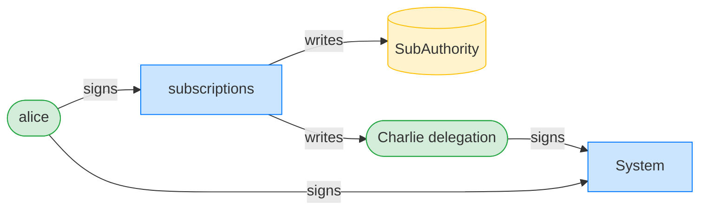

**CreateFixedDelegation (Charlie): ownership graph**

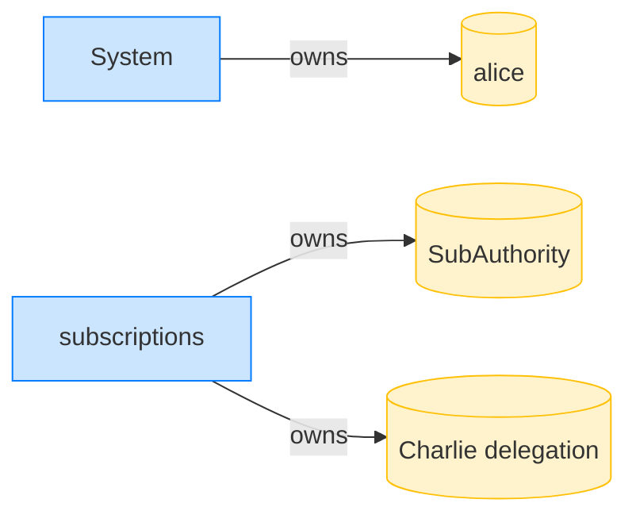

### Alice closes her subscription authority

**CloseSubscriptionAuthority: structured CPI tree**

```text

── subscriptions::CloseSubscriptionAuthority ───────────────
Transaction  signers=[alice]
└── subscriptions::CloseSubscriptionAuthority [1] ✓ 1832cu  signer=alice
Compute Units (this run): 1832
Fee: 5000 lamports
Legend (2):
  subscriptions = De1egAFMkMWZSN5rYXRj9CAdheBamobVNubTsi9avR44
  alice         = FXddRd8CdAC8SWKT3Ataasn69R7rbTfQZcKg8ejyrUbF
```

**CloseSubscriptionAuthority: sequence diagram**

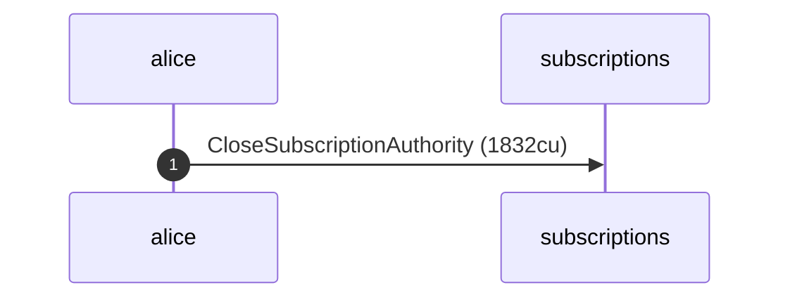

**CloseSubscriptionAuthority: sequence diagram, with lifelines**

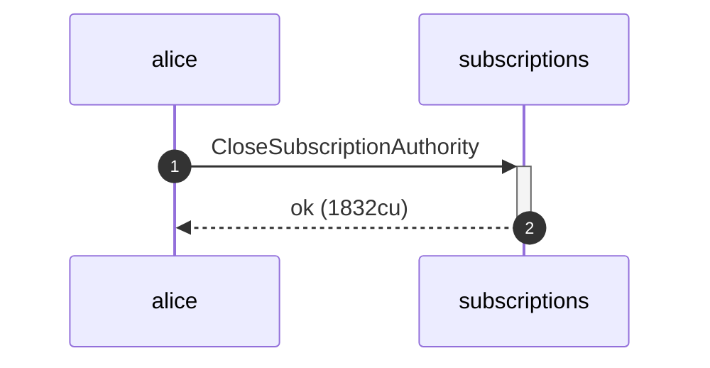

**CloseSubscriptionAuthority: authority graph**

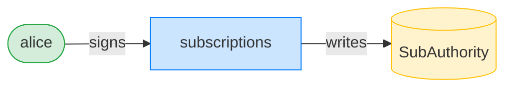

**CloseSubscriptionAuthority: ownership graph**

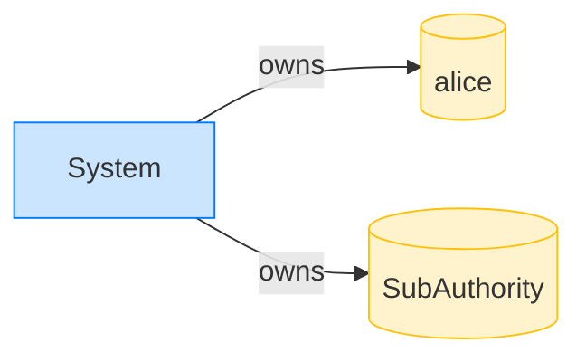

### Both Bob's and Charlie's pulls are now refused

**TransferFixed (Bob, authority closed): structured CPI tree**

```text

── subscriptions::TransferFixed ────────────────────────────
Transaction  signers=[bob]
└── subscriptions::TransferFixed [1] ✗ 374cu  signer=bob
    └── Error: InvalidSubscriptionAuthorityPda (0x67)
Error: InstructionError(0, Custom(103))
Compute Units (this run): 374
Fee: 5000 lamports
Legend (2):
  subscriptions = De1egAFMkMWZSN5rYXRj9CAdheBamobVNubTsi9avR44
  bob           = 9S8NPMnzAba71o3tr8dHDzUrfT5NesYFzP56QFpYieMR
```

**TransferFixed (Charlie, authority closed): structured CPI tree**

```text

── subscriptions::TransferFixed ────────────────────────────
Transaction  signers=[charlie]
└── subscriptions::TransferFixed [1] ✗ 374cu  signer=charlie
    └── Error: InvalidSubscriptionAuthorityPda (0x67)
Error: InstructionError(0, Custom(103))
Compute Units (this run): 374
Fee: 5000 lamports
Legend (2):
  subscriptions = De1egAFMkMWZSN5rYXRj9CAdheBamobVNubTsi9avR44
  charlie       = 5b3hX8Qbs7HnenmYwER2eYZNpufgoqPSq6wor4Fr5isz
```

- [x] Alice's funds are untouched: `100000000`

**RevokeDelegation (Bob): structured CPI tree**

```text

── subscriptions::RevokeDelegation ─────────────────────────
Transaction  signers=[alice]
└── subscriptions::RevokeDelegation [1] ✓ 267cu  signer=alice
Compute Units (this run): 267
Fee: 5000 lamports
Legend (2):
  subscriptions = De1egAFMkMWZSN5rYXRj9CAdheBamobVNubTsi9avR44
  alice         = FXddRd8CdAC8SWKT3Ataasn69R7rbTfQZcKg8ejyrUbF
```

**RevokeDelegation (Bob): sequence diagram**

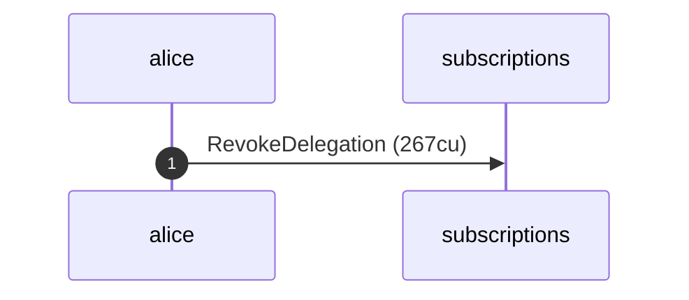

**RevokeDelegation (Bob): sequence diagram, with lifelines**

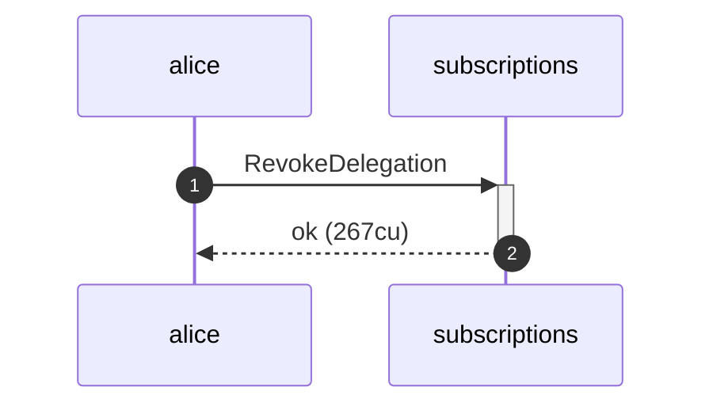

**RevokeDelegation (Bob): authority graph**

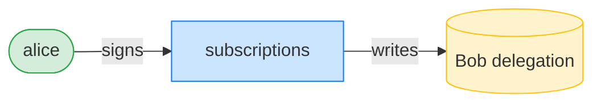

**RevokeDelegation (Bob): ownership graph**

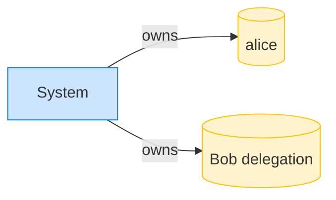

**RevokeDelegation (Charlie): structured CPI tree**

```text

── subscriptions::RevokeDelegation ─────────────────────────
Transaction  signers=[alice]
└── subscriptions::RevokeDelegation [1] ✓ 267cu  signer=alice
Compute Units (this run): 267
Fee: 5000 lamports
Legend (2):
  subscriptions = De1egAFMkMWZSN5rYXRj9CAdheBamobVNubTsi9avR44
  alice         = FXddRd8CdAC8SWKT3Ataasn69R7rbTfQZcKg8ejyrUbF
```

**RevokeDelegation (Charlie): sequence diagram**

```mermaid
sequenceDiagram
    autonumber
    participant alice
    participant subscriptions
    alice ->> subscriptions: RevokeDelegation (267cu)
```

**RevokeDelegation (Charlie): sequence diagram, with lifelines**

```mermaid
sequenceDiagram
    autonumber
    participant alice
    participant subscriptions
    alice ->>+ subscriptions: RevokeDelegation
    subscriptions -->>- alice: ok (267cu)
```

**RevokeDelegation (Charlie): authority graph**

```mermaid
flowchart LR
    classDef signer fill:#d4edda,stroke:#28a745;
    classDef program fill:#cce5ff,stroke:#007bff;
    classDef writable fill:#fff3cd,stroke:#ffc107;
    subscriptions[subscriptions]:::program
    alice([alice]):::signer
    Charlie_delegation[("Charlie delegation")]:::writable
    alice -->|signs| subscriptions
    subscriptions -->|writes| Charlie_delegation
```

**RevokeDelegation (Charlie): ownership graph**

```mermaid
flowchart LR
    classDef owner fill:#cce5ff,stroke:#007bff;
    classDef account fill:#fff3cd,stroke:#ffc107;
    System[System]:::owner
    alice[(alice)]:::account
    Charlie_delegation[("Charlie delegation")]:::account
    System -->|owns| alice
    System -->|owns| Charlie_delegation
```
