## Create a fixed delegation with a sponsor — PASS

> a sponsor pays the delegation rent; revoking refunds it to the sponsor

**InitSubscriptionAuthority: structured CPI tree**

```text

Transaction  signers=[alice]
└── subscriptions::InitSubscriptionAuthority [1] ✓ 6242cu  signer=alice
    ├── System::CreateAccount [2] ✓ (no cu)
    └── Token::Approve [2] ✓ 126cu
Compute Units (this run): 6242
Fee: 5000 lamports
Legend (2):
  alice         = FXddRd8CdAC8SWKT3Ataasn69R7rbTfQZcKg8ejyrUbF
  subscriptions = De1egAFMkMWZSN5rYXRj9CAdheBamobVNubTsi9avR44
```

**InitSubscriptionAuthority: sequence diagram**

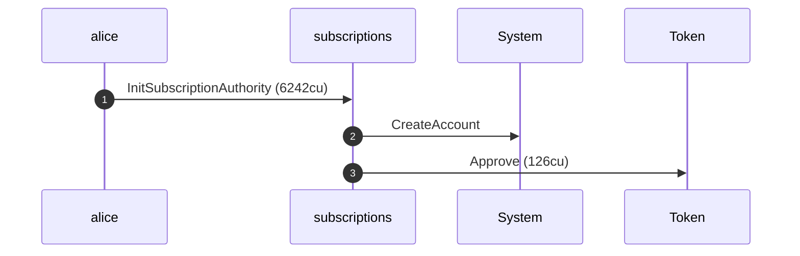

**InitSubscriptionAuthority: sequence diagram, with lifelines**

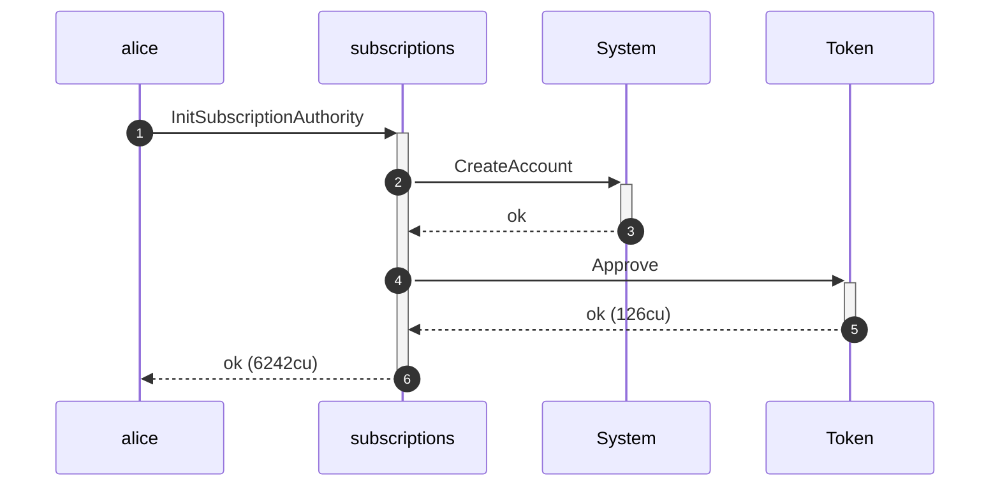

**InitSubscriptionAuthority: authority graph**

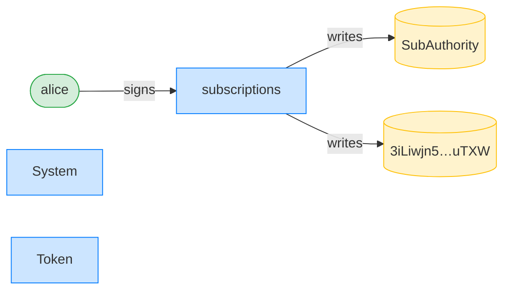

**InitSubscriptionAuthority: ownership graph**

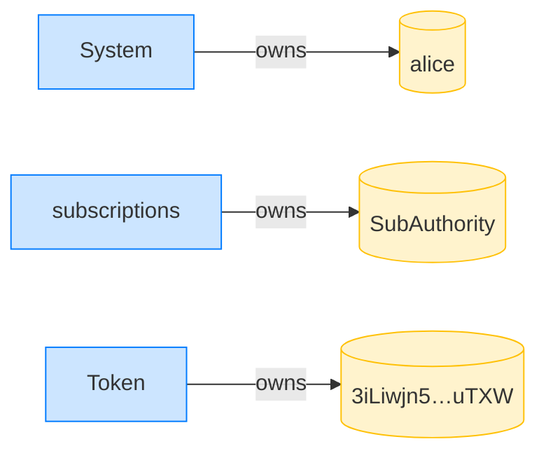

### Alice creates a fixed delegation; the sponsor pays the rent

**CreateFixedDelegation (sponsored): structured CPI tree**

```text

Transaction  signers=[sponsor, alice]
└── subscriptions::CreateFixedDelegation [1] ✓ 3566cu  signer=[alice, sponsor]
    └── System::CreateAccount [2] ✓ (no cu)
Compute Units (this run): 3566
Fee: 10000 lamports
Legend (3):
  sponsor       = 47cncVPgU4mK37H7VvxLCCsoDEKYaVhNLHHp4MbnEwvx
  alice         = FXddRd8CdAC8SWKT3Ataasn69R7rbTfQZcKg8ejyrUbF
  subscriptions = De1egAFMkMWZSN5rYXRj9CAdheBamobVNubTsi9avR44
```

**CreateFixedDelegation (sponsored): sequence diagram**

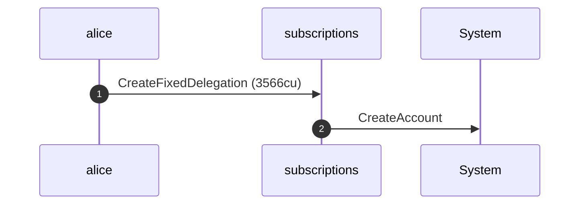

**CreateFixedDelegation (sponsored): sequence diagram, with lifelines**

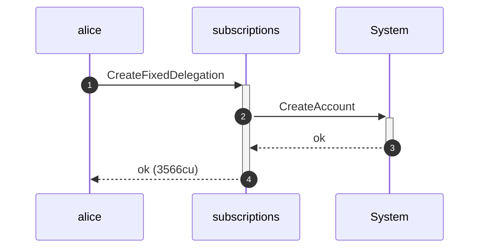

**CreateFixedDelegation (sponsored): authority graph**

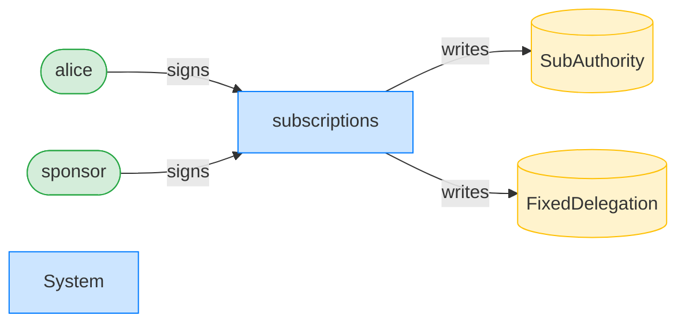

**CreateFixedDelegation (sponsored): ownership graph**

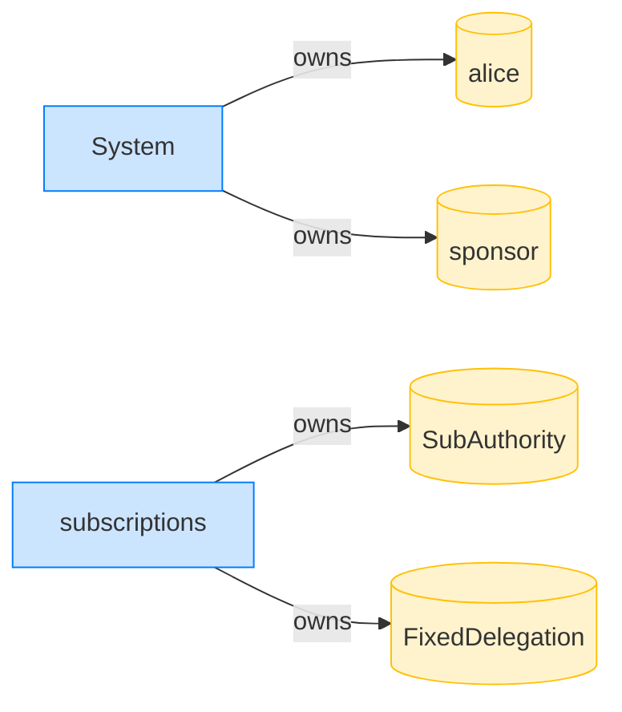

- [x] Alice's lamports are untouched: `99998366360`
- [x] the sponsor was charged: `true`
- [x] the delegation's payer is the sponsor: `47cncVPgU4mK37H7VvxLCCsoDEKYaVhNLHHp4MbnEwvx`

### Alice revokes the delegation, refunding the rent to the sponsor

**RevokeDelegation (refund to sponsor): structured CPI tree**

```text

Transaction  signers=[alice]
└── subscriptions::RevokeDelegation [1] ✓ 297cu  signer=alice
Compute Units (this run): 297
Fee: 5000 lamports
Legend (2):
  alice         = FXddRd8CdAC8SWKT3Ataasn69R7rbTfQZcKg8ejyrUbF
  subscriptions = De1egAFMkMWZSN5rYXRj9CAdheBamobVNubTsi9avR44
```

**RevokeDelegation (refund to sponsor): sequence diagram**

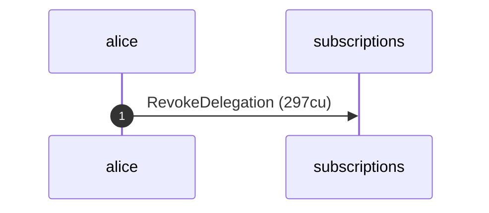

**RevokeDelegation (refund to sponsor): sequence diagram, with lifelines**

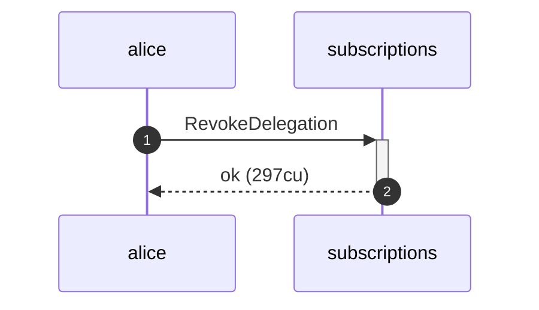

**RevokeDelegation (refund to sponsor): authority graph**

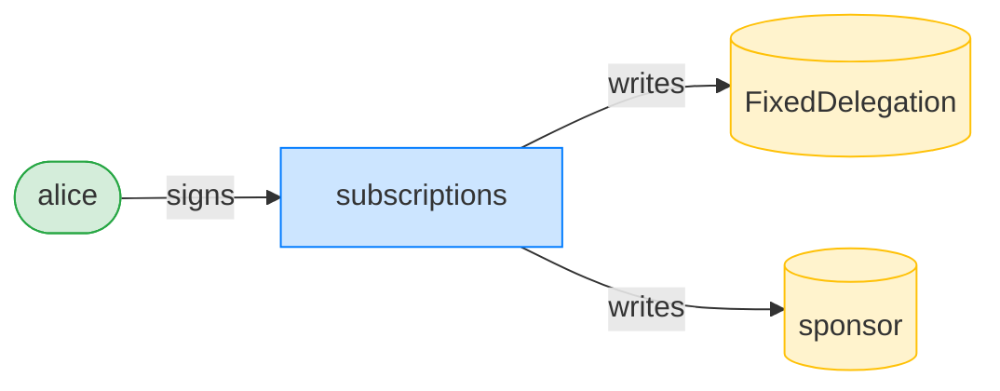

**RevokeDelegation (refund to sponsor): ownership graph**

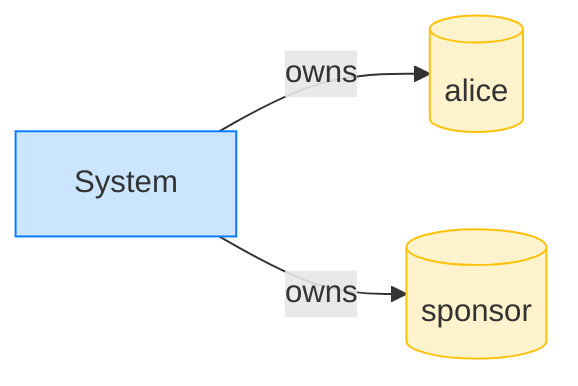

- [x] the sponsor was refunded the delegation rent: `true`
- [x] Alice paid the revoke fee: `true`
