## Create a fixed delegation with a zero expiry — PASS

> a zero expiry means no expiry; the delegatee can still pull later

**InitSubscriptionAuthority: structured CPI tree**

```text

── subscriptions::InitSubscriptionAuthority ────────────────
Transaction  signers=[alice]
└── subscriptions::InitSubscriptionAuthority [1] ✓ 12242cu  signer=alice
    ├── System::CreateAccount [2] ✓ (no cu)
    └── Token::Approve [2] ✓ 126cu
Compute Units (this run): 12242
Fee: 5000 lamports
Legend (2):
  subscriptions = De1egAFMkMWZSN5rYXRj9CAdheBamobVNubTsi9avR44
  alice         = FXddRd8CdAC8SWKT3Ataasn69R7rbTfQZcKg8ejyrUbF
```

**InitSubscriptionAuthority: sequence diagram**

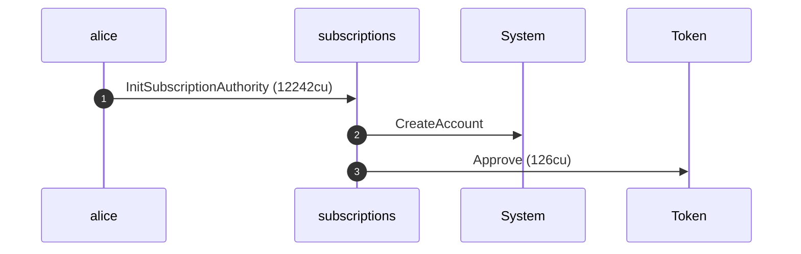

**InitSubscriptionAuthority: sequence diagram, with lifelines**

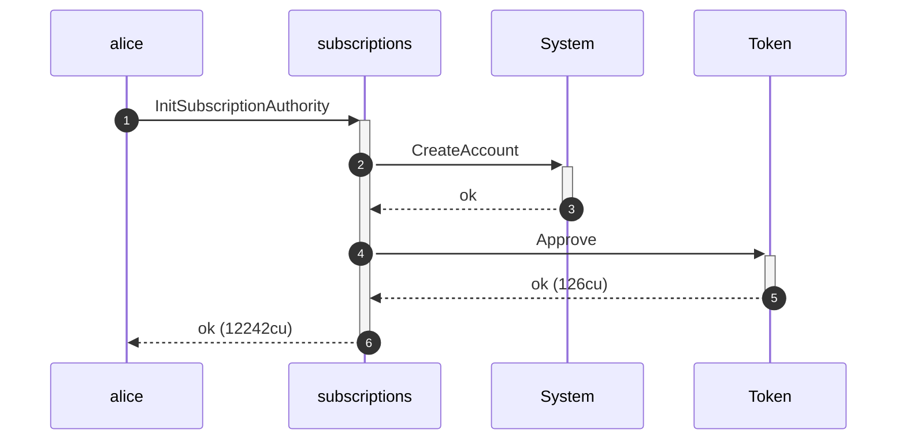

**InitSubscriptionAuthority: authority graph**

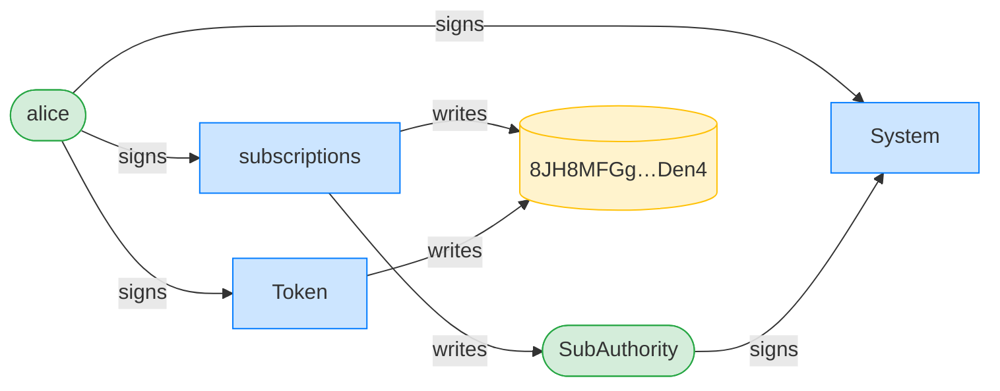

**InitSubscriptionAuthority: ownership graph**

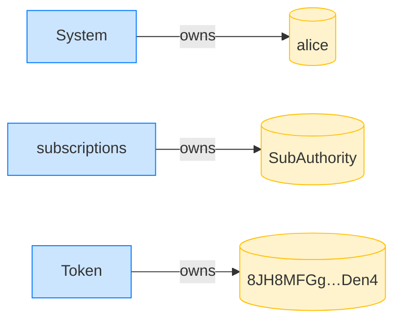

### Alice creates a fixed delegation with a zero (no-expiry) timestamp

**CreateFixedDelegation (zero expiry): structured CPI tree**

```text

── subscriptions::CreateFixedDelegation ────────────────────
Transaction  signers=[alice]
└── subscriptions::CreateFixedDelegation [1] ✓ 3536cu  signer=alice
    └── System::CreateAccount [2] ✓ (no cu)
Compute Units (this run): 3536
Fee: 5000 lamports
Legend (2):
  subscriptions = De1egAFMkMWZSN5rYXRj9CAdheBamobVNubTsi9avR44
  alice         = FXddRd8CdAC8SWKT3Ataasn69R7rbTfQZcKg8ejyrUbF
```

**CreateFixedDelegation (zero expiry): sequence diagram**

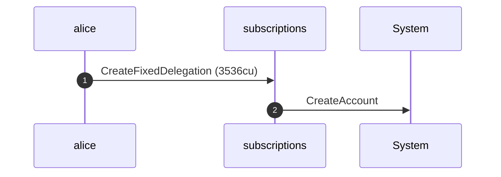

**CreateFixedDelegation (zero expiry): sequence diagram, with lifelines**

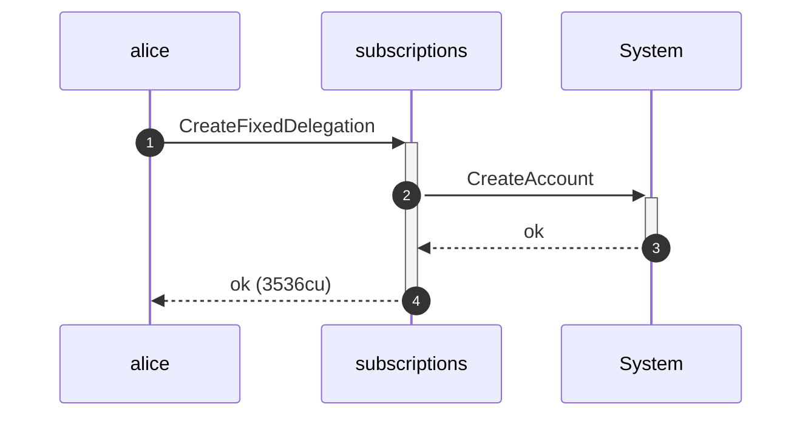

**CreateFixedDelegation (zero expiry): authority graph**

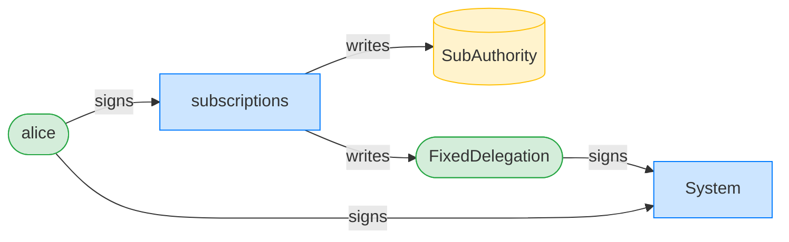

**CreateFixedDelegation (zero expiry): ownership graph**

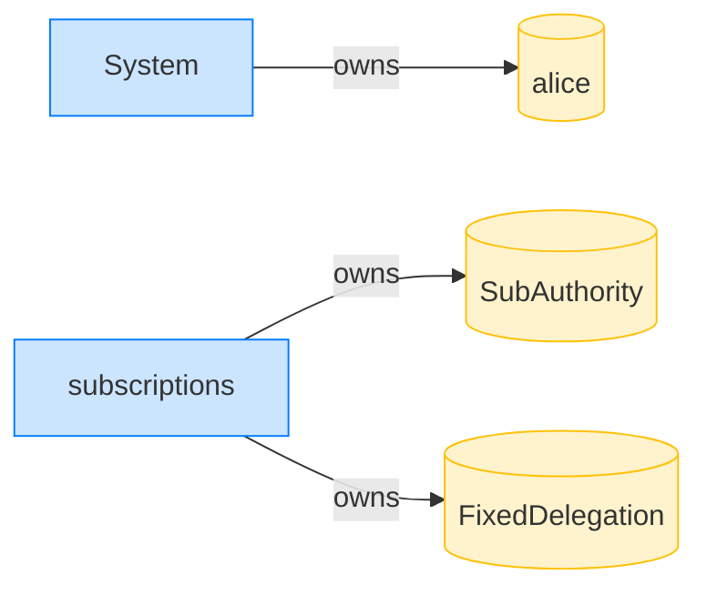

- [x] the stored expiry is zero: `0`

### Thirty days on, Bob pulls from the never-expiring delegation

**TransferFixed (after 30 days): structured CPI tree**

```text

── subscriptions::TransferFixed ────────────────────────────
Transaction  signers=[bob]
└── subscriptions::TransferFixed [1] ✓ 5552cu  signer=bob
    ├── Token::TransferChecked [2] ✓ 113cu
    └── subscriptions::EmitEvent [2] ✓ 137cu
Compute Units (this run): 5552
Fee: 5000 lamports
Legend (2):
  subscriptions = De1egAFMkMWZSN5rYXRj9CAdheBamobVNubTsi9avR44
  bob           = 9S8NPMnzAba71o3tr8dHDzUrfT5NesYFzP56QFpYieMR
```

**TransferFixed (after 30 days): sequence diagram**

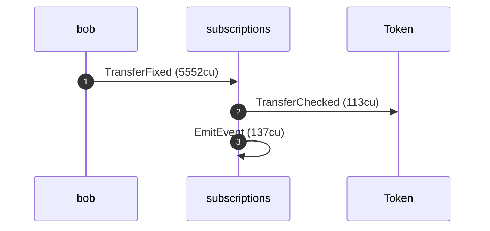

**TransferFixed (after 30 days): sequence diagram, with lifelines**

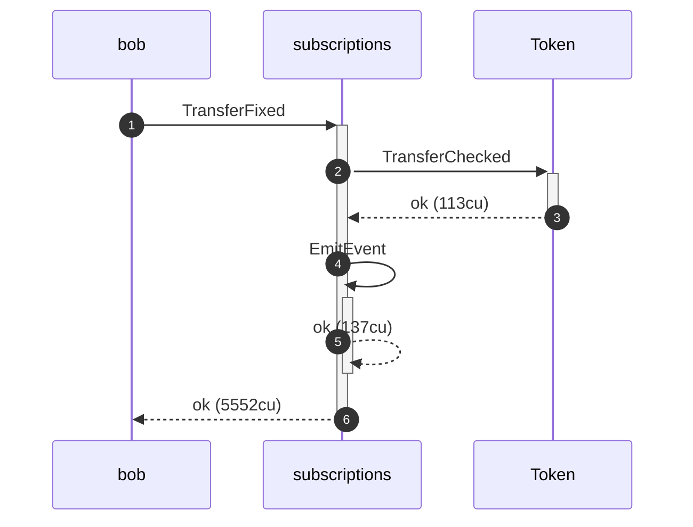

**TransferFixed (after 30 days): authority graph**

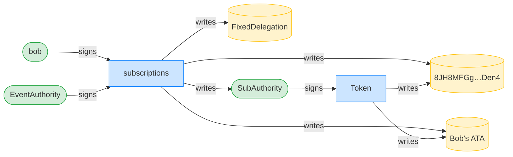

**TransferFixed (after 30 days): ownership graph**

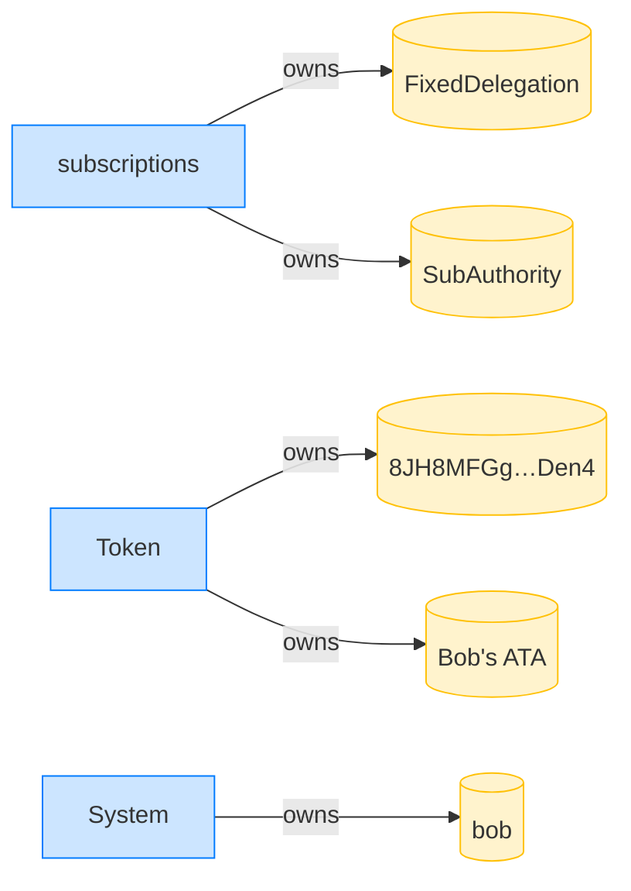

- [x] Bob received the pulled amount: `10000000`
