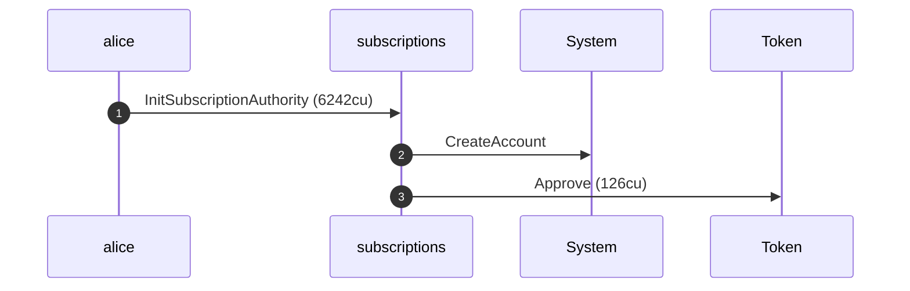
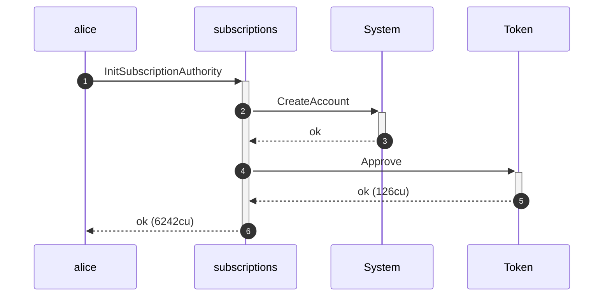
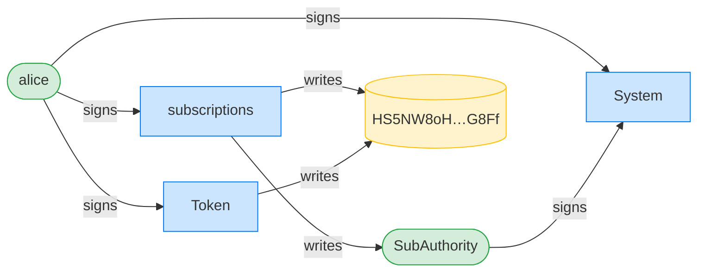
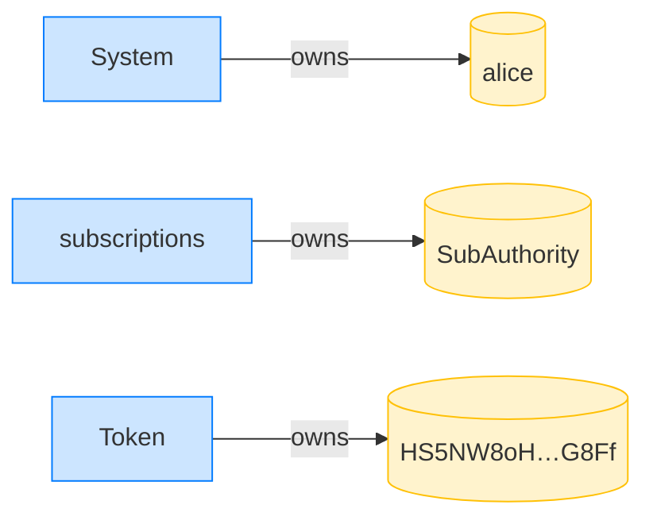
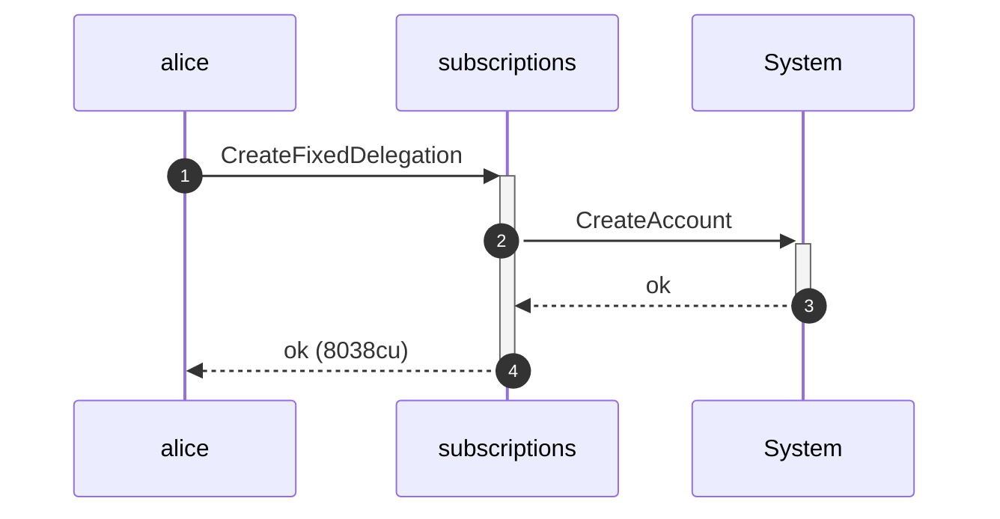
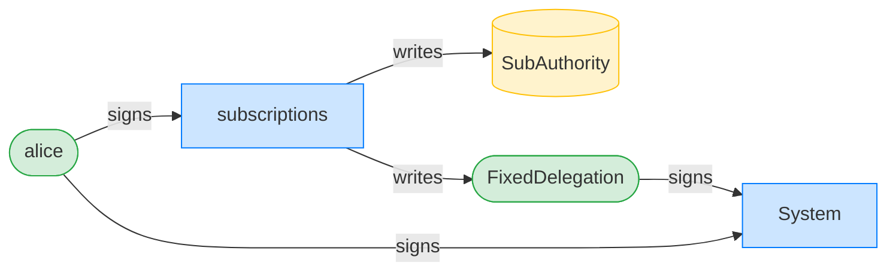
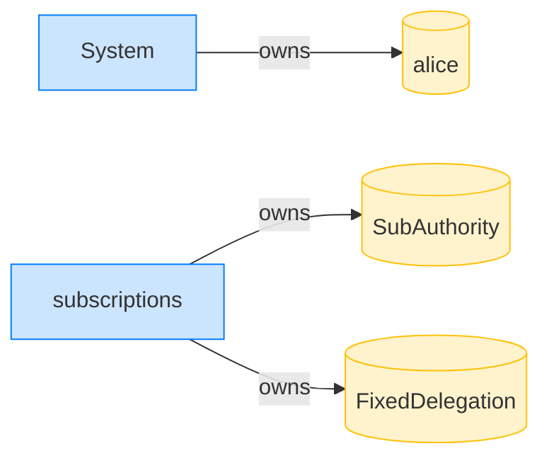

## Create a fixed delegation — PASS

> Alice grants a fixed-amount delegation to a delegatee

**InitSubscriptionAuthority: structured CPI tree**

```text

── subscriptions::InitSubscriptionAuthority ────────────────
Transaction  signers=[alice]
└── subscriptions::InitSubscriptionAuthority [1] ✓ 6242cu  signer=alice
    ├── System::CreateAccount [2] ✓ (no cu)
    └── Token::Approve [2] ✓ 126cu
Compute Units (this run): 6242
Fee: 5000 lamports
Legend (2):
  subscriptions = De1egAFMkMWZSN5rYXRj9CAdheBamobVNubTsi9avR44
  alice         = FXddRd8CdAC8SWKT3Ataasn69R7rbTfQZcKg8ejyrUbF
```

**InitSubscriptionAuthority: sequence diagram**



**InitSubscriptionAuthority: sequence diagram, with lifelines**



**InitSubscriptionAuthority: authority graph**



**InitSubscriptionAuthority: ownership graph**



### Alice creates the fixed delegation

**CreateFixedDelegation: structured CPI tree**

```text

── subscriptions::CreateFixedDelegation ────────────────────
Transaction  signers=[alice]
└── subscriptions::CreateFixedDelegation [1] ✓ 8038cu  signer=alice
    └── System::CreateAccount [2] ✓ (no cu)
Compute Units (this run): 8038
Fee: 5000 lamports
Legend (2):
  subscriptions = De1egAFMkMWZSN5rYXRj9CAdheBamobVNubTsi9avR44
  alice         = FXddRd8CdAC8SWKT3Ataasn69R7rbTfQZcKg8ejyrUbF
```

**CreateFixedDelegation: sequence diagram**


**CreateFixedDelegation: sequence diagram, with lifelines**



**CreateFixedDelegation: authority graph**



**CreateFixedDelegation: ownership graph**



- [x] the delegator is Alice: `FXddRd8CdAC8SWKT3Ataasn69R7rbTfQZcKg8ejyrUbF`
- [x] the delegatee matches: `1112SfG1kEpUmWTmhiu7tBdmjVaop95pMWjNZra4Jdo`
- [x] the account is tagged FixedDelegation: `2`
- [x] the delegated amount matches: `100000000`
- [x] the expiry matches: `1700086400`
