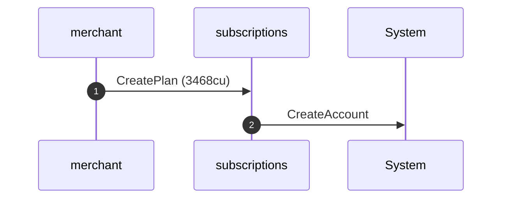
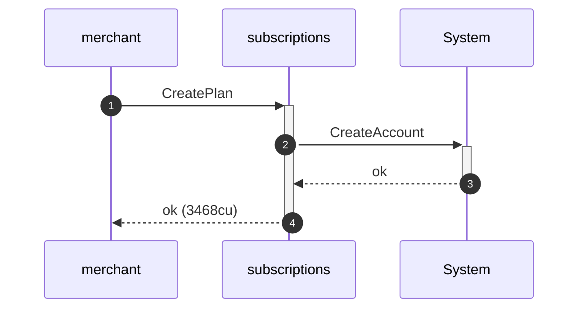
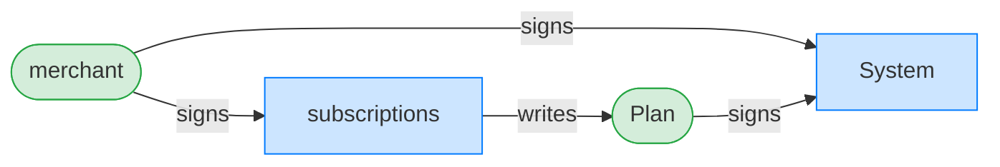
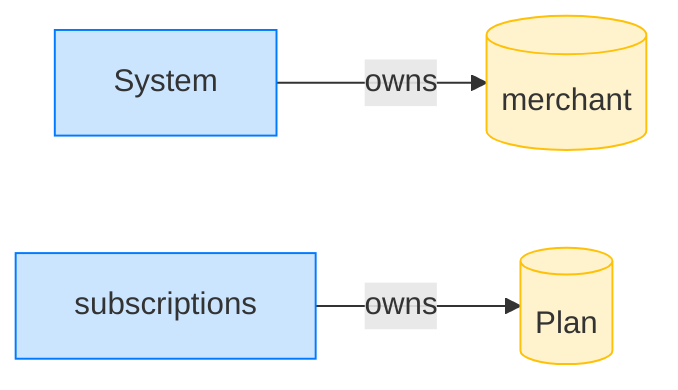

## Create a plan (happy path) — PASS

> the merchant creates a 30-day plan and every field is recorded

### The merchant creates plan 1

**CreatePlan: structured CPI tree**

```text

── subscriptions::CreatePlan ───────────────────────────────
Transaction  signers=[merchant]
└── subscriptions::CreatePlan [1] ✓ 3468cu  signer=merchant
    └── System::CreateAccount [2] ✓ (no cu)
Compute Units (this run): 3468
Fee: 5000 lamports
Legend (2):
  subscriptions = De1egAFMkMWZSN5rYXRj9CAdheBamobVNubTsi9avR44
  merchant      = J4fPsxKiTTKiXSiN9bgZ5JBrVgTM9c6N8tjhLN8gfdTq
```

**CreatePlan: sequence diagram**



**CreatePlan: sequence diagram, with lifelines**



**CreatePlan: authority graph**



**CreatePlan: ownership graph**



- [x] the plan owner is the merchant: `J4fPsxKiTTKiXSiN9bgZ5JBrVgTM9c6N8tjhLN8gfdTq`
- [x] the plan is Active: `1`
- [x] the plan id is 1: `1`
- [x] the plan mint is the USDC mint: `1113XAVvsq5j34NSfwNn2SsxbHrHNkV7CXUsM5GKFyS`
- [x] the amount is 1_000_000: `1000000`
- [x] the period is 720 hours: `720`
- [x] the end timestamp matches: `1702592000`
- [x] the first destination is recorded: `1113ZS586N6P2fz22uf4tGQvE5GyXLQNd8qyMcWD4xJ`
- [x] the first puller is recorded: `1113cr4pCWJsAD6WthPPo7fEKJn24Hv7bmrrRhnw3BX`
