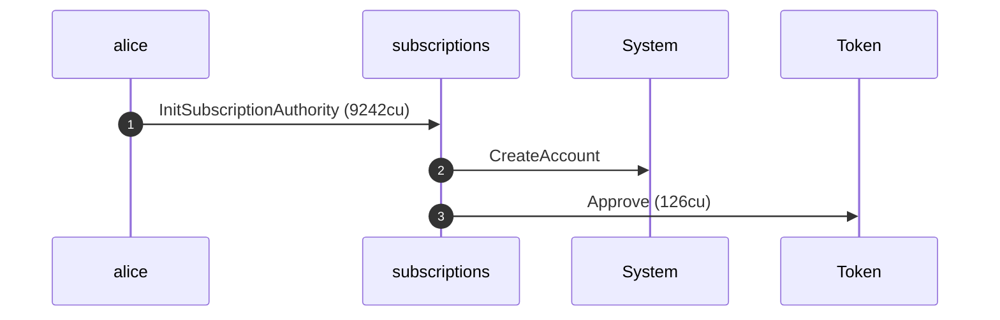
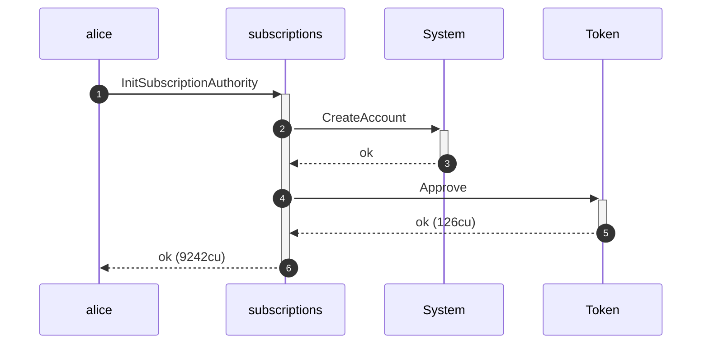
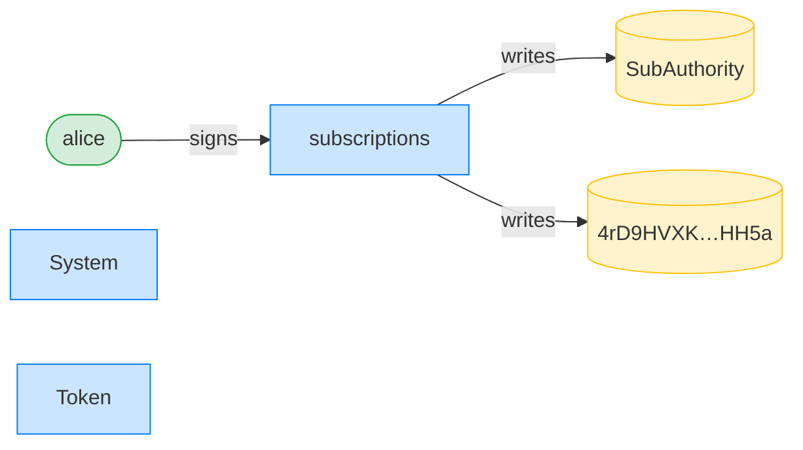
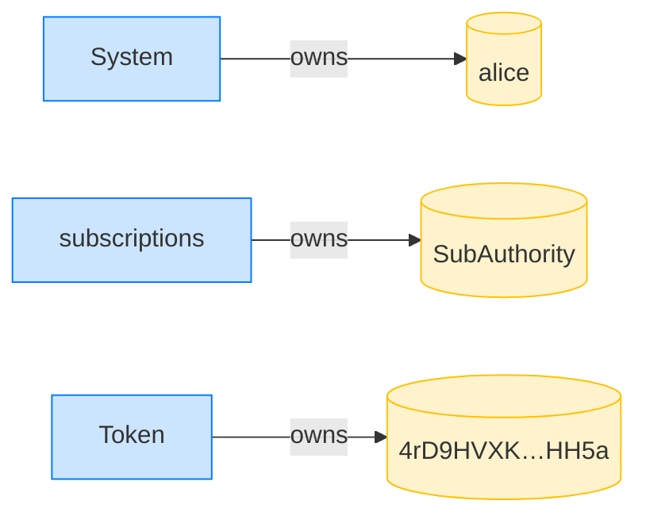
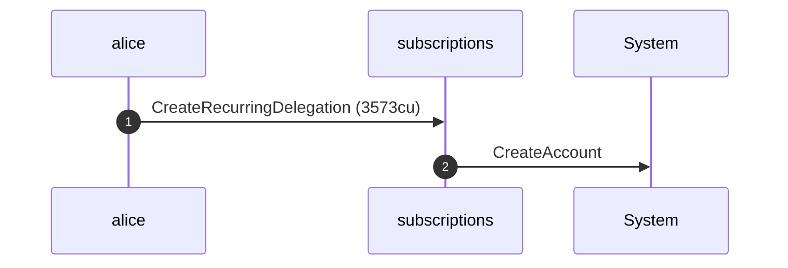
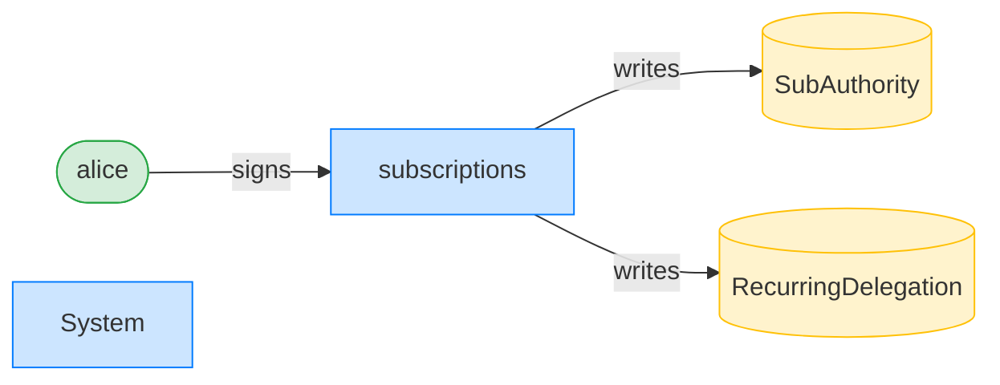
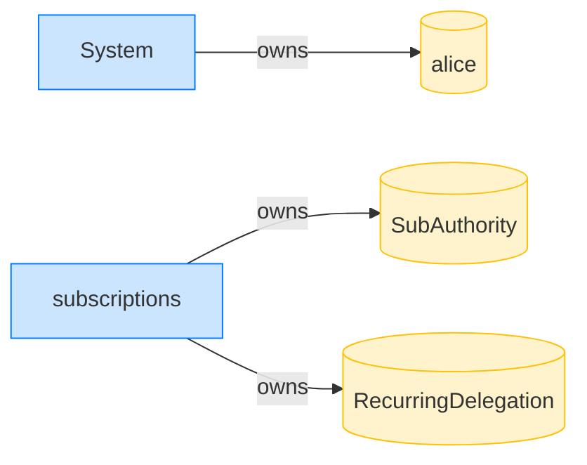

## Create a recurring delegation — PASS

> Alice grants a recurring pull delegation and its header and terms are recorded

### Alice initializes her subscription authority

**InitSubscriptionAuthority: structured CPI tree**

```text

Transaction  signers=[alice]
└── subscriptions::InitSubscriptionAuthority [1] ✓ 9242cu  signer=alice
    ├── System::CreateAccount [2] ✓ (no cu)
    └── Token::Approve [2] ✓ 126cu
Compute Units (this run): 9242
Fee: 5000 lamports
Legend (2):
  alice         = FXddRd8CdAC8SWKT3Ataasn69R7rbTfQZcKg8ejyrUbF
  subscriptions = De1egAFMkMWZSN5rYXRj9CAdheBamobVNubTsi9avR44
```

**InitSubscriptionAuthority: sequence diagram**



**InitSubscriptionAuthority: sequence diagram, with lifelines**



**InitSubscriptionAuthority: authority graph**



**InitSubscriptionAuthority: ownership graph**



### Alice creates the recurring delegation

**CreateRecurringDelegation: structured CPI tree**

```text

Transaction  signers=[alice]
└── subscriptions::CreateRecurringDelegation [1] ✓ 3573cu  signer=alice
    └── System::CreateAccount [2] ✓ (no cu)
Compute Units (this run): 3573
Fee: 5000 lamports
Legend (2):
  alice         = FXddRd8CdAC8SWKT3Ataasn69R7rbTfQZcKg8ejyrUbF
  subscriptions = De1egAFMkMWZSN5rYXRj9CAdheBamobVNubTsi9avR44
```

**CreateRecurringDelegation: sequence diagram**



**CreateRecurringDelegation: sequence diagram, with lifelines**


**CreateRecurringDelegation: authority graph**



**CreateRecurringDelegation: ownership graph**



- [x] the delegator is Alice: `FXddRd8CdAC8SWKT3Ataasn69R7rbTfQZcKg8ejyrUbF`
- [x] the delegatee is recorded: `11149So8KCEqNbf4ewskNB31ssGULFSWJ6N1iCTF7WZ`
- [x] the payer is Alice: `FXddRd8CdAC8SWKT3Ataasn69R7rbTfQZcKg8ejyrUbF`
- [x] the account is tagged RecurringDelegation: `3`
- [x] the per-period amount is recorded: `50000000`
- [x] the period length is recorded: `86400`
- [x] the expiry is recorded: `1700604800`
- [x] nothing has been pulled yet: `0`
- [x] the current period starts at the requested start: `1700000000`
