## Create multiple delegations at different nonces — PASS

> distinct nonces derive distinct delegation PDAs

**InitSubscriptionAuthority: structured CPI tree**

```text

Transaction  signers=[alice]
└── subscriptions::InitSubscriptionAuthority [1] ✓ 10742cu  signer=alice
    ├── System::CreateAccount [2] ✓ (no cu)
    └── Token::Approve [2] ✓ 126cu
Compute Units (this run): 10742
Fee: 5000 lamports
Legend (2):
  alice         = FXddRd8CdAC8SWKT3Ataasn69R7rbTfQZcKg8ejyrUbF
  subscriptions = De1egAFMkMWZSN5rYXRj9CAdheBamobVNubTsi9avR44
```

**InitSubscriptionAuthority: sequence diagram**

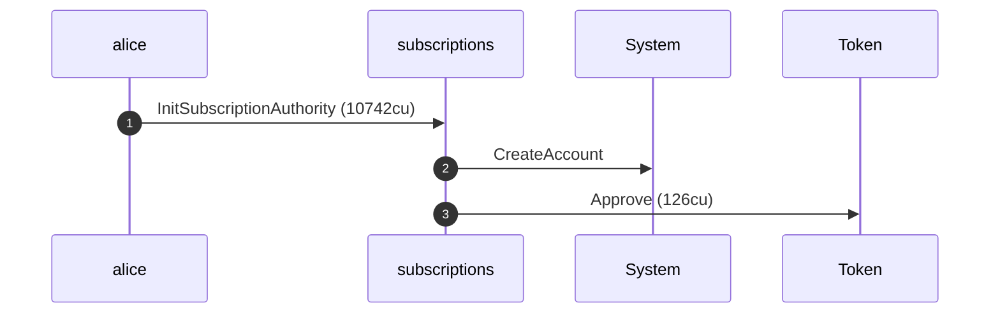

**InitSubscriptionAuthority: sequence diagram, with lifelines**

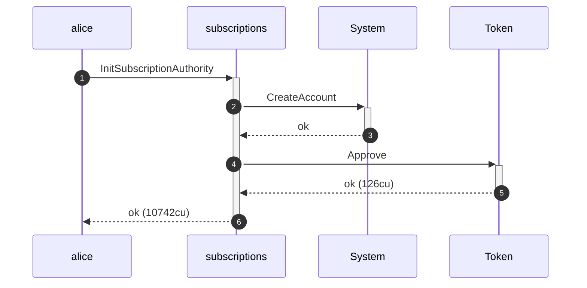

**InitSubscriptionAuthority: authority graph**

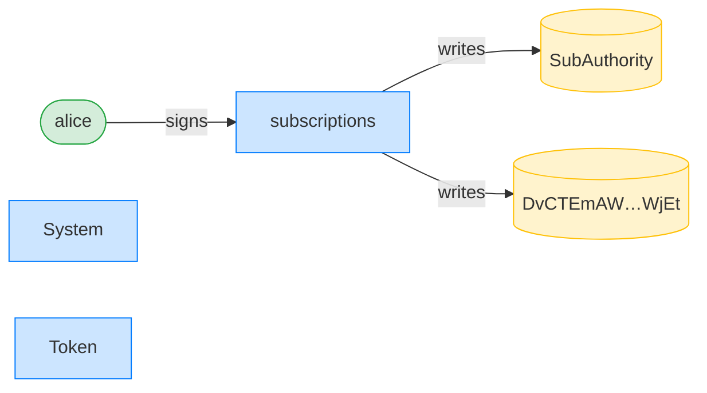

**InitSubscriptionAuthority: ownership graph**

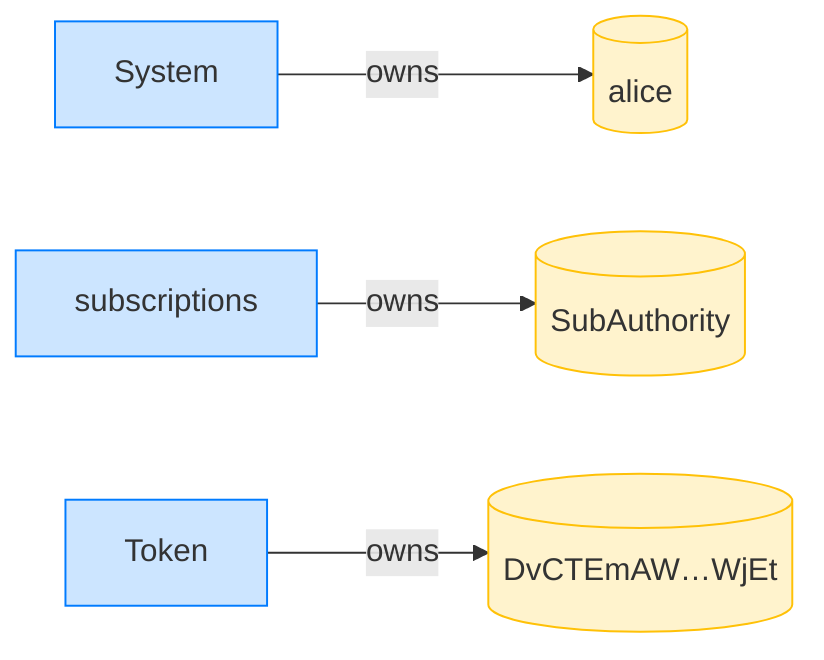

### Alice creates three delegations at nonces 0, 1, 2

**CreateFixedDelegation (nonce 0): structured CPI tree**

```text

Transaction  signers=[alice]
└── subscriptions::CreateFixedDelegation [1] ✓ 3538cu  signer=alice
    └── System::CreateAccount [2] ✓ (no cu)
Compute Units (this run): 3538
Fee: 5000 lamports
Legend (2):
  alice         = FXddRd8CdAC8SWKT3Ataasn69R7rbTfQZcKg8ejyrUbF
  subscriptions = De1egAFMkMWZSN5rYXRj9CAdheBamobVNubTsi9avR44
```

**CreateFixedDelegation (nonce 0): sequence diagram**

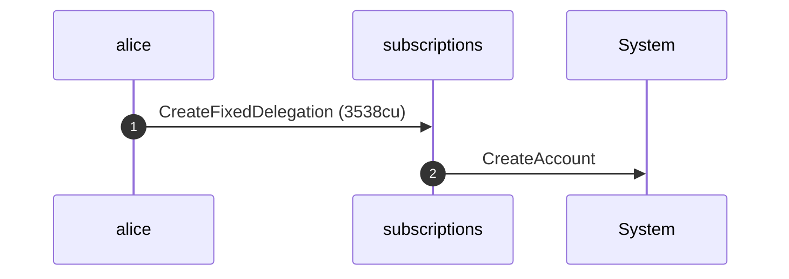

**CreateFixedDelegation (nonce 0): sequence diagram, with lifelines**

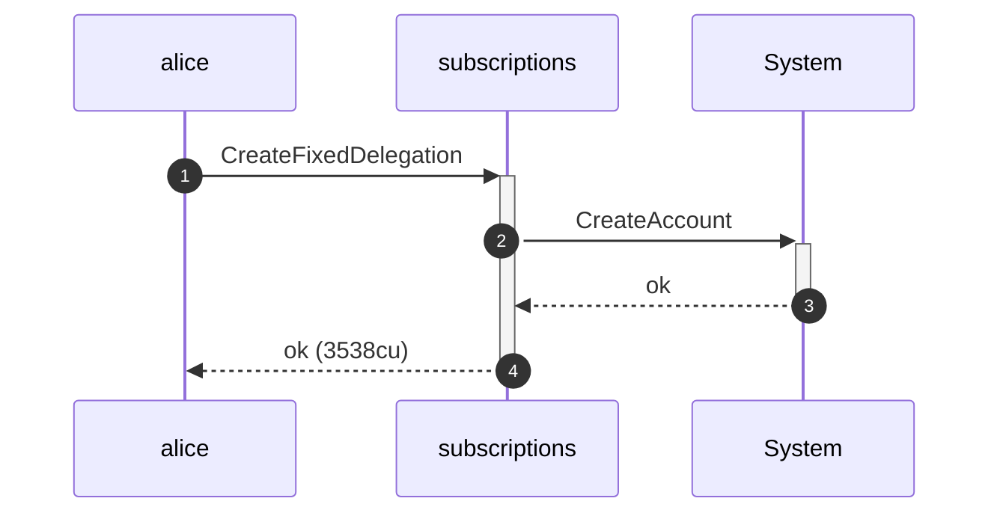

**CreateFixedDelegation (nonce 0): authority graph**

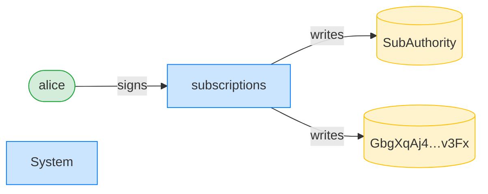

**CreateFixedDelegation (nonce 0): ownership graph**

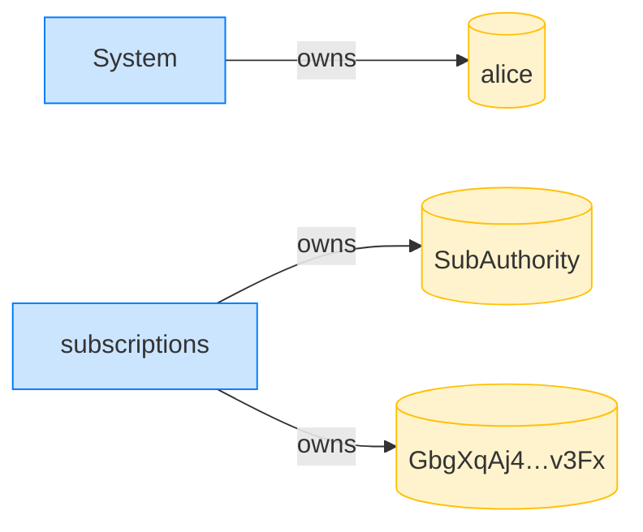

**CreateFixedDelegation (nonce 1): structured CPI tree**

```text

Transaction  signers=[alice]
└── subscriptions::CreateFixedDelegation [1] ✓ 3538cu  signer=alice
    └── System::CreateAccount [2] ✓ (no cu)
Compute Units (this run): 3538
Fee: 5000 lamports
Legend (2):
  alice         = FXddRd8CdAC8SWKT3Ataasn69R7rbTfQZcKg8ejyrUbF
  subscriptions = De1egAFMkMWZSN5rYXRj9CAdheBamobVNubTsi9avR44
```

**CreateFixedDelegation (nonce 1): sequence diagram**


**CreateFixedDelegation (nonce 1): sequence diagram, with lifelines**


**CreateFixedDelegation (nonce 1): authority graph**

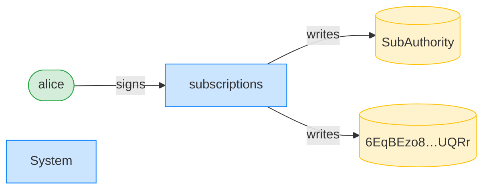

**CreateFixedDelegation (nonce 1): ownership graph**

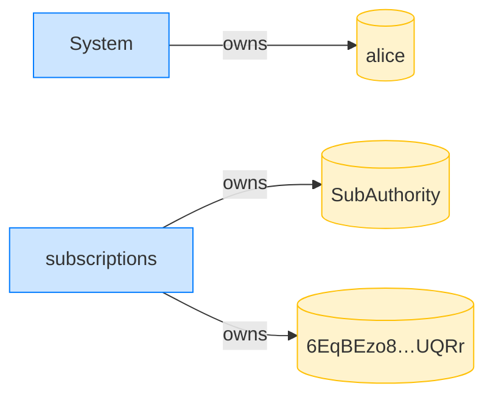

**CreateFixedDelegation (nonce 2): structured CPI tree**

```text

Transaction  signers=[alice]
└── subscriptions::CreateFixedDelegation [1] ✓ 6538cu  signer=alice
    └── System::CreateAccount [2] ✓ (no cu)
Compute Units (this run): 6538
Fee: 5000 lamports
Legend (2):
  alice         = FXddRd8CdAC8SWKT3Ataasn69R7rbTfQZcKg8ejyrUbF
  subscriptions = De1egAFMkMWZSN5rYXRj9CAdheBamobVNubTsi9avR44
```

**CreateFixedDelegation (nonce 2): sequence diagram**


**CreateFixedDelegation (nonce 2): sequence diagram, with lifelines**

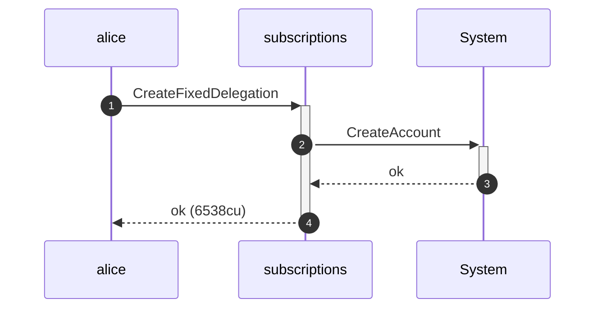

**CreateFixedDelegation (nonce 2): authority graph**

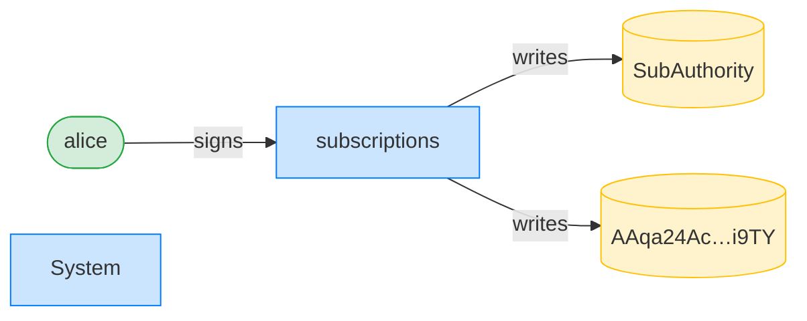

**CreateFixedDelegation (nonce 2): ownership graph**

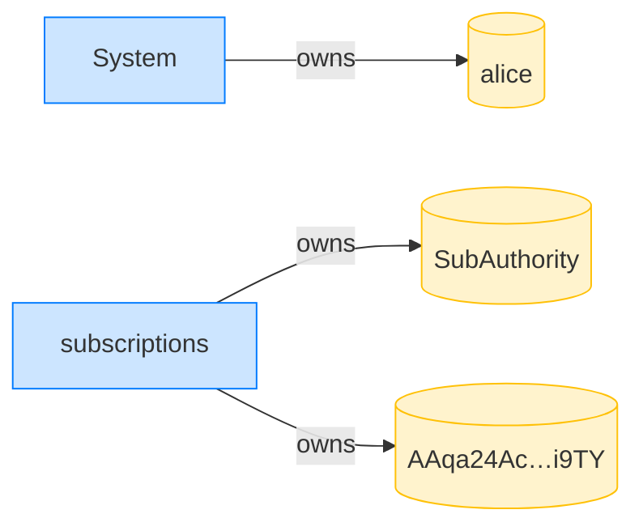

- [x] nonce 0 lands at the derived PDA: `GbgXqAj4AthPtiqiyQr9pnnTKbNvQWT59XWRGHzvv3Fx`
- [x] nonce 1 lands at the derived PDA: `6EqBEzo8osTHcpHKHEak5gN6nRiz1aBFhWQ4vdoRUQRr`
- [x] nonce 2 lands at the derived PDA: `AAqa24AcyBjzTBK2dvDwSRwhUSsJQywFDkPKS3mTi9TY`
