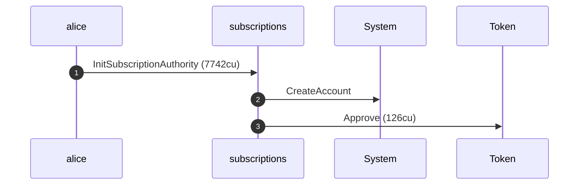
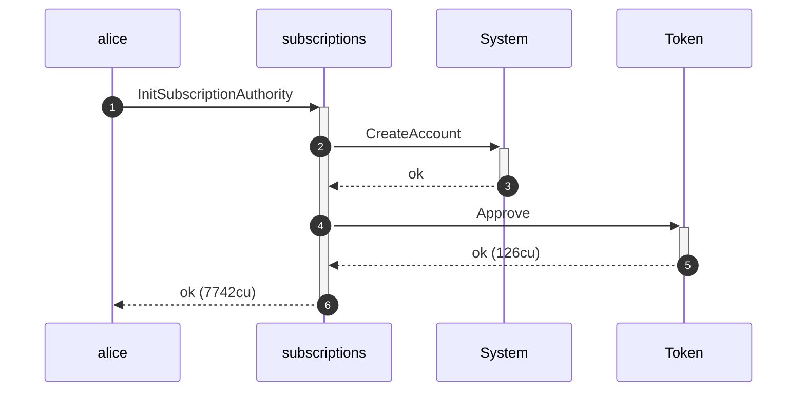
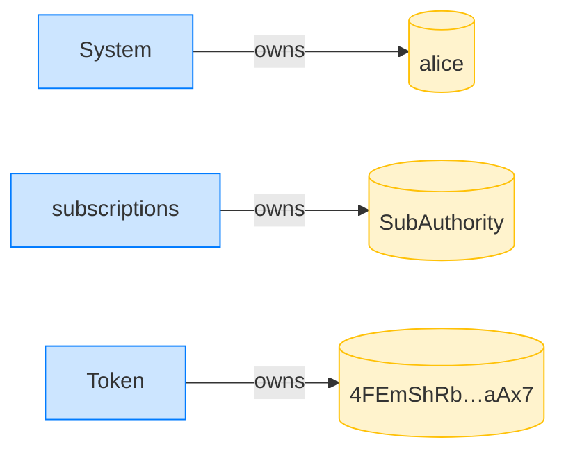
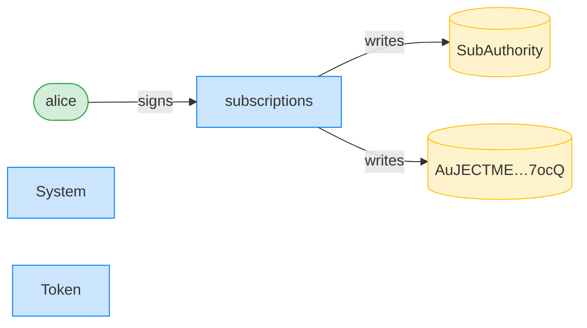
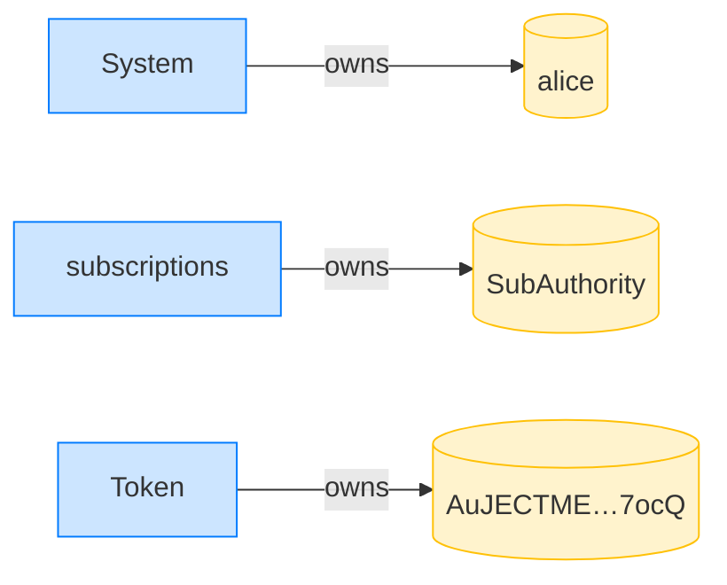
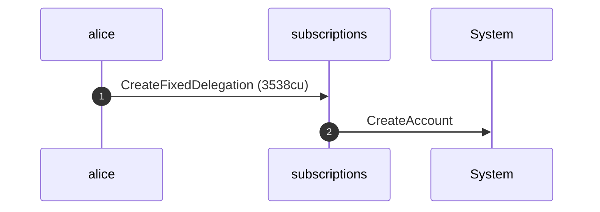
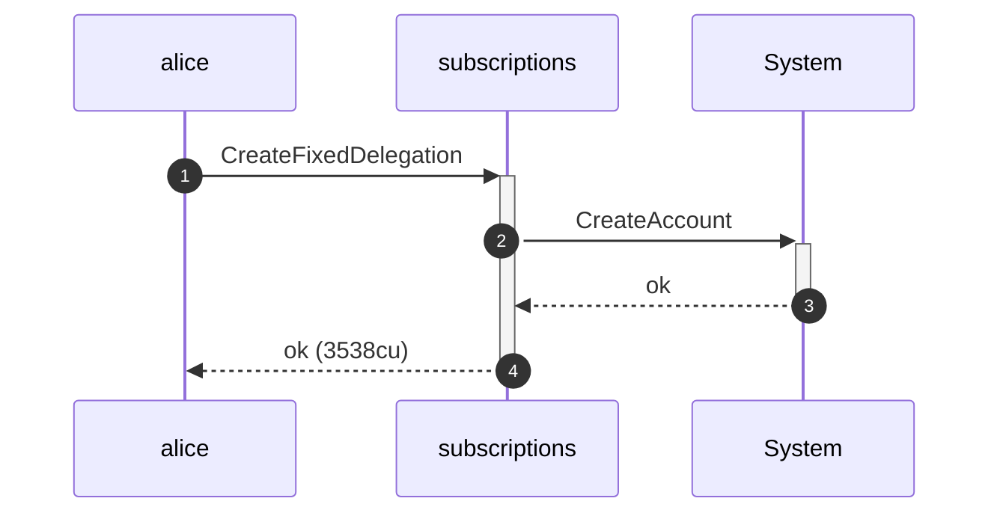
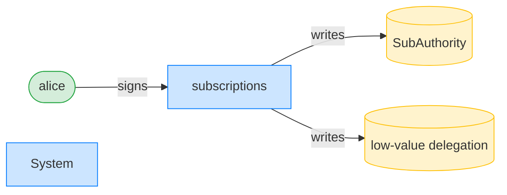
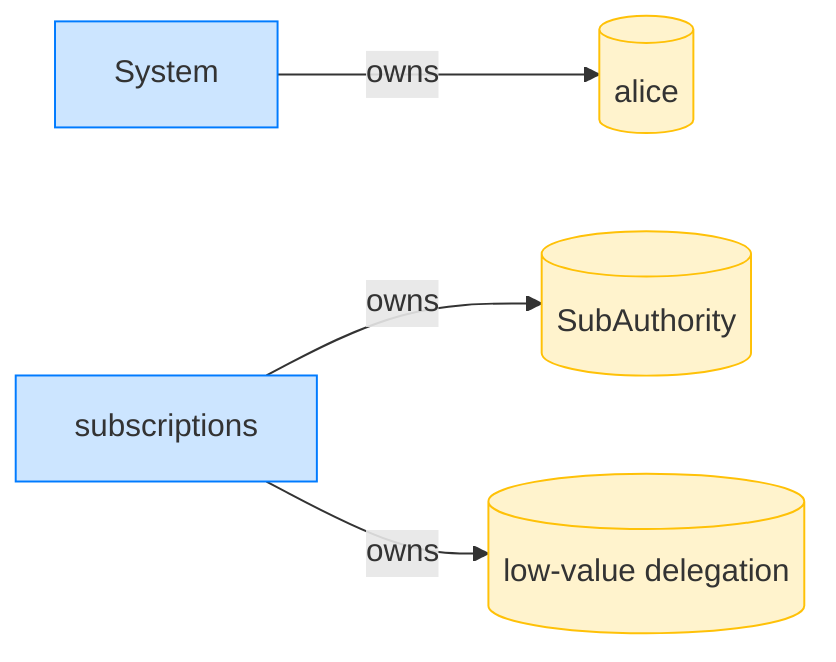

## Fixed delegation rejects a different-mint transfer — PASS

> a low-value delegation cannot be replayed against a high-value mint's accounts

### Stage: Alice's authority over both mints

**InitSubscriptionAuthority: structured CPI tree**

```text

Transaction  signers=[alice]
└── subscriptions::InitSubscriptionAuthority [1] ✓ 7742cu  signer=alice
    ├── System::CreateAccount [2] ✓ (no cu)
    └── Token::Approve [2] ✓ 126cu
Compute Units (this run): 7742
Fee: 5000 lamports
Legend (2):
  alice         = FXddRd8CdAC8SWKT3Ataasn69R7rbTfQZcKg8ejyrUbF
  subscriptions = De1egAFMkMWZSN5rYXRj9CAdheBamobVNubTsi9avR44
```

**InitSubscriptionAuthority: sequence diagram**



**InitSubscriptionAuthority: sequence diagram, with lifelines**



**InitSubscriptionAuthority: authority graph**


**InitSubscriptionAuthority: ownership graph**



**InitSubscriptionAuthority: structured CPI tree**

```text

Transaction  signers=[alice]
└── subscriptions::InitSubscriptionAuthority [1] ✓ 7742cu  signer=alice
    ├── System::CreateAccount [2] ✓ (no cu)
    └── Token::Approve [2] ✓ 126cu
Compute Units (this run): 7742
Fee: 5000 lamports
Legend (2):
  alice         = FXddRd8CdAC8SWKT3Ataasn69R7rbTfQZcKg8ejyrUbF
  subscriptions = De1egAFMkMWZSN5rYXRj9CAdheBamobVNubTsi9avR44
```

**InitSubscriptionAuthority: sequence diagram**


**InitSubscriptionAuthority: sequence diagram, with lifelines**


**InitSubscriptionAuthority: authority graph**



**InitSubscriptionAuthority: ownership graph**



**CreateFixedDelegation (low-value): structured CPI tree**

```text

Transaction  signers=[alice]
└── subscriptions::CreateFixedDelegation [1] ✓ 3538cu  signer=alice
    └── System::CreateAccount [2] ✓ (no cu)
Compute Units (this run): 3538
Fee: 5000 lamports
Legend (2):
  alice         = FXddRd8CdAC8SWKT3Ataasn69R7rbTfQZcKg8ejyrUbF
  subscriptions = De1egAFMkMWZSN5rYXRj9CAdheBamobVNubTsi9avR44
```

**CreateFixedDelegation (low-value): sequence diagram**



**CreateFixedDelegation (low-value): sequence diagram, with lifelines**



**CreateFixedDelegation (low-value): authority graph**



**CreateFixedDelegation (low-value): ownership graph**



### Bob replays the low-value delegation against the high-value mint; it is refused

**TransferFixed (mismatched mint): structured CPI tree**

```text

Transaction  signers=[bob]
└── subscriptions::TransferFixed [1] ✗ 699cu  signer=bob
    └── Error: InvalidDelegatePda
Error: InstructionError(0, Custom(126))
Compute Units (this run): 699
Fee: 5000 lamports
Legend (2):
  bob           = 9S8NPMnzAba71o3tr8dHDzUrfT5NesYFzP56QFpYieMR
  subscriptions = De1egAFMkMWZSN5rYXRj9CAdheBamobVNubTsi9avR44
```

- [x] Alice's high-value ATA is untouched: `100000000`
- [x] Bob's high-value ATA is empty: `0`
- [x] the low-value allowance is intact: `50000000`
