## Fixed transfer against a re-initialized authority is refused — PASS

> closing then re-initializing the authority bumps its init_id, staling the delegation

### Stage: Alice's authority and a fixed delegation to Bob

**InitSubscriptionAuthority: structured CPI tree**

```text

Transaction  signers=[alice]
└── subscriptions::InitSubscriptionAuthority [1] ✓ 7742cu  signer=alice
    ├── System [2] ✓ (no cu)
    └── Token [2] ✓ 126cu
Compute Units (this run): 7742
Fee: 5000 lamports
Legend (2):
  alice         = FXddRd8CdAC8SWKT3Ataasn69R7rbTfQZcKg8ejyrUbF
  subscriptions = De1egAFMkMWZSN5rYXRj9CAdheBamobVNubTsi9avR44
```

**InitSubscriptionAuthority: sequence diagram**

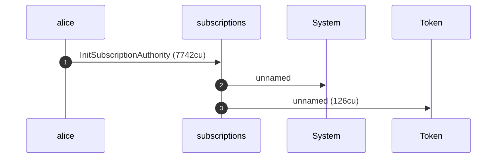

**InitSubscriptionAuthority: sequence diagram, with lifelines**

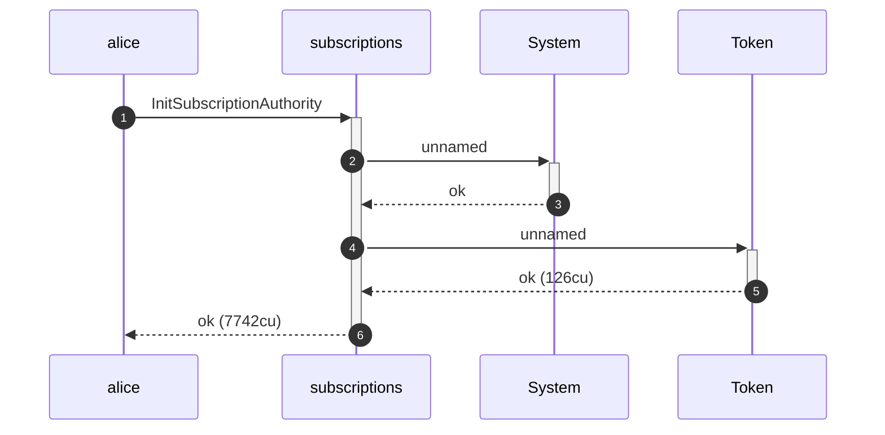

**InitSubscriptionAuthority: authority graph**

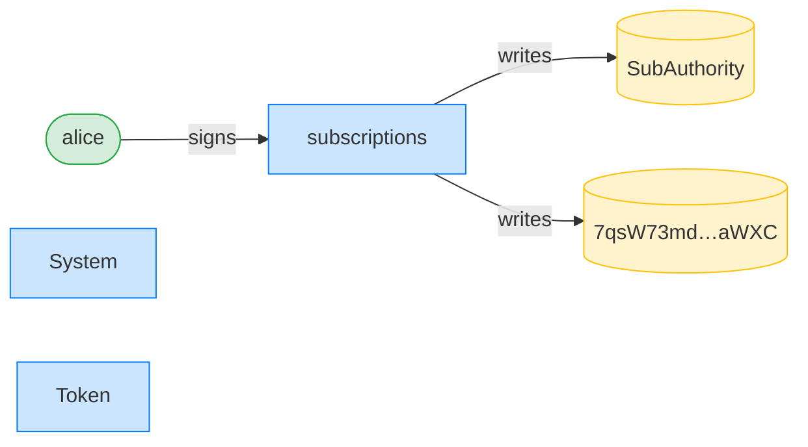

**InitSubscriptionAuthority: ownership graph**

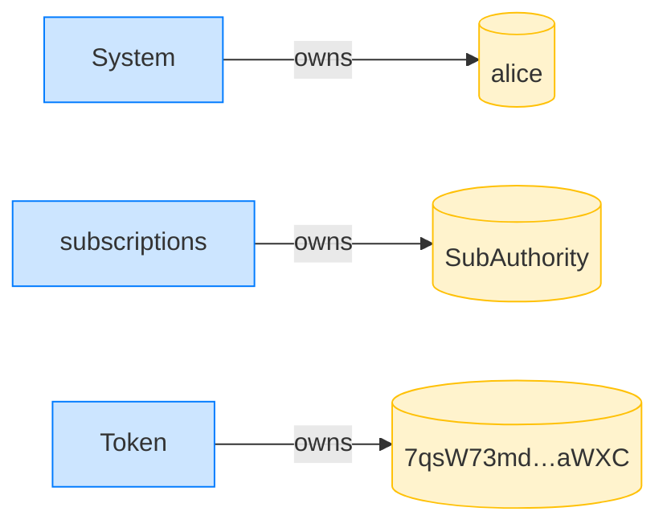

**CreateFixedDelegation: structured CPI tree**

```text

Transaction  signers=[alice]
└── subscriptions::CreateFixedDelegation [1] ✓ 3538cu  signer=alice
    └── System [2] ✓ (no cu)
Compute Units (this run): 3538
Fee: 5000 lamports
Legend (2):
  alice         = FXddRd8CdAC8SWKT3Ataasn69R7rbTfQZcKg8ejyrUbF
  subscriptions = De1egAFMkMWZSN5rYXRj9CAdheBamobVNubTsi9avR44
```

**CreateFixedDelegation: sequence diagram**

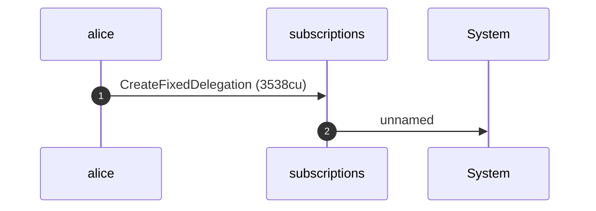

**CreateFixedDelegation: sequence diagram, with lifelines**

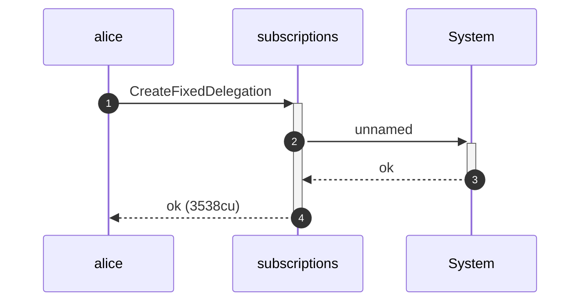

**CreateFixedDelegation: authority graph**

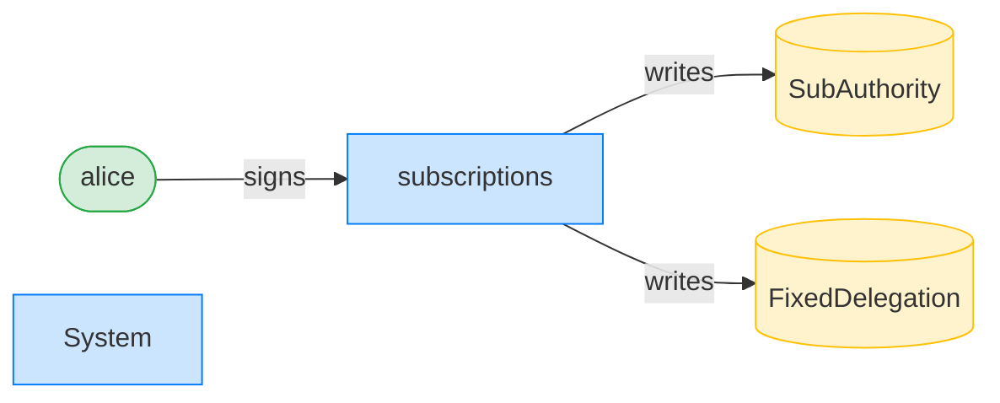

**CreateFixedDelegation: ownership graph**

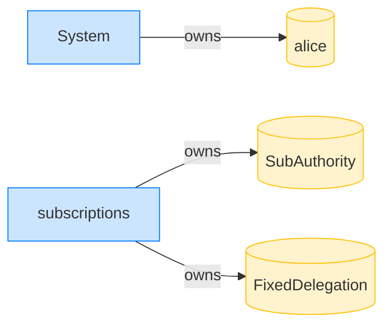

### Alice closes and re-initializes her authority, bumping its init_id

**CloseSubscriptionAuthority: structured CPI tree**

```text

Transaction  signers=[alice]
└── subscriptions::CloseSubscriptionAuthority [1] ✓ 1832cu  signer=alice
Compute Units (this run): 1832
Fee: 5000 lamports
Legend (2):
  alice         = FXddRd8CdAC8SWKT3Ataasn69R7rbTfQZcKg8ejyrUbF
  subscriptions = De1egAFMkMWZSN5rYXRj9CAdheBamobVNubTsi9avR44
```

**CloseSubscriptionAuthority: sequence diagram**

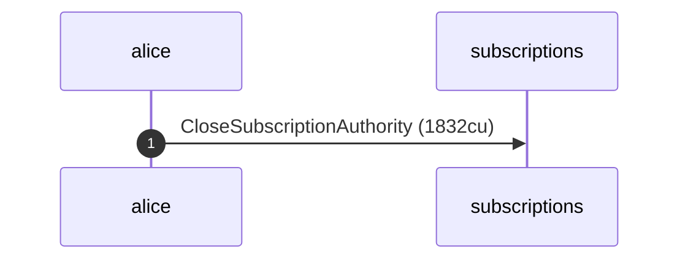

**CloseSubscriptionAuthority: sequence diagram, with lifelines**

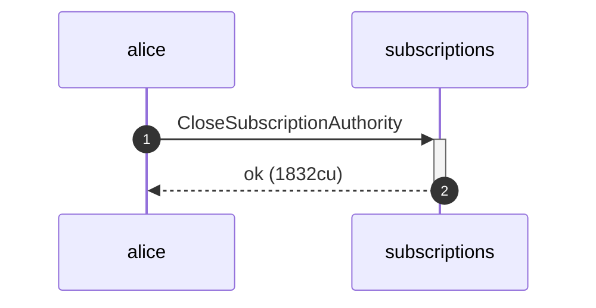

**CloseSubscriptionAuthority: authority graph**

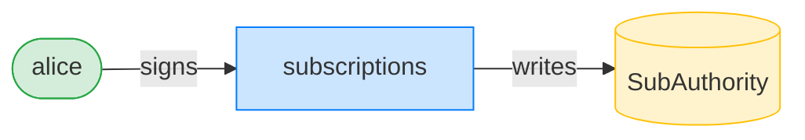

**CloseSubscriptionAuthority: ownership graph**

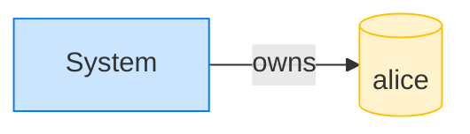

**InitSubscriptionAuthority: structured CPI tree**

```text

Transaction  signers=[alice]
└── subscriptions::InitSubscriptionAuthority [1] ✓ 7742cu  signer=alice
    ├── System [2] ✓ (no cu)
    └── Token [2] ✓ 126cu
Compute Units (this run): 7742
Fee: 5000 lamports
Legend (2):
  alice         = FXddRd8CdAC8SWKT3Ataasn69R7rbTfQZcKg8ejyrUbF
  subscriptions = De1egAFMkMWZSN5rYXRj9CAdheBamobVNubTsi9avR44
```

**InitSubscriptionAuthority: sequence diagram**


**InitSubscriptionAuthority: sequence diagram, with lifelines**


**InitSubscriptionAuthority: authority graph**


**InitSubscriptionAuthority: ownership graph**


### Bob pulls against the now-stale delegation; it is refused

**TransferFixed (stale authority): structured CPI tree**

```text

Transaction  signers=[bob]
└── subscriptions::TransferFixed [1] ✗ 1047cu  signer=bob
    └── Error: StaleSubscriptionAuthority
Error: InstructionError(0, Custom(136))
Compute Units (this run): 1047
Fee: 5000 lamports
Legend (2):
  bob           = 9S8NPMnzAba71o3tr8dHDzUrfT5NesYFzP56QFpYieMR
  subscriptions = De1egAFMkMWZSN5rYXRj9CAdheBamobVNubTsi9avR44
```

- [x] Alice's funds are untouched: `100000000`
- [x] Bob's ATA is empty: `0`

**RevokeDelegation: structured CPI tree**

```text

Transaction  signers=[alice]
└── subscriptions::RevokeDelegation [1] ✓ 267cu  signer=alice
Compute Units (this run): 267
Fee: 5000 lamports
Legend (2):
  alice         = FXddRd8CdAC8SWKT3Ataasn69R7rbTfQZcKg8ejyrUbF
  subscriptions = De1egAFMkMWZSN5rYXRj9CAdheBamobVNubTsi9avR44
```

**RevokeDelegation: sequence diagram**

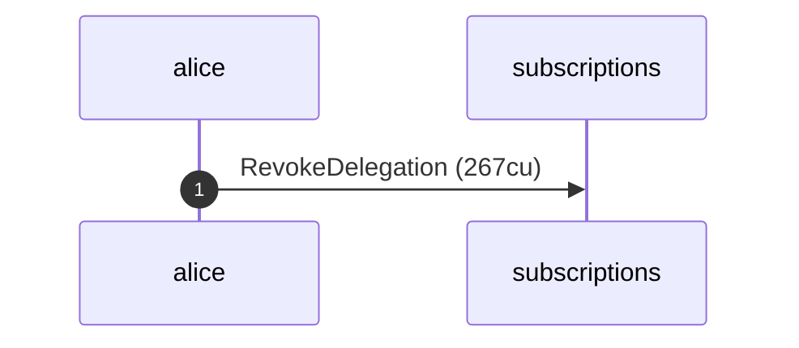

**RevokeDelegation: sequence diagram, with lifelines**

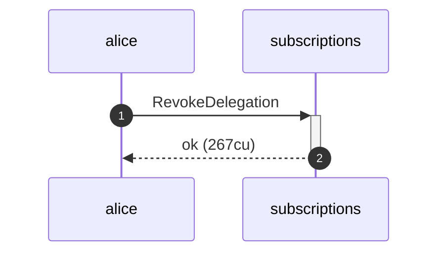

**RevokeDelegation: authority graph**

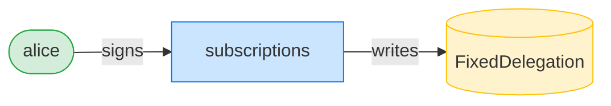

**RevokeDelegation: ownership graph**


