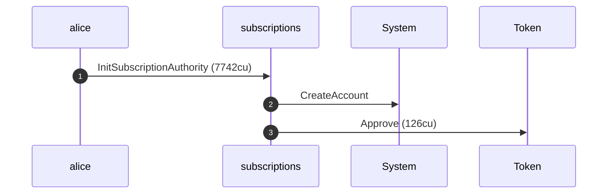
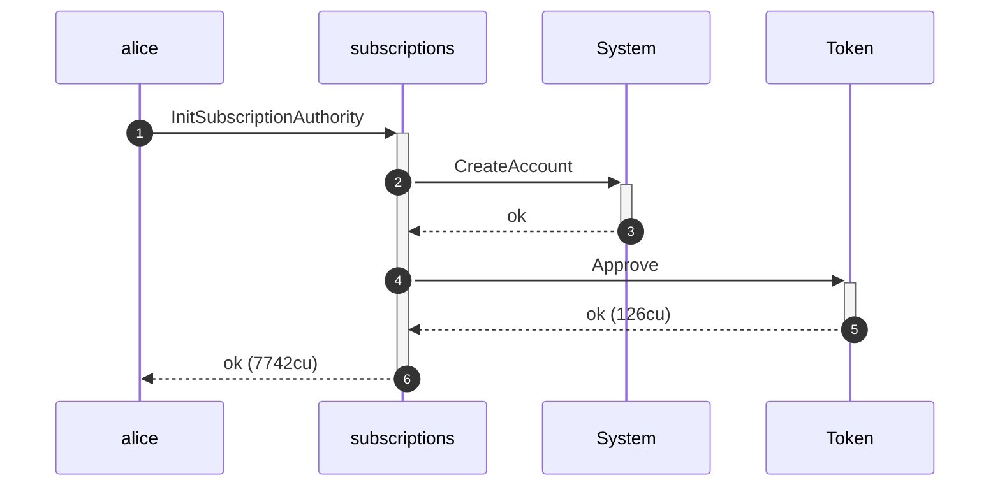
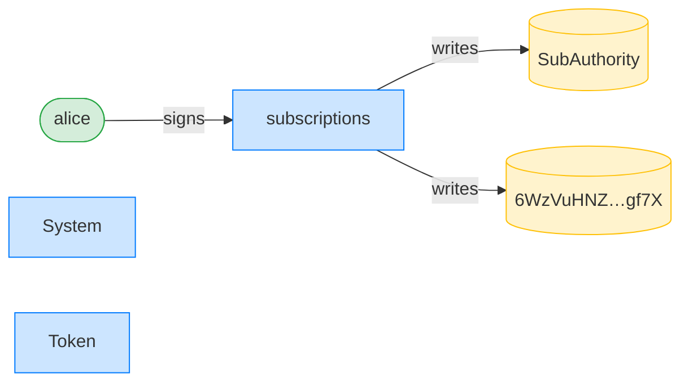
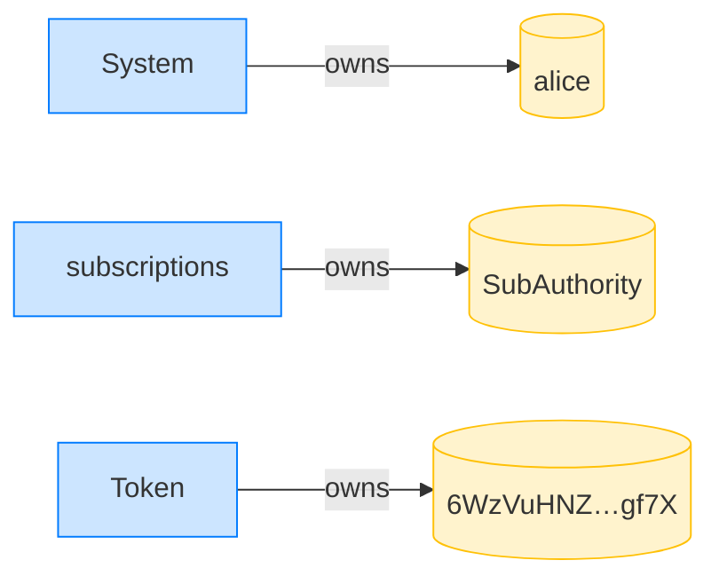
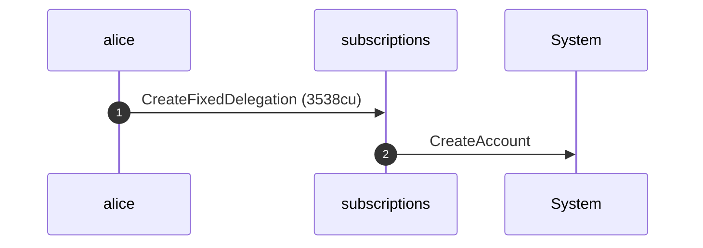
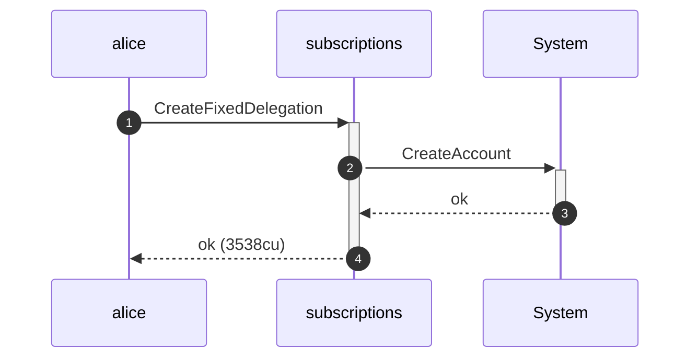
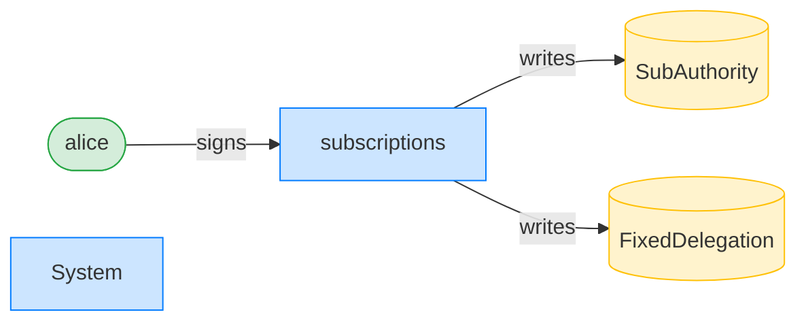
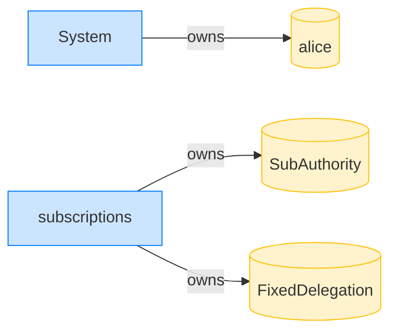

## Fixed transfer by the wrong signer is refused — PASS

> Mallory, who is not the delegatee, cannot pull against Bob's delegation

### Stage: Alice's authority and a fixed delegation to Bob

**InitSubscriptionAuthority: structured CPI tree**

```text

Transaction  signers=[alice]
└── subscriptions::InitSubscriptionAuthority [1] ✓ 7742cu  signer=alice
    ├── System::CreateAccount [2] ✓ (no cu)
    └── Token::Approve [2] ✓ 126cu
Compute Units (this run): 7742
Fee: 5000 lamports
Legend (2):
  alice         = FXddRd8CdAC8SWKT3Ataasn69R7rbTfQZcKg8ejyrUbF
  subscriptions = De1egAFMkMWZSN5rYXRj9CAdheBamobVNubTsi9avR44
```

**InitSubscriptionAuthority: sequence diagram**



**InitSubscriptionAuthority: sequence diagram, with lifelines**



**InitSubscriptionAuthority: authority graph**



**InitSubscriptionAuthority: ownership graph**



**CreateFixedDelegation: structured CPI tree**

```text

Transaction  signers=[alice]
└── subscriptions::CreateFixedDelegation [1] ✓ 3538cu  signer=alice
    └── System::CreateAccount [2] ✓ (no cu)
Compute Units (this run): 3538
Fee: 5000 lamports
Legend (2):
  alice         = FXddRd8CdAC8SWKT3Ataasn69R7rbTfQZcKg8ejyrUbF
  subscriptions = De1egAFMkMWZSN5rYXRj9CAdheBamobVNubTsi9avR44
```

**CreateFixedDelegation: sequence diagram**



**CreateFixedDelegation: sequence diagram, with lifelines**



**CreateFixedDelegation: authority graph**



**CreateFixedDelegation: ownership graph**



### Mallory, not the delegatee, tries to pull against the delegation

**TransferFixed (wrong signer): structured CPI tree**

```text

Transaction  signers=[mallory]
└── subscriptions::TransferFixed [1] ✗ 682cu  signer=mallory
    └── Error: Unauthorized
Error: InstructionError(0, Custom(130))
Compute Units (this run): 682
Fee: 5000 lamports
Legend (2):
  mallory       = DBSEUVB8mVMJYsFGED5gtoBUxDPN2FmQKs9KPiMxXoE8
  subscriptions = De1egAFMkMWZSN5rYXRj9CAdheBamobVNubTsi9avR44
```
