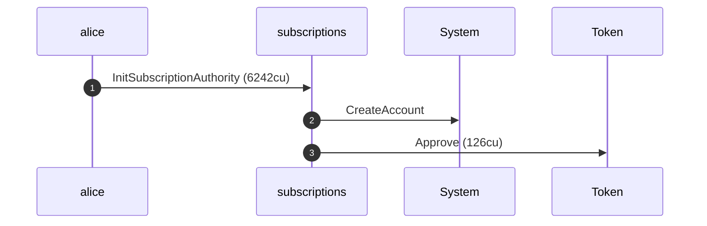
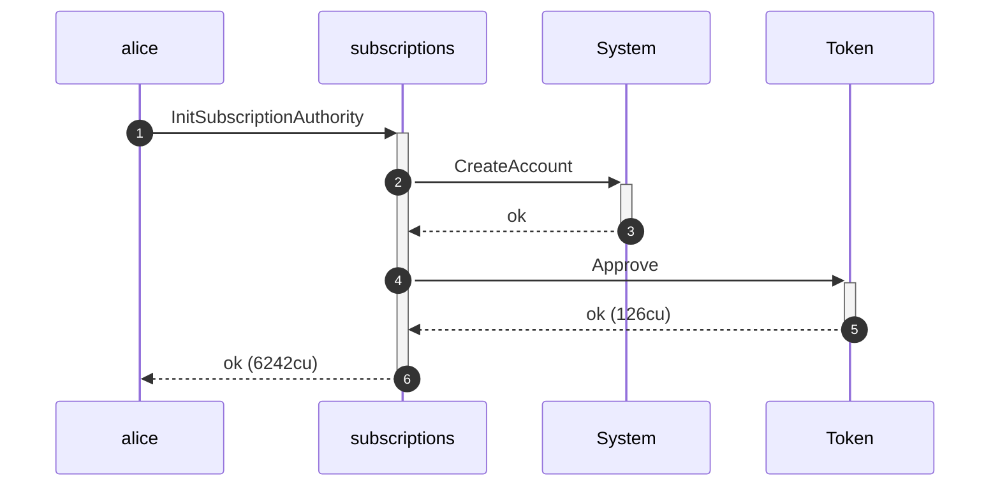
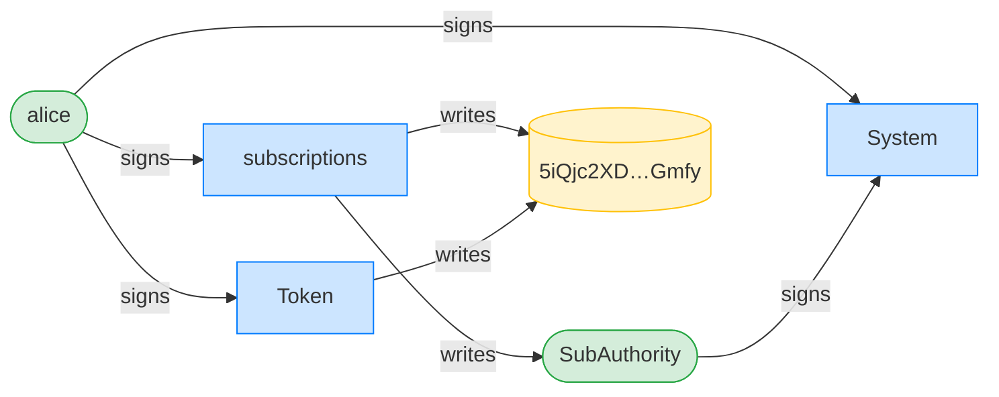
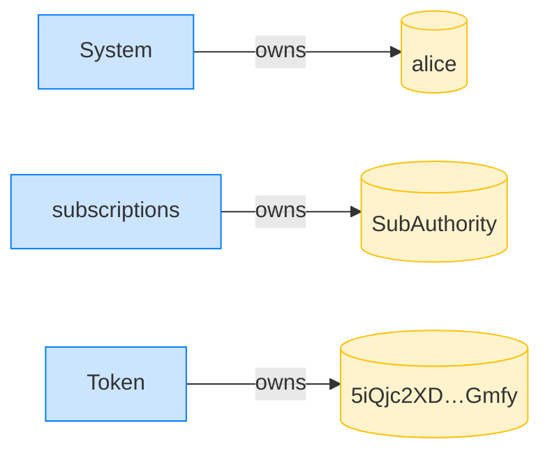
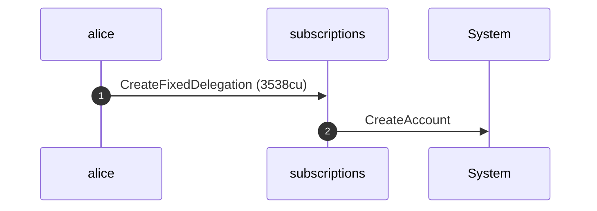
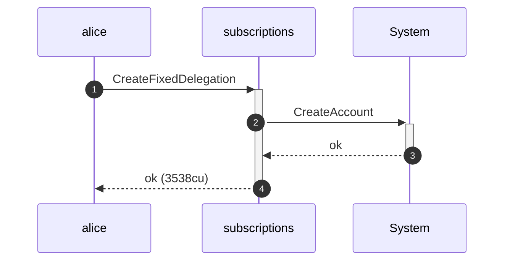
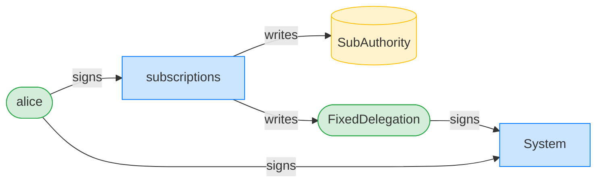
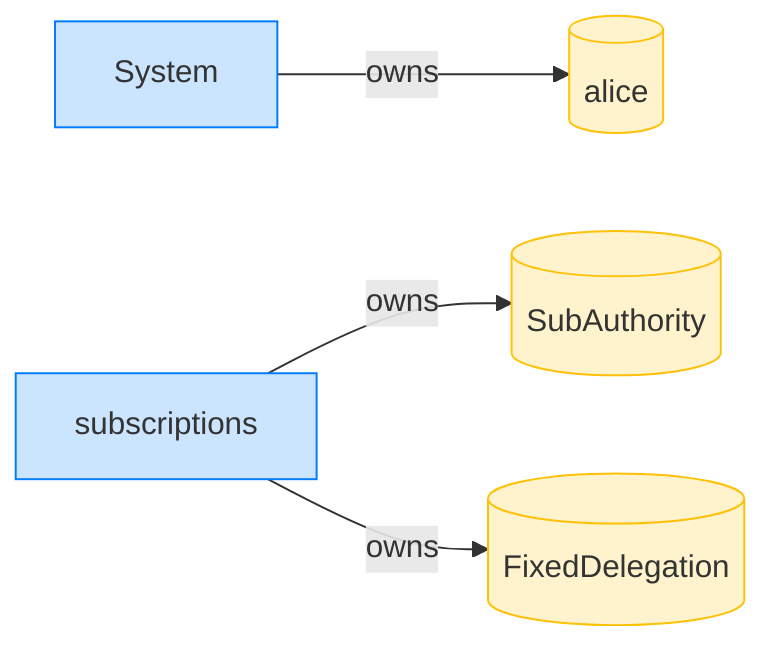

## Fixed transfer exceeding the allowance is refused — PASS

> a single pull for more than the full allowance is refused and leaves the delegation untouched

### Stage: Alice's authority and a fixed delegation to Bob

**InitSubscriptionAuthority: structured CPI tree**

```text

── subscriptions::InitSubscriptionAuthority ────────────────
Transaction  signers=[alice]
└── subscriptions::InitSubscriptionAuthority [1] ✓ 6242cu  signer=alice
    ├── System::CreateAccount [2] ✓ (no cu)
    └── Token::Approve [2] ✓ 126cu
Compute Units (this run): 6242
Fee: 5000 lamports
Legend (2):
  subscriptions = De1egAFMkMWZSN5rYXRj9CAdheBamobVNubTsi9avR44
  alice         = FXddRd8CdAC8SWKT3Ataasn69R7rbTfQZcKg8ejyrUbF
```

**InitSubscriptionAuthority: sequence diagram**



**InitSubscriptionAuthority: sequence diagram, with lifelines**



**InitSubscriptionAuthority: authority graph**



**InitSubscriptionAuthority: ownership graph**



**CreateFixedDelegation: structured CPI tree**

```text

── subscriptions::CreateFixedDelegation ────────────────────
Transaction  signers=[alice]
└── subscriptions::CreateFixedDelegation [1] ✓ 3538cu  signer=alice
    └── System::CreateAccount [2] ✓ (no cu)
Compute Units (this run): 3538
Fee: 5000 lamports
Legend (2):
  subscriptions = De1egAFMkMWZSN5rYXRj9CAdheBamobVNubTsi9avR44
  alice         = FXddRd8CdAC8SWKT3Ataasn69R7rbTfQZcKg8ejyrUbF
```

**CreateFixedDelegation: sequence diagram**



**CreateFixedDelegation: sequence diagram, with lifelines**



**CreateFixedDelegation: authority graph**



**CreateFixedDelegation: ownership graph**



- [x] Bob's ATA starts empty: `0`

### Bob tries to pull 60 tokens against a 50-token allowance

**TransferFixed (exceeds allowance): structured CPI tree**

```text

── subscriptions::TransferFixed ────────────────────────────
Transaction  signers=[bob]
└── subscriptions::TransferFixed [1] ✗ 874cu  signer=bob
    └── Error: AmountExceedsLimit (0x12c)
Error: InstructionError(0, Custom(300))
Compute Units (this run): 874
Fee: 5000 lamports
Legend (2):
  subscriptions = De1egAFMkMWZSN5rYXRj9CAdheBamobVNubTsi9avR44
  bob           = 9S8NPMnzAba71o3tr8dHDzUrfT5NesYFzP56QFpYieMR
```

- [x] Bob's ATA is still empty: `0`
- [x] the full allowance is intact: `50000000`
