## Fixed transfer over a Token-2022 active transfer-hook mint — PASS

> a transfer without the hook accounts fails; with them, the hook runs and the transfer succeeds

### Stage: Alice's authority and a fixed delegation to Bob

**InitSubscriptionAuthority: structured CPI tree**

```text

── subscriptions::Approve ──────────────────────────────────
Transaction  signers=[alice]
└── subscriptions::InitSubscriptionAuthority [1] ✓ 15012cu  signer=alice
    ├── System::CreateAccount [2] ✓ (no cu)
    └── Token-2022::Approve [2] ✓ 1098cu
Compute Units (this run): 15012
Fee: 5000 lamports
Legend (2):
  subscriptions = De1egAFMkMWZSN5rYXRj9CAdheBamobVNubTsi9avR44
  alice         = FXddRd8CdAC8SWKT3Ataasn69R7rbTfQZcKg8ejyrUbF
```

**InitSubscriptionAuthority: sequence diagram**

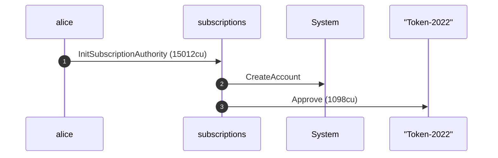

**InitSubscriptionAuthority: sequence diagram, with lifelines**

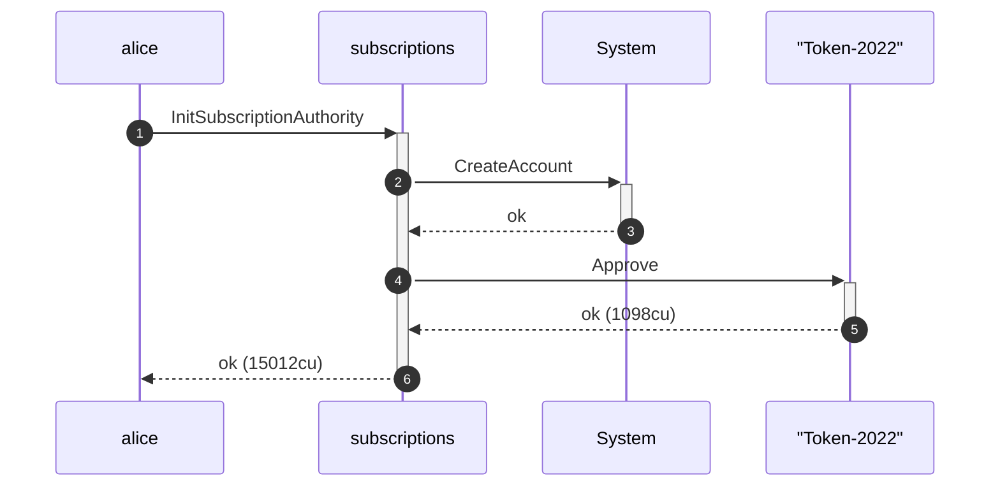

**InitSubscriptionAuthority: authority graph**

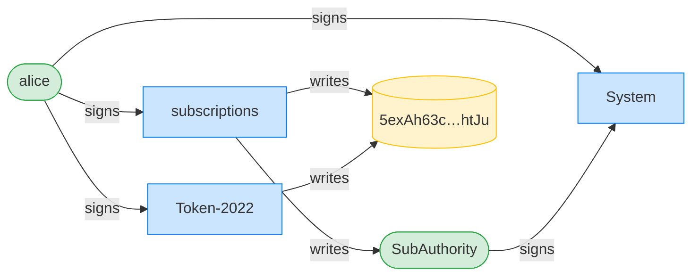

**InitSubscriptionAuthority: ownership graph**

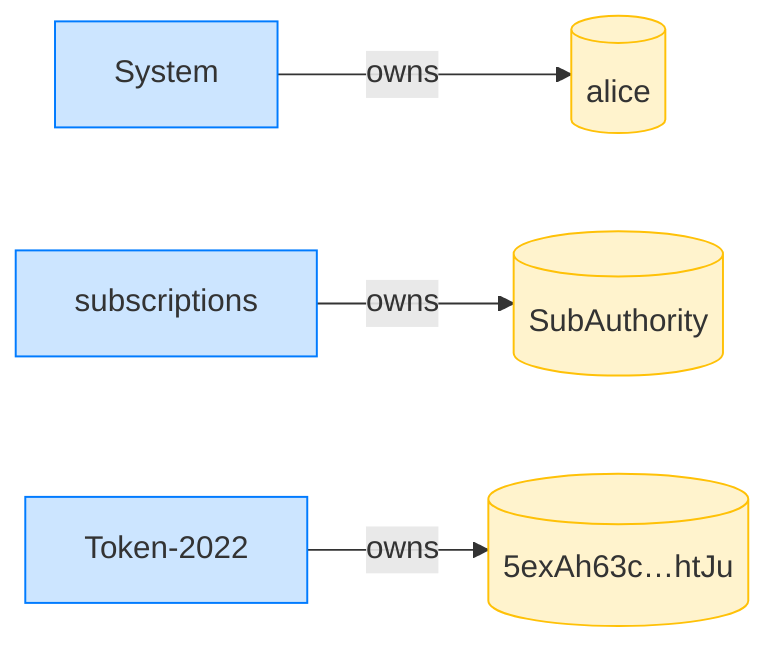

**CreateFixedDelegation: structured CPI tree**

```text

── subscriptions::CreateFixedDelegation ────────────────────
Transaction  signers=[alice]
└── subscriptions::CreateFixedDelegation [1] ✓ 17038cu  signer=alice
    └── System::CreateAccount [2] ✓ (no cu)
Compute Units (this run): 17038
Fee: 5000 lamports
Legend (2):
  subscriptions = De1egAFMkMWZSN5rYXRj9CAdheBamobVNubTsi9avR44
  alice         = FXddRd8CdAC8SWKT3Ataasn69R7rbTfQZcKg8ejyrUbF
```

**CreateFixedDelegation: sequence diagram**

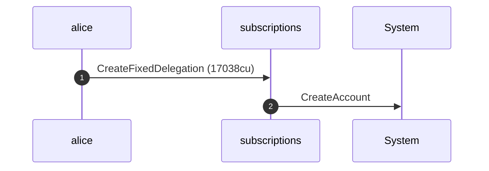

**CreateFixedDelegation: sequence diagram, with lifelines**

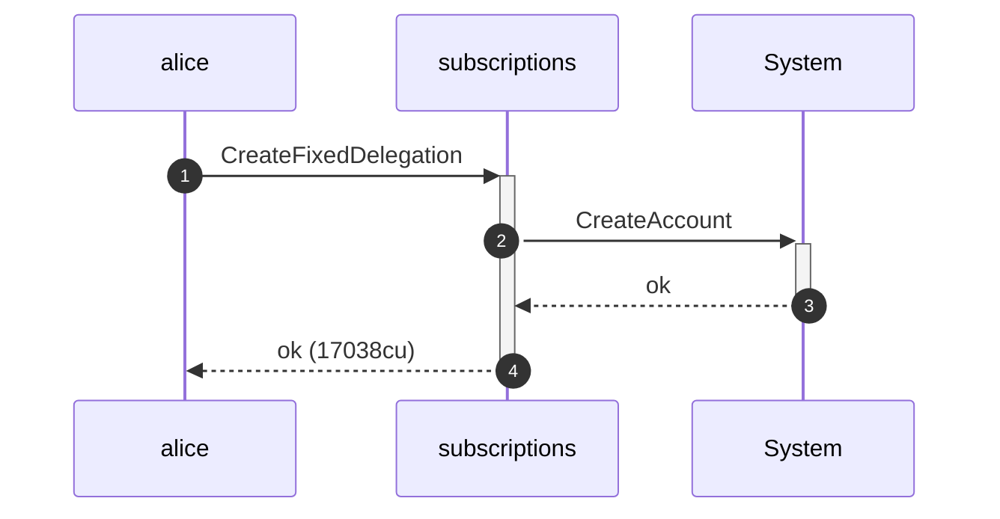

**CreateFixedDelegation: authority graph**

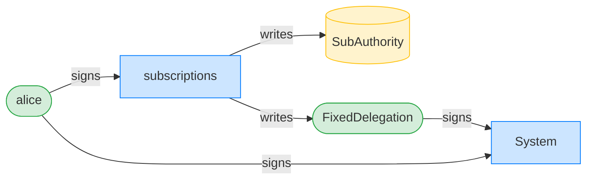

**CreateFixedDelegation: ownership graph**

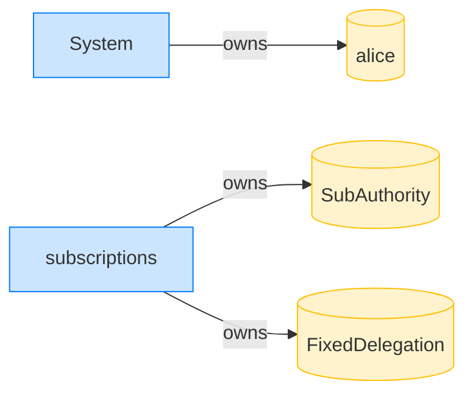

### Bob pulls without supplying the hook accounts; the transfer is refused

**TransferFixed (missing hook accounts): structured CPI tree**

```text

── subscriptions::TransferFixed ────────────────────────────
Transaction  signers=[bob]
└── subscriptions::TransferFixed [1] ✗ 7686cu  signer=bob
    └── Error: TransferHookValidationAccountMissing (0x8a)
Error: InstructionError(0, Custom(138))
Compute Units (this run): 7686
Fee: 5000 lamports
Legend (2):
  subscriptions = De1egAFMkMWZSN5rYXRj9CAdheBamobVNubTsi9avR44
  bob           = 9S8NPMnzAba71o3tr8dHDzUrfT5NesYFzP56QFpYieMR
```

- [x] Bob's ATA is still empty: `0`

### Bob retries with the hook accounts attached; the hook runs

**TransferFixed (with hook accounts): structured CPI tree**

```text

── subscriptions::TransferChecked ──────────────────────────
Transaction  signers=[bob]
└── subscriptions::TransferFixed [1] ✓ 20030cu  signer=bob
    ├── Token-2022::TransferChecked [2] ✓ 9403cu
    │   └── 3qbR1eZR…NzYh [3] ✓ 80cu
    └── subscriptions::EmitEvent [2] ✓ 137cu
Compute Units (this run): 20030
Fee: 5000 lamports
Legend (2):
  subscriptions = De1egAFMkMWZSN5rYXRj9CAdheBamobVNubTsi9avR44
  bob           = 9S8NPMnzAba71o3tr8dHDzUrfT5NesYFzP56QFpYieMR
```

**TransferFixed (with hook accounts): sequence diagram**

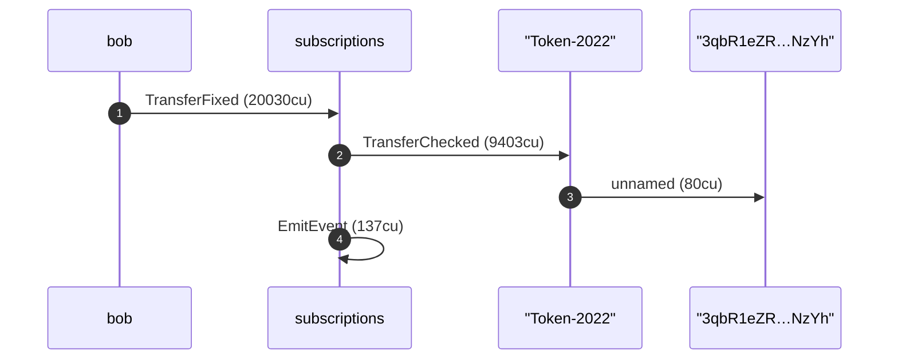

**TransferFixed (with hook accounts): sequence diagram, with lifelines**

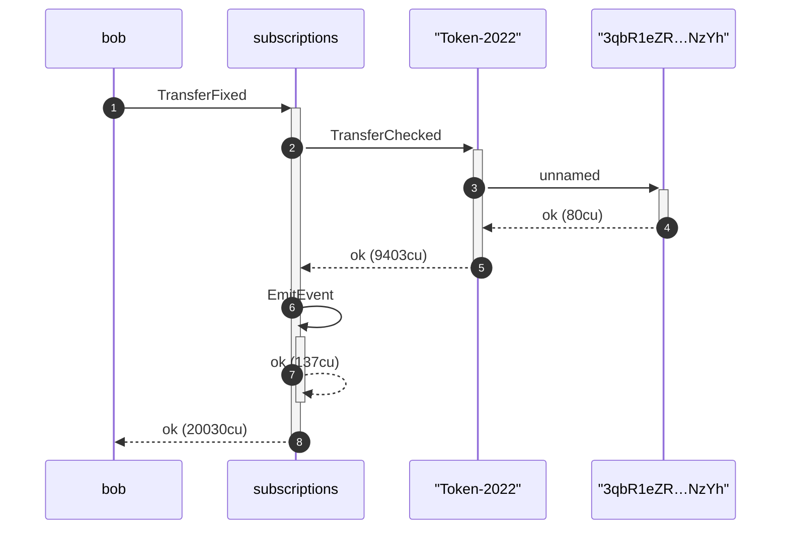

**TransferFixed (with hook accounts): authority graph**

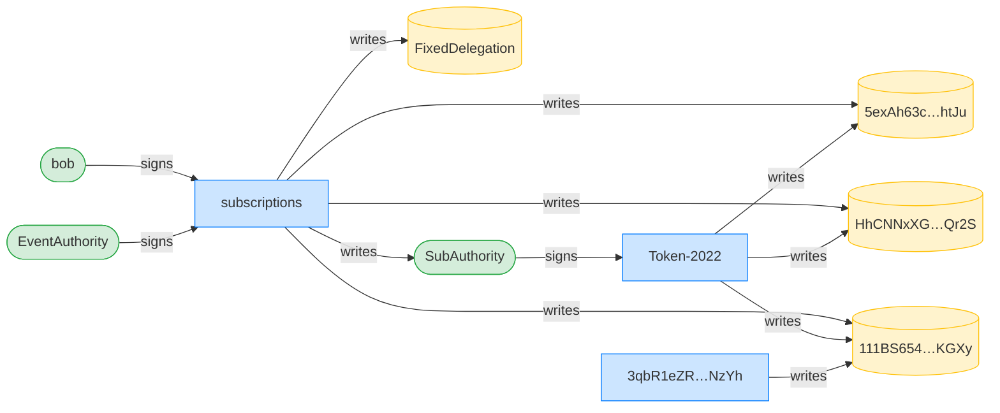

**TransferFixed (with hook accounts): ownership graph**

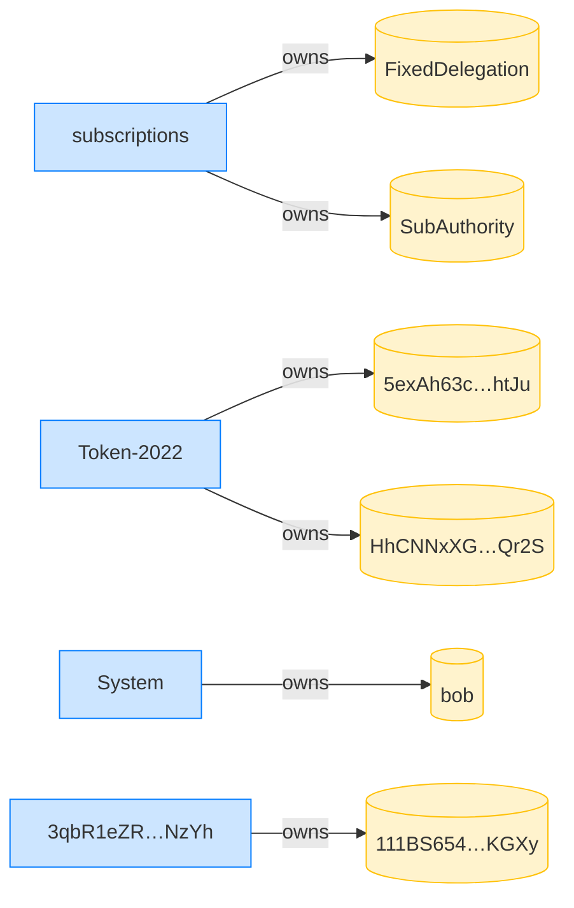

- [x] Alice's ATA debited 10 tokens: `90000000`
- [x] Bob received 10 tokens: `10000000`
- [x] the transfer hook ran once: `1`
