## Fixed transfer over a Token-2022 confidential-transfer mint — PASS

> a transfer of the public balance over a confidential-transfer mint succeeds

### Stage: Alice's authority and a fixed delegation to Bob

**InitSubscriptionAuthority: structured CPI tree**

```text

Transaction  signers=[alice]
└── subscriptions::InitSubscriptionAuthority [1] ✓ 13387cu  signer=alice
    ├── System [2] ✓ (no cu)
    └── Token-2022::Approve [2] ✓ 1035cu
Compute Units (this run): 13387
Fee: 5000 lamports
Legend (2):
  alice         = FXddRd8CdAC8SWKT3Ataasn69R7rbTfQZcKg8ejyrUbF
  subscriptions = De1egAFMkMWZSN5rYXRj9CAdheBamobVNubTsi9avR44
```

**InitSubscriptionAuthority: sequence diagram**

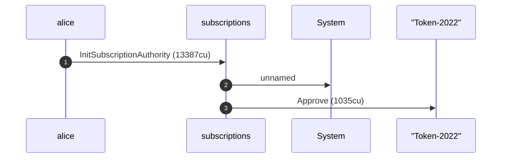

**InitSubscriptionAuthority: sequence diagram, with lifelines**

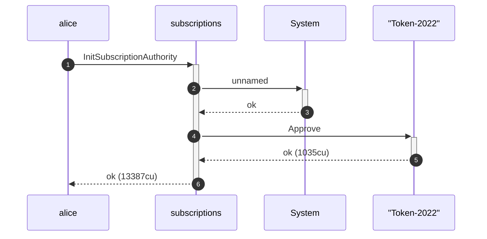

**InitSubscriptionAuthority: authority graph**

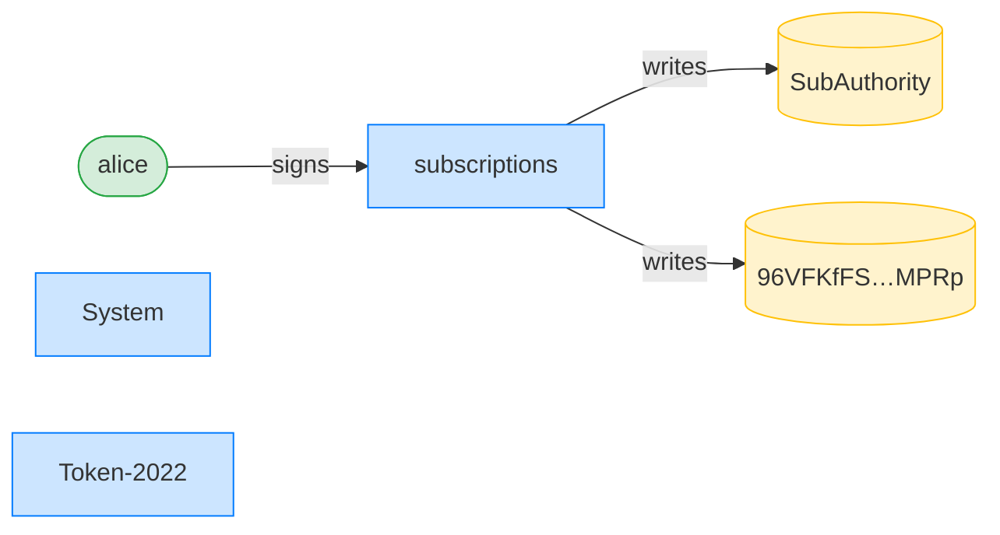

**InitSubscriptionAuthority: ownership graph**

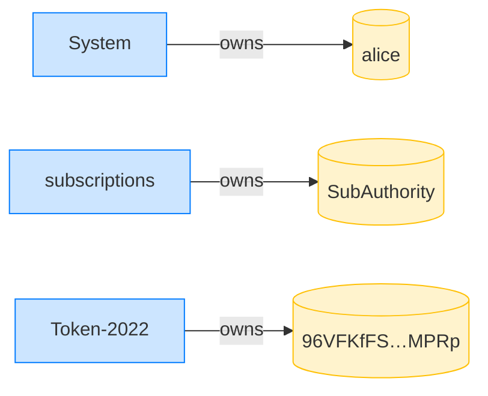

**CreateFixedDelegation: structured CPI tree**

```text

Transaction  signers=[alice]
└── subscriptions::CreateFixedDelegation [1] ✓ 3538cu  signer=alice
    └── System [2] ✓ (no cu)
Compute Units (this run): 3538
Fee: 5000 lamports
Legend (2):
  alice         = FXddRd8CdAC8SWKT3Ataasn69R7rbTfQZcKg8ejyrUbF
  subscriptions = De1egAFMkMWZSN5rYXRj9CAdheBamobVNubTsi9avR44
```

**CreateFixedDelegation: sequence diagram**

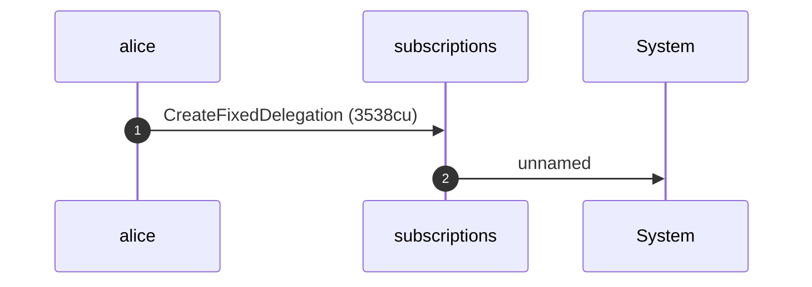

**CreateFixedDelegation: sequence diagram, with lifelines**

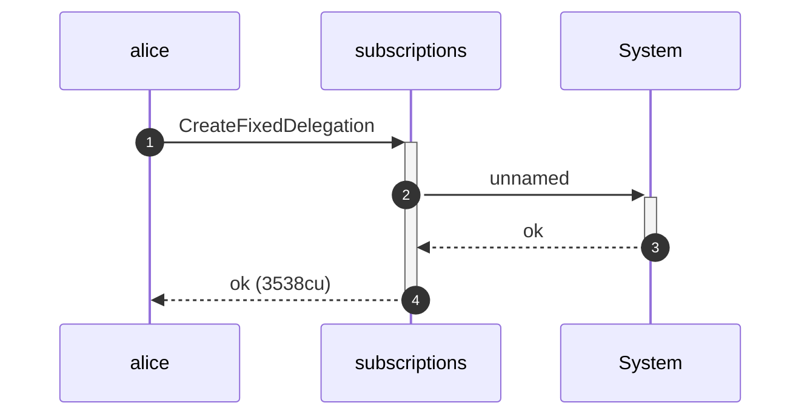

**CreateFixedDelegation: authority graph**

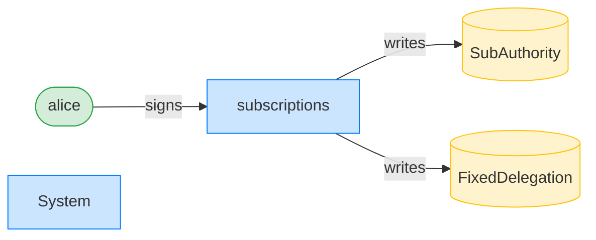

**CreateFixedDelegation: ownership graph**

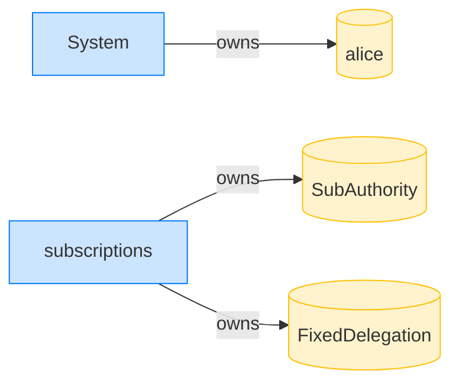

### Bob pulls 10 tokens of the public balance

**TransferFixed: structured CPI tree**

```text

Transaction  signers=[bob]
└── subscriptions::TransferFixed [1] ✓ 13662cu  signer=bob
    ├── Token-2022::TransferChecked [2] ✓ 2058cu
    └── subscriptions [2] ✓ 137cu
Compute Units (this run): 13662
Fee: 5000 lamports
Legend (2):
  bob           = 9S8NPMnzAba71o3tr8dHDzUrfT5NesYFzP56QFpYieMR
  subscriptions = De1egAFMkMWZSN5rYXRj9CAdheBamobVNubTsi9avR44
```

**TransferFixed: sequence diagram**

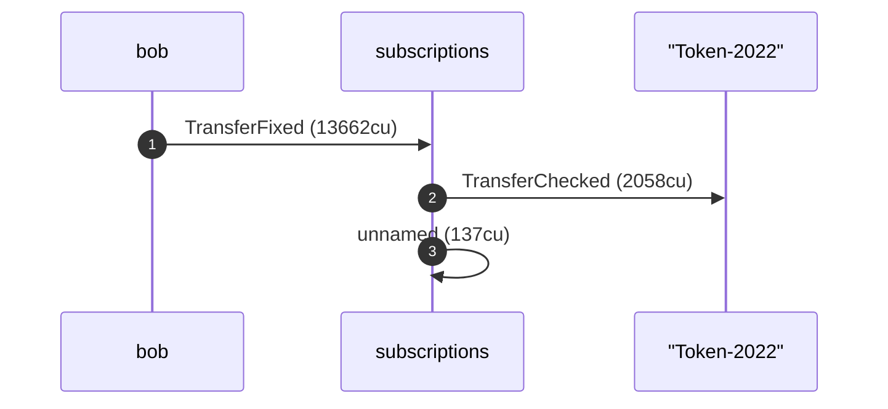

**TransferFixed: sequence diagram, with lifelines**

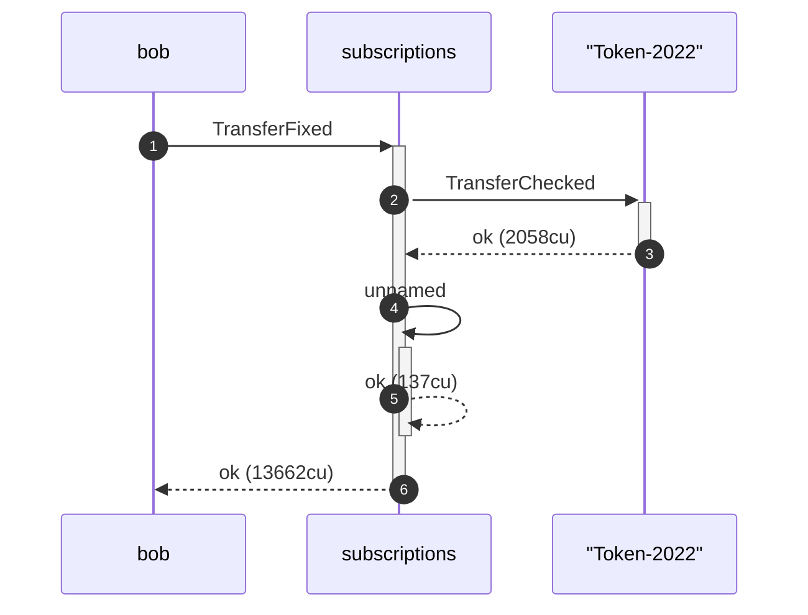

**TransferFixed: authority graph**

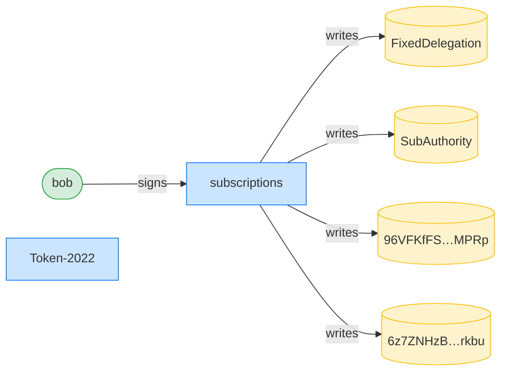

**TransferFixed: ownership graph**

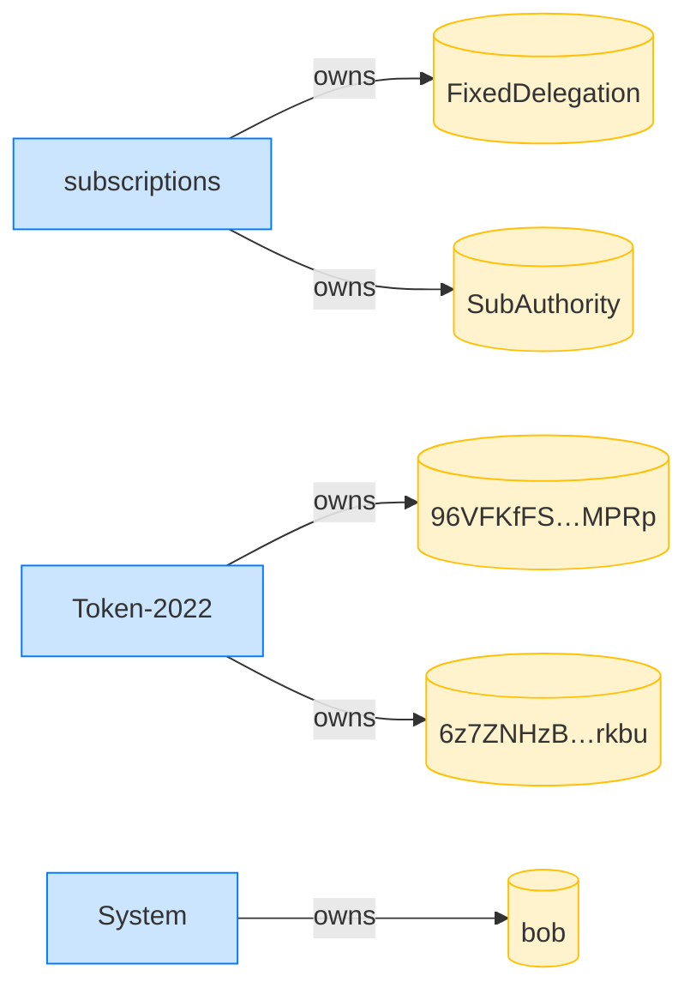

- [x] Alice's ATA debited 10 tokens: `90000000`
- [x] Bob received 10 tokens: `10000000`
