## Fixed transfer over a Token-2022 transfer-fee mint — PASS

> the transfer fee is withheld from the receiver; the allowance decrements by the gross amount

### Stage: Alice's authority and a fixed delegation to Bob

**InitSubscriptionAuthority: structured CPI tree**

```text

── subscriptions::Approve ──────────────────────────────────
Transaction  signers=[alice]
└── subscriptions::InitSubscriptionAuthority [1] ✓ 9012cu  signer=alice
    ├── System::CreateAccount [2] ✓ (no cu)
    └── Token-2022::Approve [2] ✓ 1098cu
Compute Units (this run): 9012
Fee: 5000 lamports
Legend (2):
  subscriptions = De1egAFMkMWZSN5rYXRj9CAdheBamobVNubTsi9avR44
  alice         = FXddRd8CdAC8SWKT3Ataasn69R7rbTfQZcKg8ejyrUbF
```

**InitSubscriptionAuthority: sequence diagram**

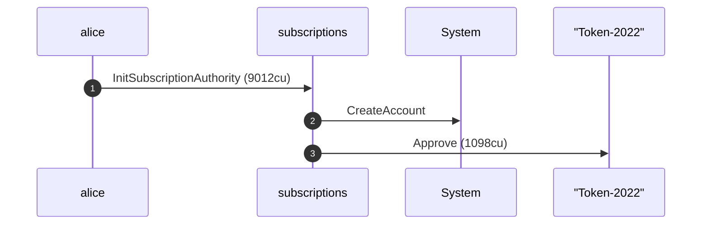

**InitSubscriptionAuthority: sequence diagram, with lifelines**

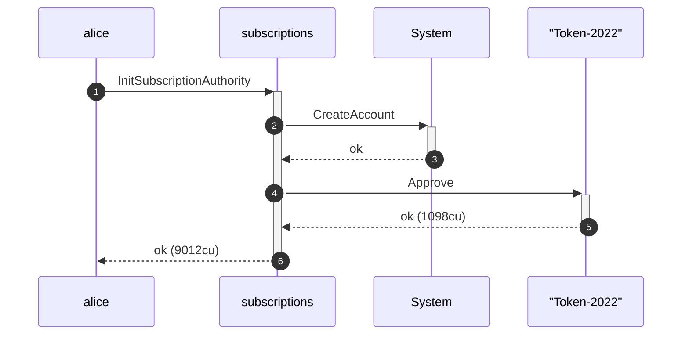

**InitSubscriptionAuthority: authority graph**

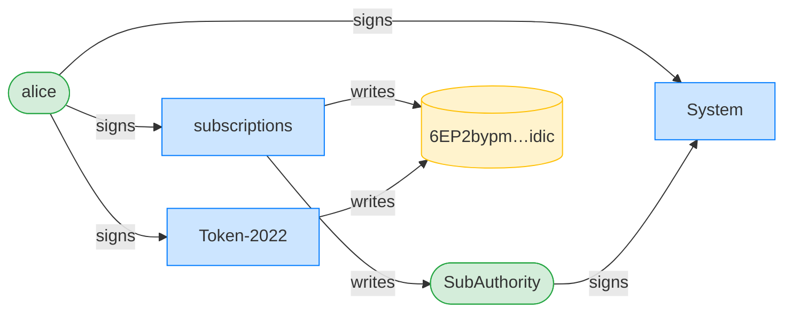

**InitSubscriptionAuthority: ownership graph**

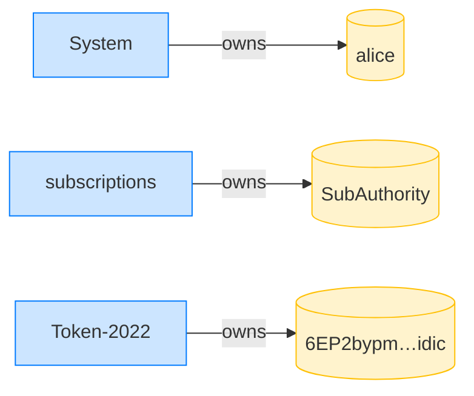

**CreateFixedDelegation: structured CPI tree**

```text

── subscriptions::CreateFixedDelegation ────────────────────
Transaction  signers=[alice]
└── subscriptions::CreateFixedDelegation [1] ✓ 8038cu  signer=alice
    └── System::CreateAccount [2] ✓ (no cu)
Compute Units (this run): 8038
Fee: 5000 lamports
Legend (2):
  subscriptions = De1egAFMkMWZSN5rYXRj9CAdheBamobVNubTsi9avR44
  alice         = FXddRd8CdAC8SWKT3Ataasn69R7rbTfQZcKg8ejyrUbF
```

**CreateFixedDelegation: sequence diagram**

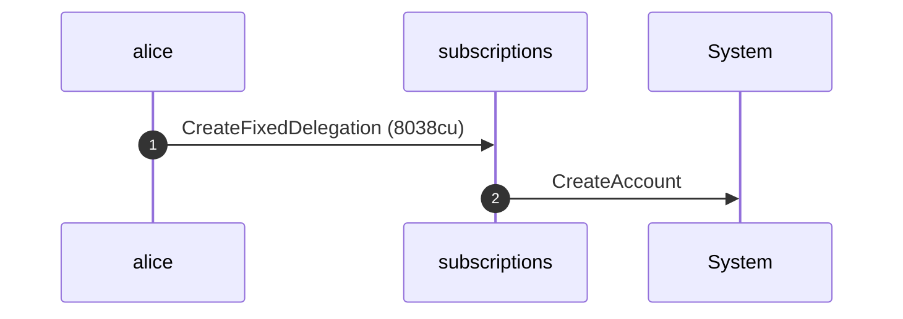

**CreateFixedDelegation: sequence diagram, with lifelines**

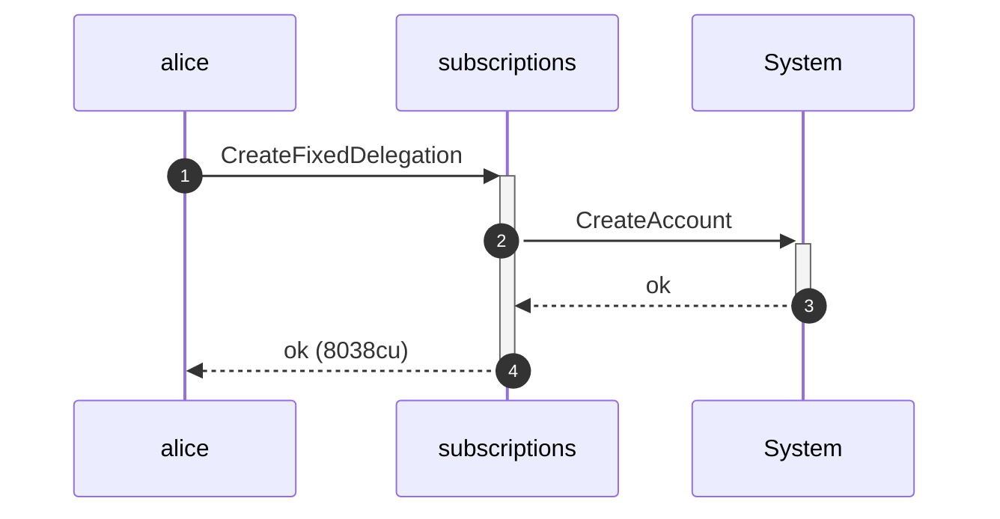

**CreateFixedDelegation: authority graph**

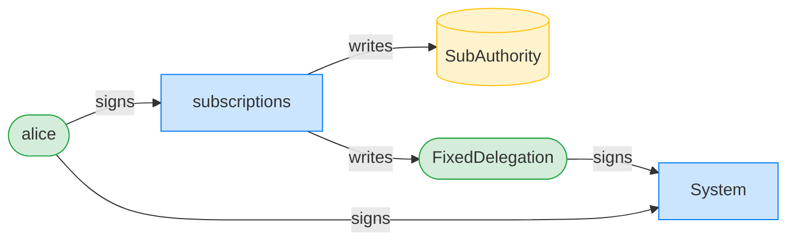

**CreateFixedDelegation: ownership graph**

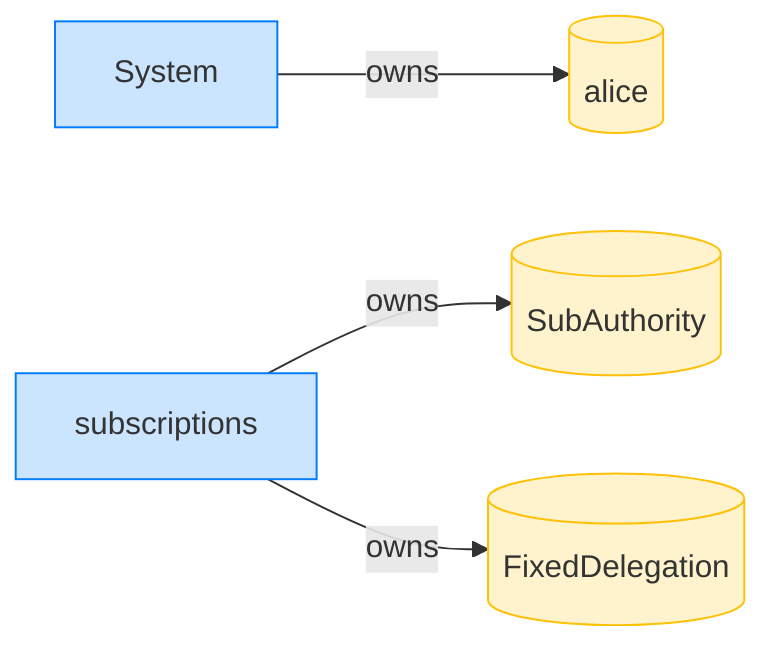

### Bob pulls 10 tokens; the transfer fee is withheld

**TransferFixed: structured CPI tree**

```text

── subscriptions::TransferChecked ──────────────────────────
Transaction  signers=[bob]
└── subscriptions::TransferFixed [1] ✓ 8523cu  signer=bob
    ├── Token-2022::TransferChecked [2] ✓ 2856cu
    └── subscriptions::EmitEvent [2] ✓ 137cu
Compute Units (this run): 8523
Fee: 5000 lamports
Legend (2):
  subscriptions = De1egAFMkMWZSN5rYXRj9CAdheBamobVNubTsi9avR44
  bob           = 9S8NPMnzAba71o3tr8dHDzUrfT5NesYFzP56QFpYieMR
```

**TransferFixed: sequence diagram**

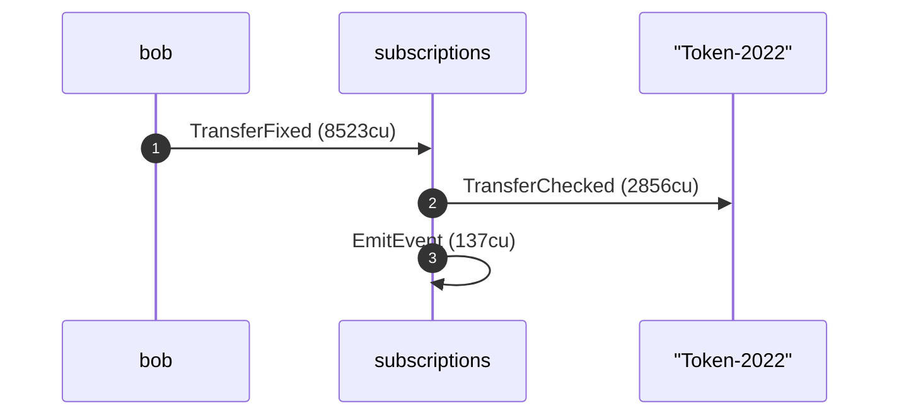

**TransferFixed: sequence diagram, with lifelines**

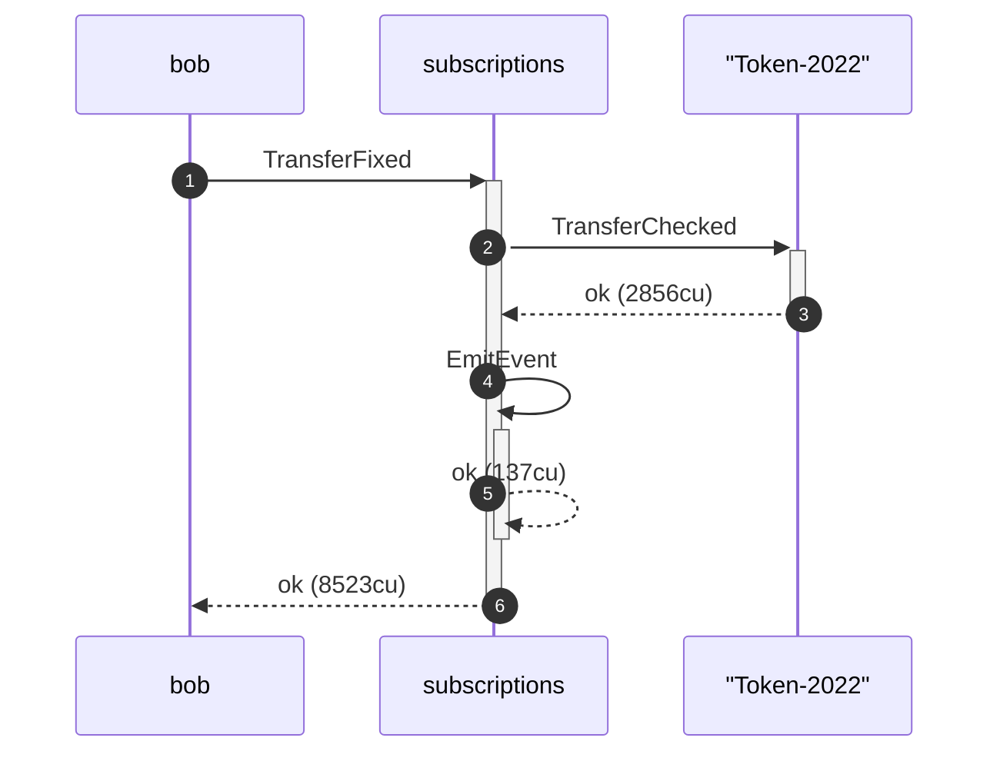

**TransferFixed: authority graph**

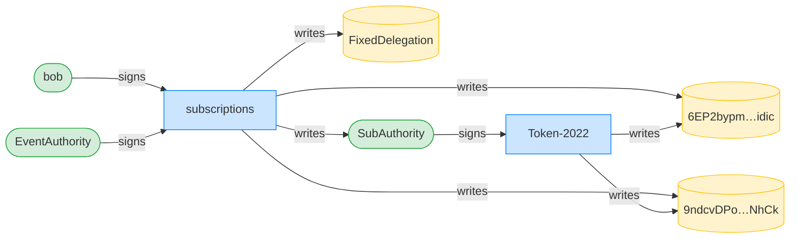

**TransferFixed: ownership graph**

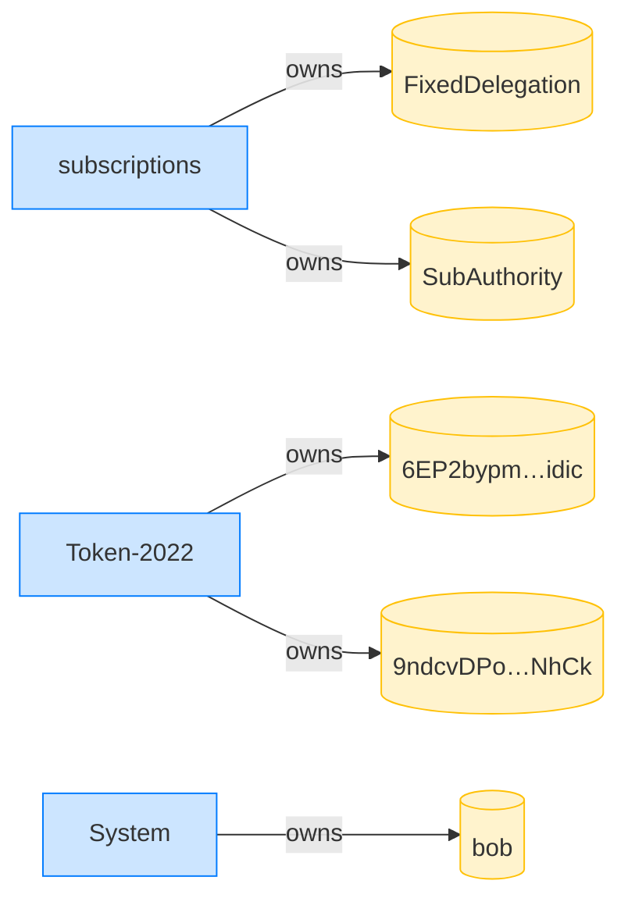

- [x] Alice's ATA debited the gross 10 tokens: `90000000`
- [x] Bob received 10 tokens net of the 1% fee: `9900000`
- [x] the allowance decrements by the gross 10 tokens: `40000000`
