## Fixed transfer succeeds — PASS

> Bob pulls part of his fixed allowance; the remaining allowance decrements

### Stage: Alice's authority and a fixed delegation to Bob

**InitSubscriptionAuthority: structured CPI tree**

```text

Transaction  signers=[alice]
└── subscriptions::InitSubscriptionAuthority [1] ✓ 6242cu  signer=alice
    ├── System [2] ✓ (no cu)
    └── Token [2] ✓ 126cu
Compute Units (this run): 6242
Fee: 5000 lamports
Legend (2):
  alice         = FXddRd8CdAC8SWKT3Ataasn69R7rbTfQZcKg8ejyrUbF
  subscriptions = De1egAFMkMWZSN5rYXRj9CAdheBamobVNubTsi9avR44
```

**InitSubscriptionAuthority: sequence diagram**

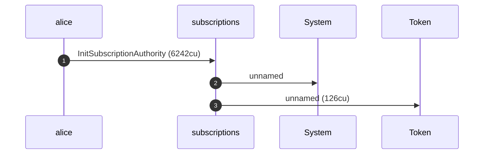

**InitSubscriptionAuthority: sequence diagram, with lifelines**

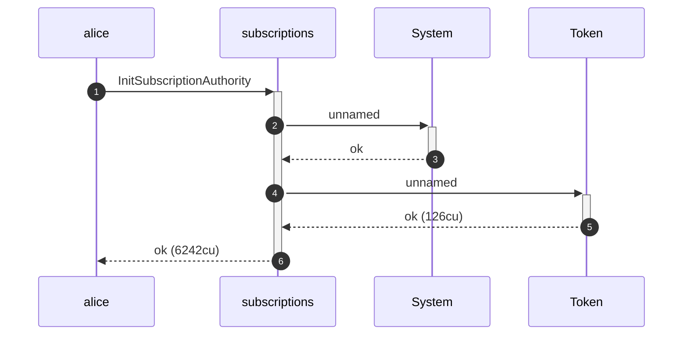

**InitSubscriptionAuthority: authority graph**

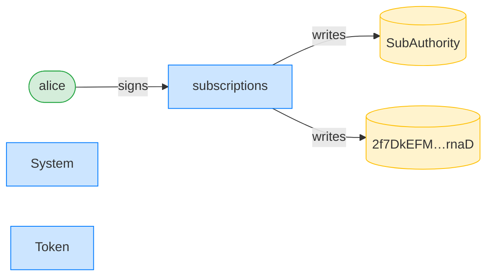

**InitSubscriptionAuthority: ownership graph**

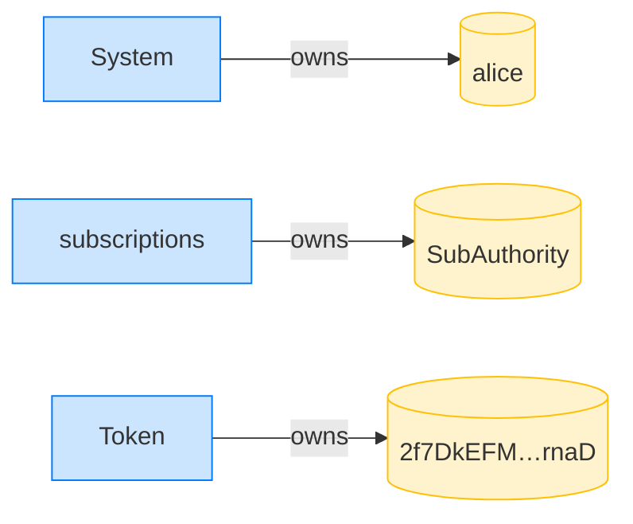

**CreateFixedDelegation: structured CPI tree**

```text

Transaction  signers=[alice]
└── subscriptions::CreateFixedDelegation [1] ✓ 6538cu  signer=alice
    └── System [2] ✓ (no cu)
Compute Units (this run): 6538
Fee: 5000 lamports
Legend (2):
  alice         = FXddRd8CdAC8SWKT3Ataasn69R7rbTfQZcKg8ejyrUbF
  subscriptions = De1egAFMkMWZSN5rYXRj9CAdheBamobVNubTsi9avR44
```

**CreateFixedDelegation: sequence diagram**

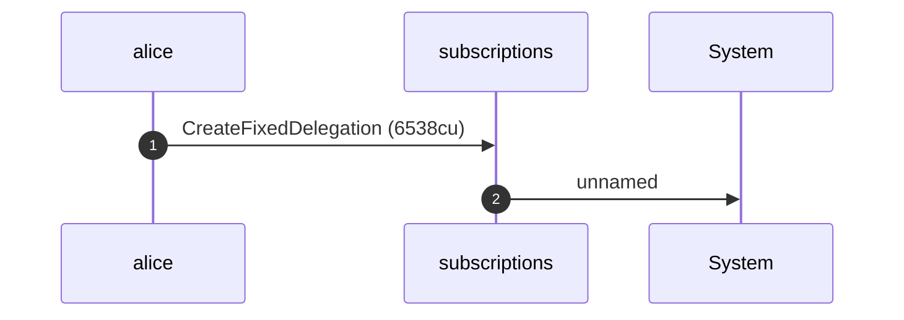

**CreateFixedDelegation: sequence diagram, with lifelines**

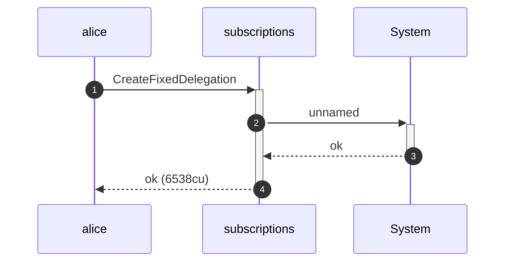

**CreateFixedDelegation: authority graph**

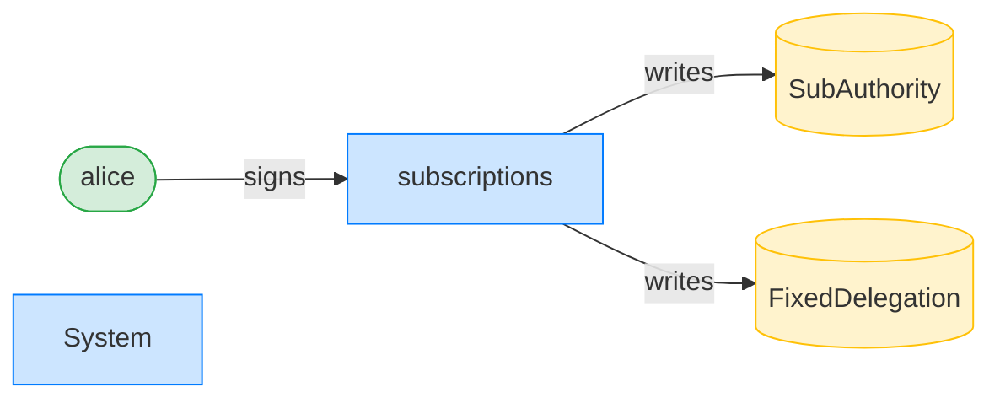

**CreateFixedDelegation: ownership graph**

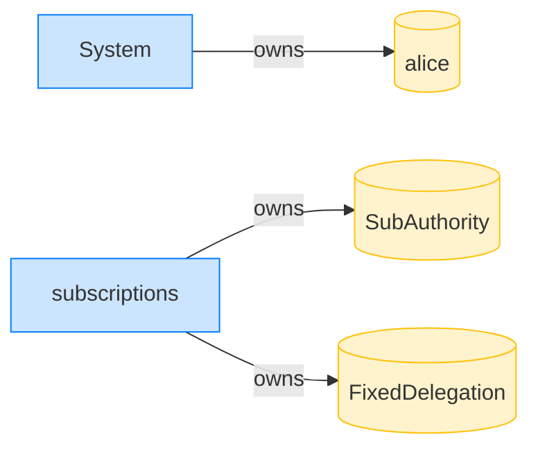

- [x] Bob's ATA starts empty: `0`

### Bob pulls 30 tokens against his fixed delegation

**TransferFixed: structured CPI tree**

```text

Transaction  signers=[bob]
└── subscriptions::TransferFixed [1] ✓ 5555cu  signer=bob
    ├── Token [2] ✓ 113cu
    └── subscriptions [2] ✓ 137cu
Compute Units (this run): 5555
Fee: 5000 lamports
Legend (2):
  bob           = 9S8NPMnzAba71o3tr8dHDzUrfT5NesYFzP56QFpYieMR
  subscriptions = De1egAFMkMWZSN5rYXRj9CAdheBamobVNubTsi9avR44
```

**TransferFixed: sequence diagram**

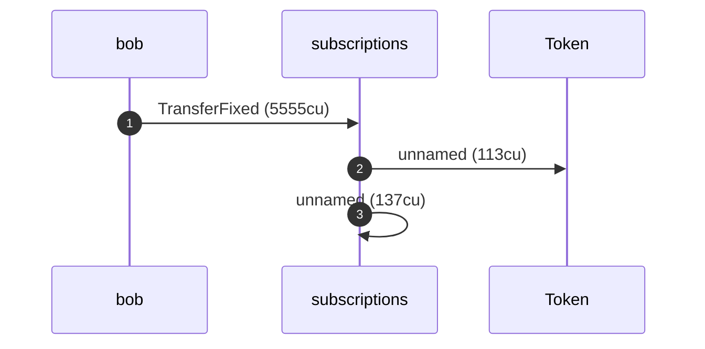

**TransferFixed: sequence diagram, with lifelines**

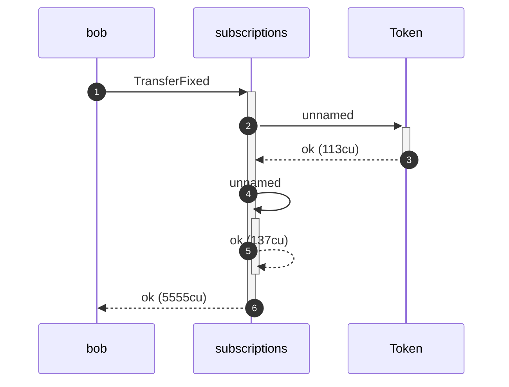

**TransferFixed: authority graph**

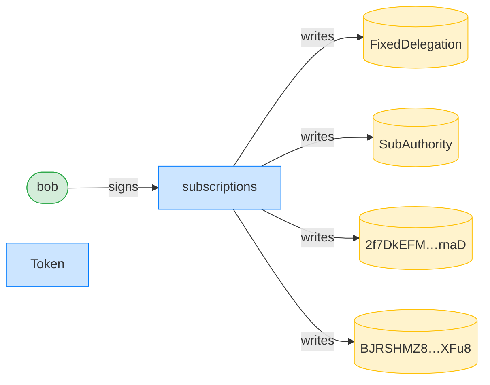

**TransferFixed: ownership graph**

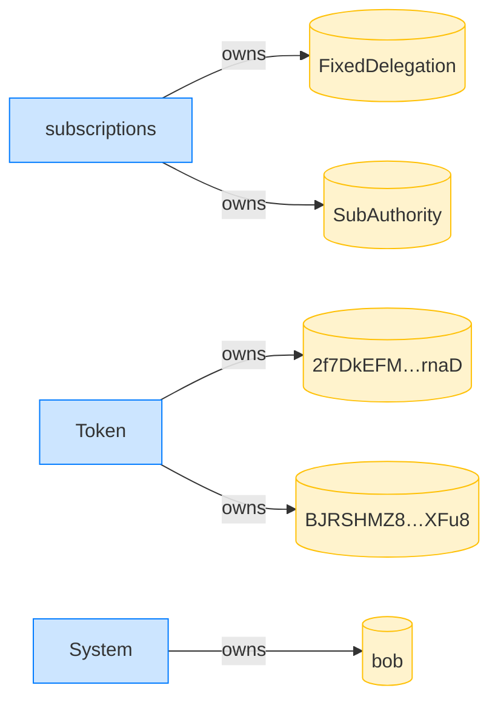

- [x] Bob received 30 tokens: `30000000`
- [x] the remaining allowance is 20 tokens: `20000000`
- [x] the expiry is unchanged: `1700086400`
