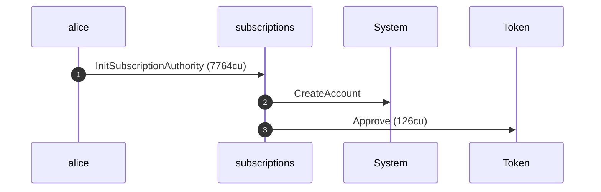
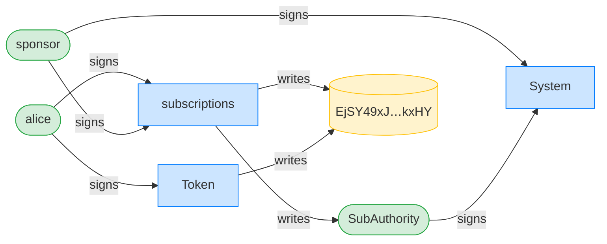
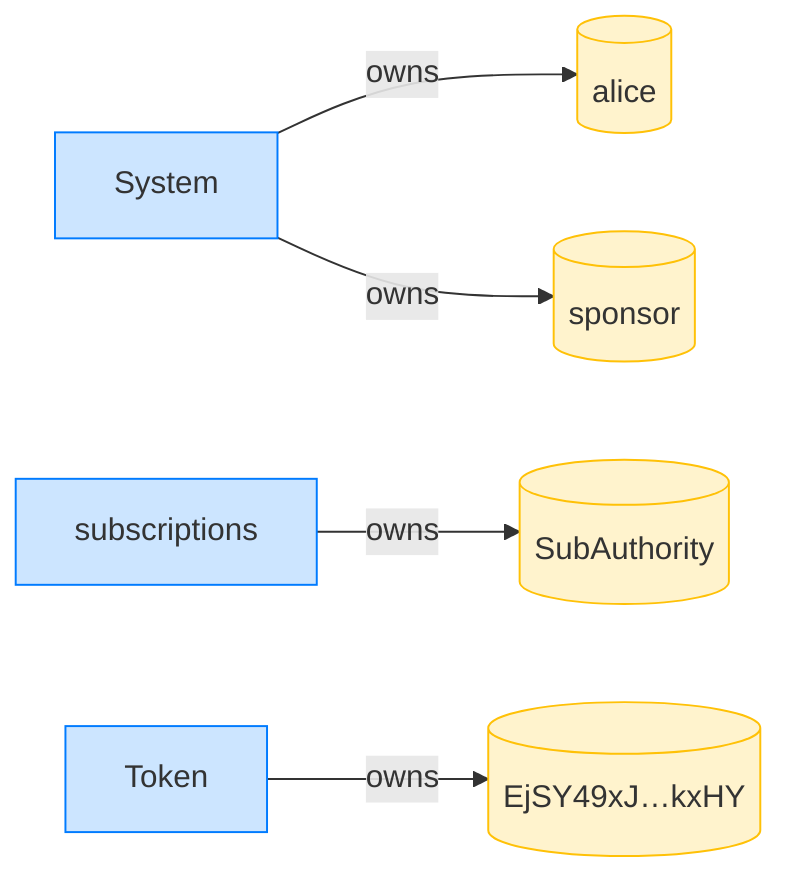
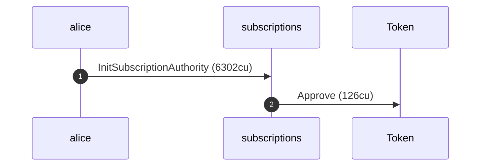
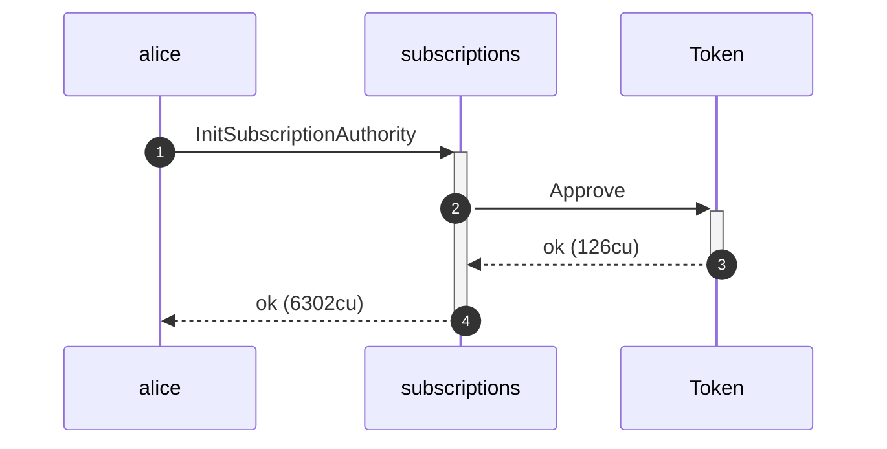
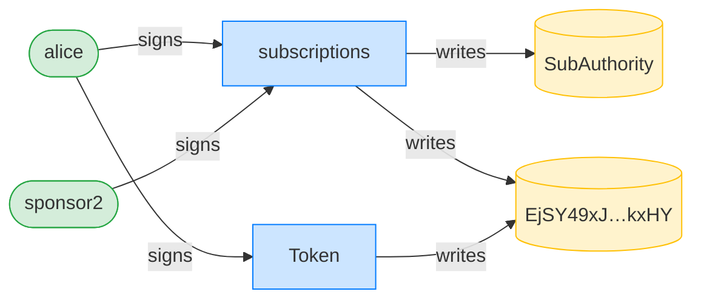
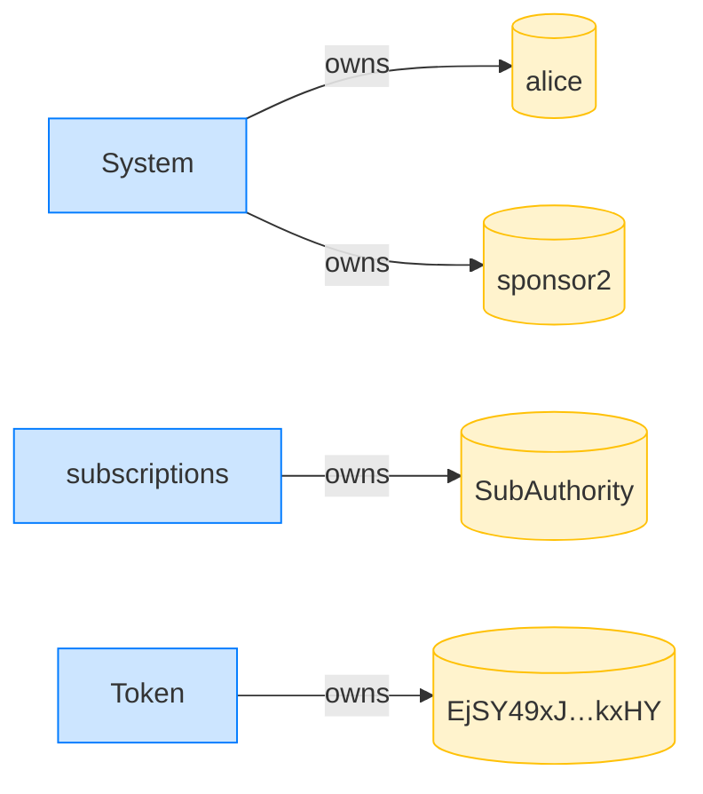

## Idempotent init preserves the original payer — PASS

> a second init by a different sponsor leaves the stored payer untouched

### Sponsor A initializes the authority

**InitSubscriptionAuthority: structured CPI tree**

```text

── subscriptions::InitSubscriptionAuthority ────────────────
Transaction  signers=[sponsor, alice]
└── subscriptions::InitSubscriptionAuthority [1] ✓ 7764cu  signer=[alice, sponsor]
    ├── System::CreateAccount [2] ✓ (no cu)
    └── Token::Approve [2] ✓ 126cu
Compute Units (this run): 7764
Fee: 10000 lamports
Legend (3):
  subscriptions = De1egAFMkMWZSN5rYXRj9CAdheBamobVNubTsi9avR44
  sponsor       = 47cncVPgU4mK37H7VvxLCCsoDEKYaVhNLHHp4MbnEwvx
  alice         = FXddRd8CdAC8SWKT3Ataasn69R7rbTfQZcKg8ejyrUbF
```

**InitSubscriptionAuthority: sequence diagram**



**InitSubscriptionAuthority: sequence diagram, with lifelines**


**InitSubscriptionAuthority: authority graph**



**InitSubscriptionAuthority: ownership graph**



### Sponsor B re-runs init

**InitSubscriptionAuthority: structured CPI tree**

```text

── subscriptions::InitSubscriptionAuthority ────────────────
Transaction  signers=[sponsor2, alice]
└── subscriptions::InitSubscriptionAuthority [1] ✓ 6302cu  signer=[alice, sponsor2]
    └── Token::Approve [2] ✓ 126cu
Compute Units (this run): 6302
Fee: 10000 lamports
Legend (3):
  subscriptions = De1egAFMkMWZSN5rYXRj9CAdheBamobVNubTsi9avR44
  sponsor2      = CRhhd9p4sqTfae2hJTknFKWimstLVHZRyYMK8GZLMKqz
  alice         = FXddRd8CdAC8SWKT3Ataasn69R7rbTfQZcKg8ejyrUbF
```

**InitSubscriptionAuthority: sequence diagram**



**InitSubscriptionAuthority: sequence diagram, with lifelines**



**InitSubscriptionAuthority: authority graph**



**InitSubscriptionAuthority: ownership graph**



- [x] the stored payer is still sponsor A: `47cncVPgU4mK37H7VvxLCCsoDEKYaVhNLHHp4MbnEwvx`
