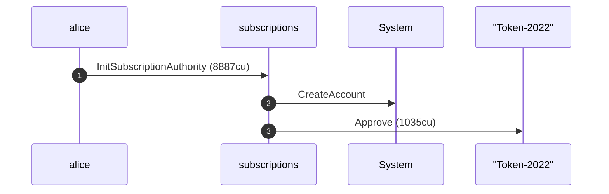
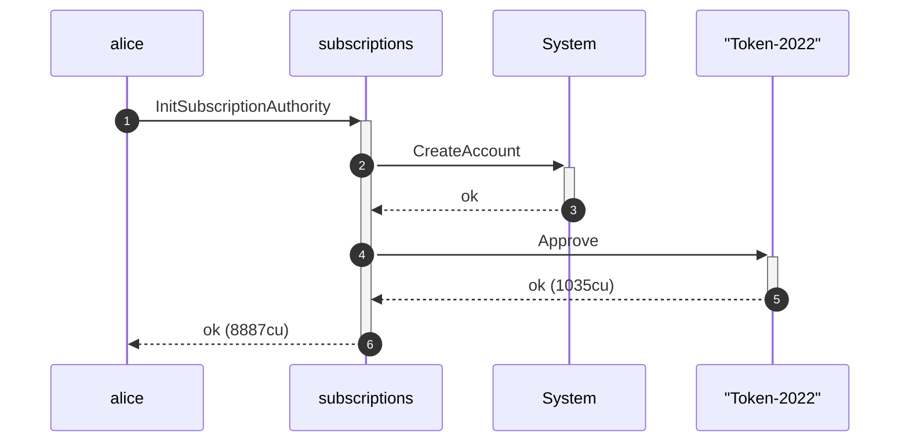
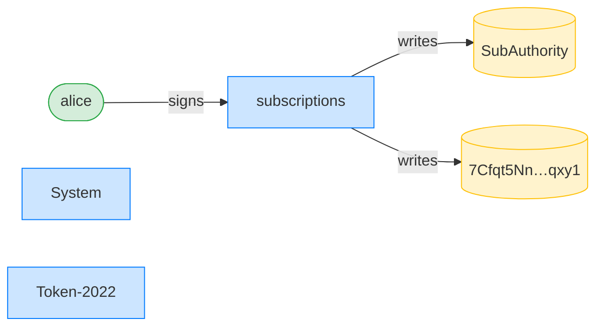
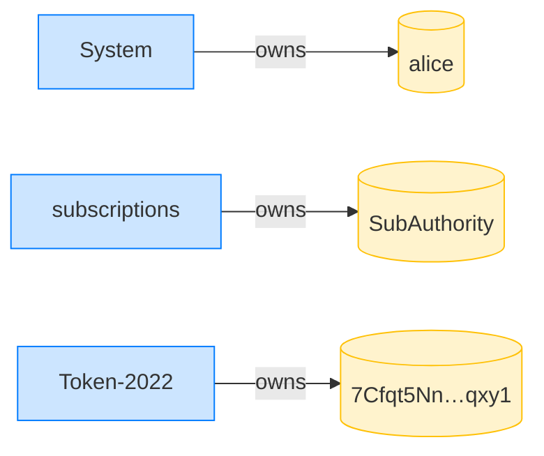

## Initialize over a Token-2022 mint ([MintCloseAuthority, ConfidentialTransferMint]) — PASS

> the authority initializes over a Token-2022 mint with the given extensions

### Alice initializes her authority over the Token-2022 mint

**InitSubscriptionAuthority: structured CPI tree**

```text

Transaction  signers=[alice]
└── subscriptions::InitSubscriptionAuthority [1] ✓ 8887cu  signer=alice
    ├── System::CreateAccount [2] ✓ (no cu)
    └── Token-2022::Approve [2] ✓ 1035cu
Compute Units (this run): 8887
Fee: 5000 lamports
Legend (2):
  alice         = FXddRd8CdAC8SWKT3Ataasn69R7rbTfQZcKg8ejyrUbF
  subscriptions = De1egAFMkMWZSN5rYXRj9CAdheBamobVNubTsi9avR44
```

**InitSubscriptionAuthority: sequence diagram**



**InitSubscriptionAuthority: sequence diagram, with lifelines**



**InitSubscriptionAuthority: authority graph**



**InitSubscriptionAuthority: ownership graph**


