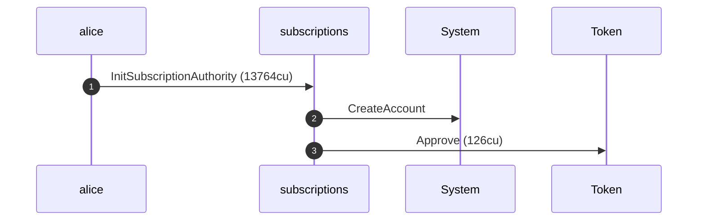
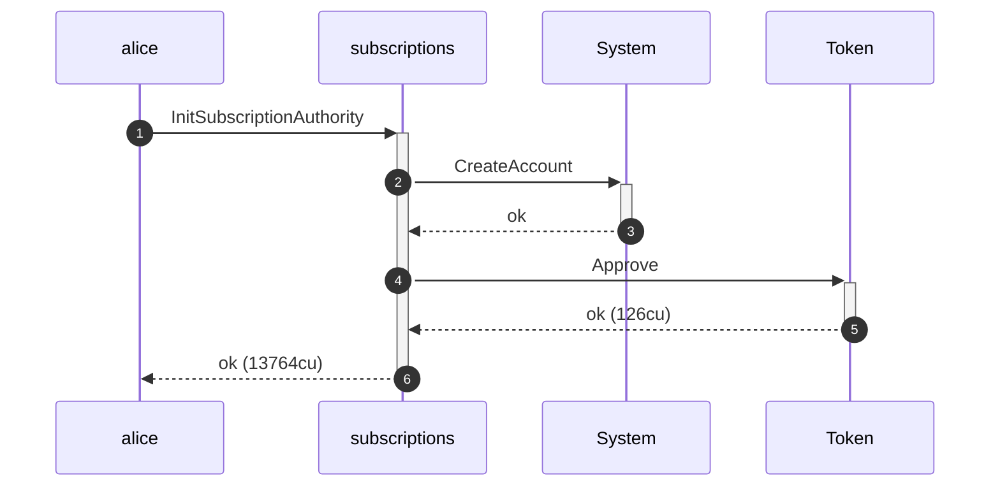
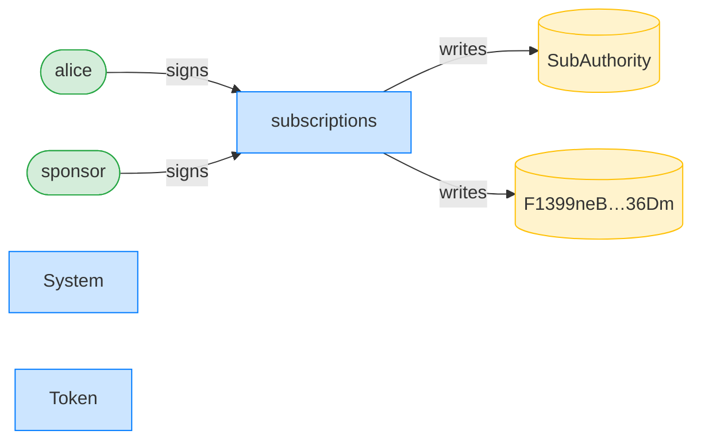
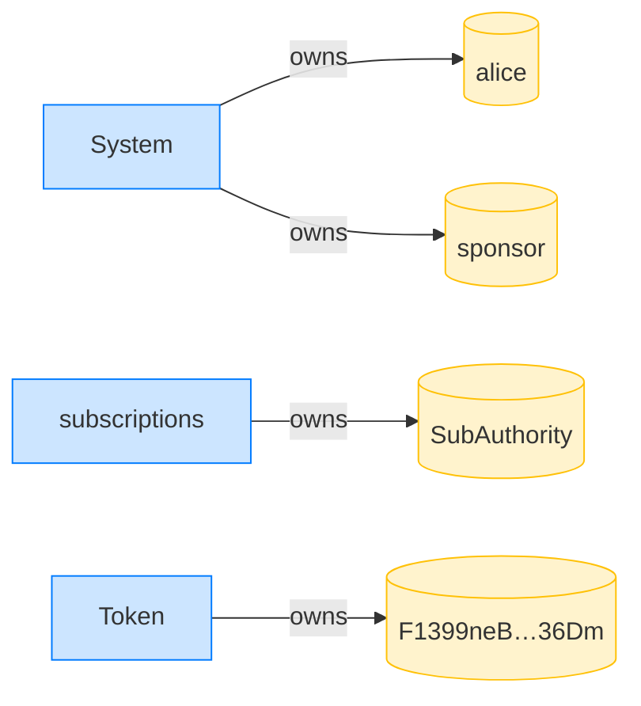

## Initialize with a sponsor — PASS

> a sponsor pays rent and the fee; Alice's lamports stay untouched

### Alice initializes her authority; the sponsor pays

**InitSubscriptionAuthority: structured CPI tree**

```text

Transaction  signers=[sponsor, alice]
└── subscriptions::InitSubscriptionAuthority [1] ✓ 13764cu  signer=[alice, sponsor]
    ├── System::CreateAccount [2] ✓ (no cu)
    └── Token::Approve [2] ✓ 126cu
Compute Units (this run): 13764
Fee: 10000 lamports
Legend (3):
  sponsor       = 47cncVPgU4mK37H7VvxLCCsoDEKYaVhNLHHp4MbnEwvx
  alice         = FXddRd8CdAC8SWKT3Ataasn69R7rbTfQZcKg8ejyrUbF
  subscriptions = De1egAFMkMWZSN5rYXRj9CAdheBamobVNubTsi9avR44
```

**InitSubscriptionAuthority: sequence diagram**



**InitSubscriptionAuthority: sequence diagram, with lifelines**



**InitSubscriptionAuthority: authority graph**



**InitSubscriptionAuthority: ownership graph**



- [x] the authority's user is Alice: `FXddRd8CdAC8SWKT3Ataasn69R7rbTfQZcKg8ejyrUbF`
- [x] the authority's payer is the sponsor: `47cncVPgU4mK37H7VvxLCCsoDEKYaVhNLHHp4MbnEwvx`
- [x] Alice's lamports are untouched: `100000000000`
- [x] the sponsor was charged: `true`
