## Payer recovers a no-expiry recurring delegation after the authority is closed — PASS

> Alice closes her authority; the sponsor sweeps the abandoned recurring delegation and recovers its rent

**InitSubscriptionAuthority: structured CPI tree**

```text

Transaction  signers=[alice]
└── subscriptions::InitSubscriptionAuthority [1] ✓ 6242cu  signer=alice
    ├── System [2] ✓ (no cu)
    └── Token [2] ✓ 126cu
Compute Units (this run): 6242
Fee: 5000 lamports
Legend (2):
  alice         = FXddRd8CdAC8SWKT3Ataasn69R7rbTfQZcKg8ejyrUbF
  subscriptions = De1egAFMkMWZSN5rYXRj9CAdheBamobVNubTsi9avR44
```

**InitSubscriptionAuthority: sequence diagram**

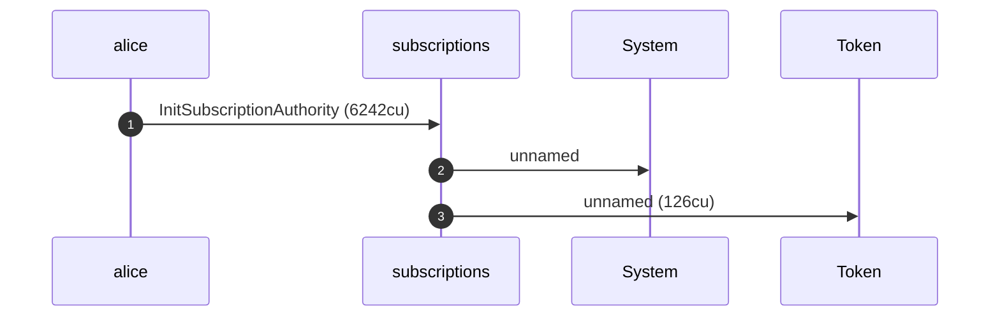

**InitSubscriptionAuthority: sequence diagram, with lifelines**

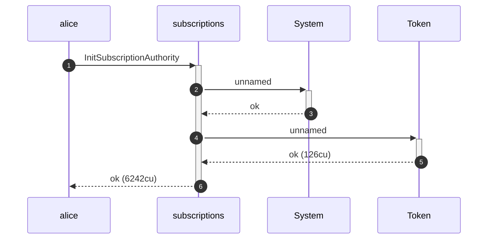

**InitSubscriptionAuthority: authority graph**

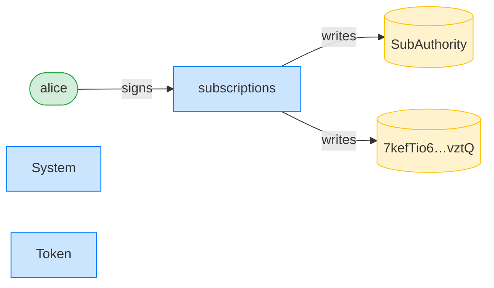

**InitSubscriptionAuthority: ownership graph**

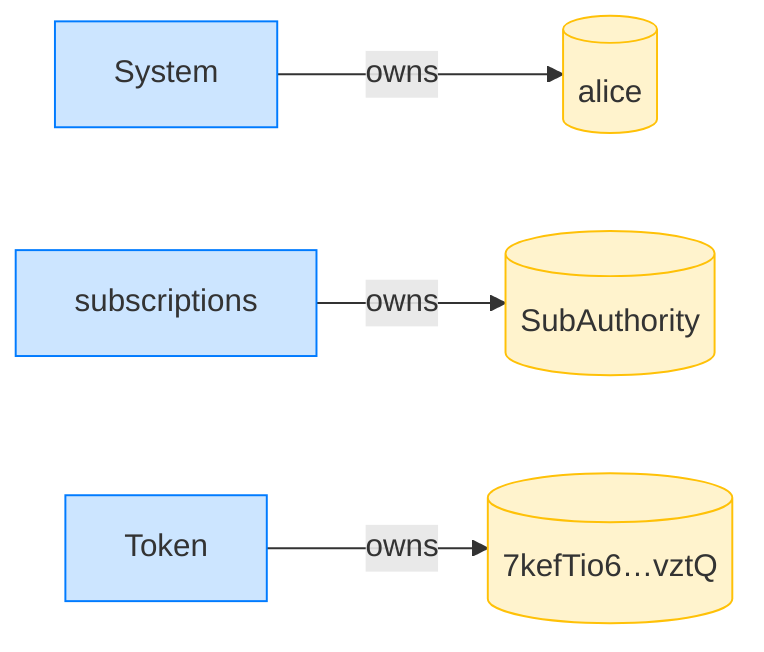

### Alice (with the sponsor paying rent) creates a no-expiry recurring delegation

**CreateRecurringDelegation: structured CPI tree**

```text

Transaction  signers=[sponsor, alice]
└── subscriptions::CreateRecurringDelegation [1] ✓ 5099cu  signer=[alice, sponsor]
    └── System [2] ✓ (no cu)
Compute Units (this run): 5099
Fee: 10000 lamports
Legend (3):
  sponsor       = 47cncVPgU4mK37H7VvxLCCsoDEKYaVhNLHHp4MbnEwvx
  alice         = FXddRd8CdAC8SWKT3Ataasn69R7rbTfQZcKg8ejyrUbF
  subscriptions = De1egAFMkMWZSN5rYXRj9CAdheBamobVNubTsi9avR44
```

**CreateRecurringDelegation: sequence diagram**

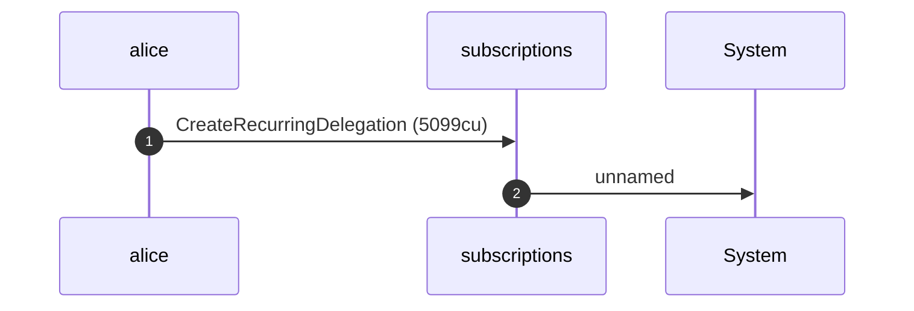

**CreateRecurringDelegation: sequence diagram, with lifelines**

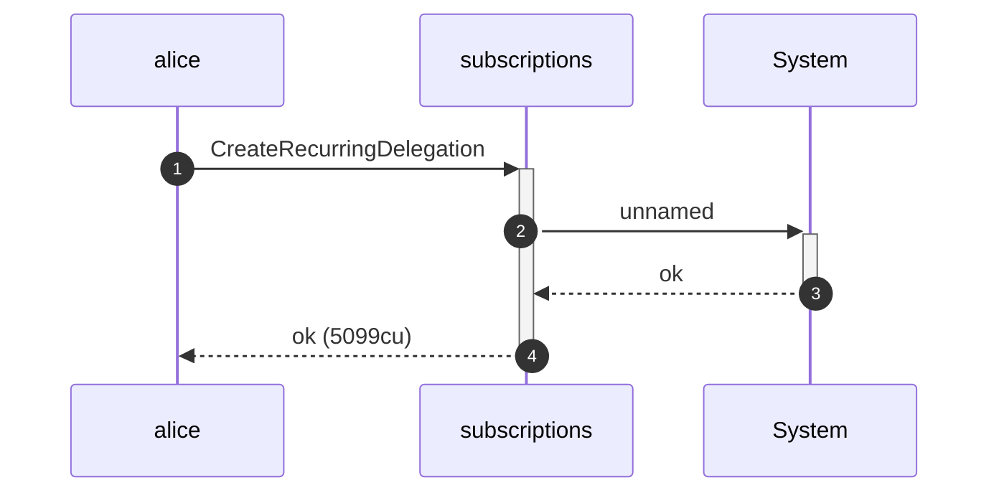

**CreateRecurringDelegation: authority graph**

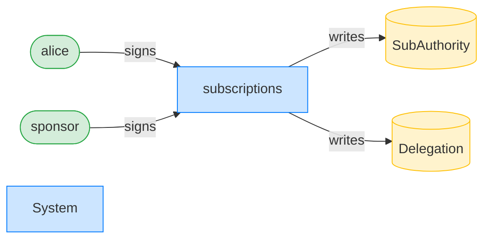

**CreateRecurringDelegation: ownership graph**

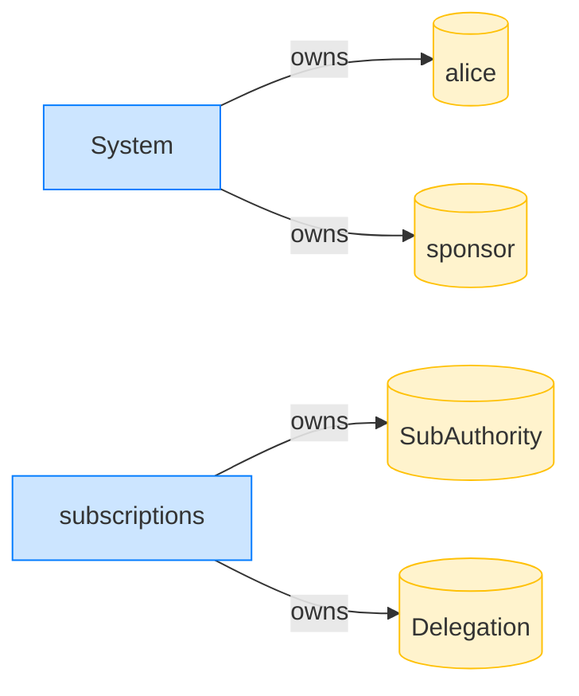

### Alice closes her subscription authority, abandoning the delegation

**CloseSubscriptionAuthority: structured CPI tree**

```text

Transaction  signers=[alice]
└── subscriptions::CloseSubscriptionAuthority [1] ✓ 1832cu  signer=alice
Compute Units (this run): 1832
Fee: 5000 lamports
Legend (2):
  alice         = FXddRd8CdAC8SWKT3Ataasn69R7rbTfQZcKg8ejyrUbF
  subscriptions = De1egAFMkMWZSN5rYXRj9CAdheBamobVNubTsi9avR44
```

**CloseSubscriptionAuthority: sequence diagram**

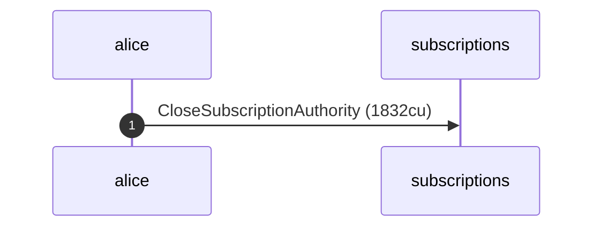

**CloseSubscriptionAuthority: sequence diagram, with lifelines**

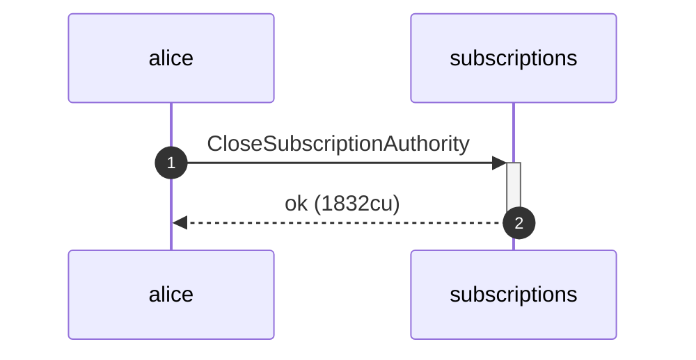

**CloseSubscriptionAuthority: authority graph**

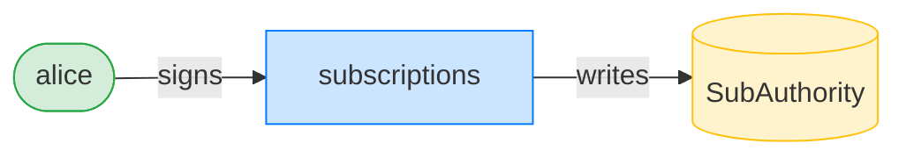

**CloseSubscriptionAuthority: ownership graph**

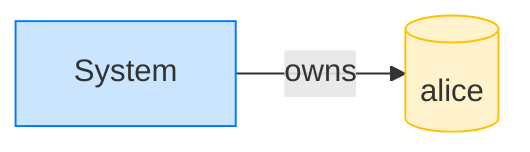

### The sponsor sweeps the abandoned delegation and recovers its rent

**RevokeAbandonedDelegation: structured CPI tree**

```text

Transaction  signers=[sponsor]
└── subscriptions::RevokeAbandonedDelegation [1] ✓ 306cu  signer=sponsor
Compute Units (this run): 306
Fee: 5000 lamports
Legend (2):
  sponsor       = 47cncVPgU4mK37H7VvxLCCsoDEKYaVhNLHHp4MbnEwvx
  subscriptions = De1egAFMkMWZSN5rYXRj9CAdheBamobVNubTsi9avR44
```

**RevokeAbandonedDelegation: sequence diagram**

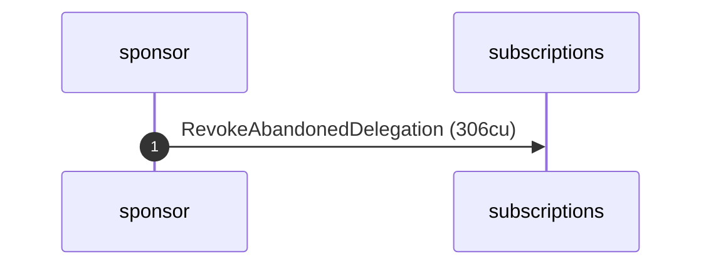

**RevokeAbandonedDelegation: sequence diagram, with lifelines**

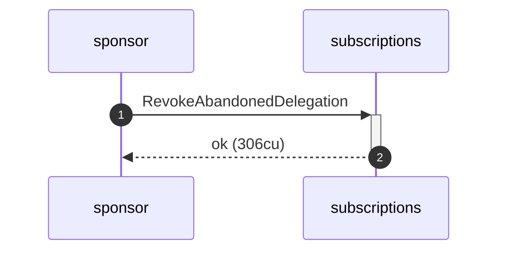

**RevokeAbandonedDelegation: authority graph**

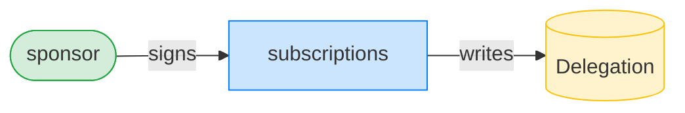

**RevokeAbandonedDelegation: ownership graph**

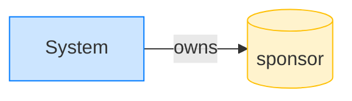

- [x] the delegation account is gone: `true`
- [x] the sponsor recovered the delegation rent (net of fees): `true`
