## Recurring rollover blocked at the expiry boundary — PASS

> when a period would roll over exactly at expiry, the rollover pull is refused

### Stage: Alice's authority and a recurring delegation to Bob

**InitSubscriptionAuthority: structured CPI tree**

```text

Transaction  signers=[alice]
└── subscriptions::InitSubscriptionAuthority [1] ✓ 12242cu  signer=alice
    ├── System [2] ✓ (no cu)
    └── Token [2] ✓ 126cu
Compute Units (this run): 12242
Fee: 5000 lamports
Legend (2):
  alice         = FXddRd8CdAC8SWKT3Ataasn69R7rbTfQZcKg8ejyrUbF
  subscriptions = De1egAFMkMWZSN5rYXRj9CAdheBamobVNubTsi9avR44
```

**InitSubscriptionAuthority: sequence diagram**

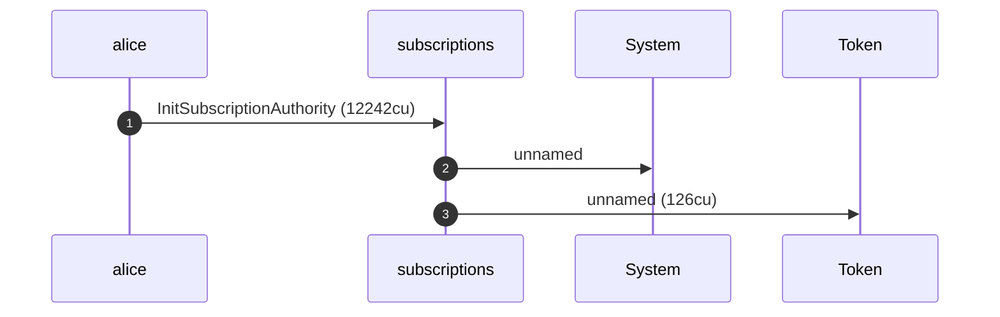

**InitSubscriptionAuthority: sequence diagram, with lifelines**

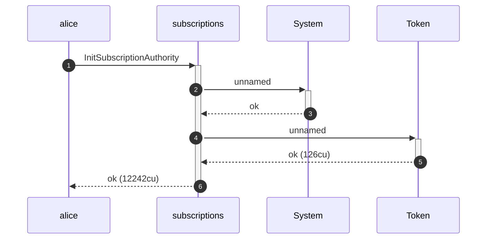

**InitSubscriptionAuthority: authority graph**

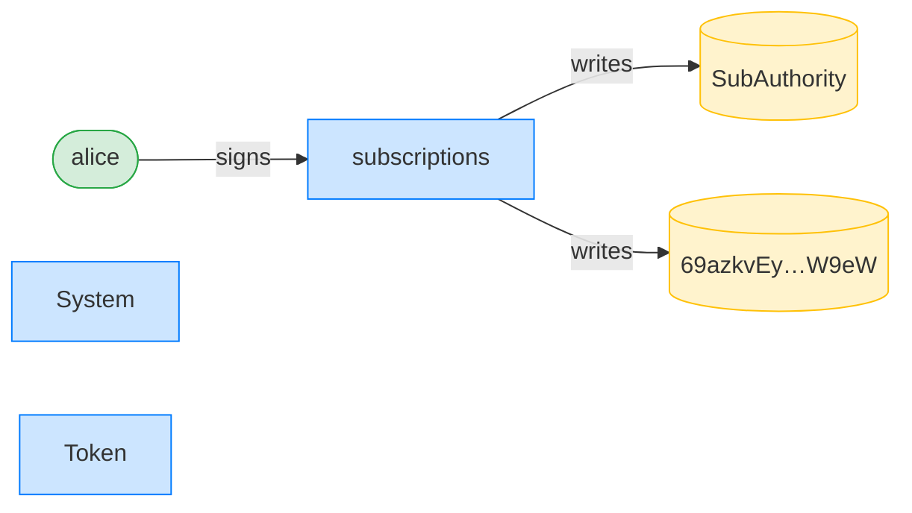

**InitSubscriptionAuthority: ownership graph**

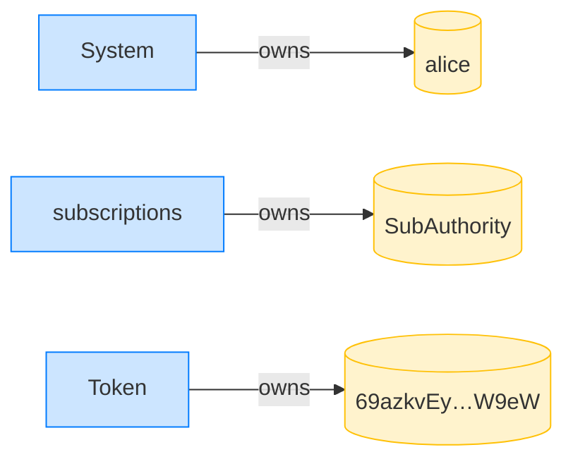

**CreateRecurringDelegation: structured CPI tree**

```text

Transaction  signers=[alice]
└── subscriptions::CreateRecurringDelegation [1] ✓ 5073cu  signer=alice
    └── System [2] ✓ (no cu)
Compute Units (this run): 5073
Fee: 5000 lamports
Legend (2):
  alice         = FXddRd8CdAC8SWKT3Ataasn69R7rbTfQZcKg8ejyrUbF
  subscriptions = De1egAFMkMWZSN5rYXRj9CAdheBamobVNubTsi9avR44
```

**CreateRecurringDelegation: sequence diagram**

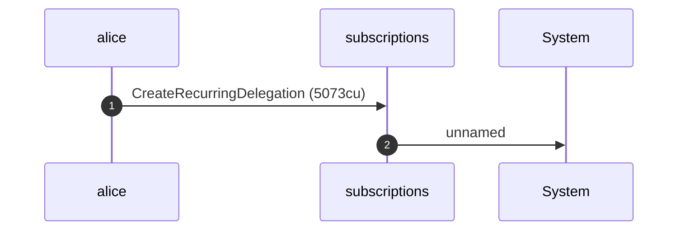

**CreateRecurringDelegation: sequence diagram, with lifelines**

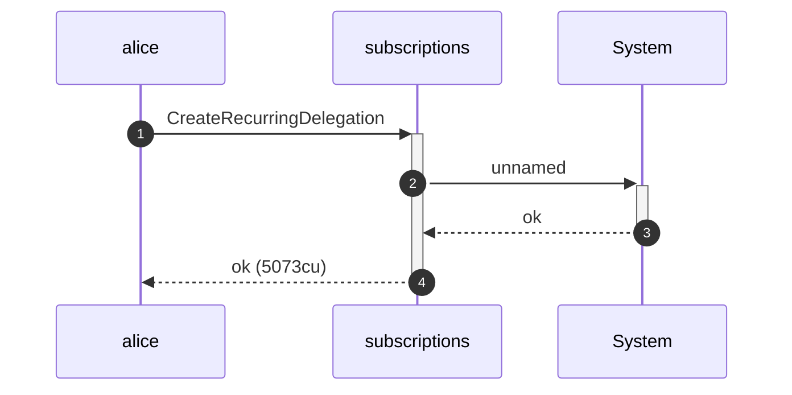

**CreateRecurringDelegation: authority graph**

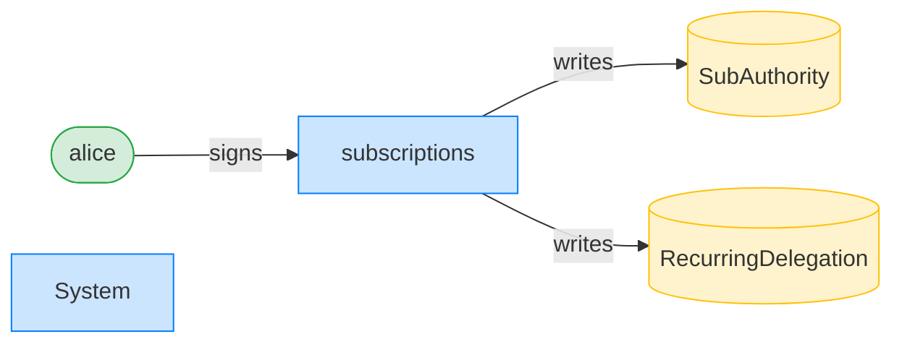

**CreateRecurringDelegation: ownership graph**

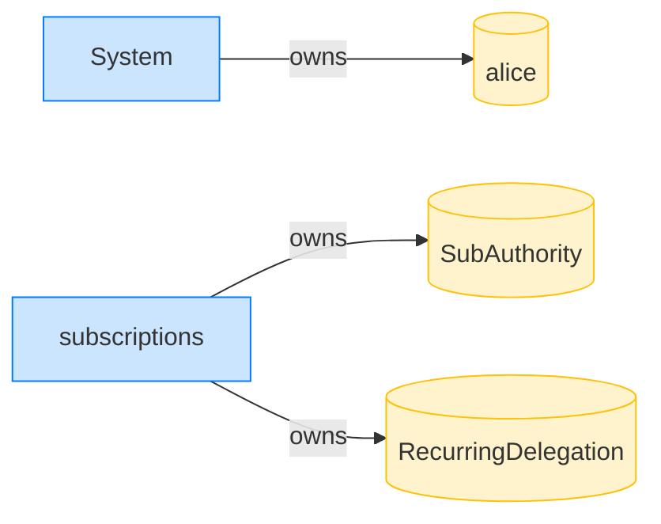

### Bob pulls the full allowance in period 0

**TransferRecurring (period 0): structured CPI tree**

```text

Transaction  signers=[bob]
└── subscriptions::TransferRecurring [1] ✓ 8664cu  signer=bob
    ├── Token [2] ✓ 113cu
    └── subscriptions [2] ✓ 137cu
          🔔 RecurringTransfer
               delegatee:        bob,
               amount:           1000000,
               pulled_in_period: 1000000,
               receiver:         bob
Compute Units (this run): 8664
Fee: 5000 lamports
Legend (2):
  bob           = 9S8NPMnzAba71o3tr8dHDzUrfT5NesYFzP56QFpYieMR
  subscriptions = De1egAFMkMWZSN5rYXRj9CAdheBamobVNubTsi9avR44
```

**TransferRecurring (period 0): sequence diagram**

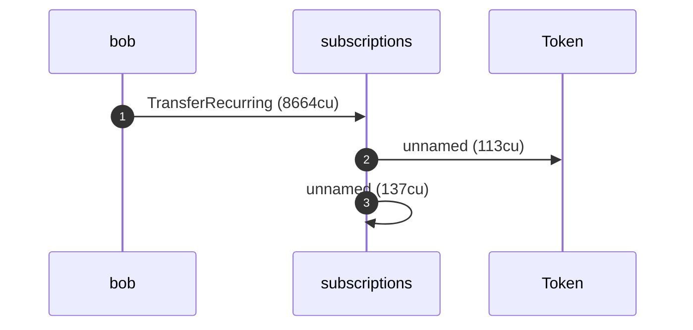

**TransferRecurring (period 0): sequence diagram, with lifelines**

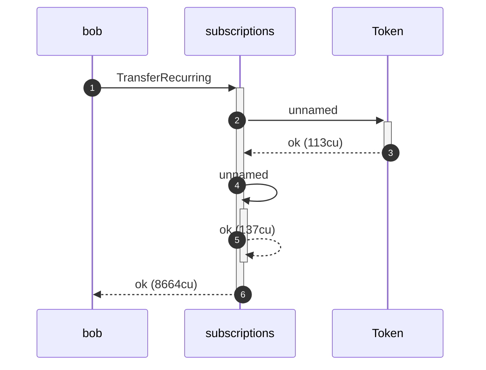

**TransferRecurring (period 0): authority graph**

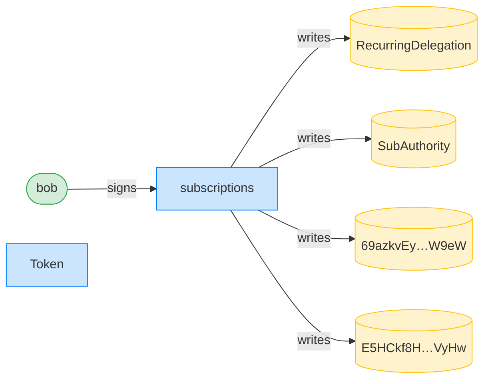

**TransferRecurring (period 0): ownership graph**

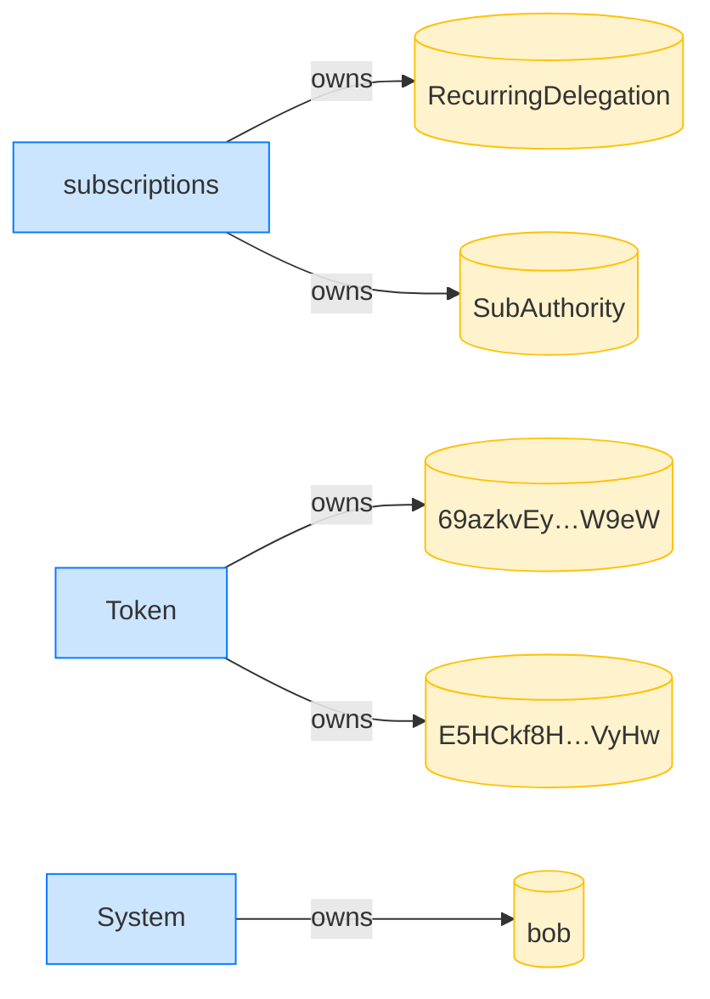

- [x] Bob received the full allowance: `1000000`

### A period elapses, landing exactly at expiry; the rollover pull is refused

**TransferRecurring (rollover at expiry): structured CPI tree**

```text

Transaction  signers=[bob]
└── subscriptions::TransferRecurring [1] ✗ 1018cu  signer=bob
    └── Error: AmountExceedsPeriodLimit
Error: InstructionError(0, Custom(400))
Compute Units (this run): 1018
Fee: 5000 lamports
Legend (2):
  bob           = 9S8NPMnzAba71o3tr8dHDzUrfT5NesYFzP56QFpYieMR
  subscriptions = De1egAFMkMWZSN5rYXRj9CAdheBamobVNubTsi9avR44
```

- [x] Bob's balance is unchanged: `1000000`
