## Recurring transfer after a token Revoke is refused until re-approved for the max — PASS

> revoking the SPL approval breaks the pull; a partial re-approval still fails; only a max approval restores it

### Stage: Alice's authority and a recurring delegation to Bob

**InitSubscriptionAuthority: structured CPI tree**

```text

── subscriptions::InitSubscriptionAuthority ────────────────
Transaction  signers=[alice]
└── subscriptions::InitSubscriptionAuthority [1] ✓ 6242cu  signer=alice
    ├── System::CreateAccount [2] ✓ (no cu)
    └── Token::Approve [2] ✓ 126cu
Compute Units (this run): 6242
Fee: 5000 lamports
Legend (2):
  subscriptions = De1egAFMkMWZSN5rYXRj9CAdheBamobVNubTsi9avR44
  alice         = FXddRd8CdAC8SWKT3Ataasn69R7rbTfQZcKg8ejyrUbF
```

**InitSubscriptionAuthority: sequence diagram**

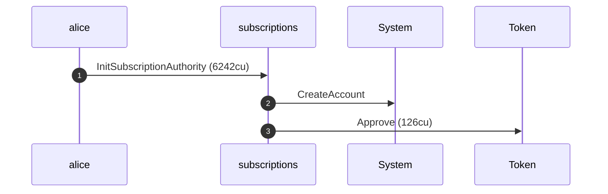

**InitSubscriptionAuthority: sequence diagram, with lifelines**

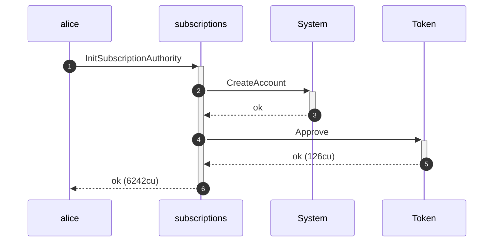

**InitSubscriptionAuthority: authority graph**

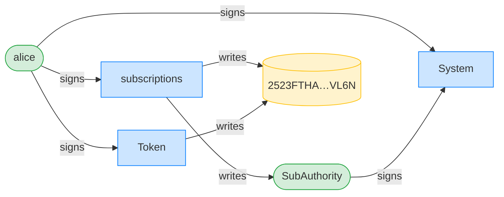

**InitSubscriptionAuthority: ownership graph**

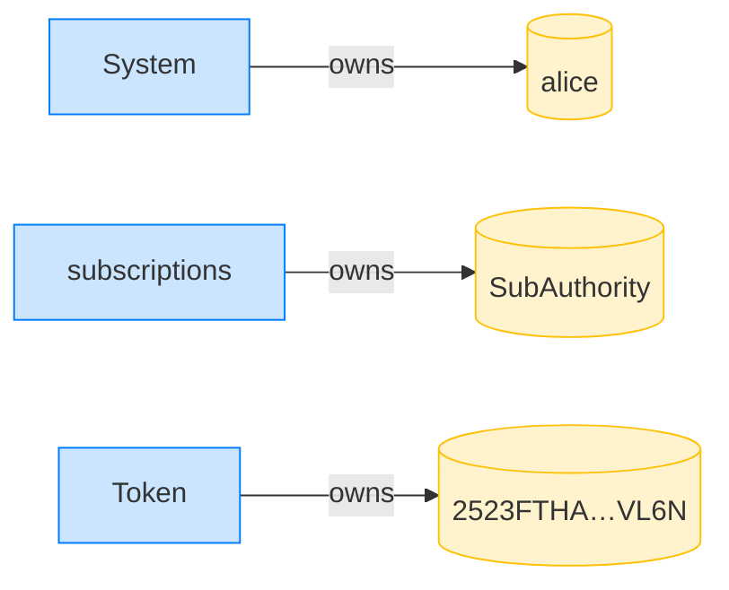

**CreateRecurringDelegation: structured CPI tree**

```text

── subscriptions::CreateRecurringDelegation ────────────────
Transaction  signers=[alice]
└── subscriptions::CreateRecurringDelegation [1] ✓ 5073cu  signer=alice
    └── System::CreateAccount [2] ✓ (no cu)
Compute Units (this run): 5073
Fee: 5000 lamports
Legend (2):
  subscriptions = De1egAFMkMWZSN5rYXRj9CAdheBamobVNubTsi9avR44
  alice         = FXddRd8CdAC8SWKT3Ataasn69R7rbTfQZcKg8ejyrUbF
```

**CreateRecurringDelegation: sequence diagram**

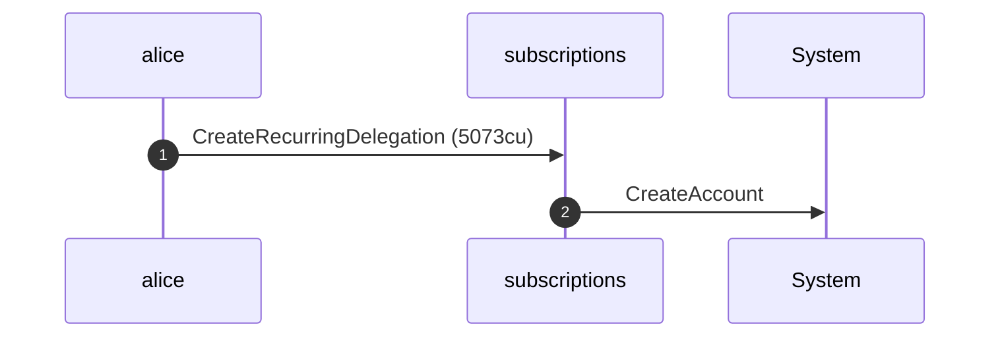

**CreateRecurringDelegation: sequence diagram, with lifelines**

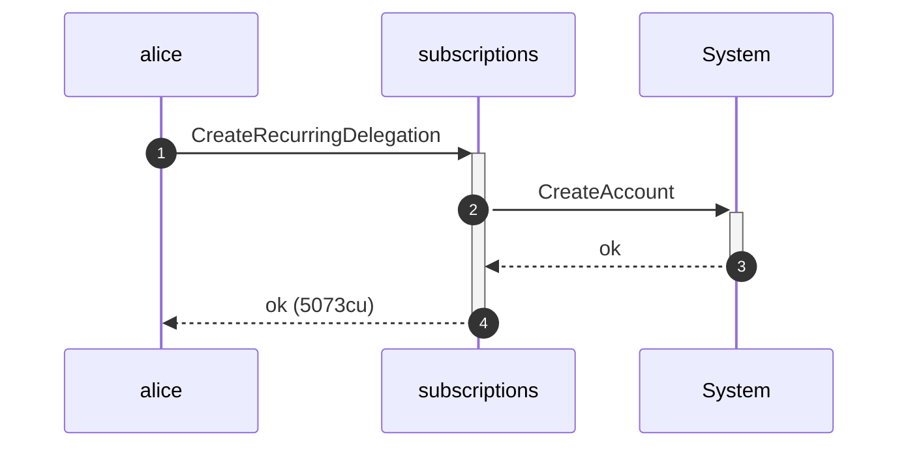

**CreateRecurringDelegation: authority graph**

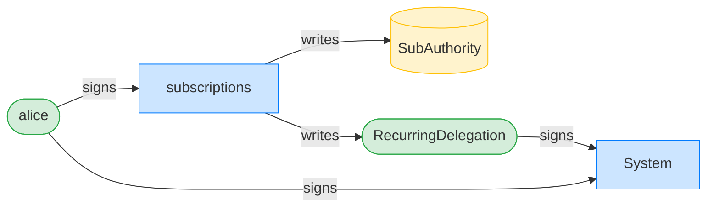

**CreateRecurringDelegation: ownership graph**

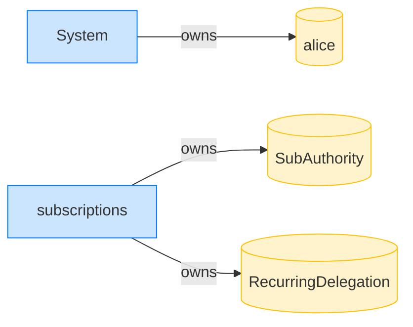

- [x] Bob's ATA starts empty: `0`

### Bob pulls the full 50 tokens in period 0

**TransferRecurring (period 0): structured CPI tree**

```text

── subscriptions::TransferRecurring ────────────────────────
Transaction  signers=[bob]
└── subscriptions::TransferRecurring [1] ✓ 5664cu  signer=bob
    ├── Token::TransferChecked [2] ✓ 113cu
    └── subscriptions::EmitEvent [2] ✓ 137cu
          🔔 RecurringTransfer
               delegatee:        bob,
               amount:           50000000,
               pulled_in_period: 50000000,
               receiver:         bob
Compute Units (this run): 5664
Fee: 5000 lamports
Legend (2):
  subscriptions = De1egAFMkMWZSN5rYXRj9CAdheBamobVNubTsi9avR44
  bob           = 9S8NPMnzAba71o3tr8dHDzUrfT5NesYFzP56QFpYieMR
```

**TransferRecurring (period 0): sequence diagram**

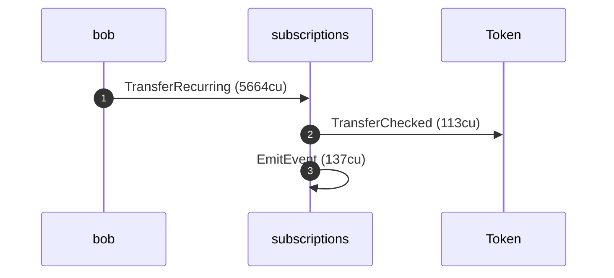

**TransferRecurring (period 0): sequence diagram, with lifelines**

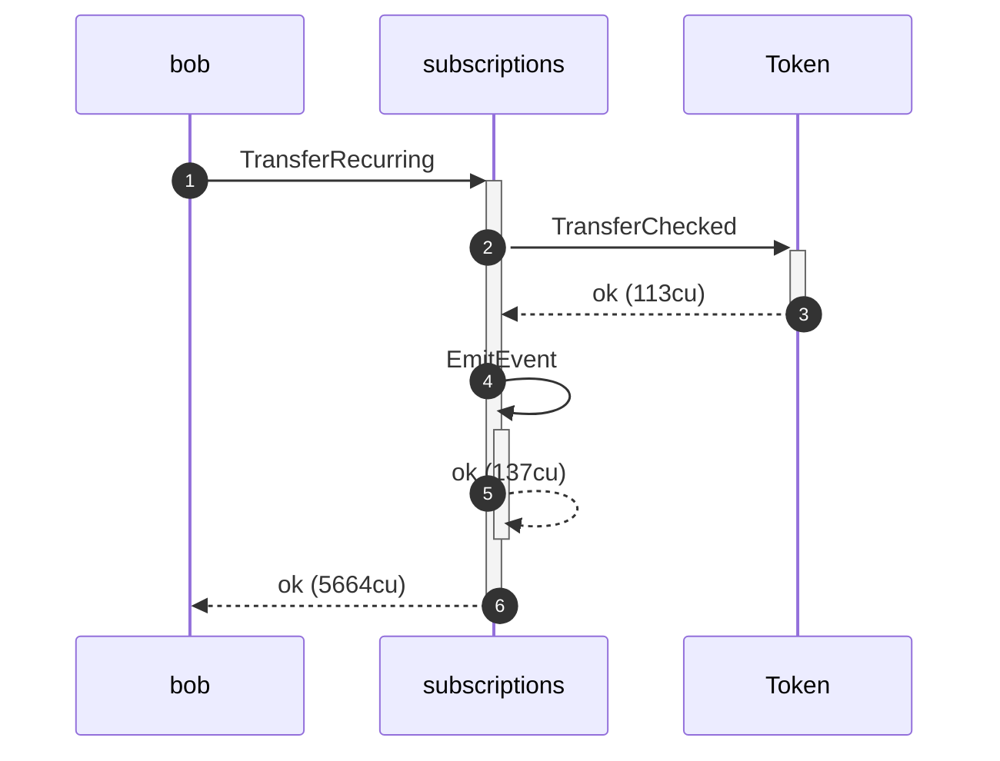

**TransferRecurring (period 0): authority graph**

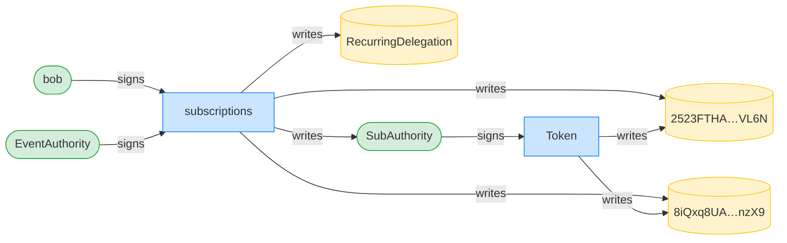

**TransferRecurring (period 0): ownership graph**

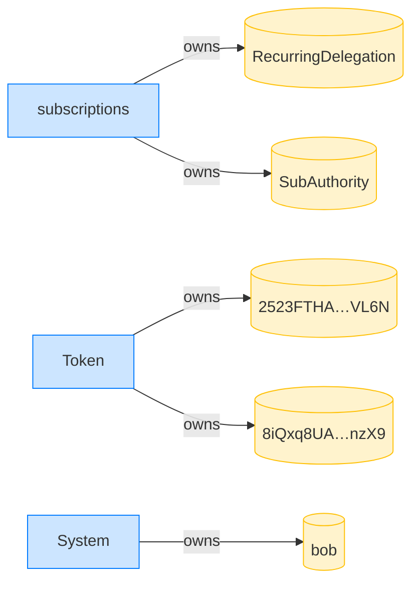

- [x] Bob received 50 tokens: `50000000`

### Alice revokes the SPL token approval over her ATA

**Revoke: structured CPI tree**

```text

── Token::Revoke ───────────────────────────────────────────
Transaction  signers=[alice]
└── Token::Revoke [1] ✓ 108cu  signer=alice
Compute Units (this run): 108
Fee: 5000 lamports
Legend (1):
  alice = FXddRd8CdAC8SWKT3Ataasn69R7rbTfQZcKg8ejyrUbF
```

**Revoke: sequence diagram**


**Revoke: sequence diagram, with lifelines**

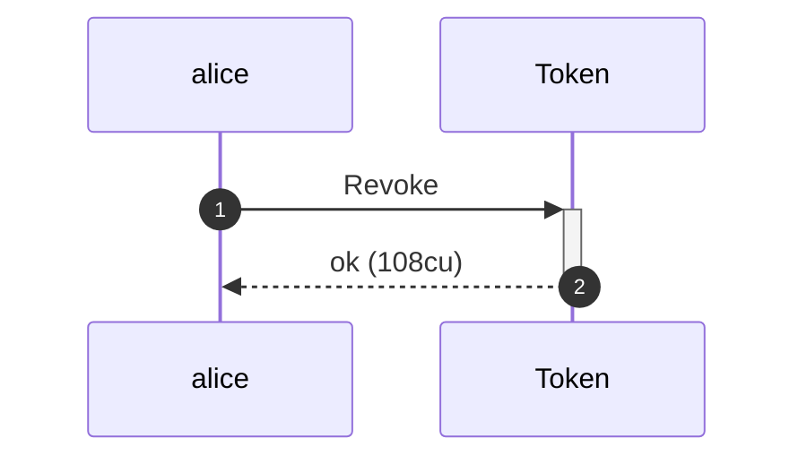

**Revoke: authority graph**

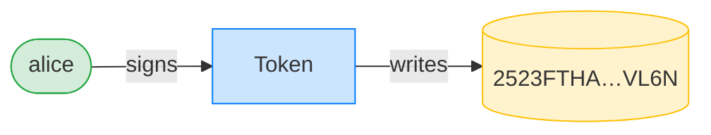

**Revoke: ownership graph**

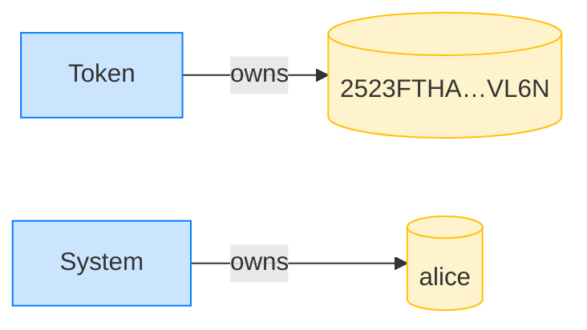

### A full period elapses; Bob's pull now fails with an owner mismatch

**TransferRecurring (after revoke): structured CPI tree**

```text

── subscriptions::TransferRecurring ────────────────────────
Transaction  signers=[bob]
└── subscriptions::TransferRecurring [1] ✗ 4449cu  signer=bob
    ├── Token::TransferChecked [2] ✗ 227cu
    │   └── Error: custom program error: 0x4
    └── Error: custom program error: 0x4
Error: InstructionError(0, Custom(4))
Compute Units (this run): 4449
Fee: 5000 lamports
Legend (2):
  subscriptions = De1egAFMkMWZSN5rYXRj9CAdheBamobVNubTsi9avR44
  bob           = 9S8NPMnzAba71o3tr8dHDzUrfT5NesYFzP56QFpYieMR
```

### Alice re-approves, but for too small an amount; the pull still fails

**Approve (partial): structured CPI tree**

```text

── Token::Approve ──────────────────────────────────────────
Transaction  signers=[alice]
└── Token::Approve [1] ✓ 126cu  signer=alice
Compute Units (this run): 126
Fee: 5000 lamports
Legend (1):
  alice = FXddRd8CdAC8SWKT3Ataasn69R7rbTfQZcKg8ejyrUbF
```

**Approve (partial): sequence diagram**

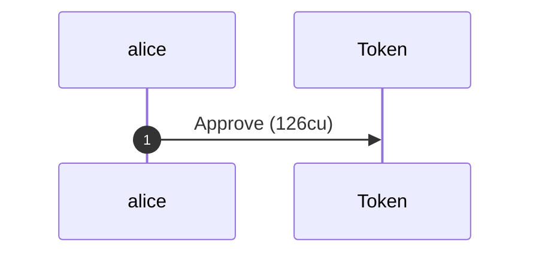

**Approve (partial): sequence diagram, with lifelines**


**Approve (partial): authority graph**

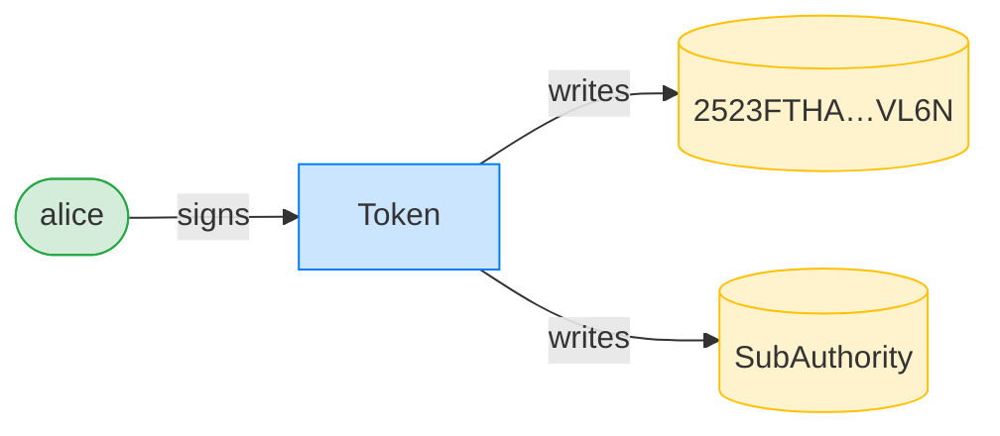

**Approve (partial): ownership graph**

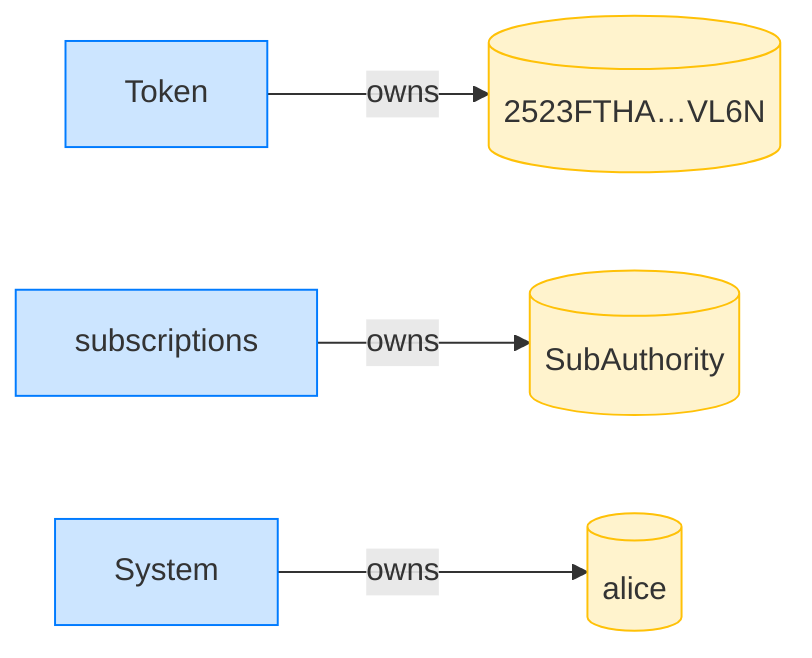

**TransferRecurring (partial approval): structured CPI tree**

```text

── subscriptions::TransferRecurring ────────────────────────
Transaction  signers=[bob]
└── subscriptions::TransferRecurring [1] ✗ 4465cu  signer=bob
    ├── Token::TransferChecked [2] ✗ 243cu
    │   └── Error: custom program error: 0x1
    └── Error: custom program error: 0x1
Error: InstructionError(0, Custom(1))
Compute Units (this run): 4465
Fee: 5000 lamports
Legend (2):
  subscriptions = De1egAFMkMWZSN5rYXRj9CAdheBamobVNubTsi9avR44
  bob           = 9S8NPMnzAba71o3tr8dHDzUrfT5NesYFzP56QFpYieMR
```

### Alice re-approves for the max amount; the pull succeeds again

**Approve (max): structured CPI tree**

```text

── Token::Approve ──────────────────────────────────────────
Transaction  signers=[alice]
└── Token::Approve [1] ✓ 126cu  signer=alice
Compute Units (this run): 126
Fee: 5000 lamports
Legend (1):
  alice = FXddRd8CdAC8SWKT3Ataasn69R7rbTfQZcKg8ejyrUbF
```

**Approve (max): sequence diagram**

```mermaid
sequenceDiagram
    autonumber
    participant alice
    participant Token
    alice ->> Token: Approve (126cu)
```

**Approve (max): sequence diagram, with lifelines**

```mermaid
sequenceDiagram
    autonumber
    participant alice
    participant Token
    alice ->>+ Token: Approve
    Token -->>- alice: ok (126cu)
```

**Approve (max): authority graph**

```mermaid
flowchart LR
    classDef signer fill:#d4edda,stroke:#28a745;
    classDef program fill:#cce5ff,stroke:#007bff;
    classDef writable fill:#fff3cd,stroke:#ffc107;
    Token[Token]:::program
    2523FTHA_VL6N[("2523FTHA…VL6N")]:::writable
    SubAuthority[(SubAuthority)]:::writable
    alice([alice]):::signer
    alice -->|signs| Token
    Token -->|writes| 2523FTHA_VL6N
    Token -->|writes| SubAuthority
```

**Approve (max): ownership graph**

```mermaid
flowchart LR
    classDef owner fill:#cce5ff,stroke:#007bff;
    classDef account fill:#fff3cd,stroke:#ffc107;
    Token[Token]:::owner
    2523FTHA_VL6N[("2523FTHA…VL6N")]:::account
    subscriptions[subscriptions]:::owner
    SubAuthority[(SubAuthority)]:::account
    System[System]:::owner
    alice[(alice)]:::account
    Token -->|owns| 2523FTHA_VL6N
    subscriptions -->|owns| SubAuthority
    System -->|owns| alice
```

**TransferRecurring (after max approval): structured CPI tree**

```text

── subscriptions::TransferRecurring ────────────────────────
Transaction  signers=[bob]
└── subscriptions::TransferRecurring [1] ✓ 5755cu  signer=bob
    ├── Token::TransferChecked [2] ✓ 113cu
    └── subscriptions::EmitEvent [2] ✓ 137cu
          🔔 RecurringTransfer
               delegatee:        bob,
               amount:           50000000,
               pulled_in_period: 50000000,
               receiver:         bob
Compute Units (this run): 5755
Fee: 5000 lamports
Legend (2):
  subscriptions = De1egAFMkMWZSN5rYXRj9CAdheBamobVNubTsi9avR44
  bob           = 9S8NPMnzAba71o3tr8dHDzUrfT5NesYFzP56QFpYieMR
```

**TransferRecurring (after max approval): sequence diagram**

```mermaid
sequenceDiagram
    autonumber
    participant bob
    participant subscriptions
    participant Token
    bob ->> subscriptions: TransferRecurring (5755cu)
    subscriptions ->> Token: TransferChecked (113cu)
    subscriptions ->> subscriptions: EmitEvent (137cu)
```

**TransferRecurring (after max approval): sequence diagram, with lifelines**

```mermaid
sequenceDiagram
    autonumber
    participant bob
    participant subscriptions
    participant Token
    bob ->>+ subscriptions: TransferRecurring
    subscriptions ->>+ Token: TransferChecked
    Token -->>- subscriptions: ok (113cu)
    subscriptions ->>+ subscriptions: EmitEvent
    subscriptions -->>- subscriptions: ok (137cu)
    subscriptions -->>- bob: ok (5755cu)
```

**TransferRecurring (after max approval): authority graph**

```mermaid
flowchart LR
    classDef signer fill:#d4edda,stroke:#28a745;
    classDef program fill:#cce5ff,stroke:#007bff;
    classDef writable fill:#fff3cd,stroke:#ffc107;
    subscriptions[subscriptions]:::program
    RecurringDelegation[(RecurringDelegation)]:::writable
    SubAuthority([SubAuthority]):::signer
    2523FTHA_VL6N[("2523FTHA…VL6N")]:::writable
    8iQxq8UA_nzX9[("8iQxq8UA…nzX9")]:::writable
    bob([bob]):::signer
    Token[Token]:::program
    EventAuthority([EventAuthority]):::signer
    bob -->|signs| subscriptions
    SubAuthority -->|signs| Token
    EventAuthority -->|signs| subscriptions
    subscriptions -->|writes| RecurringDelegation
    subscriptions -->|writes| SubAuthority
    subscriptions -->|writes| 2523FTHA_VL6N
    subscriptions -->|writes| 8iQxq8UA_nzX9
    Token -->|writes| 2523FTHA_VL6N
    Token -->|writes| 8iQxq8UA_nzX9
```

**TransferRecurring (after max approval): ownership graph**

```mermaid
flowchart LR
    classDef owner fill:#cce5ff,stroke:#007bff;
    classDef account fill:#fff3cd,stroke:#ffc107;
    subscriptions[subscriptions]:::owner
    RecurringDelegation[(RecurringDelegation)]:::account
    SubAuthority[(SubAuthority)]:::account
    Token[Token]:::owner
    2523FTHA_VL6N[("2523FTHA…VL6N")]:::account
    8iQxq8UA_nzX9[("8iQxq8UA…nzX9")]:::account
    System[System]:::owner
    bob[(bob)]:::account
    subscriptions -->|owns| RecurringDelegation
    subscriptions -->|owns| SubAuthority
    Token -->|owns| 2523FTHA_VL6N
    Token -->|owns| 8iQxq8UA_nzX9
    System -->|owns| bob
```
