## Recurring transfer after expiry is refused — PASS

> a pull within the window succeeds; once the clock passes expiry, a further pull is refused

### Stage: Alice's authority and a recurring delegation to Bob

**InitSubscriptionAuthority: structured CPI tree**

```text

Transaction  signers=[alice]
└── subscriptions::InitSubscriptionAuthority [1] ✓ 9242cu  signer=alice
    ├── System::CreateAccount [2] ✓ (no cu)
    └── Token::Approve [2] ✓ 126cu
Compute Units (this run): 9242
Fee: 5000 lamports
Legend (2):
  alice         = FXddRd8CdAC8SWKT3Ataasn69R7rbTfQZcKg8ejyrUbF
  subscriptions = De1egAFMkMWZSN5rYXRj9CAdheBamobVNubTsi9avR44
```

**InitSubscriptionAuthority: sequence diagram**

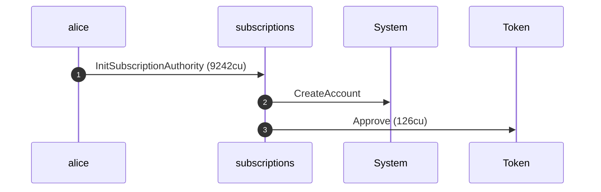

**InitSubscriptionAuthority: sequence diagram, with lifelines**

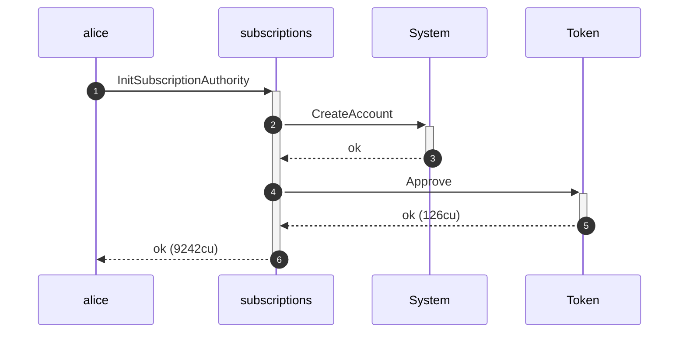

**InitSubscriptionAuthority: authority graph**

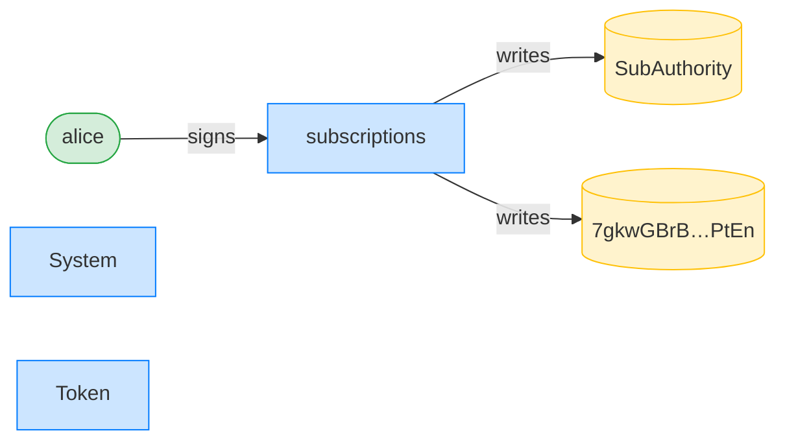

**InitSubscriptionAuthority: ownership graph**

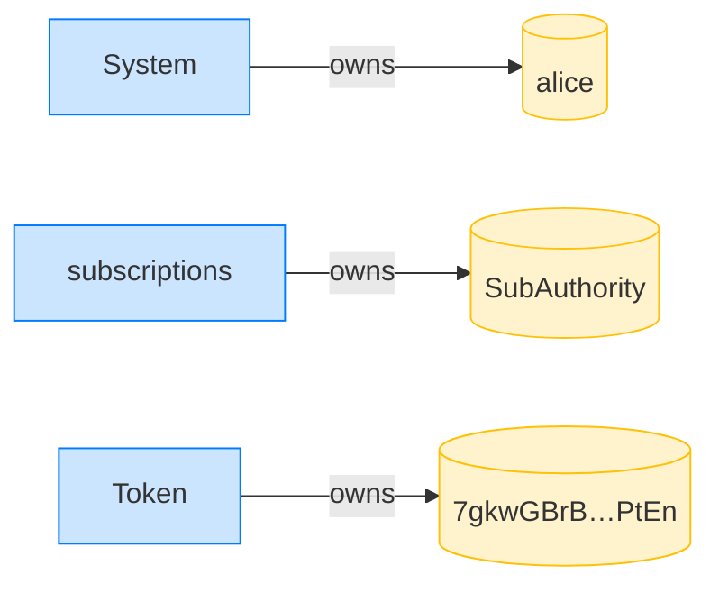

**CreateRecurringDelegation: structured CPI tree**

```text

Transaction  signers=[alice]
└── subscriptions::CreateRecurringDelegation [1] ✓ 5073cu  signer=alice
    └── System::CreateAccount [2] ✓ (no cu)
Compute Units (this run): 5073
Fee: 5000 lamports
Legend (2):
  alice         = FXddRd8CdAC8SWKT3Ataasn69R7rbTfQZcKg8ejyrUbF
  subscriptions = De1egAFMkMWZSN5rYXRj9CAdheBamobVNubTsi9avR44
```

**CreateRecurringDelegation: sequence diagram**

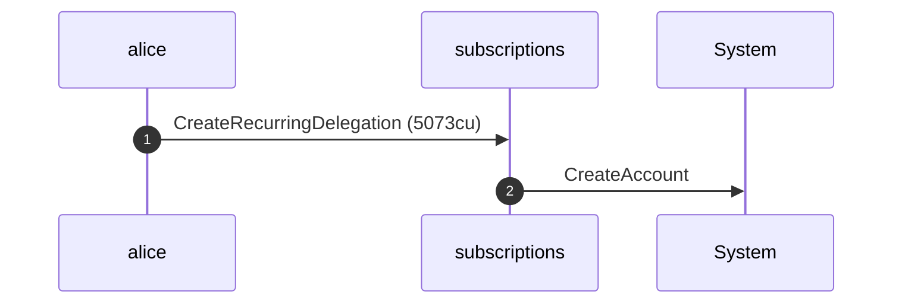

**CreateRecurringDelegation: sequence diagram, with lifelines**

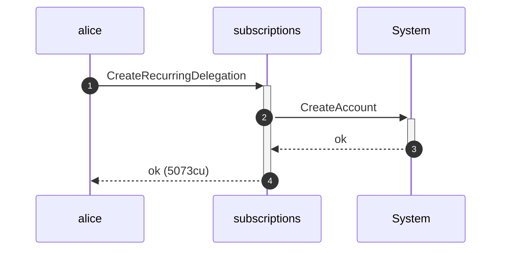

**CreateRecurringDelegation: authority graph**

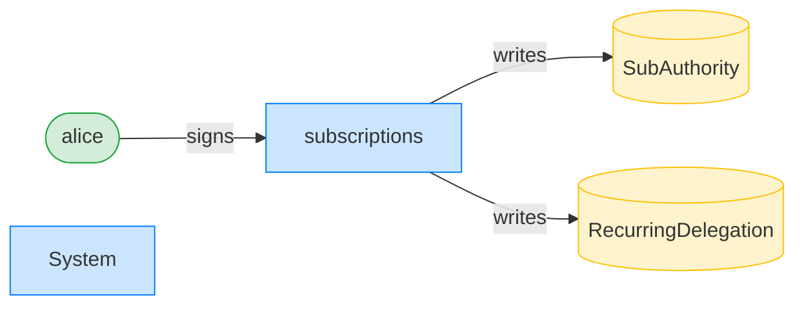

**CreateRecurringDelegation: ownership graph**

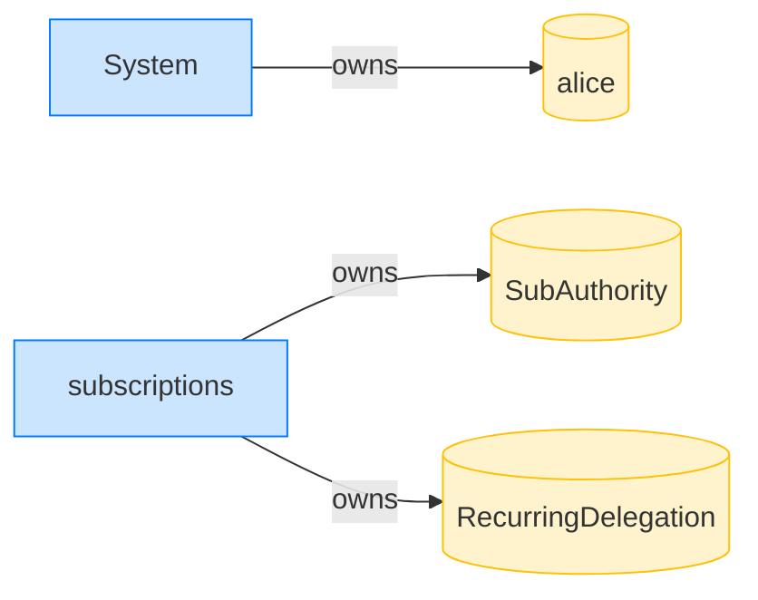

- [x] Bob's ATA starts empty: `0`

### Bob pulls 30 tokens within the window

**TransferRecurring (within window): structured CPI tree**

```text

Transaction  signers=[bob]
└── subscriptions::TransferRecurring [1] ✓ 8664cu  signer=bob
    ├── Token::TransferChecked [2] ✓ 113cu
    └── subscriptions::EmitEvent [2] ✓ 137cu
          🔔 RecurringTransfer
               delegatee:        bob,
               amount:           30000000,
               pulled_in_period: 30000000,
               receiver:         bob
Compute Units (this run): 8664
Fee: 5000 lamports
Legend (2):
  bob           = 9S8NPMnzAba71o3tr8dHDzUrfT5NesYFzP56QFpYieMR
  subscriptions = De1egAFMkMWZSN5rYXRj9CAdheBamobVNubTsi9avR44
```

**TransferRecurring (within window): sequence diagram**

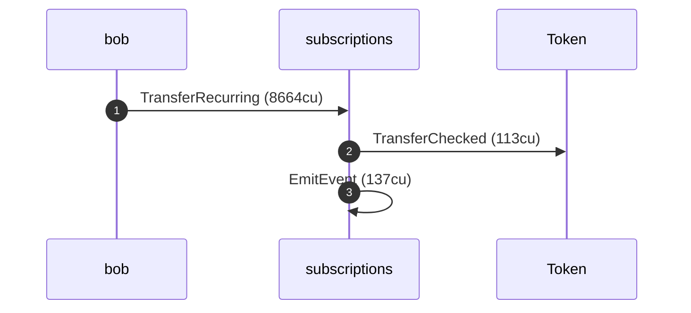

**TransferRecurring (within window): sequence diagram, with lifelines**

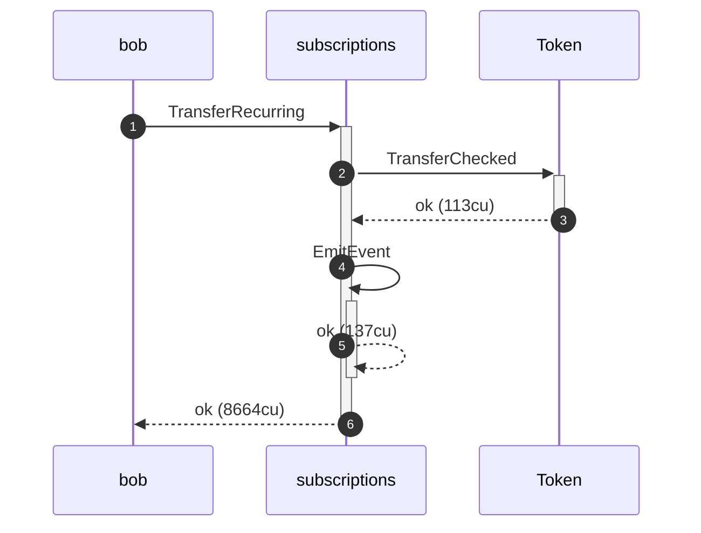

**TransferRecurring (within window): authority graph**

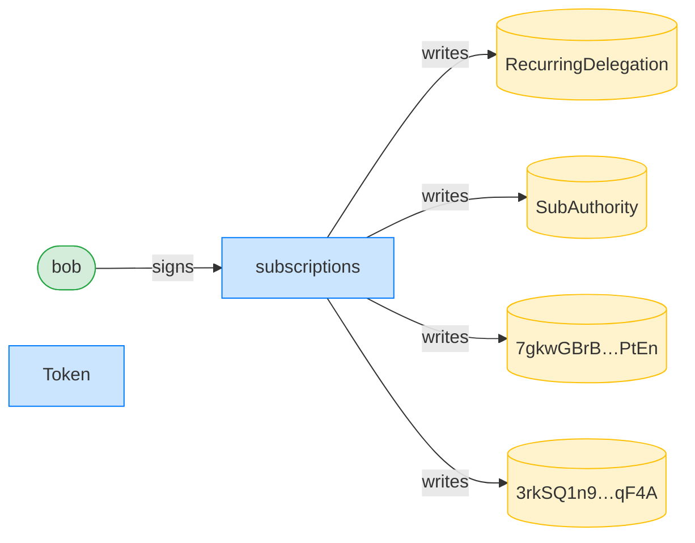

**TransferRecurring (within window): ownership graph**

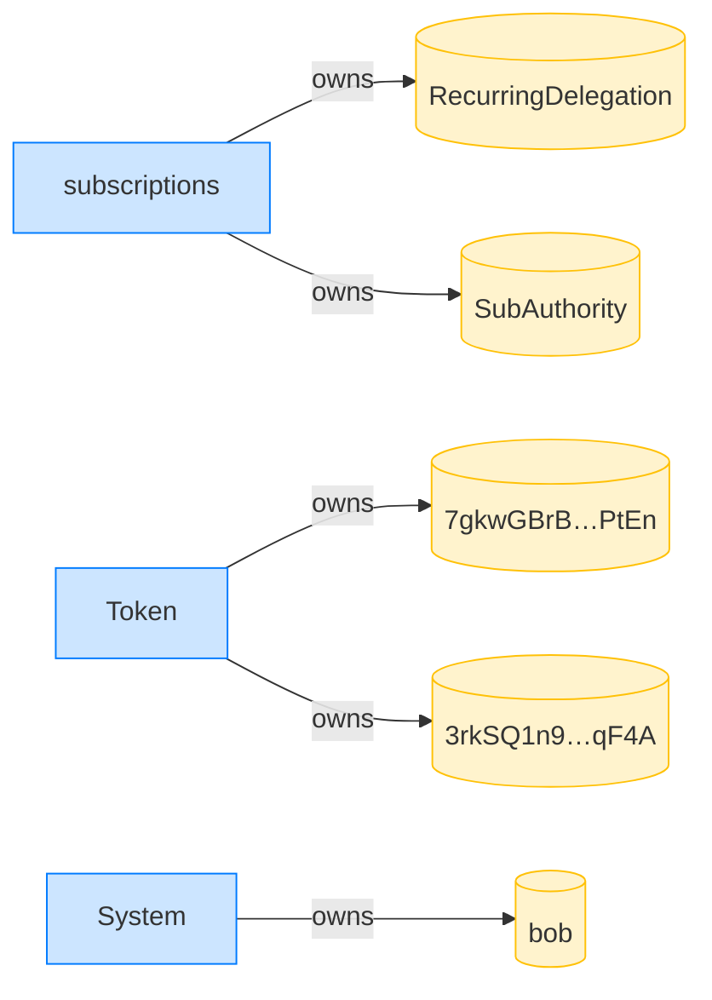

- [x] Bob received 30 tokens: `30000000`

### The clock advances past expiry; a further pull is refused

**TransferRecurring (expired): structured CPI tree**

```text

Transaction  signers=[bob]
└── subscriptions::TransferRecurring [1] ✗ 911cu  signer=bob
    └── Error: DelegationExpired
Error: InstructionError(0, Custom(128))
Compute Units (this run): 911
Fee: 5000 lamports
Legend (2):
  bob           = 9S8NPMnzAba71o3tr8dHDzUrfT5NesYFzP56QFpYieMR
  subscriptions = De1egAFMkMWZSN5rYXRj9CAdheBamobVNubTsi9avR44
```

- [x] Bob's balance is unchanged: `30000000`
