## Recurring transfer aligns the period start when periods are skipped — PASS

> after skipping three periods, the period start jumps forward by a whole number of periods

### Stage: Alice's authority and a recurring delegation to Bob

**InitSubscriptionAuthority: structured CPI tree**

```text

── subscriptions::InitSubscriptionAuthority ────────────────
Transaction  signers=[alice]
└── subscriptions::InitSubscriptionAuthority [1] ✓ 9242cu  signer=alice
    ├── System::CreateAccount [2] ✓ (no cu)
    └── Token::Approve [2] ✓ 126cu
Compute Units (this run): 9242
Fee: 5000 lamports
Legend (2):
  subscriptions = De1egAFMkMWZSN5rYXRj9CAdheBamobVNubTsi9avR44
  alice         = FXddRd8CdAC8SWKT3Ataasn69R7rbTfQZcKg8ejyrUbF
```

**InitSubscriptionAuthority: sequence diagram**

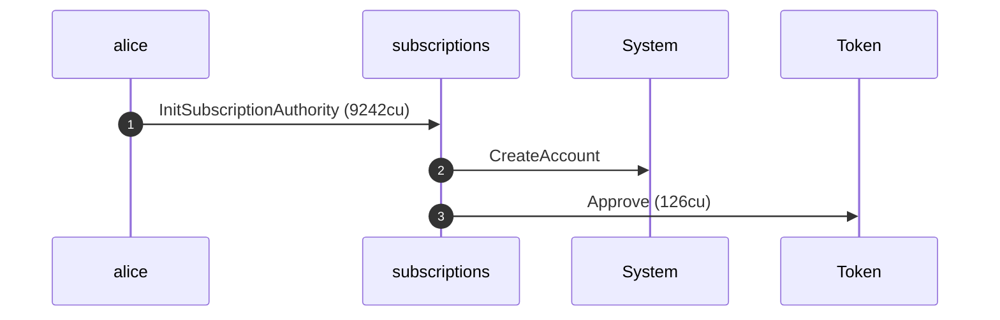

**InitSubscriptionAuthority: sequence diagram, with lifelines**

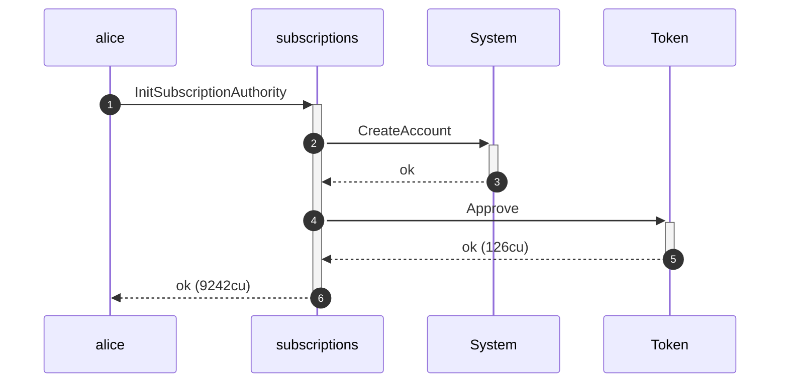

**InitSubscriptionAuthority: authority graph**

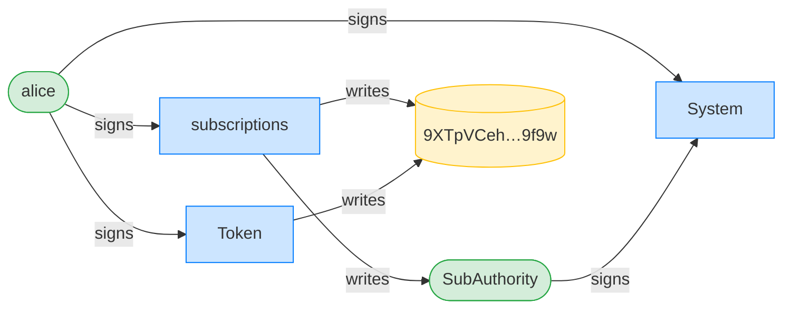

**InitSubscriptionAuthority: ownership graph**

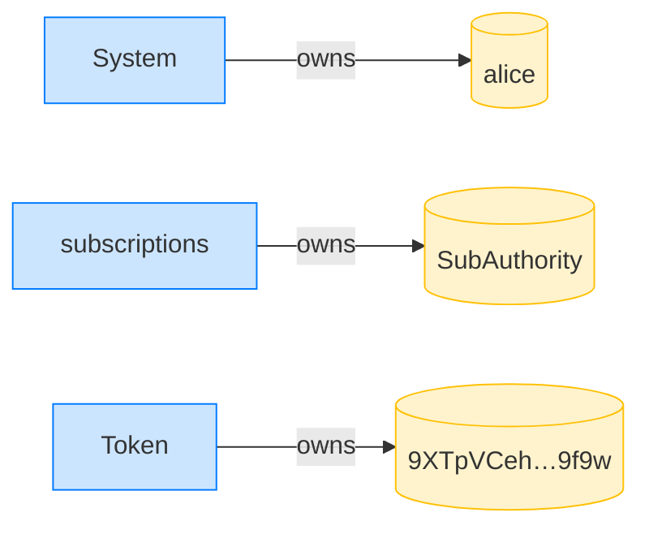

**CreateRecurringDelegation: structured CPI tree**

```text

── subscriptions::CreateRecurringDelegation ────────────────
Transaction  signers=[alice]
└── subscriptions::CreateRecurringDelegation [1] ✓ 3573cu  signer=alice
    └── System::CreateAccount [2] ✓ (no cu)
Compute Units (this run): 3573
Fee: 5000 lamports
Legend (2):
  subscriptions = De1egAFMkMWZSN5rYXRj9CAdheBamobVNubTsi9avR44
  alice         = FXddRd8CdAC8SWKT3Ataasn69R7rbTfQZcKg8ejyrUbF
```

**CreateRecurringDelegation: sequence diagram**

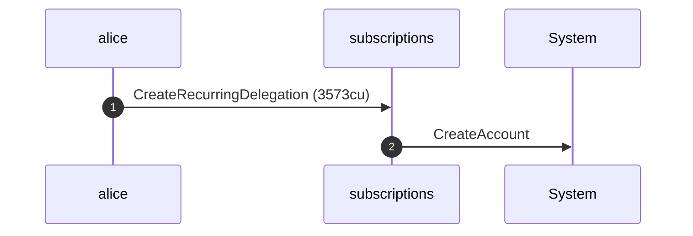

**CreateRecurringDelegation: sequence diagram, with lifelines**

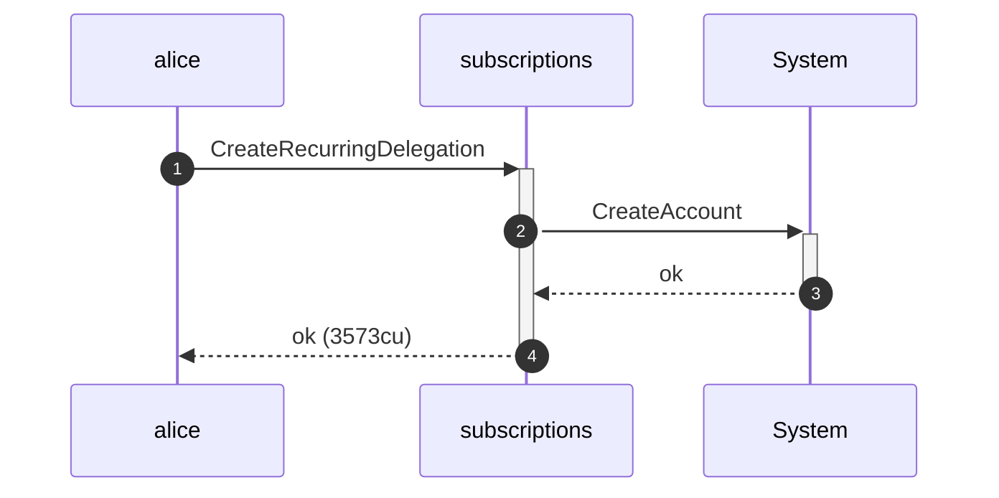

**CreateRecurringDelegation: authority graph**

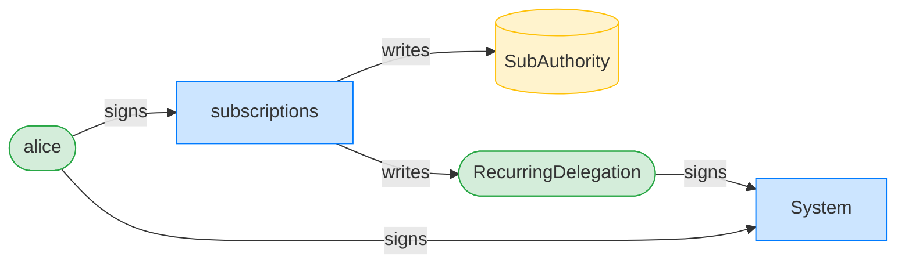

**CreateRecurringDelegation: ownership graph**

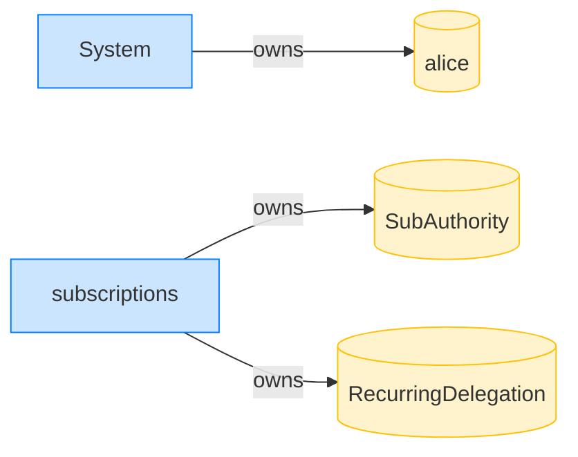

- [x] Bob's ATA starts empty: `0`

### Period 0: Bob pulls 10 tokens

**TransferRecurring (period 0): structured CPI tree**

```text

── subscriptions::TransferRecurring ────────────────────────
Transaction  signers=[bob]
└── subscriptions::TransferRecurring [1] ✓ 7164cu  signer=bob
    ├── Token::TransferChecked [2] ✓ 113cu
    └── subscriptions::EmitEvent [2] ✓ 137cu
          🔔 RecurringTransfer
               delegatee:        bob,
               amount:           10000000,
               pulled_in_period: 10000000,
               receiver:         bob
Compute Units (this run): 7164
Fee: 5000 lamports
Legend (2):
  subscriptions = De1egAFMkMWZSN5rYXRj9CAdheBamobVNubTsi9avR44
  bob           = 9S8NPMnzAba71o3tr8dHDzUrfT5NesYFzP56QFpYieMR
```

**TransferRecurring (period 0): sequence diagram**


**TransferRecurring (period 0): sequence diagram, with lifelines**

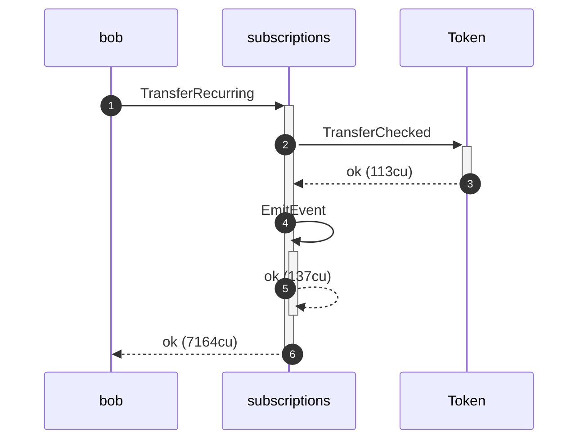

**TransferRecurring (period 0): authority graph**

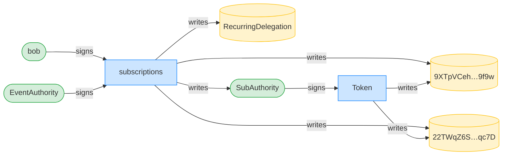

**TransferRecurring (period 0): ownership graph**

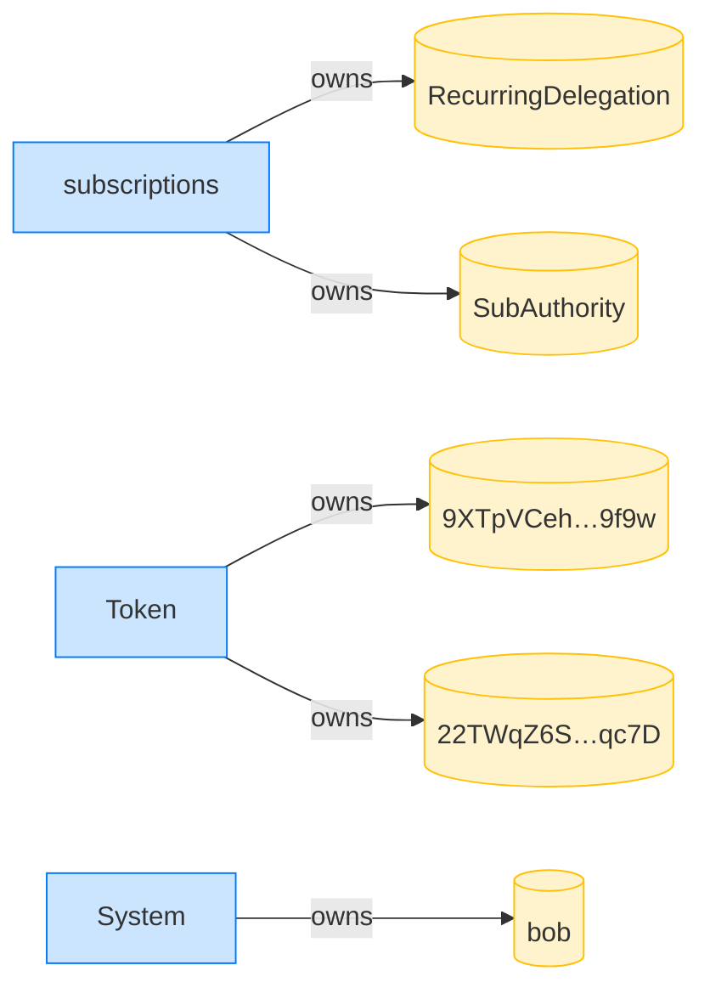

- [x] Bob received 10 tokens: `10000000`

### Three periods are skipped; Bob pulls again in period 3

**TransferRecurring (period 3): structured CPI tree**

```text

── subscriptions::TransferRecurring ────────────────────────
Transaction  signers=[bob]
└── subscriptions::TransferRecurring [1] ✓ 7255cu  signer=bob
    ├── Token::TransferChecked [2] ✓ 113cu
    └── subscriptions::EmitEvent [2] ✓ 137cu
          🔔 RecurringTransfer
               delegatee:        bob,
               amount:           10000000,
               pulled_in_period: 10000000,
               receiver:         bob
Compute Units (this run): 7255
Fee: 5000 lamports
Legend (2):
  subscriptions = De1egAFMkMWZSN5rYXRj9CAdheBamobVNubTsi9avR44
  bob           = 9S8NPMnzAba71o3tr8dHDzUrfT5NesYFzP56QFpYieMR
```

**TransferRecurring (period 3): sequence diagram**

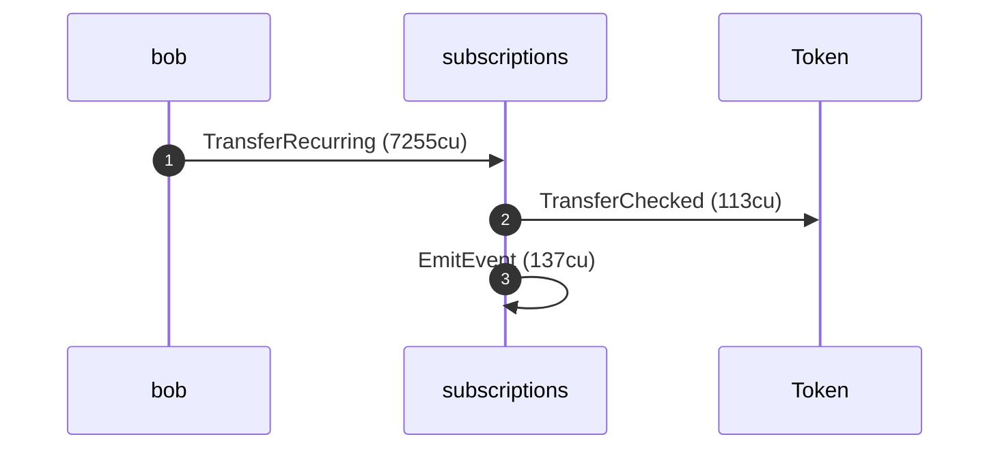

**TransferRecurring (period 3): sequence diagram, with lifelines**


**TransferRecurring (period 3): authority graph**

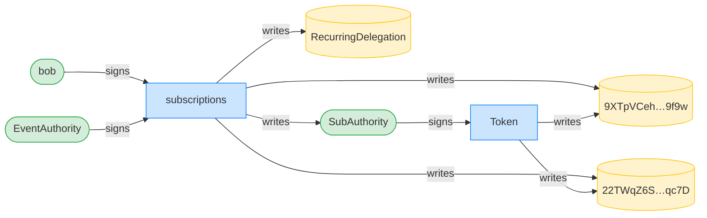

**TransferRecurring (period 3): ownership graph**


- [x] Bob received another 10 tokens: `20000000`
- [x] the period start jumped forward 3 periods: `1700010800`
- [x] only 10 tokens pulled in the new period: `10000000`
