## Recurring transfer before the start time is refused — PASS

> a pull before the delegation's start is refused; once the start passes, it succeeds

### Stage: Alice's authority and a recurring delegation to Bob

**InitSubscriptionAuthority: structured CPI tree**

```text

Transaction  signers=[alice]
└── subscriptions::InitSubscriptionAuthority [1] ✓ 15242cu  signer=alice
    ├── System [2] ✓ (no cu)
    └── Token [2] ✓ 126cu
Compute Units (this run): 15242
Fee: 5000 lamports
Legend (2):
  alice         = FXddRd8CdAC8SWKT3Ataasn69R7rbTfQZcKg8ejyrUbF
  subscriptions = De1egAFMkMWZSN5rYXRj9CAdheBamobVNubTsi9avR44
```

**InitSubscriptionAuthority: sequence diagram**

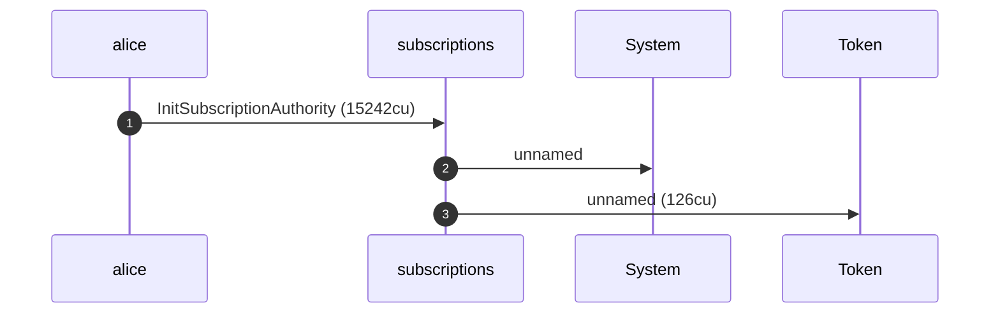

**InitSubscriptionAuthority: sequence diagram, with lifelines**

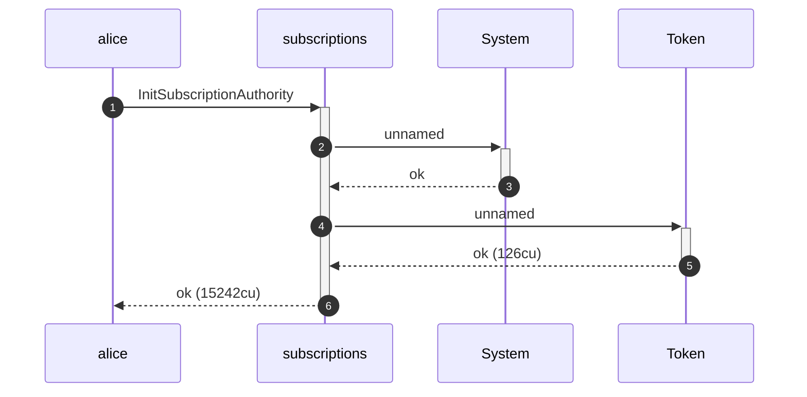

**InitSubscriptionAuthority: authority graph**

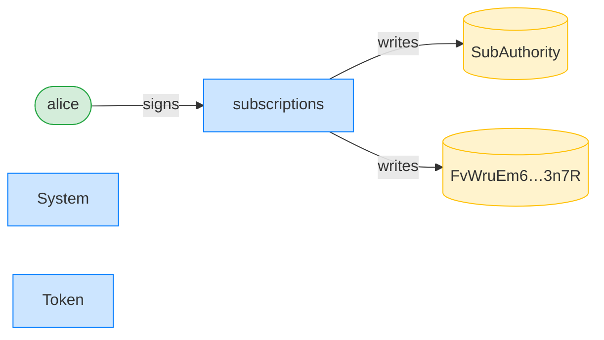

**InitSubscriptionAuthority: ownership graph**

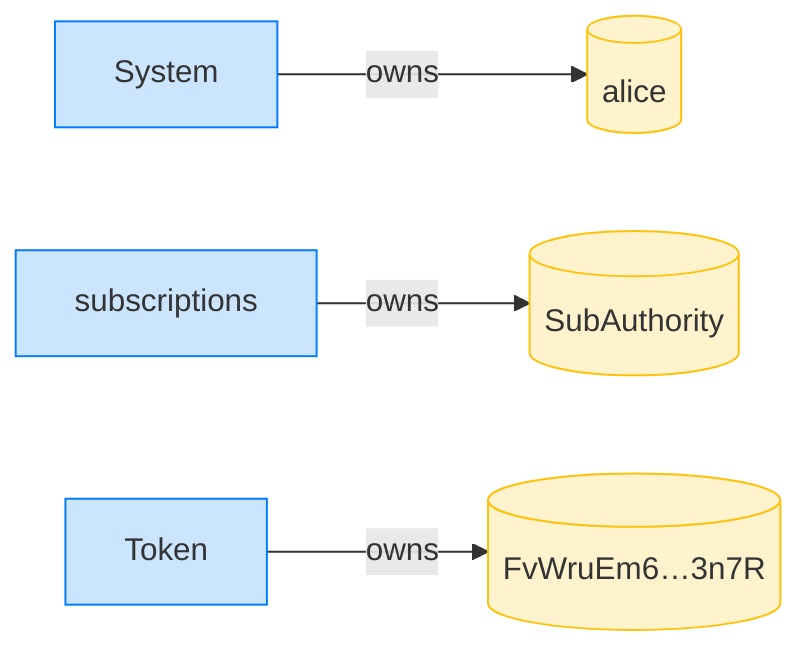

**CreateRecurringDelegation: structured CPI tree**

```text

Transaction  signers=[alice]
└── subscriptions::CreateRecurringDelegation [1] ✓ 3573cu  signer=alice
    └── System [2] ✓ (no cu)
Compute Units (this run): 3573
Fee: 5000 lamports
Legend (2):
  alice         = FXddRd8CdAC8SWKT3Ataasn69R7rbTfQZcKg8ejyrUbF
  subscriptions = De1egAFMkMWZSN5rYXRj9CAdheBamobVNubTsi9avR44
```

**CreateRecurringDelegation: sequence diagram**

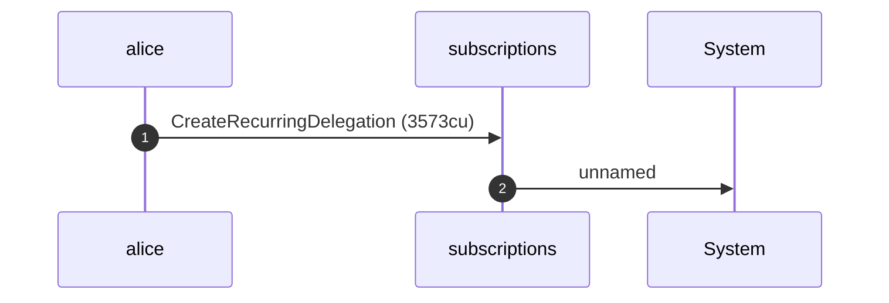

**CreateRecurringDelegation: sequence diagram, with lifelines**

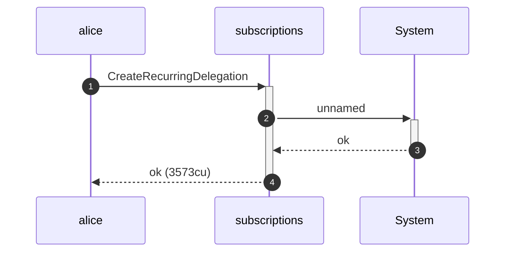

**CreateRecurringDelegation: authority graph**

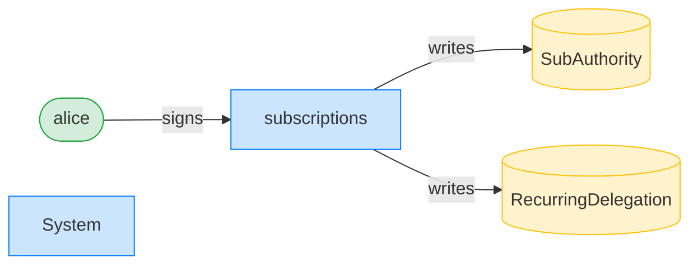

**CreateRecurringDelegation: ownership graph**

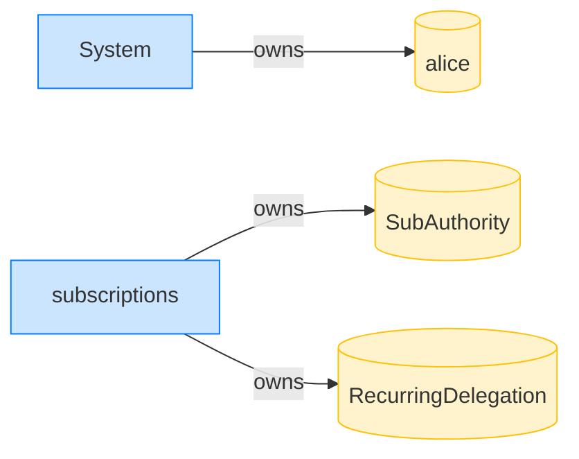

- [x] Bob's ATA starts empty: `0`

### Bob pulls before the start time; it is refused

**TransferRecurring (not started): structured CPI tree**

```text

Transaction  signers=[bob]
└── subscriptions::TransferRecurring [1] ✗ 909cu  signer=bob
    └── Error: DelegationNotStarted
Error: InstructionError(0, Custom(407))
Compute Units (this run): 909
Fee: 5000 lamports
Legend (2):
  bob           = 9S8NPMnzAba71o3tr8dHDzUrfT5NesYFzP56QFpYieMR
  subscriptions = De1egAFMkMWZSN5rYXRj9CAdheBamobVNubTsi9avR44
```

- [x] Bob's ATA is still empty: `0`

### The clock passes the start time; Bob's pull now succeeds

**TransferRecurring (after start): structured CPI tree**

```text

Transaction  signers=[bob]
└── subscriptions::TransferRecurring [1] ✓ 11664cu  signer=bob
    ├── Token [2] ✓ 113cu
    └── subscriptions [2] ✓ 137cu
          🔔 RecurringTransfer
               delegatee:        bob,
               amount:           10000000,
               pulled_in_period: 10000000,
               receiver:         bob
Compute Units (this run): 11664
Fee: 5000 lamports
Legend (2):
  bob           = 9S8NPMnzAba71o3tr8dHDzUrfT5NesYFzP56QFpYieMR
  subscriptions = De1egAFMkMWZSN5rYXRj9CAdheBamobVNubTsi9avR44
```

**TransferRecurring (after start): sequence diagram**

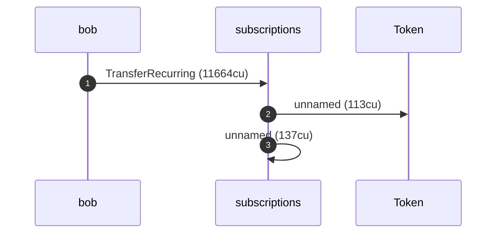

**TransferRecurring (after start): sequence diagram, with lifelines**

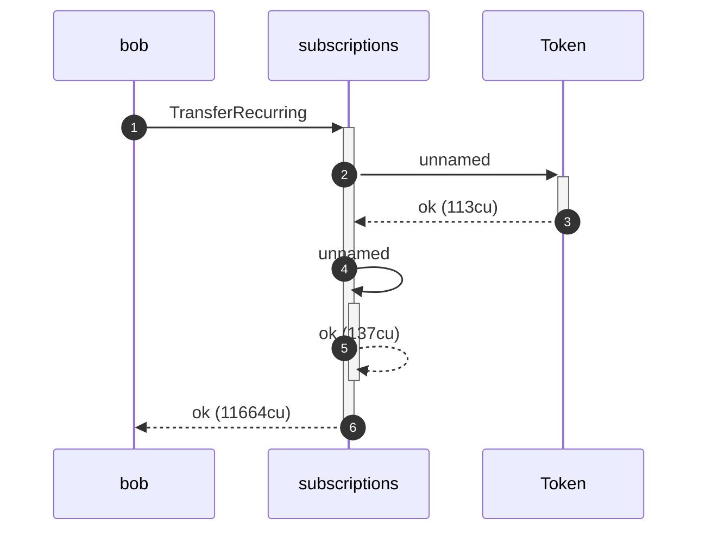

**TransferRecurring (after start): authority graph**

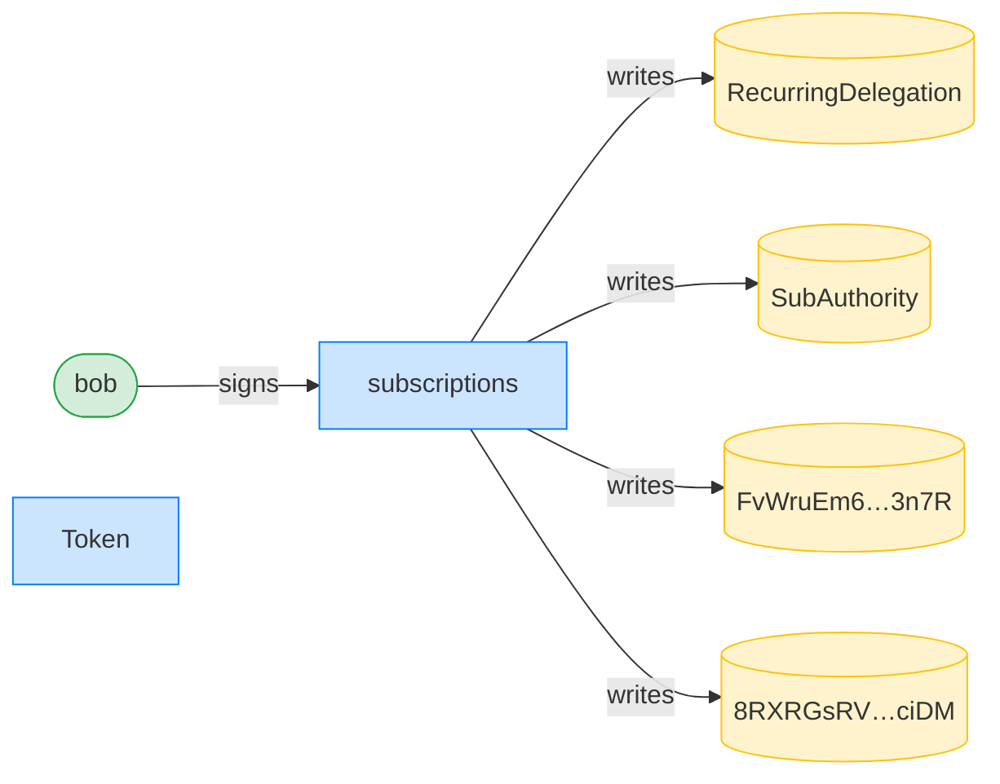

**TransferRecurring (after start): ownership graph**

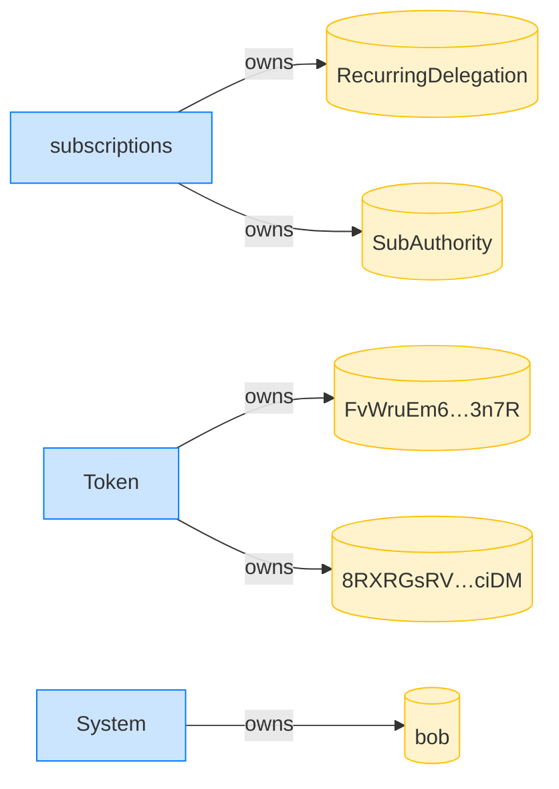

- [x] Bob received 10 tokens: `10000000`
