## Recurring transfer delegator-mismatch exploit is blocked — PASS

> Bob's self-delegation cannot be used to drain Alice's account by spoofing the delegator

### Stage: Alice's authority and a recurring delegation to Bob

**InitSubscriptionAuthority: structured CPI tree**

```text

Transaction  signers=[alice]
└── subscriptions::InitSubscriptionAuthority [1] ✓ 7742cu  signer=alice
    ├── System [2] ✓ (no cu)
    └── Token [2] ✓ 126cu
Compute Units (this run): 7742
Fee: 5000 lamports
Legend (2):
  alice         = FXddRd8CdAC8SWKT3Ataasn69R7rbTfQZcKg8ejyrUbF
  subscriptions = De1egAFMkMWZSN5rYXRj9CAdheBamobVNubTsi9avR44
```

**InitSubscriptionAuthority: sequence diagram**

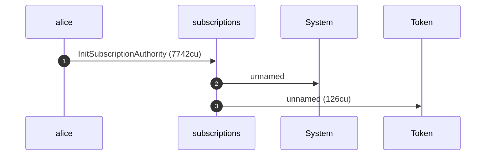

**InitSubscriptionAuthority: sequence diagram, with lifelines**


**InitSubscriptionAuthority: authority graph**

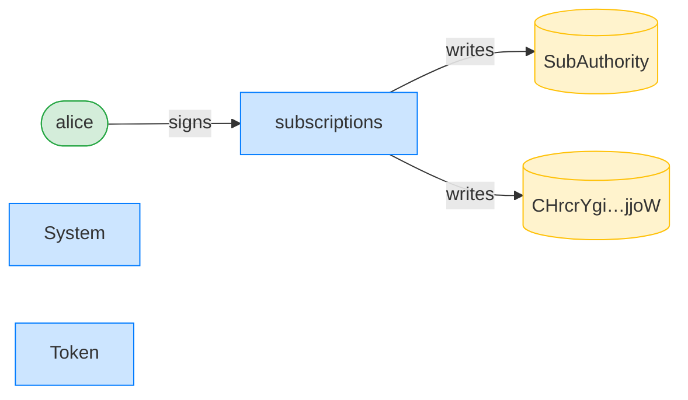

**InitSubscriptionAuthority: ownership graph**

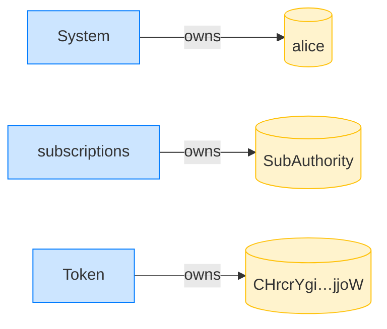

**CreateRecurringDelegation: structured CPI tree**

```text

Transaction  signers=[alice]
└── subscriptions::CreateRecurringDelegation [1] ✓ 9573cu  signer=alice
    └── System [2] ✓ (no cu)
Compute Units (this run): 9573
Fee: 5000 lamports
Legend (2):
  alice         = FXddRd8CdAC8SWKT3Ataasn69R7rbTfQZcKg8ejyrUbF
  subscriptions = De1egAFMkMWZSN5rYXRj9CAdheBamobVNubTsi9avR44
```

**CreateRecurringDelegation: sequence diagram**

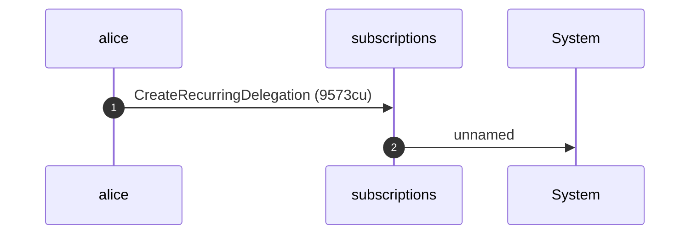

**CreateRecurringDelegation: sequence diagram, with lifelines**

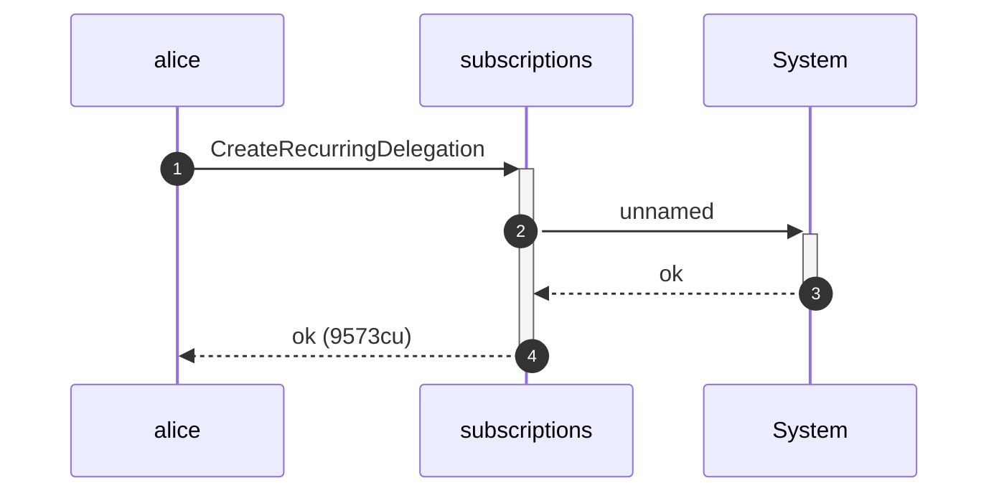

**CreateRecurringDelegation: authority graph**

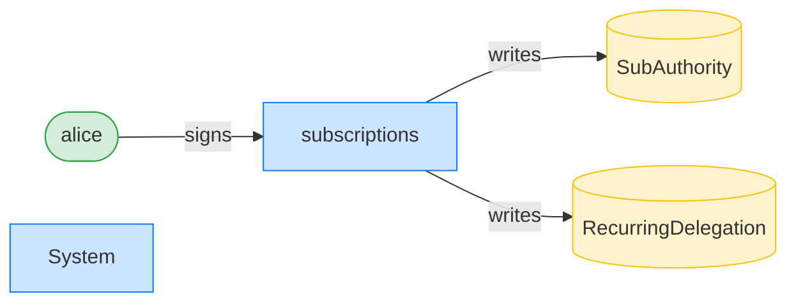

**CreateRecurringDelegation: ownership graph**

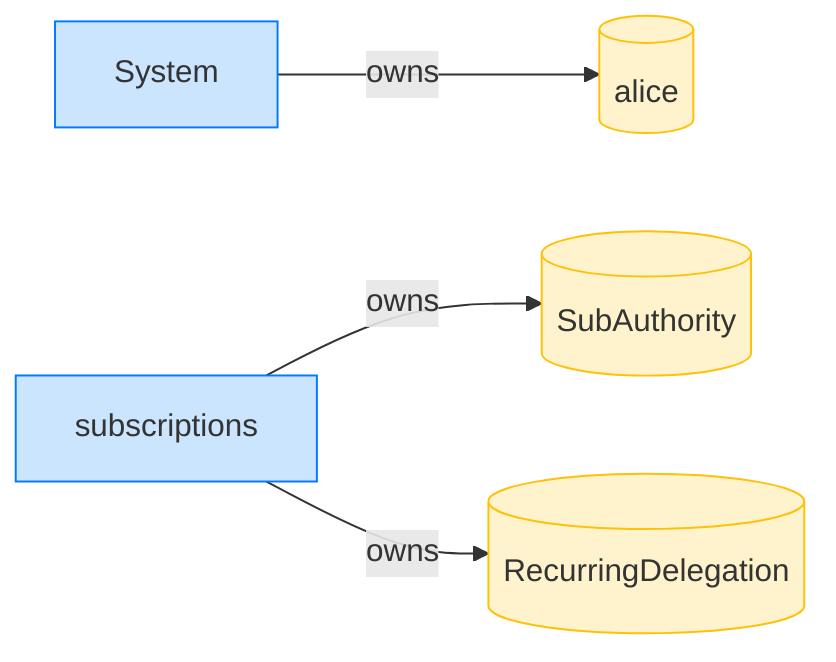

### Bob initializes his own authority and a self-delegation

**InitSubscriptionAuthority: structured CPI tree**

```text

Transaction  signers=[bob]
└── subscriptions::InitSubscriptionAuthority [1] ✓ 10742cu  signer=bob
    ├── System [2] ✓ (no cu)
    └── Token [2] ✓ 126cu
Compute Units (this run): 10742
Fee: 5000 lamports
Legend (2):
  bob           = 9S8NPMnzAba71o3tr8dHDzUrfT5NesYFzP56QFpYieMR
  subscriptions = De1egAFMkMWZSN5rYXRj9CAdheBamobVNubTsi9avR44
```

**InitSubscriptionAuthority: sequence diagram**

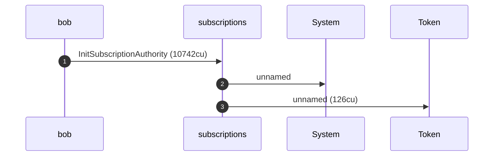

**InitSubscriptionAuthority: sequence diagram, with lifelines**


**InitSubscriptionAuthority: authority graph**

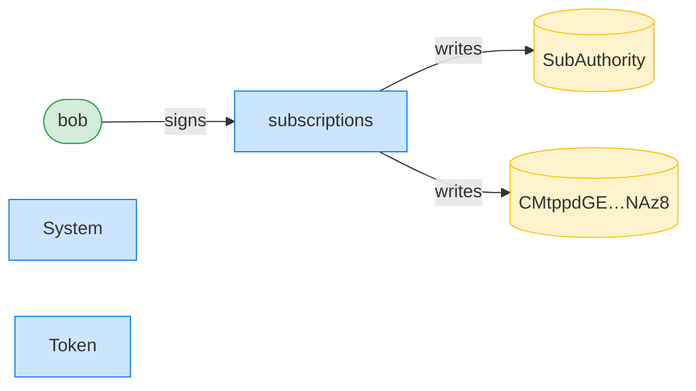

**InitSubscriptionAuthority: ownership graph**

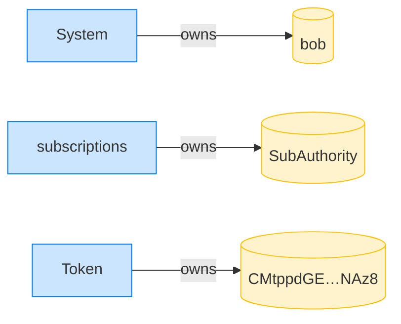

**CreateRecurringDelegation (Bob self): structured CPI tree**

```text

Transaction  signers=[bob]
└── subscriptions::CreateRecurringDelegation [1] ✓ 3568cu  signer=[bob, bob]
    └── System [2] ✓ (no cu)
Compute Units (this run): 3568
Fee: 5000 lamports
Legend (2):
  bob           = 9S8NPMnzAba71o3tr8dHDzUrfT5NesYFzP56QFpYieMR
  subscriptions = De1egAFMkMWZSN5rYXRj9CAdheBamobVNubTsi9avR44
```

**CreateRecurringDelegation (Bob self): sequence diagram**


**CreateRecurringDelegation (Bob self): sequence diagram, with lifelines**

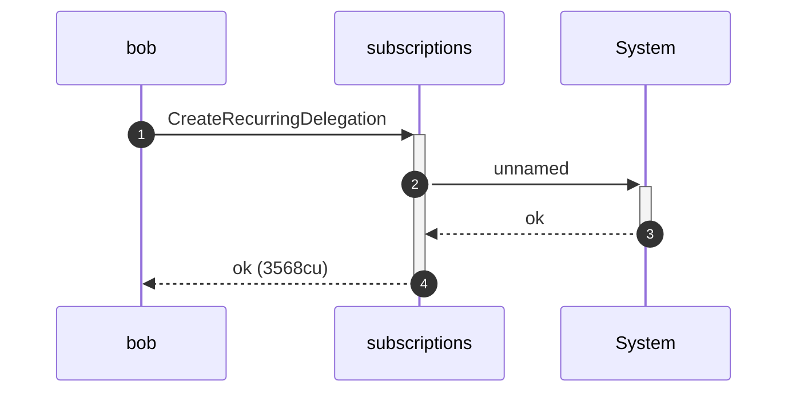

**CreateRecurringDelegation (Bob self): authority graph**

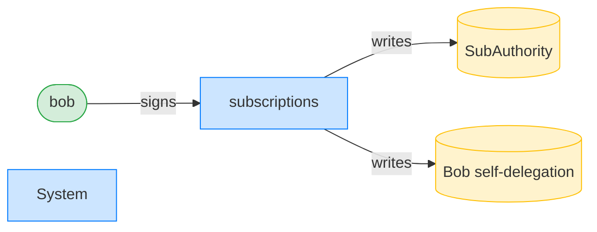

**CreateRecurringDelegation (Bob self): ownership graph**

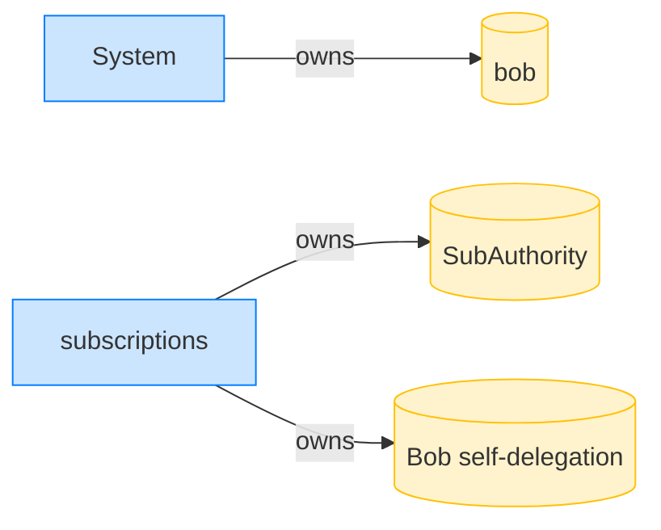

### Bob spoofs Alice as the delegator while using his own delegation; it is refused

**TransferRecurring (delegator mismatch): structured CPI tree**

```text

Transaction  signers=[bob]
└── subscriptions::TransferRecurring [1] ✗ 788cu  signer=bob
    └── Error: Unauthorized
Error: InstructionError(0, Custom(130))
Compute Units (this run): 788
Fee: 5000 lamports
Legend (2):
  bob           = 9S8NPMnzAba71o3tr8dHDzUrfT5NesYFzP56QFpYieMR
  subscriptions = De1egAFMkMWZSN5rYXRj9CAdheBamobVNubTsi9avR44
```

- [x] Alice's funds are untouched: `100000000`
- [x] Bob received no funds: `0`
