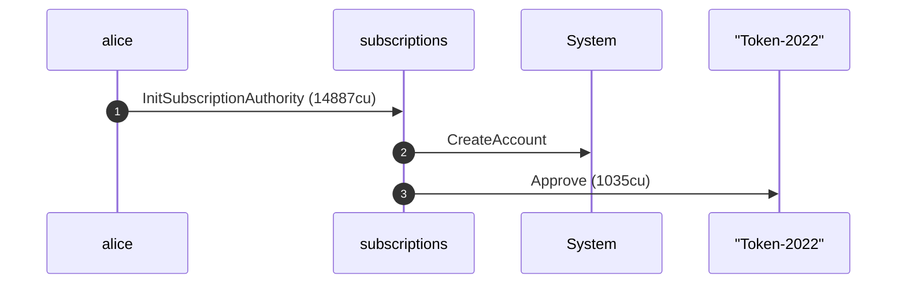
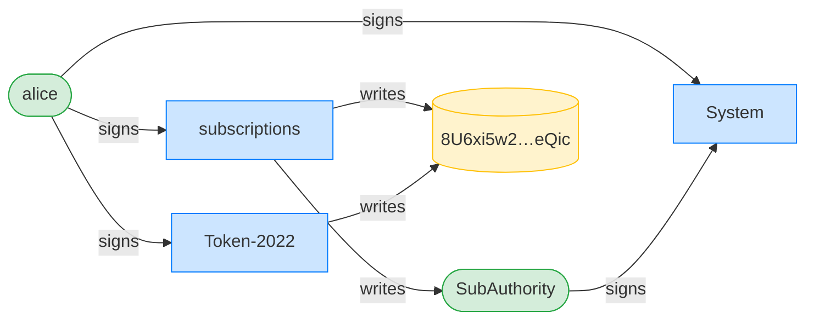
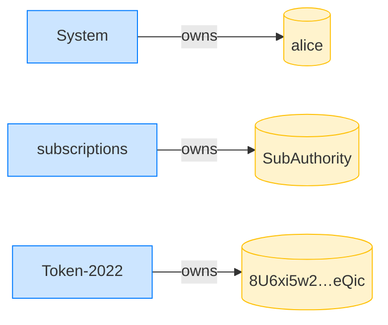
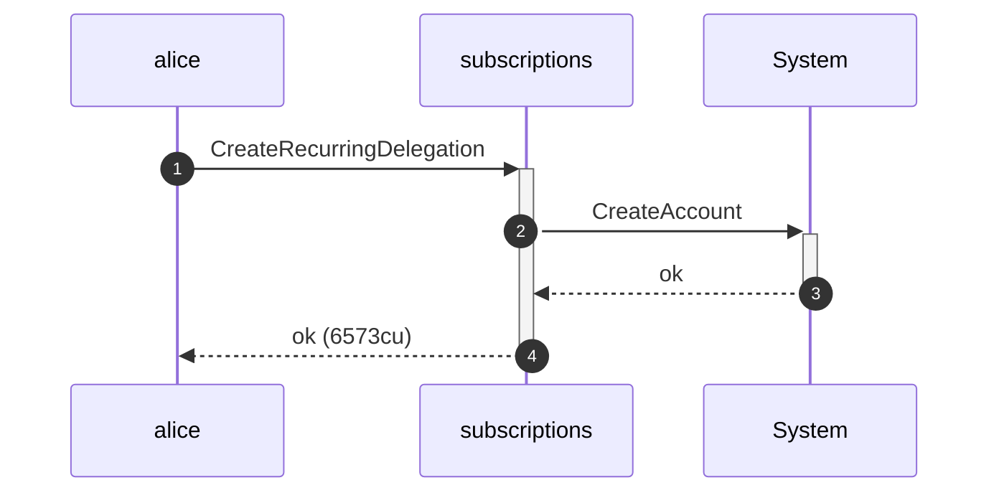
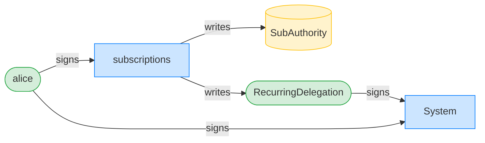
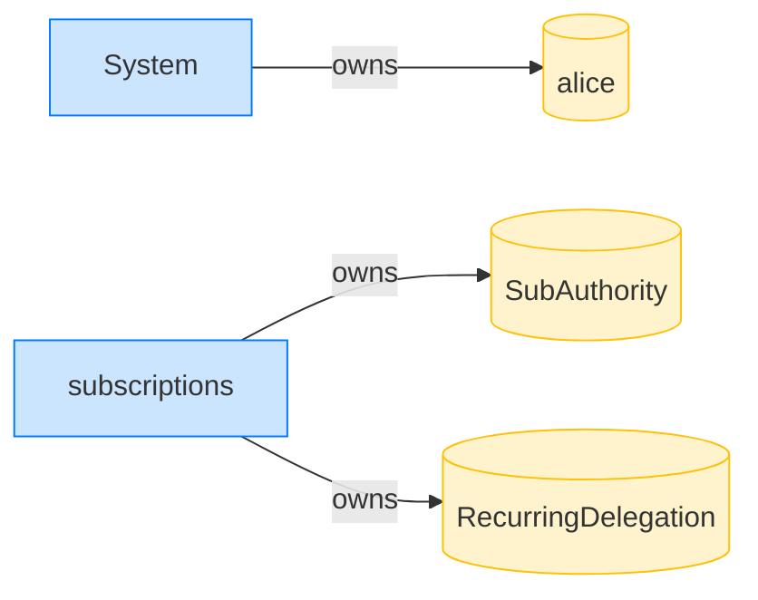
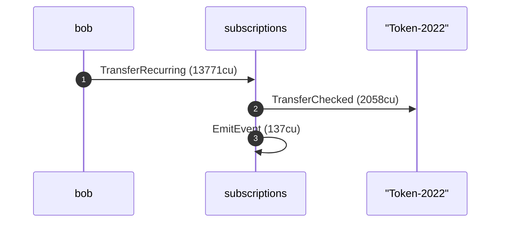
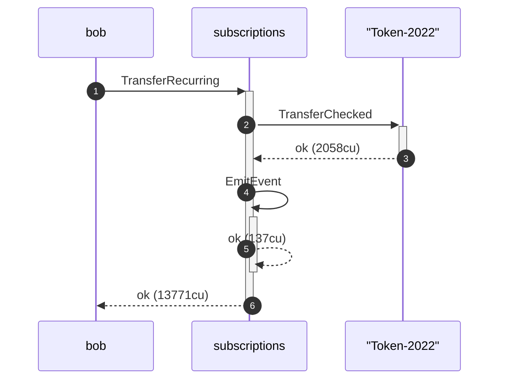
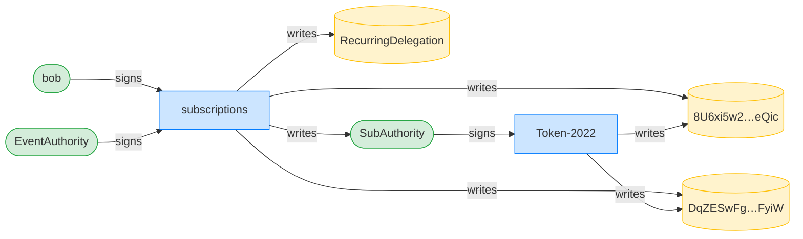

## Recurring transfer over a Token-2022 confidential-transfer mint — PASS

> a transfer of the public balance over a confidential-transfer mint succeeds

### Stage: Alice's authority and a recurring delegation to Bob

**InitSubscriptionAuthority: structured CPI tree**

```text

── subscriptions::Approve ──────────────────────────────────
Transaction  signers=[alice]
└── subscriptions::InitSubscriptionAuthority [1] ✓ 14887cu  signer=alice
    ├── System::CreateAccount [2] ✓ (no cu)
    └── Token-2022::Approve [2] ✓ 1035cu
Compute Units (this run): 14887
Fee: 5000 lamports
Legend (2):
  subscriptions = De1egAFMkMWZSN5rYXRj9CAdheBamobVNubTsi9avR44
  alice         = FXddRd8CdAC8SWKT3Ataasn69R7rbTfQZcKg8ejyrUbF
```

**InitSubscriptionAuthority: sequence diagram**



**InitSubscriptionAuthority: sequence diagram, with lifelines**


**InitSubscriptionAuthority: authority graph**



**InitSubscriptionAuthority: ownership graph**



**CreateRecurringDelegation: structured CPI tree**

```text

── subscriptions::CreateRecurringDelegation ────────────────
Transaction  signers=[alice]
└── subscriptions::CreateRecurringDelegation [1] ✓ 6573cu  signer=alice
    └── System::CreateAccount [2] ✓ (no cu)
Compute Units (this run): 6573
Fee: 5000 lamports
Legend (2):
  subscriptions = De1egAFMkMWZSN5rYXRj9CAdheBamobVNubTsi9avR44
  alice         = FXddRd8CdAC8SWKT3Ataasn69R7rbTfQZcKg8ejyrUbF
```

**CreateRecurringDelegation: sequence diagram**


**CreateRecurringDelegation: sequence diagram, with lifelines**



**CreateRecurringDelegation: authority graph**



**CreateRecurringDelegation: ownership graph**



### Bob pulls 10 tokens of the public balance

**TransferRecurring: structured CPI tree**

```text

── subscriptions::TransferChecked ──────────────────────────
Transaction  signers=[bob]
└── subscriptions::TransferRecurring [1] ✓ 13771cu  signer=bob
    ├── Token-2022::TransferChecked [2] ✓ 2058cu
    └── subscriptions::EmitEvent [2] ✓ 137cu
          🔔 RecurringTransfer
               delegatee:        bob,
               amount:           10000000,
               pulled_in_period: 10000000,
               receiver:         bob
Compute Units (this run): 13771
Fee: 5000 lamports
Legend (2):
  subscriptions = De1egAFMkMWZSN5rYXRj9CAdheBamobVNubTsi9avR44
  bob           = 9S8NPMnzAba71o3tr8dHDzUrfT5NesYFzP56QFpYieMR
```

**TransferRecurring: sequence diagram**



**TransferRecurring: sequence diagram, with lifelines**



**TransferRecurring: authority graph**



**TransferRecurring: ownership graph**


- [x] Alice's ATA debited 10 tokens: `90000000`
- [x] Bob received 10 tokens: `10000000`
