## Recurring transfer rejects a non-canonical source — PASS

> an auxiliary (non-ATA) source the authority was Approve'd over cannot be drained via a delegation

### Stage: Alice's authority and a recurring delegation to Bob

**InitSubscriptionAuthority: structured CPI tree**

```text

Transaction  signers=[alice]
└── subscriptions::InitSubscriptionAuthority [1] ✓ 6242cu  signer=alice
    ├── System [2] ✓ (no cu)
    └── Token [2] ✓ 126cu
Compute Units (this run): 6242
Fee: 5000 lamports
Legend (2):
  alice         = FXddRd8CdAC8SWKT3Ataasn69R7rbTfQZcKg8ejyrUbF
  subscriptions = De1egAFMkMWZSN5rYXRj9CAdheBamobVNubTsi9avR44
```

**InitSubscriptionAuthority: sequence diagram**

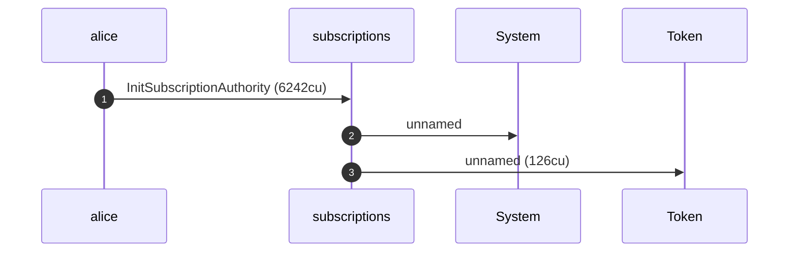

**InitSubscriptionAuthority: sequence diagram, with lifelines**

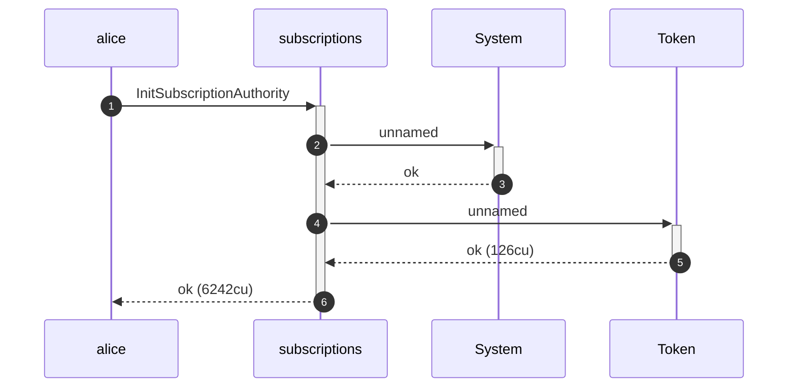

**InitSubscriptionAuthority: authority graph**

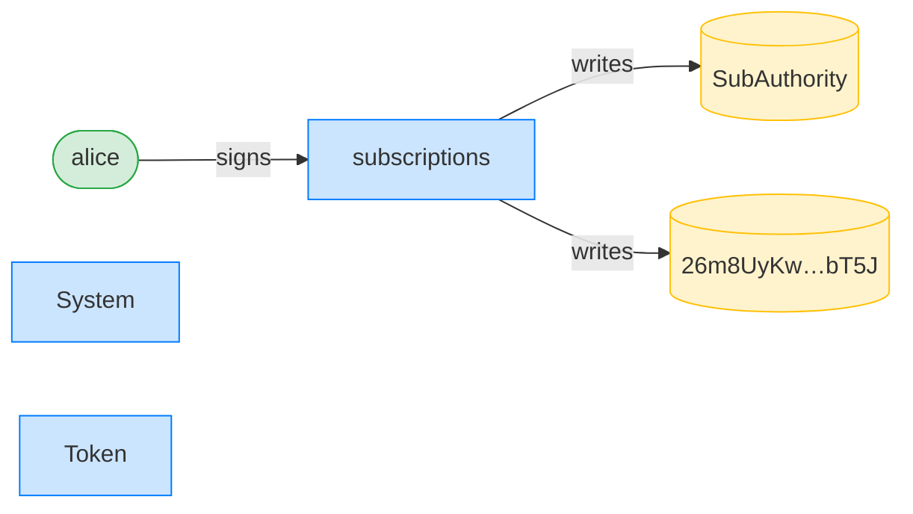

**InitSubscriptionAuthority: ownership graph**

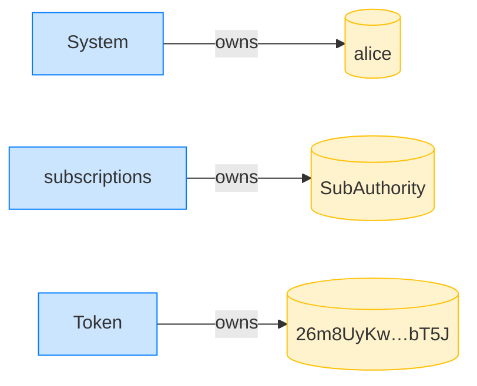

**CreateRecurringDelegation: structured CPI tree**

```text

Transaction  signers=[alice]
└── subscriptions::CreateRecurringDelegation [1] ✓ 3573cu  signer=alice
    └── System [2] ✓ (no cu)
Compute Units (this run): 3573
Fee: 5000 lamports
Legend (2):
  alice         = FXddRd8CdAC8SWKT3Ataasn69R7rbTfQZcKg8ejyrUbF
  subscriptions = De1egAFMkMWZSN5rYXRj9CAdheBamobVNubTsi9avR44
```

**CreateRecurringDelegation: sequence diagram**

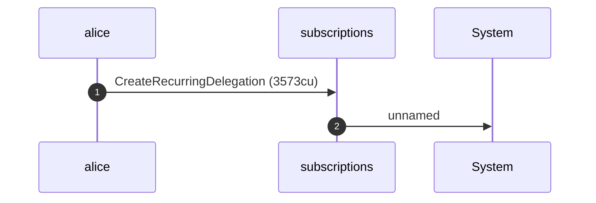

**CreateRecurringDelegation: sequence diagram, with lifelines**

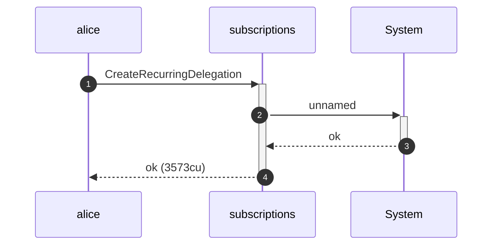

**CreateRecurringDelegation: authority graph**

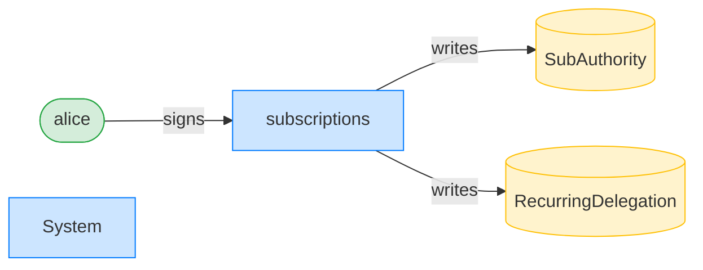

**CreateRecurringDelegation: ownership graph**

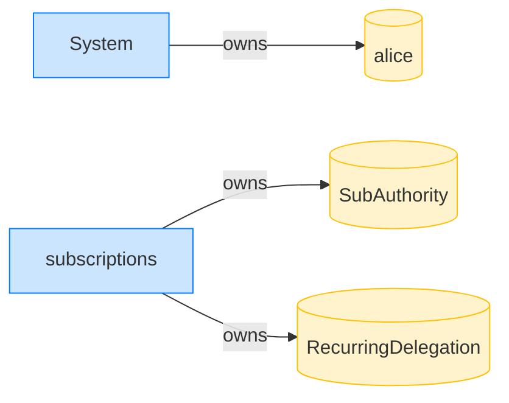

### Alice Approve's the authority over her auxiliary account

**Approve (aux account): structured CPI tree**

```text

Transaction  signers=[alice]
└── Token::Approve [1] ✓ 126cu  signer=alice
Compute Units (this run): 126
Fee: 5000 lamports
Legend (1):
  alice = FXddRd8CdAC8SWKT3Ataasn69R7rbTfQZcKg8ejyrUbF
```

**Approve (aux account): sequence diagram**

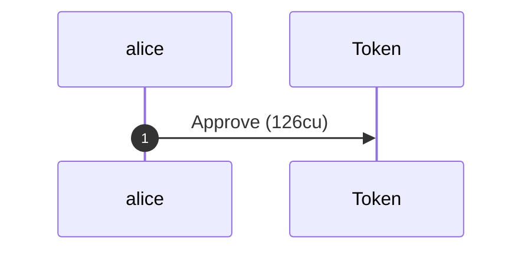

**Approve (aux account): sequence diagram, with lifelines**

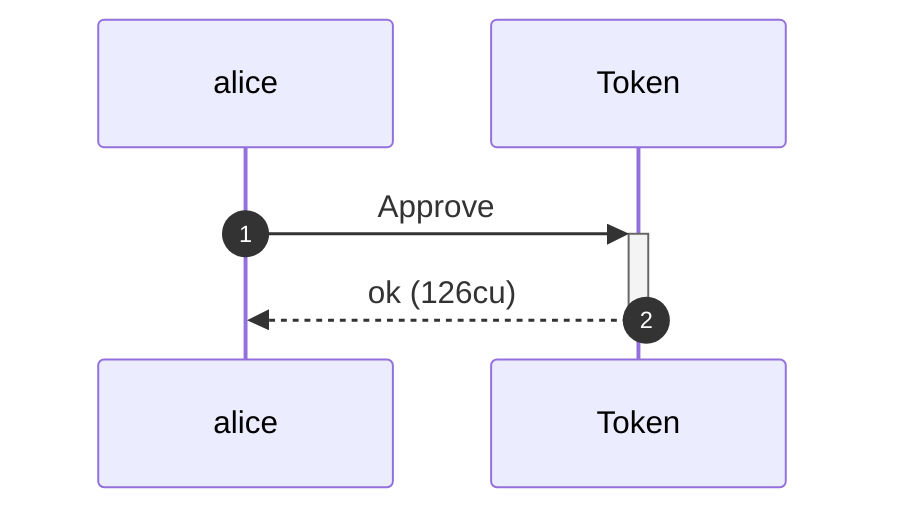

**Approve (aux account): authority graph**

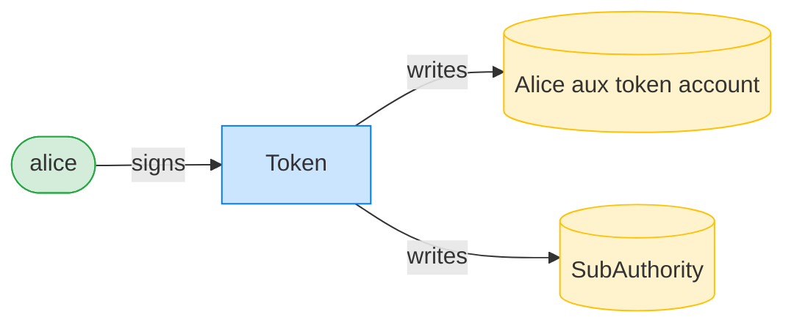

**Approve (aux account): ownership graph**

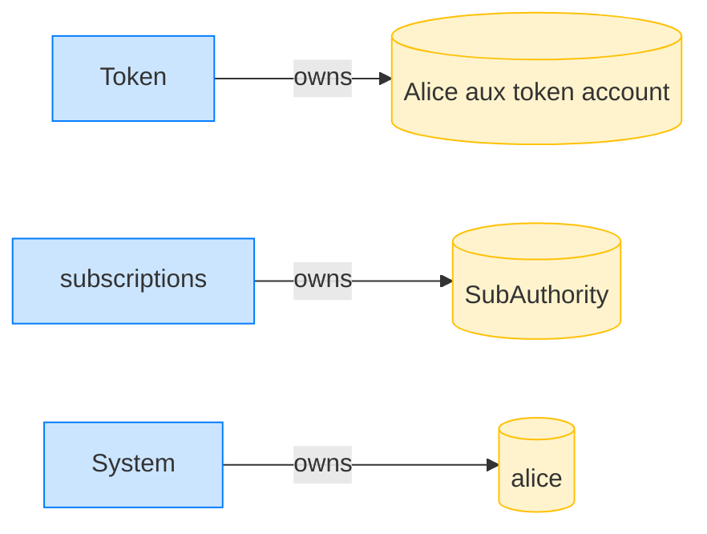

### Bob points the delegation at the auxiliary source; it is refused

**TransferRecurring (non-canonical source): structured CPI tree**

```text

Transaction  signers=[bob]
└── subscriptions::TransferRecurring [1] ✗ 2725cu  signer=bob
    └── Error: InvalidAssociatedTokenAccountDerivedAddress
Error: InstructionError(0, Custom(108))
Compute Units (this run): 2725
Fee: 5000 lamports
Legend (2):
  bob           = 9S8NPMnzAba71o3tr8dHDzUrfT5NesYFzP56QFpYieMR
  subscriptions = De1egAFMkMWZSN5rYXRj9CAdheBamobVNubTsi9avR44
```

- [x] Alice's ATA is untouched: `100000000`
- [x] Alice's aux account is untouched: `100000000`
- [x] Bob's ATA is empty: `0`
- [x] the allowance is intact: `0`
